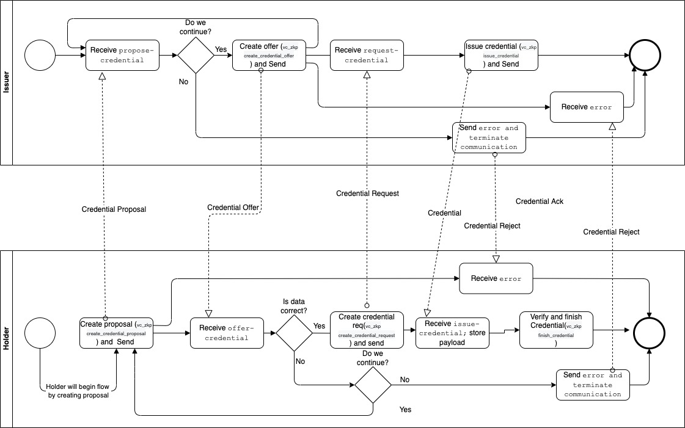

import Tabs from '@theme/Tabs';
import TabItem from '@theme/TabItem';

# BBS+

Vade supports the creation of BBS+ based proofs for credentials. The flow for creating a BBS+ based credential requires multiple operations done in Vade directly.

Vade uses the bbs implementation from [hyperledger](https://crates.io/crates/bbs) to create and verify the signatures.

## Used Vade commands

For the whole flow the vade-evan-bbs module has implemented the following commands

- vc_zkp create_credential_schema
- vc_zkp create_revocation_registry_definition
- vc_zkp issue_credential
- vc_zkp create_credential_offer
- vc_zkp present_proof
- vc_zkp create_credential_proposal
- vc_zkp request_credential
- vc_zkp request_proof
- vc_zkp revoke_credential
- vc_zkp verify_proof
- vc_zkp finish_credential

To issue a credential, the issuer needs a DID Document currently registered on the `evan.network` substrate chain.



## Complete flow for creating a credential

### Creating a Schema

Every credential is based on a specific schema. This schema describes the structure of the issued data for a credential.

Creating a credential schema is needed as base for a credential with a BBS+ Proof. A schema defines the structure of the credential payload and how it is organized. The command creates a new DID and associates the needed DID Document structure for verifying and validating credentials.

The command is `vc_zkp create_credential_schema` and has the parameters `method`, `options` and `payload`

- method -> This is method where the DID is created (we use `did:evan` for now)
- options -> With the options, we pass the private key for signing and the associated `evan` identity. To scope the schema we add `"type":"bbs"`
- payload -> This contains the payload for the schema.

<Tabs groupId="vade">
<TabItem value="json_args" label="JSON">

The Schema is in general a "JSONSchema" which defines the following properties:

```json
{
    "issuer": "did:evan:testcore:0x6240cedfc840579b7fdcd686bdc65a9a8c42dea6",
    "schemaName": "test_schema",
    "description": "Test description",
    "properties": {
        "test_property_string": {
            "type": "string"
        }
    },
    "requiredProperties": [
        "test_property_string"
    ],
    "allowAdditionalProperties": false,
    "issuerPublicKeyDid": "did:evan:testcore:0x6240cedfc840579b7fdcd686bdc65a9a8c42dea6#key-1",
    "issuerProvingKey": "30d446cc76b19c6eacad89237d021eb2c85144b61d63cb852aee09179f460920"
}
```

- issuer: This is the issuer DID of the schema
- schemaName: This represents the title of the schema
- description: You can also add a more detailed description to the schema
- properties: This is the key-value object where you can define your properties in the schema **please only add "type":"string" properties for now**
- requiredProperties: In that array you can define which properties must be set in the credential to be valid
- allowAdditionalProperties: With that flag its possible to add additional fields which are not mentioned in the schema properties
- issuerPublicKeyDid: This defines the signer key who adds a JWT proof to the schema credential
- issuerProvingKey: This is the private key of the signer who sign's the schema credential

</TabItem>

<TabItem value="vade_cli" label="Vade Cli">
example command:

```bash
payload='{"issuer":"did:evan:testcore:0x6240cedfc840579b7fdcd686bdc65a9a8c42dea6","schemaName":"test_schema","description":"Test description","properties":{"test_property_string":{"type":"string"}},"requiredProperties":["test_property_string"],"allowAdditionalProperties":false,"issuerPublicKeyDid":"did:evan:testcore:0x6240cedfc840579b7fdcd686bdc65a9a8c42dea6#key-1","issuerProvingKey":"30d446cc76b19c6eacad89237d021eb2c85144b61d63cb852aee09179f460920"}'

option='{"type":"bbs","privateKey":"dfcdcb6d5d09411ae9cbe1b0fd9751ba8803dd4b276d5bf9488ae4ede2669106","identity":"did:evan:testcore:0x0d87204c3957d73b68ae28d0af961d3c72403906"}'

./vade_evan_cli vc_zkp create_credential_schema --method "did:evan" --options $option --payload $payload
```
</TabItem>

<TabItem value="vade_output" label="Cli output">
example response:

```json
{
    "id": "did:evan:zkp:0x03d57c17c1202a0c859bc45afb0b102bcfe73ba51be137095fd3d70c91b68e03",
    "type": "EvanVCSchema",
    "name": "test_schema",
    "author": "did:evan:testcore:0x6240cedfc840579b7fdcd686bdc65a9a8c42dea6",
    "createdAt": "2021-11-05T08:01:00.000Z",
    "description": "Test description",
    "properties": {
        "test_property_string": {
            "type": "string"
        }
    },
    "required": [
        "test_property_string"
    ],
    "additionalProperties": false,
    "proof": {
        "type": "EcdsaPublicKeySecp256k1",
        "created": "2021-11-05T08:01:00.000Z",
        "proofPurpose": "assertionMethod",
        "verificationMethod": "did:evan:testcore:0x6240cedfc840579b7fdcd686bdc65a9a8c42dea6#key-1",
        "jws": "eyJ0eXAiOiJKV1QiLCJhbGciOiJFUzI1NkstUiJ9.eyJpYXQiOiIyMDIxLTExLTA1VDA4OjAxOjAwLjAwMFoiLCJkb2MiOnsiaWQiOiJkaWQ6ZXZhbjp6a3A6MHgwM2Q1N2MxN2MxMjAyYTBjODU5YmM0NWFmYjBiMTAyYmNmZTczYmE1MWJlMTM3MDk1ZmQzZDcwYzkxYjY4ZTAzIiwidHlwZSI6IkV2YW5WQ1NjaGVtYSIsIm5hbWUiOiJ0ZXN0X3NjaGVtYSIsImF1dGhvciI6ImRpZDpldmFuOnRlc3Rjb3JlOjB4NjI0MGNlZGZjODQwNTc5YjdmZGNkNjg2YmRjNjVhOWE4YzQyZGVhNiIsImNyZWF0ZWRBdCI6IjIwMjEtMTEtMDVUMDg6MDE6MDAuMDAwWiIsImRlc2NyaXB0aW9uIjoiVGVzdCBkZXNjcmlwdGlvbiIsInByb3BlcnRpZXMiOnsidGVzdF9wcm9wZXJ0eV9zdHJpbmciOnsidHlwZSI6InN0cmluZyJ9fSwicmVxdWlyZWQiOlsidGVzdF9wcm9wZXJ0eV9zdHJpbmciXSwiYWRkaXRpb25hbFByb3BlcnRpZXMiOmZhbHNlfSwiaXNzIjoiZGlkOmV2YW46dGVzdGNvcmU6MHg2MjQwY2VkZmM4NDA1NzliN2ZkY2Q2ODZiZGM2NWE5YThjNDJkZWE2In0.y5t411efca94-QrSrduiO4fzrMFDvfCLx77etZGNak4rGXr_yoNhU2EwCDIiX0e_kryFxv6YrB85gGnTXa3R_gA"
    }
}
```

The returned JSON structure is your newly created schema did which can be used now when you want to issue credentials. It contains all the properties you defined and also a signature, which is signed by the provided `issuerProvingKey`. Schemas can be reused between JWT/BBS+ and CL Credentials.

</TabItem>
</Tabs>

### Creating a Revocation Registry

Every created credential has the ability to be revoked by the issuer of the credential. For the BBS+ credentials we implemented the concept of the [RevocationList2020](https://w3c-ccg.github.io/vc-status-rl-2020/) in VADE. A revocation list is basically a remote anchored credential which holds a bit list where every credential gets a id assigned. This id is the index number in the bit list. If this bit is 0 in the credential, then the associated credential isn't revoked.

This implies that for every credential which should be revoked, the owner of the revocation credential must update the according document.

To create a revocation registry we use the command `vc_zkp create_revocation_registry` and has the parameters `method`, `options` and `payload`

- method -> This is method where the DID is created (we use `did:evan` for now)
- options -> With the options, we pass the private key for signing and the associated `evan` identity. To scope the schema we add `"type":"bbs"`
- payload -> This contains the payload for the schema.

<Tabs groupId="vade">
<TabItem value="vade_cli" label="Vade Cli">

```bash
payload='{"issuerDid":"did:evan:testcore:0x6240cedfc840579b7fdcd686bdc65a9a8c42dea6","issuerPublicKeyDid":"did:evan:testcore:0x6240cedfc840579b7fdcd686bdc65a9a8c42dea6#key-1","issuerProvingKey":"30d446cc76b19c6eacad89237d021eb2c85144b61d63cb852aee09179f460920"}'

option='{"type":"bbs","privateKey":"dfcdcb6d5d09411ae9cbe1b0fd9751ba8803dd4b276d5bf9488ae4ede2669106","identity":"did:evan:testcore:0x0d87204c3957d73b68ae28d0af961d3c72403906"}'

./vade_evan_cli vc_zkp create_revocation_registry_definition --method "did:evan" --options $option --payload $payload
```
</TabItem>

<TabItem value="vade_output" label="Vade Output">

the response of the executable returns the following JSON object

```json
{
    "@context": [
        "https://www.w3.org/2018/credentials/v1",
        "https://w3id.org/vc-revocation-list-2020/v1"
    ],
    "id": "did:evan:zkp:0x01e323d0f05c31f528d12e7a63702f70f9e076e7daa6933a630a3f6d1900c7f4",
    "type": [
        "VerifiableCredential",
        "RevocationList2020Credential"
    ],
    "issuer": "did:evan:testcore:0x6240cedfc840579b7fdcd686bdc65a9a8c42dea6#key-1",
    "issued": "2021-11-23T14:04:00.000Z",
    "credentialSubject": {
        "id": "did:evan:zkp:0x01e323d0f05c31f528d12e7a63702f70f9e076e7daa6933a630a3f6d1900c7f4#list",
        "type": "RevocationList2020",
        "encodedList": "H4sIAAAAAAAA_-3AMQEAAADCoPVPbQwfKAAAAAAAAAAAAAAAAAAAAOBthtJUqwBAAAA="
    },
    "proof": {
        "type": "EcdsaPublicKeySecp256k1",
        "created": "2021-11-23T14:04:00.000Z",
        "proofPurpose": "assertionMethod",
        "verificationMethod": "did:evan:testcore:0x6240cedfc840579b7fdcd686bdc65a9a8c42dea6#key-1",
        "jws": "eyJ0eXAiOiJKV1QiLCJhbGciOiJFUzI1NkstUiJ9.eyJpYXQiOiIyMDIxLTExLTIzVDE0OjA0OjAwLjAwMFoiLCJkb2MiOnsiQGNvbnRleHQiOlsiaHR0cHM6Ly93d3cudzMub3JnLzIwMTgvY3JlZGVudGlhbHMvdjEiLCJodHRwczovL3czaWQub3JnL3ZjLXJldm9jYXRpb24tbGlzdC0yMDIwL3YxIl0sImlkIjoiZGlkOmV2YW46emtwOjB4MDFlMzIzZDBmMDVjMzFmNTI4ZDEyZTdhNjM3MDJmNzBmOWUwNzZlN2RhYTY5MzNhNjMwYTNmNmQxOTAwYzdmNCIsInR5cGUiOlsiVmVyaWZpYWJsZUNyZWRlbnRpYWwiLCJSZXZvY2F0aW9uTGlzdDIwMjBDcmVkZW50aWFsIl0sImlzc3VlciI6ImRpZDpldmFuOnRlc3Rjb3JlOjB4NjI0MGNlZGZjODQwNTc5YjdmZGNkNjg2YmRjNjVhOWE4YzQyZGVhNiNrZXktMSIsImlzc3VlZCI6IjIwMjEtMTEtMjNUMTQ6MDQ6MDAuMDAwWiIsImNyZWRlbnRpYWxTdWJqZWN0Ijp7ImlkIjoiZGlkOmV2YW46emtwOjB4MDFlMzIzZDBmMDVjMzFmNTI4ZDEyZTdhNjM3MDJmNzBmOWUwNzZlN2RhYTY5MzNhNjMwYTNmNmQxOTAwYzdmNCNsaXN0IiwidHlwZSI6IlJldm9jYXRpb25MaXN0MjAyMCIsImVuY29kZWRMaXN0IjoiSDRzSUFBQUFBQUFBXy0zQU1RRUFBQURDb1BWUGJRd2ZLQUFBQUFBQUFBQUFBQUFBQUFBQUFPQnRodEpVcXdCQUFBQT0ifX0sImlzcyI6ImRpZDpldmFuOnRlc3Rjb3JlOjB4NjI0MGNlZGZjODQwNTc5YjdmZGNkNjg2YmRjNjVhOWE4YzQyZGVhNiJ9.TbmCGKpe1icm8Bnf2jc4abJA42VPTXB19TgV6qQzT2VF7HSyzWkDFRniVbUXi2lBuZCG0caeJT8ZTt7ys6p7eQA"
    }
}
````

</TabItem>
</Tabs>

This is the revocation registry where you can track revoked and revoke your credentials. When you create your credentials you have to reference the revocation registry credential did in the credentialStatus object to track if a credential is revoked or not

These are the pre requisites for creating new BBS+ based credentials and now you can start with the direct flow.

### Creating a credential proposal (Holder)

This step will be done at the Holder side of the flow. The first step is to create a Credential Proposal by the Holder, this indicates that the holder wants to receive a credential of a given schema.

The command is `vc_zkp create_credential_proposal` and has the parameters `method`, `options` and `payload`

- method -> This is method where the DID is created (we use `did:evan` for now)
- options -> With the options we tell VADE to use the bbs module `"type":"bbs"`
- payload -> This contains the payload for the credential proposal.

<Tabs groupId="vade">
<TabItem value="json" label="JSON">

The proposal json structure which defines the following properties:

```json
{
    "issuer": "did:evan:testcore:0x6240cedfc840579b7fdcd686bdc65a9a8c42dea6",
    "subject": "did:any:abc",
    "schema": "did:evan:zkp:0x03d57c17c1202a0c859bc45afb0b102bcfe73ba51be137095fd3d70c91b68e03"
}
```

- issuer: This is the issuer DID of the future credential
- subject: This is the holder DID of the future credential
- schema: This is the schema DID of the to be used schema for the future credential

</TabItem>

<TabItem value="vade_cli" label="Vade Cli">

example command:

```bash
payload='{"issuer":"did:evan:testcore:0x6240cedfc840579b7fdcd686bdc65a9a8c42dea6","subject":"did:any:abc","schema":"did:evan:zkp:0x03d57c17c1202a0c859bc45afb0b102bcfe73ba51be137095fd3d70c91b68e03"}'

option='{"type":"bbs"}'

./vade_evan_cli vc_zkp create_credential_proposal --method "did:evan" --options $option --payload $payload
```
</TabItem>

<TabItem value="vade_output" label="Vade Output">

example response:

```json
{
    "issuer": "did:evan:testcore:0x6240cedfc840579b7fdcd686bdc65a9a8c42dea6",
    "subject": "did:any:abc",
    "type": "EvanCredentialProposal",
    "schema": "did:evan:zkp:0x03d57c17c1202a0c859bc45afb0b102bcfe73ba51be137095fd3d70c91b68e03"
}
```

The output is a JSON structure which must be used in the upcoming steps (yeah ... the structure could be also generated statically :D)

</TabItem>
</Tabs>

After the Holder has generated the Credential Proposal request, the Issuer now  has to create a credential offer

### Creating a credential offer (Issuer)

This step is on the issuer side of the flow. In this step he takes the proposal of the Holder and creates an credential offer based on the proposal.

The command is `vc_zkp create_credential_offer` and has the parameters `method`, `options` and `payload`

- method -> This is method where the DID is created (we use `did:evan` for now)
- options -> With the options we tell VADE to use the bbs module `"type":"bbs"`
- payload -> This contains the payload for the credential offer.

<Tabs groupId="vade">
<TabItem value="json" label="JSON">

The proposal json structure which defines the following properties:

```json
{
    "issuer": "did:evan:testcore:0x6240cedfc840579b7fdcd686bdc65a9a8c42dea6",
    "subject": "did:any:abc",
    "nquadCount": 1
}
```

- issuer: This is the issuer DID of the future credential
- credentialProposal: This is the proposal object received from the holder
- nquadCount: This is the number of statements which are included in the proof

</TabItem>

<TabItem value="vade_cli" label="Vade Cli">

example command:

```bash
payload='{"issuer":"did:evan:testcore:0x6240cedfc840579b7fdcd686bdc65a9a8c42dea6","credentialProposal":{"issuer":"did:evan:testcore:0x6240cedfc840579b7fdcd686bdc65a9a8c42dea6","subject":"did:any:abc","type":"EvanCredentialProposal","schema":"did:evan:zkp:0x03d57c17c1202a0c859bc45afb0b102bcfe73ba51be137095fd3d70c91b68e03"},"nquadCount":1}'

option='{"type":"bbs"}'

./vade_evan_cli vc_zkp create_credential_offer --method "did:evan" --options $option --payload $payload
```
</TabItem>

<TabItem value="vade_output" label="Vade Ouptpu">

example response:

```json
{
    "issuer": "did:evan:testcore:0x6240cedfc840579b7fdcd686bdc65a9a8c42dea6",
    "subject": "did:any:abc",
    "nonce": "QqJR4o6joiApYVXX7JLbRIZBQ9QprlFpewo8GbojIKY=",
    "credentialMessageCount": 2
}
````

the response now consists of a `nonce` which will be checked by the holder when he receives the full credential and a `credentialMessageCount` this is always nquadCount + 1 because the mastersecret will be included in the signature every time.

</TabItem>
</Tabs>

Now this offer is transferred to the Holder again and the holder will now create a credential request based on the offer

### Creating a credential request (Holder)

This step is on the holder side of the flow. Now the holder is able to create a concrete credential request with the values he wants to have issued by the issuer

The command is `vc_zkp create_credential_request` and has the parameters `method`, `options` and `payload`

- method -> This is method where the DID is created (we use `did:evan` for now)
- options -> With the options we tell VADE to use the bbs module `"type":"bbs"`
- payload -> This contains the payload for the credential request.

<Tabs groupId="vade">
<TabItem value="json" label="JSON">

The request json structure which defines the following properties:

```json
{
    "credentialOffering": {
        "issuer": "did:evan:testcore:0x0d87204c3957d73b68ae28d0af961d3c72403906",
        "subject": "did:any:abc",
        "nonce": "QqJR4o6joiApYVXX7JLbRIZBQ9QprlFpewo8GbojIKY=",
        "credentialMessageCount": 2
    },
    "masterSecret": "OASkVMA8q6b3qJuabvgaN9K1mKoqptCv4SCNvRmnWuI=",
    "credentialValues": {
        "test_property_string": "value"
    },
    "issuerPubKey": "jCv7l26izalfcsFe6j/IqtVlDolo2Y3lNld7xOG63GjSNHBVWrvZQe2O859q9JeVEV4yXtfYofGQSWrMVfgH5ySbuHpQj4fSgLu4xXyFgMidUO1sIe0NHRcXpOorP01o",
    "credentialSchema": {
        "id": "did:evan:zkp:0x03d57c17c1202a0c859bc45afb0b102bcfe73ba51be137095fd3d70c91b68e03",
        "type": "EvanVCSchema",
        "name": "test_schema",
        "author": "did:evan:testcore:0x6240cedfc840579b7fdcd686bdc65a9a8c42dea6",
        "createdAt": "2021-11-05T08:01:00.000Z",
        "description": "Test description",
        "properties": {
            "test_property_string": {
                "type": "string"
            }
        },
        "required": [
            "test_property_string"
        ],
        "additionalProperties": false,
        "proof": {
            "type": "EcdsaPublicKeySecp256k1",
            "created": "2021-11-05T08:01:00.000Z",
            "proofPurpose": "assertionMethod",
            "verificationMethod": "did:evan:testcore:0x6240cedfc840579b7fdcd686bdc65a9a8c42dea6#key-1",
            "jws": "eyJ0eXAiOiJKV1QiLCJhbGciOiJFUzI1NkstUiJ9.eyJpYXQiOiIyMDIxLTExLTA1VDA4OjAxOjAwLjAwMFoiLCJkb2MiOnsiaWQiOiJkaWQ6ZXZhbjp6a3A6MHgwM2Q1N2MxN2MxMjAyYTBjODU5YmM0NWFmYjBiMTAyYmNmZTczYmE1MWJlMTM3MDk1ZmQzZDcwYzkxYjY4ZTAzIiwidHlwZSI6IkV2YW5WQ1NjaGVtYSIsIm5hbWUiOiJ0ZXN0X3NjaGVtYSIsImF1dGhvciI6ImRpZDpldmFuOnRlc3Rjb3JlOjB4NjI0MGNlZGZjODQwNTc5YjdmZGNkNjg2YmRjNjVhOWE4YzQyZGVhNiIsImNyZWF0ZWRBdCI6IjIwMjEtMTEtMDVUMDg6MDE6MDAuMDAwWiIsImRlc2NyaXB0aW9uIjoiVGVzdCBkZXNjcmlwdGlvbiIsInByb3BlcnRpZXMiOnsidGVzdF9wcm9wZXJ0eV9zdHJpbmciOnsidHlwZSI6InN0cmluZyJ9fSwicmVxdWlyZWQiOlsidGVzdF9wcm9wZXJ0eV9zdHJpbmciXSwiYWRkaXRpb25hbFByb3BlcnRpZXMiOmZhbHNlfSwiaXNzIjoiZGlkOmV2YW46dGVzdGNvcmU6MHg2MjQwY2VkZmM4NDA1NzliN2ZkY2Q2ODZiZGM2NWE5YThjNDJkZWE2In0.y5t411efca94-QrSrduiO4fzrMFDvfCLx77etZGNak4rGXr_yoNhU2EwCDIiX0e_kryFxv6YrB85gGnTXa3R_gA"
        }
    }
}
```

- credentialOffering: This is the credential offer object received from the issuer
- masterSecret: This is the master secret of the holder
- credentialValues: These are the values that the holder wants to get issued as a credential
- issuerPubKey: This is the public key of type Bls12381G2Key2020 from the issuers did document
- credentialSchema: This is the full json of the schema which has to be used for the credential creation

</TabItem>

<TabItem value="vade_cli" label="Vade Cli">

example command:

```bash
payload='{"credentialOffering":{"issuer":"did:evan:testcore:0x0d87204c3957d73b68ae28d0af961d3c72403906","subject":"did:any:abc","type":"EvanBbsCredentialOffering","schema":"did:evan:testcore:0x6240cedfc840579b7fdcd686bdc65a9a8c42dea6","nonce":"QqJR4o6joiApYVXX7JLbRIZBQ9QprlFpewo8GbojIKY=","credentialMessageCount":2},"masterSecret":"OASkVMA8q6b3qJuabvgaN9K1mKoqptCv4SCNvRmnWuI=","credentialValues":{"test_property_string":"value"},"issuerPubKey":"jCv7l26izalfcsFe6j/IqtVlDolo2Y3lNld7xOG63GjSNHBVWrvZQe2O859q9JeVEV4yXtfYofGQSWrMVfgH5ySbuHpQj4fSgLu4xXyFgMidUO1sIe0NHRcXpOorP01o","credentialSchema":{"id":"did:evan:zkp:0x03d57c17c1202a0c859bc45afb0b102bcfe73ba51be137095fd3d70c91b68e03","type":"EvanVCSchema","name":"test_schema","author":"did:evan:testcore:0x6240cedfc840579b7fdcd686bdc65a9a8c42dea6","createdAt":"2021-11-05T08:01:00.000Z","description":"Test description","properties":{"test_property_string":{"type":"string"}},"required":["test_property_string"],"additionalProperties":false,"proof":{"type":"EcdsaPublicKeySecp256k1","created":"2021-11-05T08:01:00.000Z","proofPurpose":"assertionMethod","verificationMethod":"did:evan:testcore:0x6240cedfc840579b7fdcd686bdc65a9a8c42dea6#key-1","jws":"eyJ0eXAiOiJKV1QiLCJhbGciOiJFUzI1NkstUiJ9.eyJpYXQiOiIyMDIxLTExLTA1VDA4OjAxOjAwLjAwMFoiLCJkb2MiOnsiaWQiOiJkaWQ6ZXZhbjp6a3A6MHgwM2Q1N2MxN2MxMjAyYTBjODU5YmM0NWFmYjBiMTAyYmNmZTczYmE1MWJlMTM3MDk1ZmQzZDcwYzkxYjY4ZTAzIiwidHlwZSI6IkV2YW5WQ1NjaGVtYSIsIm5hbWUiOiJ0ZXN0X3NjaGVtYSIsImF1dGhvciI6ImRpZDpldmFuOnRlc3Rjb3JlOjB4NjI0MGNlZGZjODQwNTc5YjdmZGNkNjg2YmRjNjVhOWE4YzQyZGVhNiIsImNyZWF0ZWRBdCI6IjIwMjEtMTEtMDVUMDg6MDE6MDAuMDAwWiIsImRlc2NyaXB0aW9uIjoiVGVzdCBkZXNjcmlwdGlvbiIsInByb3BlcnRpZXMiOnsidGVzdF9wcm9wZXJ0eV9zdHJpbmciOnsidHlwZSI6InN0cmluZyJ9fSwicmVxdWlyZWQiOlsidGVzdF9wcm9wZXJ0eV9zdHJpbmciXSwiYWRkaXRpb25hbFByb3BlcnRpZXMiOmZhbHNlfSwiaXNzIjoiZGlkOmV2YW46dGVzdGNvcmU6MHg2MjQwY2VkZmM4NDA1NzliN2ZkY2Q2ODZiZGM2NWE5YThjNDJkZWE2In0.y5t411efca94-QrSrduiO4fzrMFDvfCLx77etZGNak4rGXr_yoNhU2EwCDIiX0e_kryFxv6YrB85gGnTXa3R_gA"}}}'

option='{"type":"bbs"}'

./vade_evan_cli vc_zkp request_credential --method "did:evan" --options $option --payload $payload
```
</TabItem>

<TabItem value="vade_output" label="Vade Output">
example response:

```json
[
    {
        "subject": "did:any:abc",
        "schema": "did:evan:zkp:0x03d57c17c1202a0c859bc45afb0b102bcfe73ba51be137095fd3d70c91b68e03",
        "type": "EvanBbsCredentialRequest",
        "blindSignatureContext": "ikIGW12mSBoVLD3EDx6A6Us93Fbi7KKf7cZI9a8B5kizZQjGeh4W41eCsiIuQuC2Pg0E9Iusfwvp71RgNCDn3DVzDAh/svMn3AW6vq+2BYiOIaambOPcCTIhNjKpm3woPTbyBXSL+h9JNFd5gQh4bD6yevw1x+YJeO6qp5OuOU4AAAACKsGp9pz0QvjysTWgBMEY/F9cPBAFi53A7j1X+TXy20hj5uSjS7dxYxJnqbY/gotzZ32kq6x0PhTvSqXtV9oqKA==",
        "credentialValues": {
            "test_property_string": "value"
        }
    },
    "ZPqH9BMhwjbbXM3qm+rzx1Ty/qcGLshD6LsdEJod9Xc="
]
````

The response of the credential request now contains a blindSignatureContext which will be used for computing a blind signature and verifying proof of hidden messages from a prover. The issuer needs this values to compute the correct signature for the newly created credential.

</TabItem>
</Tabs>

The second element in the returned array contains the signature blinding which is needed for finishing the credential signature returned by the issuer.

### Creating a credential (Issuer)

When the Issuer now receives the credential request from the Holder, he is now able to issue/create a new credential for him. For that he needs the following parameters:

- The Secret Key of the issuer (mentioned in the DID as a public key)
- The Public Key of the issuer
- The ID of the Key in the DID
- The required indices for the nquads
- The to be signed nquads array
- The raw credential without the signature

The command is `vc_zkp issue_credential` and has the parameters `method`, `options` and `payload`

- method -> This is method where the DID is created (we use `did:evan` for now)
- options -> With the options we tell VADE to use the bbs module `"type":"bbs"`
- payload -> This contains the payload for the credential request.

<Tabs groupId="vade">
<TabItem value="vade_cli" label="Vade Cli">

```bash
payload='{"unsignedVc":{"@context":["https://www.w3.org/2018/credentials/v1","https://schema.org","https://w3id.org/vc-revocation-list-2020/v1"],"id":"uuid:any","type":["VerifiableCredential"],"issuer":"did:evan:testcore:0x6240cedfc840579b7fdcd686bdc65a9a8c42dea6","credentialSubject":{"id":"did:any:abc","data":{"test_property_string":"value"}},"credentialStatus":{"id":"did:evan:zkp:0x01e323d0f05c31f528d12e7a63702f70f9e076e7daa6933a630a3f6d1900c7f4#0","type":"RevocationList2020Status","revocationListIndex":"0","revocationListCredential":"did:evan:zkp:0x01e323d0f05c31f528d12e7a63702f70f9e076e7daa6933a630a3f6d1900c7f4"},"credentialSchema":{"id":"did:evan:zkp:0xd641c26161e769cef4b41760211972b274a8f37f135a34083e4e48b3f1035eda","type":"EvanZKPSchema"},"issuanceDate":"2021-10-06T05:48:29.906Z"},"issuerPublicKeyId":"did:evan:testcore:0x0d87204c3957d73b68ae28d0af961d3c72403906#key-1","issuerPublicKey":"jCv7l26izalfcsFe6j/IqtVlDolo2Y3lNld7xOG63GjSNHBVWrvZQe2O859q9JeVEV4yXtfYofGQSWrMVfgH5ySbuHpQj4fSgLu4xXyFgMidUO1sIe0NHRcXpOorP01o","issuerSecretKey":"Ilm14JX/ULRybFcHOq93gzDu5McYuX9L7AE052Sz5SQ=","credentialRequest":{"subject":"did:any:abc","schema":"did:evan:zkp:0xd641c26161e769cef4b41760211972b274a8f37f135a34083e4e48b3f1035eda","type":"EvanBbsCredentialRequest","blindSignatureContext":"jND/StzMpzMauGViwRAb9BYxMz4p/iPXNbiy5RSucHuVQHXQqGwt5JFlcVhMon3USb6sIIbQsXndWA7nUtt7E3I8iXph0+31I63Dc22PQ0WFbjuZgjIQk2k5GDmL6EbUFF1HVnC6LXTBLKQSCB4056ArUjBJFRtzgIN5iB/bQfgAAAACcwcp6M4616IBXQeLbgW55vbMFMYJMxlB21xmQbe3AI9MSEoHTJMUtrrytzctgOkJWtGmf3y8RU1XT0J4ryvRnA==","credentialValues":{"test_property_string":"value"}},"credentialOffer":{"issuer":"did:evan:testcore:0x0d87204c3957d73b68ae28d0af961d3c72403906","subject":"did:any:abc","type":"EvanBbsCredentialOffering","schema":"did:evan:zkp:0xd641c26161e769cef4b41760211972b274a8f37f135a34083e4e48b3f1035eda","nonce":"QqJR4o6joiApYVXX7JLbRIZBQ9QprlFpewo8GbojIKY=","credentialMessageCount":2},"requiredIndices":[],"nquads":["test_property_string:value"]}'

option='{"type":"bbs"}'

./vade_evan_cli vc_zkp issue_credential --method "did:evan" --options $option --payload $payload
```
</TabItem>
<TabItem value="vade_output" label="Vade Output">

This command then returns the full credential with a BBS+ signature

```json
{
    "@context": [
        "https://www.w3.org/2018/credentials/v1",
        "https://schema.org",
        "https://w3id.org/vc-revocation-list-2020/v1"
    ],
    "id": "uuid:any",
    "type": [
        "VerifiableCredential"
    ],
    "issuer": "did:evan:testcore:0x6240cedfc840579b7fdcd686bdc65a9a8c42dea6",
    "issuanceDate": "2021-10-06T05:48:29.906Z",
    "credentialSubject": {
        "id": "did:any:abc",
        "data": {
            "test_property_string": "value"
        }
    },
    "credentialSchema": {
        "id": "did:evan:zkp:0xd641c26161e769cef4b41760211972b274a8f37f135a34083e4e48b3f1035eda",
        "type": "EvanZKPSchema"
    },
    "credentialStatus": {
        "id": "did:evan:zkp:0x01e323d0f05c31f528d12e7a63702f70f9e076e7daa6933a630a3f6d1900c7f4#0",
        "type": "RevocationList2020Status",
        "revocationListIndex": "0",
        "revocationListCredential": "did:evan:zkp:0x01e323d0f05c31f528d12e7a63702f70f9e076e7daa6933a630a3f6d1900c7f4"
    },
    "proof": {
        "type": "BbsBlsSignature2020",
        "created": "2021-10-06T05:48:29.906Z",
        "proofPurpose": "assertionMethod",
        "verificationMethod": "did:evan:testcore:0x0d87204c3957d73b68ae28d0af961d3c72403906#key-1",
        "credentialMessageCount": 2,
        "requiredRevealStatements": [],
        "blindSignature": "lxz/a7BxKLpc4mYVz725vHzjFL35DNRS8hsCVNdYdd6luHegiDV6k/MXtg3cRMqtTI6YVxtL6KhQfWu2xXE9EwALMJYJ7mROdZx6uCuOSe5J2bF8dRkdwwEADuU+WZ9LcCqUeargRjX7i6W4jfKX+Q=="
    }
}
```

</TabItem>
</Tabs>

This credential is now sent back to the Holder who must finalize the credential with his signature blinding value

### Finishing a credential (Holder)

When the holder receives his BBS+ credential he needs to verify if the signature is mapped for his received signature blinding

The command is `vc_zkp finish_credential` and has the parameters `method`, `options` and `payload`

- method -> This is method where the DID is created (we use `did:evan` for now)
- options -> With the options we tell VADE to use the bbs module `"type":"bbs"`
- payload -> This contains the payload for the credential finishing.

The payload must contain the following values

- the credential itself
- his mastersecret
- the nquad array to verify if the signature matches
- the issuer public key
- the blinding

<Tabs groupId="vade">
<TabItem value="vade_json" label="JSON">

```json
{
    "credential":{
        "@context": [
            "https://www.w3.org/2018/credentials/v1",
            "https://schema.org",
            "https://w3id.org/vc-revocation-list-2020/v1"
        ],
        "id": "uuid:any",
        "type": [
            "VerifiableCredential"
        ],
        "issuer": "did:evan:testcore:0x6240cedfc840579b7fdcd686bdc65a9a8c42dea6",
        "issuanceDate": "2021-10-06T05:48:29.906Z",
        "credentialSubject": {
            "id": "did:any:abc",
            "data": {
                "test_property_string": "value"
            }
        },
        "credentialSchema": {
            "id": "did:evan:zkp:0xd641c26161e769cef4b41760211972b274a8f37f135a34083e4e48b3f1035eda",
            "type": "EvanZKPSchema"
        },
        "credentialStatus": {
            "id": "did:evan:zkp:0x01e323d0f05c31f528d12e7a63702f70f9e076e7daa6933a630a3f6d1900c7f4#0",
            "type": "RevocationList2020Status",
            "revocationListIndex": "0",
            "revocationListCredential": "did:evan:zkp:0x01e323d0f05c31f528d12e7a63702f70f9e076e7daa6933a630a3f6d1900c7f4"
        },
        "proof": {
            "type": "BbsBlsSignature2020",
            "created": "2021-10-06T05:48:29.906Z",
            "proofPurpose": "assertionMethod",
            "verificationMethod": "did:evan:testcore:0x0d87204c3957d73b68ae28d0af961d3c72403906#key-1",
            "credentialMessageCount": 2,
            "requiredRevealStatements": [],
            "blindSignature": "lxz/a7BxKLpc4mYVz725vHzjFL35DNRS8hsCVNdYdd6luHegiDV6k/MXtg3cRMqtTI6YVxtL6KhQfWu2xXE9EwALMJYJ7mROdZx6uCuOSe5J2bF8dRkdwwEADuU+WZ9LcCqUeargRjX7i6W4jfKX+Q=="
        }
    },
    "mastersecret": "OASkVMA8q6b3qJuabvgaN9K1mKoqptCv4SCNvRmnWuI=",
    "nquads": ["test_property_string:value"],
    "issuerPublicKey": "jCv7l26izalfcsFe6j/IqtVlDolo2Y3lNld7xOG63GjSNHBVWrvZQe2O859q9JeVEV4yXtfYofGQSWrMVfgH5ySbuHpQj4fSgLu4xXyFgMidUO1sIe0NHRcXpOorP01o",
    "blinding":"JefdIPUgvAHDGdXVtSYM9ER6TJCtut77jBKg6MnwX9o="
}
```
</TabItem>

<TabItem value="vade_cli" label="Vade Cli">

The command executes like this:

```bash
payload='{"credential":{"@context":["https://www.w3.org/2018/credentials/v1","https://schema.org","https://w3id.org/vc-revocation-list-2020/v1"],"id":"uuid:any","type":["VerifiableCredential"],"issuer":"did:evan:testcore:0x6240cedfc840579b7fdcd686bdc65a9a8c42dea6","issuanceDate":"2021-10-06T05:48:29.906Z","credentialSubject":{"id":"did:any:abc","data":{"test_property_string":"value"}},"credentialSchema":{"id":"did:evan:zkp:0xd641c26161e769cef4b41760211972b274a8f37f135a34083e4e48b3f1035eda","type":"EvanZKPSchema"},"credentialStatus":{"id":"did:evan:zkp:0x01e323d0f05c31f528d12e7a63702f70f9e076e7daa6933a630a3f6d1900c7f4#0","type":"RevocationList2020Status","revocationListIndex":"0","revocationListCredential":"did:evan:zkp:0x01e323d0f05c31f528d12e7a63702f70f9e076e7daa6933a630a3f6d1900c7f4"},"proof":{"type":"BbsBlsSignature2020","created":"2021-10-06T05:48:29.906Z","proofPurpose":"assertionMethod","verificationMethod":"did:evan:testcore:0x0d87204c3957d73b68ae28d0af961d3c72403906#key-1","credentialMessageCount":2,"requiredRevealStatements":[],"blindSignature":"lxz/a7BxKLpc4mYVz725vHzjFL35DNRS8hsCVNdYdd6luHegiDV6k/MXtg3cRMqtTI6YVxtL6KhQfWu2xXE9EwALMJYJ7mROdZx6uCuOSe5J2bF8dRkdwwEADuU+WZ9LcCqUeargRjX7i6W4jfKX+Q=="}},"masterSecret":"OASkVMA8q6b3qJuabvgaN9K1mKoqptCv4SCNvRmnWuI=","nquads":["test_property_string:value"],"issuerPublicKey":"jCv7l26izalfcsFe6j/IqtVlDolo2Y3lNld7xOG63GjSNHBVWrvZQe2O859q9JeVEV4yXtfYofGQSWrMVfgH5ySbuHpQj4fSgLu4xXyFgMidUO1sIe0NHRcXpOorP01o","blinding":"JefdIPUgvAHDGdXVtSYM9ER6TJCtut77jBKg6MnwX9o="}'

option='{"type":"bbs"}'

./vade_evan_cli vc_zkp finish_credential --method "did:evan" --options $option --payload $payload
```
</TabItem>
<TabItem value="vade_output" label="Vade Output">

This command returns now the blinded signature credential which can be used for creating presentations of it with zero knowledge proofs

```json
{
    "@context": [
        "https://www.w3.org/2018/credentials/v1",
        "https://schema.org",
        "https://w3id.org/vc-revocation-list-2020/v1"
    ],
    "id": "uuid:any",
    "type": [
        "VerifiableCredential"
    ],
    "issuer": "did:evan:testcore:0x6240cedfc840579b7fdcd686bdc65a9a8c42dea6",
    "issuanceDate": "2021-10-06T05:48:29.906Z",
    "credentialSubject": {
        "id": "did:any:abc",
        "data": {
            "test_property_string": "value"
        }
    },
    "credentialSchema": {
        "id": "did:evan:zkp:0xd641c26161e769cef4b41760211972b274a8f37f135a34083e4e48b3f1035eda",
        "type": "EvanZKPSchema"
    },
    "credentialStatus": {
        "id": "did:evan:zkp:0x01e323d0f05c31f528d12e7a63702f70f9e076e7daa6933a630a3f6d1900c7f4#0",
        "type": "RevocationList2020Status",
        "revocationListIndex": "0",
        "revocationListCredential": "did:evan:zkp:0x01e323d0f05c31f528d12e7a63702f70f9e076e7daa6933a630a3f6d1900c7f4"
    },
    "proof": {
        "type": "BbsBlsSignature2020",
        "created": "2021-10-06T05:48:29.906Z",
        "proofPurpose": "assertionMethod",
        "verificationMethod": "did:evan:testcore:0x0d87204c3957d73b68ae28d0af961d3c72403906#key-1",
        "credentialMessageCount": 2,
        "requiredRevealStatements": [],
        "signature": "lxz/a7BxKLpc4mYVz725vHzjFL35DNRS8hsCVNdYdd6luHegiDV6k/MXtg3cRMqtTI6YVxtL6KhQfWu2xXE9EwALMJYJ7mROdZx6uCuOSe5vwY6dajnZxMQZ5Lrzf6w/tKThClibJTGHnkahV+L30w=="
    }
}
```

</TabItem>
</Tabs>

### Creating a Proof request (Verifier)

When now a Verifier wants to check that a Holder has a credential for a given schema and wants to have the value `test_property_string` revealed from the Holder, he must create a proof request and send it to the Holder:

The command is `vc_zkp request_proof` and has the parameters `method`, `options` and `payload`

- method -> This is method where the DID is created (we use `did:evan` for now)
- options -> With the options we tell VADE to use the bbs module `"type":"bbs"`
- payload -> This contains the payload for the proof request.

<Tabs groupId="vade">
<TabItem value="vade_json" label="JSON">

The payload body looks like following

```json
{
    "verifierDid":"did:any:verifier",
    "schemas":["did:evan:zkp:0xd641c26161e769cef4b41760211972b274a8f37f135a34083e4e48b3f1035eda"],
    "revealAttributes":{
        "did:evan:zkp:0xd641c26161e769cef4b41760211972b274a8f37f135a34083e4e48b3f1035eda": [1]
    }
}
```

The proof request contains the did of the verifier, the schemas which should be present in the verifiable presentation and at least the revealAttributes. This is a JSON object where you map schema -> revealed indices of the properties (in our case we only have one property so we can only request this as a reveal index)

</TabItem>
<TabItem value="vade_cli" label="Vade Cli">

The command executes with the following markup

```bash
payload='{"verifierDid":"did:any:verifier","schemas":["did:evan:zkp:0xd641c26161e769cef4b41760211972b274a8f37f135a34083e4e48b3f1035eda"],"revealAttributes":{"did:evan:zkp:0xd641c26161e769cef4b41760211972b274a8f37f135a34083e4e48b3f1035eda":[1]}}'

option='{"type":"bbs"}'

./vade_evan_cli vc_zkp request_proof --method "did:evan" --options $option --payload $payload
```
</TabItem>
<TabItem value="vade_output" label="Vade Output">

This returns the proof request which can be presented to the Holder

```json
{
    "verifier": "did:any:verifier",
    "createdAt": "2022-01-12T16:19:20.000Z",
    "nonce": "AXEWYjEP/lvOEqfV8lWiI6kSGMrYhJdBHmgnIUtg/SU=",
    "type": "BBS",
    "subProofRequests": [
        {
            "schema": "did:evan:zkp:0xd641c26161e769cef4b41760211972b274a8f37f135a34083e4e48b3f1035eda",
            "revealedAttributes": [
                1
            ]
        }
    ]
}
```

</TabItem>
</Tabs>

### Creating a Verifiable Presentation (Holder/Prover)

When the holder now receives the Proof Request from the verifier, he now creates a verifiable presentation out of the proof request

The command is `vc_zkp present_proof` and has the parameters `method`, `options` and `payload`

- method -> This is method where the DID is created (we use `did:evan` for now)
- options -> With the options we tell VADE to use the bbs module `"type":"bbs"`
- payload -> This contains the payload for the verifiable presentation.

<Tabs groupId="vade">
<TabItem value="vade_json" label="JSON">

The payload body looks like following

```json
{
    "proofRequest":{
        "verifier": "did:any:verifier",
        "createdAt": "2022-01-12T16:19:20.000Z",
        "nonce": "AXEWYjEP/lvOEqfV8lWiI6kSGMrYhJdBHmgnIUtg/SU=",
        "type": "BBS",
        "subProofRequests": [
            {
                "schema": "did:evan:zkp:0xd641c26161e769cef4b41760211972b274a8f37f135a34083e4e48b3f1035eda",
                "revealedAttributes": [
                    1
                ]
            }
        ]
    },
    "credentialSchemaMap": {
        "did:evan:zkp:0xd641c26161e769cef4b41760211972b274a8f37f135a34083e4e48b3f1035eda": {
            "@context": [
                "https://www.w3.org/2018/credentials/v1",
                "https://schema.org",
                "https://w3id.org/vc-revocation-list-2020/v1"
            ],
            "id": "uuid:any",
            "type": [
                "VerifiableCredential"
            ],
            "issuer": "did:evan:testcore:0x6240cedfc840579b7fdcd686bdc65a9a8c42dea6",
            "issuanceDate": "2021-10-06T05:48:29.906Z",
            "credentialSubject": {
                "id": "did:any:abc",
                "data": {
                    "test_property_string": "value"
                }
            },
            "credentialSchema": {
                "id": "did:evan:zkp:0xd641c26161e769cef4b41760211972b274a8f37f135a34083e4e48b3f1035eda",
                "type": "EvanZKPSchema"
            },
            "credentialStatus": {
                "id": "did:evan:zkp:0x01e323d0f05c31f528d12e7a63702f70f9e076e7daa6933a630a3f6d1900c7f4#0",
                "type": "RevocationList2020Status",
                "revocationListIndex": "0",
                "revocationListCredential": "did:evan:zkp:0x01e323d0f05c31f528d12e7a63702f70f9e076e7daa6933a630a3f6d1900c7f4"
            },
            "proof": {
                "type": "BbsBlsSignature2020",
                "created": "2021-10-06T05:48:29.906Z",
                "proofPurpose": "assertionMethod",
                "verificationMethod": "did:evan:testcore:0x0d87204c3957d73b68ae28d0af961d3c72403906#key-1",
                "credentialMessageCount": 2,
                "requiredRevealStatements": [],
                "signature": "lxz/a7BxKLpc4mYVz725vHzjFL35DNRS8hsCVNdYdd6luHegiDV6k/MXtg3cRMqtTI6YVxtL6KhQfWu2xXE9EwALMJYJ7mROdZx6uCuOSe5vwY6dajnZxMQZ5Lrzf6w/tKThClibJTGHnkahV+L30w=="
            }
        }
    },
    "publicKeySchemaMap": {
         "did:evan:zkp:0xd641c26161e769cef4b41760211972b274a8f37f135a34083e4e48b3f1035eda": "jCv7l26izalfcsFe6j/IqtVlDolo2Y3lNld7xOG63GjSNHBVWrvZQe2O859q9JeVEV4yXtfYofGQSWrMVfgH5ySbuHpQj4fSgLu4xXyFgMidUO1sIe0NHRcXpOorP01o"
    },
    "nquadsSchemaMap": {
        "did:evan:zkp:0xd641c26161e769cef4b41760211972b274a8f37f135a34083e4e48b3f1035eda": ["test_property_string:value"]
    },
    "revealedPropertiesSchemaMap": {
        "did:evan:zkp:0xd641c26161e769cef4b41760211972b274a8f37f135a34083e4e48b3f1035eda": {
            "id": "did:any:abc",
            "data": {
                "test_property_string": "value"
            }
        }
    },
    "masterSecret": "OASkVMA8q6b3qJuabvgaN9K1mKoqptCv4SCNvRmnWuI=",
    "proverDid": "did:evan:testcore:0x6240cedfc840579b7fdcd686bdc65a9a8c42dea6",
    "proverPublicKeyDid": "did:evan:testcore:0x0d87204c3957d73b68ae28d0af961d3c72403906#key-1",
    "proverProvingKey": "30d446cc76b19c6eacad89237d021eb2c85144b61d63cb852aee09179f460920",
}
```

This object contains a lot of values. the explanation for them is the following:

- proofRequest -> This is the received proof request of the Verfier
- credentialSchemaMap -> This is a map of schema -> credential. Here you add a mapping of the to be presented schema and the according finished credential
- publicKeySchemaMap -> This is a map of schema -> issuer public key. Here you add a mapping of the to be presented schema and the according public key of the issuer
- nquadsSchemaMap -> This is a map of schema -> nquads array. Here you add a mapping of the to be presented schema and the according nquad array of the credential
- revealedPropertiesSchemaMap -> This is a map of schema -> revealed properties. You need to add all revealed properties to the verifiable presentation to let the verifier check if the created proof is valid against the revealed properties
- masterSecret -> This is the holders mastersecret which will be included in the proof (because its required)
- proverDid -> This is the DID of the prover which creates a JWS for the whole verifiable presentation
- proverPublicKeyDid -> This is the Key ID of the prover reference which key is used for creating the JWS
- proverProvingKey -> THis is the private key of the prover to generate the JWS

</TabItem>
<TabItem value="vade_cli" label="Vade Cli">

The command execution looks like the following

```bash
payload='{"proofRequest":{"verifier":"did:any:verifier","createdAt":"2022-01-12T16:19:20.000Z","nonce":"AXEWYjEP/lvOEqfV8lWiI6kSGMrYhJdBHmgnIUtg/SU=","type":"BBS","subProofRequests":[{"schema":"did:evan:zkp:0xd641c26161e769cef4b41760211972b274a8f37f135a34083e4e48b3f1035eda","revealedAttributes":[1]}]},"credentialSchemaMap":{"did:evan:zkp:0xd641c26161e769cef4b41760211972b274a8f37f135a34083e4e48b3f1035eda":{"@context":["https://www.w3.org/2018/credentials/v1","https://schema.org","https://w3id.org/vc-revocation-list-2020/v1"],"id":"uuid:any","type":["VerifiableCredential"],"issuer":"did:evan:testcore:0x6240cedfc840579b7fdcd686bdc65a9a8c42dea6","issuanceDate":"2021-10-06T05:48:29.906Z","credentialSubject":{"id":"did:any:abc","data":{"test_property_string":"value"}},"credentialSchema":{"id":"did:evan:zkp:0xd641c26161e769cef4b41760211972b274a8f37f135a34083e4e48b3f1035eda","type":"EvanZKPSchema"},"credentialStatus":{"id":"did:evan:zkp:0x01e323d0f05c31f528d12e7a63702f70f9e076e7daa6933a630a3f6d1900c7f4#0","type":"RevocationList2020Status","revocationListIndex":"0","revocationListCredential":"did:evan:zkp:0x01e323d0f05c31f528d12e7a63702f70f9e076e7daa6933a630a3f6d1900c7f4"},"proof":{"type":"BbsBlsSignature2020","created":"2021-10-06T05:48:29.906Z","proofPurpose":"assertionMethod","verificationMethod":"did:evan:testcore:0x0d87204c3957d73b68ae28d0af961d3c72403906#key-1","credentialMessageCount":2,"requiredRevealStatements":[],"signature":"lxz/a7BxKLpc4mYVz725vHzjFL35DNRS8hsCVNdYdd6luHegiDV6k/MXtg3cRMqtTI6YVxtL6KhQfWu2xXE9EwALMJYJ7mROdZx6uCuOSe5vwY6dajnZxMQZ5Lrzf6w/tKThClibJTGHnkahV+L30w=="}}},"publicKeySchemaMap":{"did:evan:zkp:0xd641c26161e769cef4b41760211972b274a8f37f135a34083e4e48b3f1035eda":"jCv7l26izalfcsFe6j/IqtVlDolo2Y3lNld7xOG63GjSNHBVWrvZQe2O859q9JeVEV4yXtfYofGQSWrMVfgH5ySbuHpQj4fSgLu4xXyFgMidUO1sIe0NHRcXpOorP01o"},"nquadsSchemaMap":{"did:evan:zkp:0xd641c26161e769cef4b41760211972b274a8f37f135a34083e4e48b3f1035eda":["test_property_string:value"]},"revealedPropertiesSchemaMap":{"did:evan:zkp:0xd641c26161e769cef4b41760211972b274a8f37f135a34083e4e48b3f1035eda":{"id":"did:any:abc","data":{"test_property_string":"value"}}},"masterSecret":"OASkVMA8q6b3qJuabvgaN9K1mKoqptCv4SCNvRmnWuI=","proverDid":"did:evan:testcore:0x6240cedfc840579b7fdcd686bdc65a9a8c42dea6","proverPublicKeyDid":"did:evan:testcore:0x0d87204c3957d73b68ae28d0af961d3c72403906#key-1","proverProvingKey":"30d446cc76b19c6eacad89237d021eb2c85144b61d63cb852aee09179f460920"}'

option='{"type":"bbs"}'

./vade_evan_cli vc_zkp present_proof --method "did:evan" --options $option --payload $payload
```
</TabItem>
<TabItem value="vade_output" label="Output">

This would now return the verifiable presentation for the proof request and can be now sent back to the Verifier:

```json
{
    "@context": [
        "https://www.w3.org/2018/credentials/v1",
        "https://schema.org",
        "https://w3id.org/vc-revocation-list-2020/v1"
    ],
    "id": "2846708b-62ab-4c33-a7f6-a4c86a1779d6",
    "type": [
        "VerifiablePresentation"
    ],
    "verifiableCredential": [
        {
            "@context": [
                "https://www.w3.org/2018/credentials/v1",
                "https://schema.org",
                "https://w3id.org/vc-revocation-list-2020/v1"
            ],
            "id": "uuid:any",
            "type": [
                "VerifiableCredential"
            ],
            "issuer": "did:evan:testcore:0x6240cedfc840579b7fdcd686bdc65a9a8c42dea6",
            "issuanceDate": "2022-01-12T16:35:18.000Z",
            "credentialSubject": {
                "id": "did:any:abc",
                "data": {
                    "test_property_string": "value"
                }
            },
            "credentialSchema": {
                "id": "did:evan:zkp:0xd641c26161e769cef4b41760211972b274a8f37f135a34083e4e48b3f1035eda",
                "type": "EvanZKPSchema"
            },
            "credentialStatus": {
                "id": "did:evan:zkp:0x01e323d0f05c31f528d12e7a63702f70f9e076e7daa6933a630a3f6d1900c7f4#0",
                "type": "RevocationList2020Status",
                "revocationListIndex": "0",
                "revocationListCredential": "did:evan:zkp:0x01e323d0f05c31f528d12e7a63702f70f9e076e7daa6933a630a3f6d1900c7f4"
            },
            "proof": {
                "type": "BbsBlsSignatureProof2020",
                "created": "2021-10-06T05:48:29.906Z",
                "proofPurpose": "assertionMethod",
                "credentialMessageCount": 2,
                "verificationMethod": "did:evan:testcore:0x0d87204c3957d73b68ae28d0af961d3c72403906#key-1",
                "nonce": "AXEWYjEP/lvOEqfV8lWiI6kSGMrYhJdBHmgnIUtg/SU=",
                "proof": "AAABnJQQeSoGm8rZX4BzSPXXiRMiBelDLlpLPur21M8UskS9p4D0yvcriEhjh9Bx6z71bKVzj6nD9g8ONwPdvlNJh5MI6W2aS9my+f/l017mMrVm4gB+nwvGoqgroEZUKFR1xLTsYUxW5QfP+fpmC3saIGM2iK+flILQQc3N3FjMIThqu4AktZsO9OCVcmxPCOECoAAAAHSLUPz+xqwvkZTLuvSKsClT5l3zcWYzbkGt9N3eQ8XcEp4hZMpcsg40pt+fZvJE/g4AAAACajooc0isJbZkdcpAVL8DRhznFO8Y1r5d9UMnn/9uPq0dkDIfyOTXGNJgk/RhKBjE7fPLLc2UVmYYb5ZBhXr725PWoQ2x+6hxnYxqngFZdRMt4R4dFGj/taOLDXTyGOzcLhCymaO8tdYPdP2z5/yW0AAAAAMp6EF4sWLWquxR8k7ecuQjtokltX+RY7giGiUYGewmF2oySqThLTNGOarcfABDnRwOCvzBRuoZLtX7hLaHu0sZVRE4VIqZoZaqNJA+PQMsiVIAxuTxqCPUKTJcn6QbKrQAAAABAAAAAWY++z6yIqCtWrO+3NDS0eUa1vM1a4oC7+1WzLhkKBhl"
            }
        }
    ],
    "proof": {
        "type": "EcdsaPublicKeySecp256k1",
        "created": "2022-01-12T16:35:18.000Z",
        "proofPurpose": "assertionMethod",
        "verificationMethod": "did:evan:testcore:0x0d87204c3957d73b68ae28d0af961d3c72403906#key-1",
        "jws": "eyJ0eXAiOiJKV1QiLCJhbGciOiJFUzI1NkstUiJ9.eyJpYXQiOiIyMDIyLTAxLTEyVDE2OjM1OjE4LjAwMFoiLCJkb2MiOnsiQGNvbnRleHQiOlsiaHR0cHM6Ly93d3cudzMub3JnLzIwMTgvY3JlZGVudGlhbHMvdjEiLCJodHRwczovL3NjaGVtYS5vcmciLCJodHRwczovL3czaWQub3JnL3ZjLXJldm9jYXRpb24tbGlzdC0yMDIwL3YxIl0sImlkIjoiMjg0NjcwOGItNjJhYi00YzMzLWE3ZjYtYTRjODZhMTc3OWQ2IiwidHlwZSI6WyJWZXJpZmlhYmxlUHJlc2VudGF0aW9uIl0sInZlcmlmaWFibGVDcmVkZW50aWFsIjpbeyJAY29udGV4dCI6WyJodHRwczovL3d3dy53My5vcmcvMjAxOC9jcmVkZW50aWFscy92MSIsImh0dHBzOi8vc2NoZW1hLm9yZyIsImh0dHBzOi8vdzNpZC5vcmcvdmMtcmV2b2NhdGlvbi1saXN0LTIwMjAvdjEiXSwiaWQiOiJ1dWlkOmFueSIsInR5cGUiOlsiVmVyaWZpYWJsZUNyZWRlbnRpYWwiXSwiaXNzdWVyIjoiZGlkOmV2YW46dGVzdGNvcmU6MHg2MjQwY2VkZmM4NDA1NzliN2ZkY2Q2ODZiZGM2NWE5YThjNDJkZWE2IiwiaXNzdWFuY2VEYXRlIjoiMjAyMi0wMS0xMlQxNjozNToxOC4wMDBaIiwiY3JlZGVudGlhbFN1YmplY3QiOnsiaWQiOiJkaWQ6YW55OmFiYyIsImRhdGEiOnsidGVzdF9wcm9wZXJ0eV9zdHJpbmciOiJ2YWx1ZSJ9fSwiY3JlZGVudGlhbFNjaGVtYSI6eyJpZCI6ImRpZDpldmFuOnprcDoweGQ2NDFjMjYxNjFlNzY5Y2VmNGI0MTc2MDIxMTk3MmIyNzRhOGYzN2YxMzVhMzQwODNlNGU0OGIzZjEwMzVlZGEiLCJ0eXBlIjoiRXZhblpLUFNjaGVtYSJ9LCJjcmVkZW50aWFsU3RhdHVzIjp7ImlkIjoiZGlkOmV2YW46emtwOjB4MDFlMzIzZDBmMDVjMzFmNTI4ZDEyZTdhNjM3MDJmNzBmOWUwNzZlN2RhYTY5MzNhNjMwYTNmNmQxOTAwYzdmNCMwIiwidHlwZSI6IlJldm9jYXRpb25MaXN0MjAyMFN0YXR1cyIsInJldm9jYXRpb25MaXN0SW5kZXgiOiIwIiwicmV2b2NhdGlvbkxpc3RDcmVkZW50aWFsIjoiZGlkOmV2YW46emtwOjB4MDFlMzIzZDBmMDVjMzFmNTI4ZDEyZTdhNjM3MDJmNzBmOWUwNzZlN2RhYTY5MzNhNjMwYTNmNmQxOTAwYzdmNCJ9LCJwcm9vZiI6eyJ0eXBlIjoiQmJzQmxzU2lnbmF0dXJlUHJvb2YyMDIwIiwiY3JlYXRlZCI6IjIwMjEtMTAtMDZUMDU6NDg6MjkuOTA2WiIsInByb29mUHVycG9zZSI6ImFzc2VydGlvbk1ldGhvZCIsImNyZWRlbnRpYWxNZXNzYWdlQ291bnQiOjIsInZlcmlmaWNhdGlvbk1ldGhvZCI6ImRpZDpldmFuOnRlc3Rjb3JlOjB4MGQ4NzIwNGMzOTU3ZDczYjY4YWUyOGQwYWY5NjFkM2M3MjQwMzkwNiNrZXktMSIsIm5vbmNlIjoiQVhFV1lqRVAvbHZPRXFmVjhsV2lJNmtTR01yWWhKZEJIbWduSVV0Zy9TVT0iLCJwcm9vZiI6IkFBQUJuSlFRZVNvR204clpYNEJ6U1BYWGlSTWlCZWxETGxwTFB1cjIxTThVc2tTOXA0RDB5dmNyaUVoamg5Qng2ejcxYktWemo2bkQ5ZzhPTndQZHZsTkpoNU1JNlcyYVM5bXkrZi9sMDE3bU1yVm00Z0Irbnd2R29xZ3JvRVpVS0ZSMXhMVHNZVXhXNVFmUCtmcG1DM3NhSUdNMmlLK2ZsSUxRUWMzTjNGak1JVGhxdTRBa3Rac085T0NWY214UENPRUNvQUFBQUhTTFVQeit4cXd2a1pUTHV2U0tzQ2xUNWwzemNXWXpia0d0OU4zZVE4WGNFcDRoWk1wY3NnNDBwdCtmWnZKRS9nNEFBQUFDYWpvb2MwaXNKYlprZGNwQVZMOERSaHpuRk84WTFyNWQ5VU1ubi85dVBxMGRrRElmeU9UWEdOSmdrL1JoS0JqRTdmUExMYzJVVm1ZWWI1WkJoWHI3MjVQV29RMngrNmh4bll4cW5nRlpkUk10NFI0ZEZHai90YU9MRFhUeUdPemNMaEN5bWFPOHRkWVBkUDJ6NS95VzBBQUFBQU1wNkVGNHNXTFdxdXhSOGs3ZWN1UWp0b2tsdFgrUlk3Z2lHaVVZR2V3bUYyb3lTcVRoTFROR09hcmNmQUJEblJ3T0N2ekJSdW9aTHRYN2hMYUh1MHNaVlJFNFZJcVpvWmFxTkpBK1BRTXNpVklBeHVUeHFDUFVLVEpjbjZRYktyUUFBQUFCQUFBQUFXWSsrejZ5SXFDdFdyTyszTkRTMGVVYTF2TTFhNG9DNysxV3pMaGtLQmhsIn19XX0sImlzcyI6ImRpZDpldmFuOnRlc3Rjb3JlOjB4NjI0MGNlZGZjODQwNTc5YjdmZGNkNjg2YmRjNjVhOWE4YzQyZGVhNiJ9.WDxsRdN1LpD3u9pVxj11KiLkBP_swA149XUUTWNoewsewsynPKlg0oEgtq5luzXRWuP1R6ExesbWdT3CZA1alwA"
    }
}
```

</TabItem>
</Tabs>

### Verifying a Verifiable Presentation (Verifier)

When the Verifier now wants to check a received verifiable presentation against his created proof request he can use the following command:

The command is `vc_zkp verify_proof` and has the parameters `method`, `options` and `payload`

- method -> This is method where the DID is created (we use `did:evan` for now)
- options -> With the options we tell VADE to use the bbs module `"type":"bbs"`
- payload -> This contains the payload for the verifiable presentation.

<Tabs groupId="vade">
<TabItem value="vade_json" label="JSON">

The payload body looks like following

```json
{
    "presentation": {
        "@context": [
            "https://www.w3.org/2018/credentials/v1",
            "https://schema.org",
            "https://w3id.org/vc-revocation-list-2020/v1"
        ],
        "id": "2846708b-62ab-4c33-a7f6-a4c86a1779d6",
        "type": [
            "VerifiablePresentation"
        ],
        "verifiableCredential": [
            {
                "@context": [
                    "https://www.w3.org/2018/credentials/v1",
                    "https://schema.org",
                    "https://w3id.org/vc-revocation-list-2020/v1"
                ],
                "id": "uuid:any",
                "type": [
                    "VerifiableCredential"
                ],
                "issuer": "did:evan:testcore:0x6240cedfc840579b7fdcd686bdc65a9a8c42dea6",
                "issuanceDate": "2022-01-12T16:35:18.000Z",
                "credentialSubject": {
                    "id": "did:any:abc",
                    "data": {
                        "test_property_string": "value"
                    }
                },
                "credentialSchema": {
                    "id": "did:evan:zkp:0xd641c26161e769cef4b41760211972b274a8f37f135a34083e4e48b3f1035eda",
                    "type": "EvanZKPSchema"
                },
                "credentialStatus": {
                    "id": "did:evan:zkp:0x01e323d0f05c31f528d12e7a63702f70f9e076e7daa6933a630a3f6d1900c7f4#0",
                    "type": "RevocationList2020Status",
                    "revocationListIndex": "0",
                    "revocationListCredential": "did:evan:zkp:0x01e323d0f05c31f528d12e7a63702f70f9e076e7daa6933a630a3f6d1900c7f4"
                },
                "proof": {
                    "type": "BbsBlsSignatureProof2020",
                    "created": "2021-10-06T05:48:29.906Z",
                    "proofPurpose": "assertionMethod",
                    "credentialMessageCount": 2,
                    "verificationMethod": "did:evan:testcore:0x0d87204c3957d73b68ae28d0af961d3c72403906#key-1",
                    "nonce": "AXEWYjEP/lvOEqfV8lWiI6kSGMrYhJdBHmgnIUtg/SU=",
                    "proof": "AAABnJQQeSoGm8rZX4BzSPXXiRMiBelDLlpLPur21M8UskS9p4D0yvcriEhjh9Bx6z71bKVzj6nD9g8ONwPdvlNJh5MI6W2aS9my+f/l017mMrVm4gB+nwvGoqgroEZUKFR1xLTsYUxW5QfP+fpmC3saIGM2iK+flILQQc3N3FjMIThqu4AktZsO9OCVcmxPCOECoAAAAHSLUPz+xqwvkZTLuvSKsClT5l3zcWYzbkGt9N3eQ8XcEp4hZMpcsg40pt+fZvJE/g4AAAACajooc0isJbZkdcpAVL8DRhznFO8Y1r5d9UMnn/9uPq0dkDIfyOTXGNJgk/RhKBjE7fPLLc2UVmYYb5ZBhXr725PWoQ2x+6hxnYxqngFZdRMt4R4dFGj/taOLDXTyGOzcLhCymaO8tdYPdP2z5/yW0AAAAAMp6EF4sWLWquxR8k7ecuQjtokltX+RY7giGiUYGewmF2oySqThLTNGOarcfABDnRwOCvzBRuoZLtX7hLaHu0sZVRE4VIqZoZaqNJA+PQMsiVIAxuTxqCPUKTJcn6QbKrQAAAABAAAAAWY++z6yIqCtWrO+3NDS0eUa1vM1a4oC7+1WzLhkKBhl"
                }
            }
        ],
        "proof": {
            "type": "EcdsaPublicKeySecp256k1",
            "created": "2022-01-12T16:35:18.000Z",
            "proofPurpose": "assertionMethod",
            "verificationMethod": "did:evan:testcore:0x0d87204c3957d73b68ae28d0af961d3c72403906#key-1",
            "jws": "eyJ0eXAiOiJKV1QiLCJhbGciOiJFUzI1NkstUiJ9.eyJpYXQiOiIyMDIyLTAxLTEyVDE2OjM1OjE4LjAwMFoiLCJkb2MiOnsiQGNvbnRleHQiOlsiaHR0cHM6Ly93d3cudzMub3JnLzIwMTgvY3JlZGVudGlhbHMvdjEiLCJodHRwczovL3NjaGVtYS5vcmciLCJodHRwczovL3czaWQub3JnL3ZjLXJldm9jYXRpb24tbGlzdC0yMDIwL3YxIl0sImlkIjoiMjg0NjcwOGItNjJhYi00YzMzLWE3ZjYtYTRjODZhMTc3OWQ2IiwidHlwZSI6WyJWZXJpZmlhYmxlUHJlc2VudGF0aW9uIl0sInZlcmlmaWFibGVDcmVkZW50aWFsIjpbeyJAY29udGV4dCI6WyJodHRwczovL3d3dy53My5vcmcvMjAxOC9jcmVkZW50aWFscy92MSIsImh0dHBzOi8vc2NoZW1hLm9yZyIsImh0dHBzOi8vdzNpZC5vcmcvdmMtcmV2b2NhdGlvbi1saXN0LTIwMjAvdjEiXSwiaWQiOiJ1dWlkOmFueSIsInR5cGUiOlsiVmVyaWZpYWJsZUNyZWRlbnRpYWwiXSwiaXNzdWVyIjoiZGlkOmV2YW46dGVzdGNvcmU6MHg2MjQwY2VkZmM4NDA1NzliN2ZkY2Q2ODZiZGM2NWE5YThjNDJkZWE2IiwiaXNzdWFuY2VEYXRlIjoiMjAyMi0wMS0xMlQxNjozNToxOC4wMDBaIiwiY3JlZGVudGlhbFN1YmplY3QiOnsiaWQiOiJkaWQ6YW55OmFiYyIsImRhdGEiOnsidGVzdF9wcm9wZXJ0eV9zdHJpbmciOiJ2YWx1ZSJ9fSwiY3JlZGVudGlhbFNjaGVtYSI6eyJpZCI6ImRpZDpldmFuOnprcDoweGQ2NDFjMjYxNjFlNzY5Y2VmNGI0MTc2MDIxMTk3MmIyNzRhOGYzN2YxMzVhMzQwODNlNGU0OGIzZjEwMzVlZGEiLCJ0eXBlIjoiRXZhblpLUFNjaGVtYSJ9LCJjcmVkZW50aWFsU3RhdHVzIjp7ImlkIjoiZGlkOmV2YW46emtwOjB4MDFlMzIzZDBmMDVjMzFmNTI4ZDEyZTdhNjM3MDJmNzBmOWUwNzZlN2RhYTY5MzNhNjMwYTNmNmQxOTAwYzdmNCMwIiwidHlwZSI6IlJldm9jYXRpb25MaXN0MjAyMFN0YXR1cyIsInJldm9jYXRpb25MaXN0SW5kZXgiOiIwIiwicmV2b2NhdGlvbkxpc3RDcmVkZW50aWFsIjoiZGlkOmV2YW46emtwOjB4MDFlMzIzZDBmMDVjMzFmNTI4ZDEyZTdhNjM3MDJmNzBmOWUwNzZlN2RhYTY5MzNhNjMwYTNmNmQxOTAwYzdmNCJ9LCJwcm9vZiI6eyJ0eXBlIjoiQmJzQmxzU2lnbmF0dXJlUHJvb2YyMDIwIiwiY3JlYXRlZCI6IjIwMjEtMTAtMDZUMDU6NDg6MjkuOTA2WiIsInByb29mUHVycG9zZSI6ImFzc2VydGlvbk1ldGhvZCIsImNyZWRlbnRpYWxNZXNzYWdlQ291bnQiOjIsInZlcmlmaWNhdGlvbk1ldGhvZCI6ImRpZDpldmFuOnRlc3Rjb3JlOjB4MGQ4NzIwNGMzOTU3ZDczYjY4YWUyOGQwYWY5NjFkM2M3MjQwMzkwNiNrZXktMSIsIm5vbmNlIjoiQVhFV1lqRVAvbHZPRXFmVjhsV2lJNmtTR01yWWhKZEJIbWduSVV0Zy9TVT0iLCJwcm9vZiI6IkFBQUJuSlFRZVNvR204clpYNEJ6U1BYWGlSTWlCZWxETGxwTFB1cjIxTThVc2tTOXA0RDB5dmNyaUVoamg5Qng2ejcxYktWemo2bkQ5ZzhPTndQZHZsTkpoNU1JNlcyYVM5bXkrZi9sMDE3bU1yVm00Z0Irbnd2R29xZ3JvRVpVS0ZSMXhMVHNZVXhXNVFmUCtmcG1DM3NhSUdNMmlLK2ZsSUxRUWMzTjNGak1JVGhxdTRBa3Rac085T0NWY214UENPRUNvQUFBQUhTTFVQeit4cXd2a1pUTHV2U0tzQ2xUNWwzemNXWXpia0d0OU4zZVE4WGNFcDRoWk1wY3NnNDBwdCtmWnZKRS9nNEFBQUFDYWpvb2MwaXNKYlprZGNwQVZMOERSaHpuRk84WTFyNWQ5VU1ubi85dVBxMGRrRElmeU9UWEdOSmdrL1JoS0JqRTdmUExMYzJVVm1ZWWI1WkJoWHI3MjVQV29RMngrNmh4bll4cW5nRlpkUk10NFI0ZEZHai90YU9MRFhUeUdPemNMaEN5bWFPOHRkWVBkUDJ6NS95VzBBQUFBQU1wNkVGNHNXTFdxdXhSOGs3ZWN1UWp0b2tsdFgrUlk3Z2lHaVVZR2V3bUYyb3lTcVRoTFROR09hcmNmQUJEblJ3T0N2ekJSdW9aTHRYN2hMYUh1MHNaVlJFNFZJcVpvWmFxTkpBK1BRTXNpVklBeHVUeHFDUFVLVEpjbjZRYktyUUFBQUFCQUFBQUFXWSsrejZ5SXFDdFdyTyszTkRTMGVVYTF2TTFhNG9DNysxV3pMaGtLQmhsIn19XX0sImlzcyI6ImRpZDpldmFuOnRlc3Rjb3JlOjB4NjI0MGNlZGZjODQwNTc5YjdmZGNkNjg2YmRjNjVhOWE4YzQyZGVhNiJ9.WDxsRdN1LpD3u9pVxj11KiLkBP_swA149XUUTWNoewsewsynPKlg0oEgtq5luzXRWuP1R6ExesbWdT3CZA1alwA"
        }
    },
    "proofRequest":{
        "verifier": "did:any:verifier",
        "createdAt": "2022-01-12T16:19:20.000Z",
        "nonce": "AXEWYjEP/lvOEqfV8lWiI6kSGMrYhJdBHmgnIUtg/SU=",
        "type": "BBS",
        "subProofRequests": [
            {
                "schema": "did:evan:zkp:0xd641c26161e769cef4b41760211972b274a8f37f135a34083e4e48b3f1035eda",
                "revealedAttributes": [
                    1
                ]
            }
        ]
    },
    "keysToSchemaMap": {
         "did:evan:zkp:0xd641c26161e769cef4b41760211972b274a8f37f135a34083e4e48b3f1035eda": "jCv7l26izalfcsFe6j/IqtVlDolo2Y3lNld7xOG63GjSNHBVWrvZQe2O859q9JeVEV4yXtfYofGQSWrMVfgH5ySbuHpQj4fSgLu4xXyFgMidUO1sIe0NHRcXpOorP01o"
    },
    "signerAddress": "0xd2787429c2a5d88662a8c4af690a4479e0199c5e",
    "nquadsToSchemaMap": {
        "did:evan:zkp:0xd641c26161e769cef4b41760211972b274a8f37f135a34083e4e48b3f1035eda": ["test_property_string:value"]
    }
}
```

The payload for verifying a proof must contain the following values

- presentation -> This is the received verifiable presentation of the Prover
- proofRequest -> This is the generated proof request from the Verifier
- keysToSchemaMap -> This is a map of schema -> issuer public key. Here you add a mapping of the to be presented schema and the according public key of the issuer
- nquadsSchemaMap -> This is a map of schema -> nquads array. Here you add a mapping of the to be presented schema and the according nquad array of the credential
- signerAddress -> This is the ethereum address where the check of the JWS signature goes against

</TabItem>
<TabItem value="vade_cli" label="Vade Cli">

The command execution looks like the following

```bash
payload='{"presentation":{"@context":["https://www.w3.org/2018/credentials/v1","https://schema.org","https://w3id.org/vc-revocation-list-2020/v1"],"id":"2846708b-62ab-4c33-a7f6-a4c86a1779d6","type":["VerifiablePresentation"],"verifiableCredential":[{"@context":["https://www.w3.org/2018/credentials/v1","https://schema.org","https://w3id.org/vc-revocation-list-2020/v1"],"id":"uuid:any","type":["VerifiableCredential"],"issuer":"did:evan:testcore:0x6240cedfc840579b7fdcd686bdc65a9a8c42dea6","issuanceDate":"2022-01-12T16:35:18.000Z","credentialSubject":{"id":"did:any:abc","data":{"test_property_string":"value"}},"credentialSchema":{"id":"did:evan:zkp:0xd641c26161e769cef4b41760211972b274a8f37f135a34083e4e48b3f1035eda","type":"EvanZKPSchema"},"credentialStatus":{"id":"did:evan:zkp:0x01e323d0f05c31f528d12e7a63702f70f9e076e7daa6933a630a3f6d1900c7f4#0","type":"RevocationList2020Status","revocationListIndex":"0","revocationListCredential":"did:evan:zkp:0x01e323d0f05c31f528d12e7a63702f70f9e076e7daa6933a630a3f6d1900c7f4"},"proof":{"type":"BbsBlsSignatureProof2020","created":"2021-10-06T05:48:29.906Z","proofPurpose":"assertionMethod","credentialMessageCount":2,"verificationMethod":"did:evan:testcore:0x0d87204c3957d73b68ae28d0af961d3c72403906#key-1","nonce":"AXEWYjEP/lvOEqfV8lWiI6kSGMrYhJdBHmgnIUtg/SU=","proof":"AAABnJQQeSoGm8rZX4BzSPXXiRMiBelDLlpLPur21M8UskS9p4D0yvcriEhjh9Bx6z71bKVzj6nD9g8ONwPdvlNJh5MI6W2aS9my+f/l017mMrVm4gB+nwvGoqgroEZUKFR1xLTsYUxW5QfP+fpmC3saIGM2iK+flILQQc3N3FjMIThqu4AktZsO9OCVcmxPCOECoAAAAHSLUPz+xqwvkZTLuvSKsClT5l3zcWYzbkGt9N3eQ8XcEp4hZMpcsg40pt+fZvJE/g4AAAACajooc0isJbZkdcpAVL8DRhznFO8Y1r5d9UMnn/9uPq0dkDIfyOTXGNJgk/RhKBjE7fPLLc2UVmYYb5ZBhXr725PWoQ2x+6hxnYxqngFZdRMt4R4dFGj/taOLDXTyGOzcLhCymaO8tdYPdP2z5/yW0AAAAAMp6EF4sWLWquxR8k7ecuQjtokltX+RY7giGiUYGewmF2oySqThLTNGOarcfABDnRwOCvzBRuoZLtX7hLaHu0sZVRE4VIqZoZaqNJA+PQMsiVIAxuTxqCPUKTJcn6QbKrQAAAABAAAAAWY++z6yIqCtWrO+3NDS0eUa1vM1a4oC7+1WzLhkKBhl"}}],"proof":{"type":"EcdsaPublicKeySecp256k1","created":"2022-01-12T16:35:18.000Z","proofPurpose":"assertionMethod","verificationMethod":"did:evan:testcore:0x0d87204c3957d73b68ae28d0af961d3c72403906#key-1","jws":"eyJ0eXAiOiJKV1QiLCJhbGciOiJFUzI1NkstUiJ9.eyJpYXQiOiIyMDIyLTAxLTEyVDE2OjM1OjE4LjAwMFoiLCJkb2MiOnsiQGNvbnRleHQiOlsiaHR0cHM6Ly93d3cudzMub3JnLzIwMTgvY3JlZGVudGlhbHMvdjEiLCJodHRwczovL3NjaGVtYS5vcmciLCJodHRwczovL3czaWQub3JnL3ZjLXJldm9jYXRpb24tbGlzdC0yMDIwL3YxIl0sImlkIjoiMjg0NjcwOGItNjJhYi00YzMzLWE3ZjYtYTRjODZhMTc3OWQ2IiwidHlwZSI6WyJWZXJpZmlhYmxlUHJlc2VudGF0aW9uIl0sInZlcmlmaWFibGVDcmVkZW50aWFsIjpbeyJAY29udGV4dCI6WyJodHRwczovL3d3dy53My5vcmcvMjAxOC9jcmVkZW50aWFscy92MSIsImh0dHBzOi8vc2NoZW1hLm9yZyIsImh0dHBzOi8vdzNpZC5vcmcvdmMtcmV2b2NhdGlvbi1saXN0LTIwMjAvdjEiXSwiaWQiOiJ1dWlkOmFueSIsInR5cGUiOlsiVmVyaWZpYWJsZUNyZWRlbnRpYWwiXSwiaXNzdWVyIjoiZGlkOmV2YW46dGVzdGNvcmU6MHg2MjQwY2VkZmM4NDA1NzliN2ZkY2Q2ODZiZGM2NWE5YThjNDJkZWE2IiwiaXNzdWFuY2VEYXRlIjoiMjAyMi0wMS0xMlQxNjozNToxOC4wMDBaIiwiY3JlZGVudGlhbFN1YmplY3QiOnsiaWQiOiJkaWQ6YW55OmFiYyIsImRhdGEiOnsidGVzdF9wcm9wZXJ0eV9zdHJpbmciOiJ2YWx1ZSJ9fSwiY3JlZGVudGlhbFNjaGVtYSI6eyJpZCI6ImRpZDpldmFuOnprcDoweGQ2NDFjMjYxNjFlNzY5Y2VmNGI0MTc2MDIxMTk3MmIyNzRhOGYzN2YxMzVhMzQwODNlNGU0OGIzZjEwMzVlZGEiLCJ0eXBlIjoiRXZhblpLUFNjaGVtYSJ9LCJjcmVkZW50aWFsU3RhdHVzIjp7ImlkIjoiZGlkOmV2YW46emtwOjB4MDFlMzIzZDBmMDVjMzFmNTI4ZDEyZTdhNjM3MDJmNzBmOWUwNzZlN2RhYTY5MzNhNjMwYTNmNmQxOTAwYzdmNCMwIiwidHlwZSI6IlJldm9jYXRpb25MaXN0MjAyMFN0YXR1cyIsInJldm9jYXRpb25MaXN0SW5kZXgiOiIwIiwicmV2b2NhdGlvbkxpc3RDcmVkZW50aWFsIjoiZGlkOmV2YW46emtwOjB4MDFlMzIzZDBmMDVjMzFmNTI4ZDEyZTdhNjM3MDJmNzBmOWUwNzZlN2RhYTY5MzNhNjMwYTNmNmQxOTAwYzdmNCJ9LCJwcm9vZiI6eyJ0eXBlIjoiQmJzQmxzU2lnbmF0dXJlUHJvb2YyMDIwIiwiY3JlYXRlZCI6IjIwMjEtMTAtMDZUMDU6NDg6MjkuOTA2WiIsInByb29mUHVycG9zZSI6ImFzc2VydGlvbk1ldGhvZCIsImNyZWRlbnRpYWxNZXNzYWdlQ291bnQiOjIsInZlcmlmaWNhdGlvbk1ldGhvZCI6ImRpZDpldmFuOnRlc3Rjb3JlOjB4MGQ4NzIwNGMzOTU3ZDczYjY4YWUyOGQwYWY5NjFkM2M3MjQwMzkwNiNrZXktMSIsIm5vbmNlIjoiQVhFV1lqRVAvbHZPRXFmVjhsV2lJNmtTR01yWWhKZEJIbWduSVV0Zy9TVT0iLCJwcm9vZiI6IkFBQUJuSlFRZVNvR204clpYNEJ6U1BYWGlSTWlCZWxETGxwTFB1cjIxTThVc2tTOXA0RDB5dmNyaUVoamg5Qng2ejcxYktWemo2bkQ5ZzhPTndQZHZsTkpoNU1JNlcyYVM5bXkrZi9sMDE3bU1yVm00Z0Irbnd2R29xZ3JvRVpVS0ZSMXhMVHNZVXhXNVFmUCtmcG1DM3NhSUdNMmlLK2ZsSUxRUWMzTjNGak1JVGhxdTRBa3Rac085T0NWY214UENPRUNvQUFBQUhTTFVQeit4cXd2a1pUTHV2U0tzQ2xUNWwzemNXWXpia0d0OU4zZVE4WGNFcDRoWk1wY3NnNDBwdCtmWnZKRS9nNEFBQUFDYWpvb2MwaXNKYlprZGNwQVZMOERSaHpuRk84WTFyNWQ5VU1ubi85dVBxMGRrRElmeU9UWEdOSmdrL1JoS0JqRTdmUExMYzJVVm1ZWWI1WkJoWHI3MjVQV29RMngrNmh4bll4cW5nRlpkUk10NFI0ZEZHai90YU9MRFhUeUdPemNMaEN5bWFPOHRkWVBkUDJ6NS95VzBBQUFBQU1wNkVGNHNXTFdxdXhSOGs3ZWN1UWp0b2tsdFgrUlk3Z2lHaVVZR2V3bUYyb3lTcVRoTFROR09hcmNmQUJEblJ3T0N2ekJSdW9aTHRYN2hMYUh1MHNaVlJFNFZJcVpvWmFxTkpBK1BRTXNpVklBeHVUeHFDUFVLVEpjbjZRYktyUUFBQUFCQUFBQUFXWSsrejZ5SXFDdFdyTyszTkRTMGVVYTF2TTFhNG9DNysxV3pMaGtLQmhsIn19XX0sImlzcyI6ImRpZDpldmFuOnRlc3Rjb3JlOjB4NjI0MGNlZGZjODQwNTc5YjdmZGNkNjg2YmRjNjVhOWE4YzQyZGVhNiJ9.WDxsRdN1LpD3u9pVxj11KiLkBP_swA149XUUTWNoewsewsynPKlg0oEgtq5luzXRWuP1R6ExesbWdT3CZA1alwA"}},"proofRequest":{"verifier":"did:any:verifier","createdAt":"2022-01-12T16:19:20.000Z","nonce":"AXEWYjEP/lvOEqfV8lWiI6kSGMrYhJdBHmgnIUtg/SU=","type":"BBS","subProofRequests":[{"schema":"did:evan:zkp:0xd641c26161e769cef4b41760211972b274a8f37f135a34083e4e48b3f1035eda","revealedAttributes":[1]}]},"keysToSchemaMap":{"did:evan:zkp:0xd641c26161e769cef4b41760211972b274a8f37f135a34083e4e48b3f1035eda":"jCv7l26izalfcsFe6j/IqtVlDolo2Y3lNld7xOG63GjSNHBVWrvZQe2O859q9JeVEV4yXtfYofGQSWrMVfgH5ySbuHpQj4fSgLu4xXyFgMidUO1sIe0NHRcXpOorP01o"},"signerAddress":"0xd2787429c2a5d88662a8c4af690a4479e0199c5e","nquadsToSchemaMap":{"did:evan:zkp:0xd641c26161e769cef4b41760211972b274a8f37f135a34083e4e48b3f1035eda":["test_property_string:value"]}}'

option='{"type":"bbs"}'

./vade_evan_cli vc_zkp verify_proof --method "did:evan" --options $option --payload $payload
```

</TabItem>
<TabItem value="vade_output" label="Vade Output">

And it finally returns the result

```json
{"presentedProof":"2846708b-62ab-4c33-a7f6-a4c86a1779d6","status":"verified"}
```
</TabItem>
</Tabs>