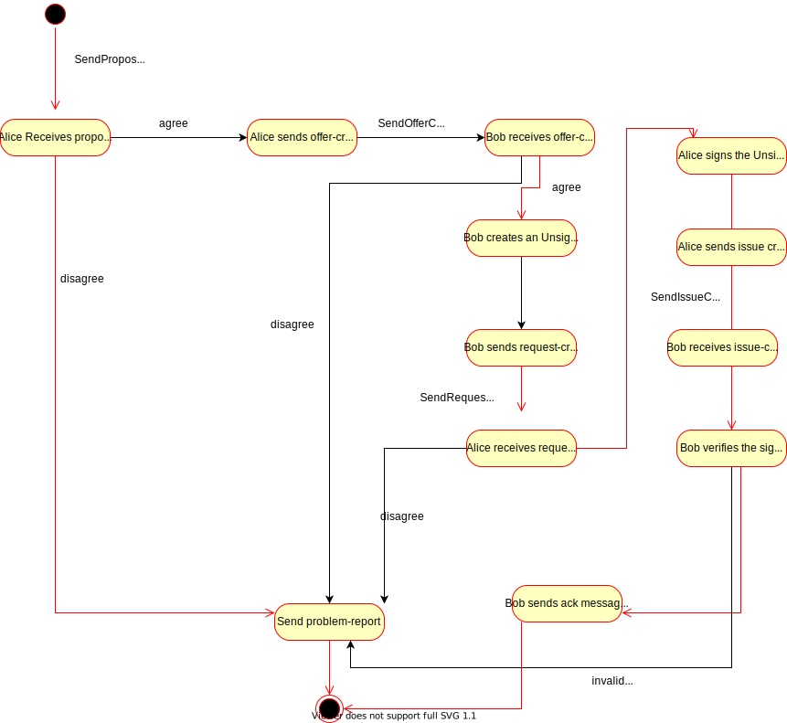

import Tabs from '@theme/Tabs';
import TabItem from '@theme/TabItem';

# Propose Credential with DIDComm

This example is similar to [A User requests a credential from an issuer] but here we start with the (future) holder of a credential **suggesting a proposal** to an issuer.

## Exchanging information and using protocols in VADE by combining plugins

So far we have discussed how plugins work individually and cater to specific functions but in real scenarios plugins work together and perform various functionalities seamlessly, we will try to understand and demonstrate it with the help of following flow:

- Bob wants a credential issued from Alice
- First of all they connect to each other via DIDcomm and Bob starts a Protocol “Issue Credential”
- Bob sends “request-credential” to Alice
- Alice receives it and creates a JWT credential and creates a “issue-credential” message which contains the created credential as payload and sends it back to Bob
- Bob receives the message and verifies the issued credential
- At last Bob sends back an “ack” message to Alice

Above scenario would be using [`vade-jwt-vc`] for JWT credential creation and signing, [`vade-didcomm`] for [`issue credential protocol`] and didcomm communication,[`vade-evan-cli`] for combining all plugins and using them seamlessly.



### Secure communication

To allow secure communication between Alice and Bob they must exchange encryption keys. This can be handled in two ways:

- Both parties perform a DID exchange via [`did exchange protocol`]. The communication for this is done via [`vade-didcomm`] as well. Once the exchange is complete, the keys are stored in VADE and both parties can omit the `encryptionKeys` in the options.
- Both parties pass `encryptionKeys` in the options in every call they make for the exchange of the credential as they exchanged in some other way already. This approach increases the amount of data that must be passed to VADE but also allows to test the calls on this page more easily as the DID exchange can be skipped. This approach is used for the explanation here to focus on the actual credential exchange.
Check [`generating keys`] section to generate encryption keys for DIDCOMM exchange.

### Bob wants a credential issued from Alice

If Bob wants a credential issued from Alice , he would need to connect with Alice and request for Credential issuance, for that purpose Bob would have to establish communication with Alice according to [`issue credential protocol`], the communication will be done via [`vade-didcomm`]. Once the initial communication is done, Bob would request credential from Alice.

### First of all they connect to each other via DIDcomm and Bob starts a Protocol “Issue Credential”

The initial communication as per [`issue credential protocol`] would involve following steps :-

Note: Please checkout the documentation for [`didcomm_send`] and [`didcomm_receive`] to understand the `payload` and `options`. The `body` parameter in payload contains the structure required for [`issue credential protocol`] and state represents the current state of protocol as each protocol goes through various status before the communication is completed or terminated. [`issue credential protocol`] starts with proposal sending from Bob so the initial state is `SendProposeCredential`.

- Bob sends `propose-credential` request to Alice via [`vade-didcomm`].

<Tabs groupId="vade_input">
<TabItem value="json_args" label="JSON args">

```json
options = {
   "encryptionKeys":{
      "encryptionMySecret":"5046adc1dba838867b2bbbfdd0c3423e58b57970b5267a90f57960924a87f156",
      "encryptionOthersPublic":"d92f5eeaa24fd4e66221c770f704a5e2639a476bab82cfec40bd2874abeb481f"
   }
}

payload = {
   "type":"https://didcomm.org/issue-credential/1.0/propose-credential",
   "service_endpoint":"https://evan.network",
   "from":"did:key:z6MkiTBz1ymuepAQ4HEHYSF1H8quG5GLVVQR3djdX3mDooWp",
   "to":[
      "did:key:z6MkjchhfUsD6mmvni8mCdXHw216Xrm9bQe2mBH1P5RDjVJG"
   ],
   "body":{
      "state":"SendProposeCredential",
      "credential_preview":{
         "type":"",
         "attributes":[
            {
               "name":"atr-name",
               "mime_type":"text",
               "value":"abc_123"
            }
         ]
      },
      "credential_proposal":{
         "id":"5b5c5765e0c84df5b0b47e93041e0943",
         "comment":"Nocomment",
         "schema_issuer_did":"did:key:z6MkiTBz1ymuepAQ4HEHYSF1H8quG5GLVVQR3djdX3mDooWp",
         "schema_id":"some_id",
         "schema_name":"name",
         "schema_version":"version",
         "cred_def_id":"cred_id",
         "issuer_did":"issuer_did"
      }
   },
   "thid":"5b5c5765e0c84df5b0b47e93041e0943"
}
```

</TabItem>
<TabItem value="vade_evan_cli" label="vade_evan_cli">

```sh
vade_options='{"encryptionKeys":{"encryptionMySecret":"5046adc1dba838867b2bbbfdd0c3423e58b57970b5267a90f57960924a87f156","encryptionOthersPublic":"d92f5eeaa24fd4e66221c770f704a5e2639a476bab82cfec40bd2874abeb481f"}}'

vade_payload='{"type":"https://didcomm.org/issue-credential/1.0/propose-credential","service_endpoint":"https://evan.network","from":"did:key:z6MkiTBz1ymuepAQ4HEHYSF1H8quG5GLVVQR3djdX3mDooWp","to":["did:key:z6MkjchhfUsD6mmvni8mCdXHw216Xrm9bQe2mBH1P5RDjVJG"],"body":{"state":"SendProposeCredential","credential_preview":{"type":"","attributes":[{"name":"atr-name","mime_type":"text","value":"abc_123"}]},"credential_proposal":{"id":"5b5c5765e0c84df5b0b47e93041e0943","comment":"Nocomment","schema_issuer_did":"did:key:z6MkiTBz1ymuepAQ4HEHYSF1H8quG5GLVVQR3djdX3mDooWp","schema_id":"some_id","schema_name":"name","schema_version":"version","cred_def_id":"cred_id","issuer_did":"issuer_did"}},"thid":"5b5c5765e0c84df5b0b47e93041e0943"}'

./vade_evan_cli didcomm send --options $vade_options --payload $vade_payload
```

</TabItem>
</Tabs>

Notice the `type` parameter in payload as well as it mentions the protocol and it's message type being sent.

- Output of send
This represents the actual message which is sent via `vade-didcomm`

```json
{
   "protected":"eyJ0eXAiOiJhcHBsaWNhdGlvbi9kaWRjb21tLWVuY3J5cHRlZCtqc29uIiwiZW5jIjoiWEMyMFAiLCJraWQiOiJhMTM0YTlmODFhZWY1MTE0NjE5MTZhMDkxM2M3NGIyZWUwZjFmY2NlOGFlNTAyZjhjNzBjNThlNjNkZjNhY2Q1Iiwic2tpZCI6ImRpZDprZXk6ejZNa2lUQnoxeW11ZXBBUTRIRUhZU0YxSDhxdUc1R0xWVlFSM2RqZFgzbURvb1dwIiwiYWxnIjoiRUNESC0xUFUrWEMyMFBLVyJ9",
   "recipients":[
      {
         "header":{
            "key_ops":[

            ],
            "alg":"ECDH-1PU+XC20PKW",
            "kid":"did:key:z6MkjchhfUsD6mmvni8mCdXHw216Xrm9bQe2mBH1P5RDjVJG",
            "epk":{
               "kty":"OKP",
               "crv":"X25519",
               "x":"dZ6Qd90s52vfWyKeyknA2RUaN--MCp6W8lpJ3rqLFSw"
            },
            "tag":"s5o2akHfRJznpd5H8-vVVA",
            "iv":"3qBwhwZvorbswQIixZLED8Jtowc_SscX"
         },
         "encrypted_key":"BUQ5pHB3nWjH-UAppxd4OfYYkZxvW73QH_dFNreBMsI"
      }
   ],
   "ciphertext":"Y5i-RkT1JLojCfouWneqAMKiNxNSNnQFexzWWFgucUe5ZZS27MY3ay6DIjSbMN5IJGif9K6jlQDYycvwXIA_SMjlBbqTy05IVxwSTnpGlS7fHVGOprNUcup0y0juPJ7MtX304M-gZt_gVemJMcKFjgFlRwuX7pOYV47APQSPmyHqrLiFpg5ppb2RMy2R5PS8qTPkMT583Fxe4ia-zbci5c5_GsHv-qKMkSD_pHFDprbfrdOjP-5q9y_VvlJdY-Nt5N_ev6MFqAgSM_zM3simfsQtZsp2_XAdHORlQpdvf39gULIi5IjLBcC9prAeUpKPgxtw2uSXdaKl3r2FEcAk7P8DbwLXlRkbF61_NSJhSUJGdWxWJnf-vwDtGTsQh6Z9KSzjauhWLoVN9kTKwoA-02o54va-M811to9FyqIRNdxWObyVeYYbxcuYOmdW78M1QkTGmSS6dgMFQNqnm-hrtgHZWZowQ2-kSyBQJExqQJUw10IrfcbkFHU_jSVtBkT8d9FXr3vaV0wNde20qRVBgcA8O6oI65Ci2PzF8ULGOu4CVXFYYvLnSnqS3Eues9l0n2lfSiv48VYzunXtJFNzd0p5hAy3Mq9lPVheCbX7PY5mP8VS4Gx9gEF77V3zotQNVEZ9or2Ea_3Qnat4U0I8mOkBRiAYT8_wv_TQ3XRY2F6w428ikKU3KGS-l-5iXYa_0Cav51b0yd9XBTSh5bQORF7ih8GaUNw9qIuO7nBRziQD44fYcNUOsTFMhwk4UfrEJEzKgx32oAjD3ZRCIZVkUbK3kyo-hRnqjUoGtvExzzjoYGysx3sM2ol85QIgZOJGMJ_zvGfDXCrjwwDvqGsTu9JNyOjqV1xqvVwZpdpFVQbxtqh3CPHc1q7Kfs0shRRA0SLuyxPxFazgItDj0dmix-ZlDuwFQ-I7zY_mSuAfC4O3EuYC9tKoGQDLCZv0tMwcB_p7gdaByKvCv7iPaKlLk7WFcbi8LXRor2eSYes4lyGG_GmZ3oUMTkJy0pZZfMFmmnAHY0KDQNNN6rdel_5qJ1QL8J02zHVBNkHReuQ0V7dxMgmUXrzQzGtUaVj7RdZysmzhTXo15ouT4N1Z7UAq4NYHvVv_ngIYN-KKzx5HssX2-gaOIpRffHFIRXzC5EQZljCgzS6POiT50TEURWXSUZfmWZC2o0r7WlrSgXk6ZpWU1IEfuh-MZ05nxF_2U9YvY6A0cM-NOQD4w4V8E7hQus9f0IxRqCc3v2jaDh0AlYqlnvPXv5Ntq4kE-7QwMLcEzPYbD3TKtSmMYvE2Dwak8zZAZ0BUPq9JSNgei7Ow9Z5FCTdht-Pq9Z3yOVxTiLCQyiTmm1iDZ3ECRW7vTOUvi4C9fIe2wFnOLEvBkvS86J7aU7uufem3_hIeQDWFfL_w9klmJrQ-puuKKeU6R7l6w9cwBb09Grkfe4NwLYZJjAweugbko3ojq2zBkMpYhdPSTh_HtDzcQHg16-uxih1yaUxr-pB34FxbXnw-7JNzbd1egNPOybHK4LjOjv1vXGCQ7eOLQUHUwI11NKWesI_QfqtMbSIJD3o0A3F1LYC_XVBovH-f4M4w8ihYHL_vZ4jr6lI1ACCA9jkZE341K3R6z8qper_ZQREtID-zq2NEJmOM7vSuqhSK1JWSVgszjX1-JGmVCC1ow-QKMnGzFd7X-JhWayTrzR6rgKqwIhrzap2EyjijWVQ3TtjRfBsNd9v1HfyqHm6BV2X89mLuGtiDpVWU-2asE0rt2QtrabyYiKwPKhliCxbWCVpb8R3UmFCyp93aaUZTtxxxXaQM1JUQUScZeKA5r0KuDX5mBWQ_VozsIRE-HMVq7CNVhBD0KFwYZHh1i9w0LLzAsVArYHXLKrTC08CPFWQK7gZtU9sKTIomC_CvCLBghSQIiveNPYlo3FNhw7fE-p--LU03p19j7yuB0ZFOzgaxFNwrZpR8TrPmH3ZtERU75Z8Gw2vuXwLmxaJ2WbXOnQMXVWfGUwKlTWl_wQ2UrGC5bply1SWJOpaZRFU93hfZ6JFRrFae3ykPjiTAyIHn_D3L1uAyr0pMsLt8v3y9Oig4Q48aW9IaB6P1qcnSaFSbPdPQ-n04e9JUB6rOPeItYwpQmI1KyyM0Bf9ywC_6U4tZQJR7R7jyxsf56wxQYoUEwwSx8SLhde47zftg0nbAYpLo-BD_C7-QspRgJva1SvVzUUGLb9wIbcjNDp8EJfNFqjd3wZMWL_YEDtYBsyVGVCIUak2BfWK9wtNC9FSZ7F2E8vdTSNUXTAitjKVTMfM95ec7vvVrE0p0kaMNY7SFv_aNvvX0Tl2RqZUCwMNT82kiNejFTeScFSCuxydPgwG24uULgh4utx_9lDgNFe6rnL0ZrVrOZKfeY1nusi2MwhaD08Do0v9WXeeTei44wzbpgyf3IqooOrMUzsqorVz9GFxBCE3syeDNRWhcAFmsPxgVjPh0NAmX6Xie1AJZLpz-kSLeF4XZtDznCZ14xATwj2AME6mQVHA8Ff2Ho1rpNAdsPMzTHh2HrohRbYVfRf2kQiWlvQCWbxVV9Xk3AaOSQKPYT6La2NME2dB_mI4Eo_AqfFSSsYUPfiKR7Ko3DbpRxGtaIW-T48xmZxYOPwqAGUuRsAp1lenomHaFBTKwwM0Pav9N8uAgAv6BSNBSXGeQAI0V9lWjTAacRFMzHJ-mjHF3naQSgz5J7H4n4u4IrRUMKCrVlrlF7s-AUnduMLy2tk9PHU1vYksXI-DwzT1UvFy4zFyuABRSv9VcYJnkXI3aob_C5eKCkue3l4oS2jXT7rwMaqqWJVlc6DNuZL31JUVNk5Y5Kx2KS0PaG-GxRjzz37N1j_kBFpZNRYpFHKRCW4CAqXqQfpD-kk7zNkgqzdxZbA_2QdPoJCi2Ugwp2AYo9JpPOnmwXz4Wr_CUtVZyXhv6xefjN-AzdnkBiJxqz6wS3VKVHqx-L38StIsXlCqv4cSrRcKxSaz6Lfcnfva2Y6rmoeywc8mJbpP_aobXPWUw1tfDCQmlUasTT0NlDcyARVqmHt6b6i0dwCFGZe3yCMJDy_gs3BZ4H3nj4uzO5-I0tL4lh8HFjnxKBkGK_j0p0rccFnCQAriOaWm6cINjkTrnqHUKEclkHxYAMub3pltphAPplflbtpEN",
   "iv":"xQ3IIPr9aG1t7A_UKmcDaZ0h-pjqRb55",
   "tag":"FUnmXD1Kn0J3rjIV9nRNPg"
}
```

- Alice receives `propose-credential` request and check the proposal.

<Tabs groupId="vade_input">
<TabItem value="json_args" label="JSON args">

```json
options = {
   "encryptionKeys":{
      "encryptionMySecret":"f068e2f7ccc3eee220065e1dc937d34d548ec59be6488fea5ae1397e63f81c52",
      "encryptionOthersPublic":"5bf55c73b82ebe22be80f3430667af570fae2556a6415e6b30d4065300aa947d"
   }
}

payload = {
   "protected":"eyJ0eXAiOiJhcHBsaWNhdGlvbi9kaWRjb21tLWVuY3J5cHRlZCtqc29uIiwiZW5jIjoiWEMyMFAiLCJraWQiOiJhMTM0YTlmODFhZWY1MTE0NjE5MTZhMDkxM2M3NGIyZWUwZjFmY2NlOGFlNTAyZjhjNzBjNThlNjNkZjNhY2Q1Iiwic2tpZCI6ImRpZDprZXk6ejZNa2lUQnoxeW11ZXBBUTRIRUhZU0YxSDhxdUc1R0xWVlFSM2RqZFgzbURvb1dwIiwiYWxnIjoiRUNESC0xUFUrWEMyMFBLVyJ9",
   "recipients":[
      {
         "header":{
            "key_ops":[

            ],
            "alg":"ECDH-1PU+XC20PKW",
            "kid":"did:key:z6MkjchhfUsD6mmvni8mCdXHw216Xrm9bQe2mBH1P5RDjVJG",
            "epk":{
               "kty":"OKP",
               "crv":"X25519",
               "x":"dZ6Qd90s52vfWyKeyknA2RUaN--MCp6W8lpJ3rqLFSw"
            },
            "tag":"s5o2akHfRJznpd5H8-vVVA",
            "iv":"3qBwhwZvorbswQIixZLED8Jtowc_SscX"
         },
         "encrypted_key":"BUQ5pHB3nWjH-UAppxd4OfYYkZxvW73QH_dFNreBMsI"
      }
   ],
   "ciphertext":"Y5i-RkT1JLojCfouWneqAMKiNxNSNnQFexzWWFgucUe5ZZS27MY3ay6DIjSbMN5IJGif9K6jlQDYycvwXIA_SMjlBbqTy05IVxwSTnpGlS7fHVGOprNUcup0y0juPJ7MtX304M-gZt_gVemJMcKFjgFlRwuX7pOYV47APQSPmyHqrLiFpg5ppb2RMy2R5PS8qTPkMT583Fxe4ia-zbci5c5_GsHv-qKMkSD_pHFDprbfrdOjP-5q9y_VvlJdY-Nt5N_ev6MFqAgSM_zM3simfsQtZsp2_XAdHORlQpdvf39gULIi5IjLBcC9prAeUpKPgxtw2uSXdaKl3r2FEcAk7P8DbwLXlRkbF61_NSJhSUJGdWxWJnf-vwDtGTsQh6Z9KSzjauhWLoVN9kTKwoA-02o54va-M811to9FyqIRNdxWObyVeYYbxcuYOmdW78M1QkTGmSS6dgMFQNqnm-hrtgHZWZowQ2-kSyBQJExqQJUw10IrfcbkFHU_jSVtBkT8d9FXr3vaV0wNde20qRVBgcA8O6oI65Ci2PzF8ULGOu4CVXFYYvLnSnqS3Eues9l0n2lfSiv48VYzunXtJFNzd0p5hAy3Mq9lPVheCbX7PY5mP8VS4Gx9gEF77V3zotQNVEZ9or2Ea_3Qnat4U0I8mOkBRiAYT8_wv_TQ3XRY2F6w428ikKU3KGS-l-5iXYa_0Cav51b0yd9XBTSh5bQORF7ih8GaUNw9qIuO7nBRziQD44fYcNUOsTFMhwk4UfrEJEzKgx32oAjD3ZRCIZVkUbK3kyo-hRnqjUoGtvExzzjoYGysx3sM2ol85QIgZOJGMJ_zvGfDXCrjwwDvqGsTu9JNyOjqV1xqvVwZpdpFVQbxtqh3CPHc1q7Kfs0shRRA0SLuyxPxFazgItDj0dmix-ZlDuwFQ-I7zY_mSuAfC4O3EuYC9tKoGQDLCZv0tMwcB_p7gdaByKvCv7iPaKlLk7WFcbi8LXRor2eSYes4lyGG_GmZ3oUMTkJy0pZZfMFmmnAHY0KDQNNN6rdel_5qJ1QL8J02zHVBNkHReuQ0V7dxMgmUXrzQzGtUaVj7RdZysmzhTXo15ouT4N1Z7UAq4NYHvVv_ngIYN-KKzx5HssX2-gaOIpRffHFIRXzC5EQZljCgzS6POiT50TEURWXSUZfmWZC2o0r7WlrSgXk6ZpWU1IEfuh-MZ05nxF_2U9YvY6A0cM-NOQD4w4V8E7hQus9f0IxRqCc3v2jaDh0AlYqlnvPXv5Ntq4kE-7QwMLcEzPYbD3TKtSmMYvE2Dwak8zZAZ0BUPq9JSNgei7Ow9Z5FCTdht-Pq9Z3yOVxTiLCQyiTmm1iDZ3ECRW7vTOUvi4C9fIe2wFnOLEvBkvS86J7aU7uufem3_hIeQDWFfL_w9klmJrQ-puuKKeU6R7l6w9cwBb09Grkfe4NwLYZJjAweugbko3ojq2zBkMpYhdPSTh_HtDzcQHg16-uxih1yaUxr-pB34FxbXnw-7JNzbd1egNPOybHK4LjOjv1vXGCQ7eOLQUHUwI11NKWesI_QfqtMbSIJD3o0A3F1LYC_XVBovH-f4M4w8ihYHL_vZ4jr6lI1ACCA9jkZE341K3R6z8qper_ZQREtID-zq2NEJmOM7vSuqhSK1JWSVgszjX1-JGmVCC1ow-QKMnGzFd7X-JhWayTrzR6rgKqwIhrzap2EyjijWVQ3TtjRfBsNd9v1HfyqHm6BV2X89mLuGtiDpVWU-2asE0rt2QtrabyYiKwPKhliCxbWCVpb8R3UmFCyp93aaUZTtxxxXaQM1JUQUScZeKA5r0KuDX5mBWQ_VozsIRE-HMVq7CNVhBD0KFwYZHh1i9w0LLzAsVArYHXLKrTC08CPFWQK7gZtU9sKTIomC_CvCLBghSQIiveNPYlo3FNhw7fE-p--LU03p19j7yuB0ZFOzgaxFNwrZpR8TrPmH3ZtERU75Z8Gw2vuXwLmxaJ2WbXOnQMXVWfGUwKlTWl_wQ2UrGC5bply1SWJOpaZRFU93hfZ6JFRrFae3ykPjiTAyIHn_D3L1uAyr0pMsLt8v3y9Oig4Q48aW9IaB6P1qcnSaFSbPdPQ-n04e9JUB6rOPeItYwpQmI1KyyM0Bf9ywC_6U4tZQJR7R7jyxsf56wxQYoUEwwSx8SLhde47zftg0nbAYpLo-BD_C7-QspRgJva1SvVzUUGLb9wIbcjNDp8EJfNFqjd3wZMWL_YEDtYBsyVGVCIUak2BfWK9wtNC9FSZ7F2E8vdTSNUXTAitjKVTMfM95ec7vvVrE0p0kaMNY7SFv_aNvvX0Tl2RqZUCwMNT82kiNejFTeScFSCuxydPgwG24uULgh4utx_9lDgNFe6rnL0ZrVrOZKfeY1nusi2MwhaD08Do0v9WXeeTei44wzbpgyf3IqooOrMUzsqorVz9GFxBCE3syeDNRWhcAFmsPxgVjPh0NAmX6Xie1AJZLpz-kSLeF4XZtDznCZ14xATwj2AME6mQVHA8Ff2Ho1rpNAdsPMzTHh2HrohRbYVfRf2kQiWlvQCWbxVV9Xk3AaOSQKPYT6La2NME2dB_mI4Eo_AqfFSSsYUPfiKR7Ko3DbpRxGtaIW-T48xmZxYOPwqAGUuRsAp1lenomHaFBTKwwM0Pav9N8uAgAv6BSNBSXGeQAI0V9lWjTAacRFMzHJ-mjHF3naQSgz5J7H4n4u4IrRUMKCrVlrlF7s-AUnduMLy2tk9PHU1vYksXI-DwzT1UvFy4zFyuABRSv9VcYJnkXI3aob_C5eKCkue3l4oS2jXT7rwMaqqWJVlc6DNuZL31JUVNk5Y5Kx2KS0PaG-GxRjzz37N1j_kBFpZNRYpFHKRCW4CAqXqQfpD-kk7zNkgqzdxZbA_2QdPoJCi2Ugwp2AYo9JpPOnmwXz4Wr_CUtVZyXhv6xefjN-AzdnkBiJxqz6wS3VKVHqx-L38StIsXlCqv4cSrRcKxSaz6Lfcnfva2Y6rmoeywc8mJbpP_aobXPWUw1tfDCQmlUasTT0NlDcyARVqmHt6b6i0dwCFGZe3yCMJDy_gs3BZ4H3nj4uzO5-I0tL4lh8HFjnxKBkGK_j0p0rccFnCQAriOaWm6cINjkTrnqHUKEclkHxYAMub3pltphAPplflbtpEN",
   "iv":"xQ3IIPr9aG1t7A_UKmcDaZ0h-pjqRb55",
   "tag":"FUnmXD1Kn0J3rjIV9nRNPg"
}
```

</TabItem>
<TabItem value="vade_evan_cli" label="vade_evan_cli">

```sh
vade_options='{"encryptionMySecret":"f068e2f7ccc3eee220065e1dc937d34d548ec59be6488fea5ae1397e63f81c52","encryptionOthersPublic":"5bf55c73b82ebe22be80f3430667af570fae2556a6415e6b30d4065300aa947d"}'

vade_payload='{"protected":"eyJ0eXAiOiJhcHBsaWNhdGlvbi9kaWRjb21tLWVuY3J5cHRlZCtqc29uIiwiZW5jIjoiWEMyMFAiLCJraWQiOiJhMTM0YTlmODFhZWY1MTE0NjE5MTZhMDkxM2M3NGIyZWUwZjFmY2NlOGFlNTAyZjhjNzBjNThlNjNkZjNhY2Q1Iiwic2tpZCI6ImRpZDprZXk6ejZNa2lUQnoxeW11ZXBBUTRIRUhZU0YxSDhxdUc1R0xWVlFSM2RqZFgzbURvb1dwIiwiYWxnIjoiRUNESC0xUFUrWEMyMFBLVyJ9","recipients":[{"header":{"key_ops":[],"alg":"ECDH-1PU+XC20PKW","kid":"did:key:z6MkjchhfUsD6mmvni8mCdXHw216Xrm9bQe2mBH1P5RDjVJG","epk":{"kty":"OKP","crv":"X25519","x":"dZ6Qd90s52vfWyKeyknA2RUaN--MCp6W8lpJ3rqLFSw"},"tag":"s5o2akHfRJznpd5H8-vVVA","iv":"3qBwhwZvorbswQIixZLED8Jtowc_SscX"},"encrypted_key":"BUQ5pHB3nWjH-UAppxd4OfYYkZxvW73QH_dFNreBMsI"}],"ciphertext":"Y5i-RkT1JLojCfouWneqAMKiNxNSNnQFexzWWFgucUe5ZZS27MY3ay6DIjSbMN5IJGif9K6jlQDYycvwXIA_SMjlBbqTy05IVxwSTnpGlS7fHVGOprNUcup0y0juPJ7MtX304M-gZt_gVemJMcKFjgFlRwuX7pOYV47APQSPmyHqrLiFpg5ppb2RMy2R5PS8qTPkMT583Fxe4ia-zbci5c5_GsHv-qKMkSD_pHFDprbfrdOjP-5q9y_VvlJdY-Nt5N_ev6MFqAgSM_zM3simfsQtZsp2_XAdHORlQpdvf39gULIi5IjLBcC9prAeUpKPgxtw2uSXdaKl3r2FEcAk7P8DbwLXlRkbF61_NSJhSUJGdWxWJnf-vwDtGTsQh6Z9KSzjauhWLoVN9kTKwoA-02o54va-M811to9FyqIRNdxWObyVeYYbxcuYOmdW78M1QkTGmSS6dgMFQNqnm-hrtgHZWZowQ2-kSyBQJExqQJUw10IrfcbkFHU_jSVtBkT8d9FXr3vaV0wNde20qRVBgcA8O6oI65Ci2PzF8ULGOu4CVXFYYvLnSnqS3Eues9l0n2lfSiv48VYzunXtJFNzd0p5hAy3Mq9lPVheCbX7PY5mP8VS4Gx9gEF77V3zotQNVEZ9or2Ea_3Qnat4U0I8mOkBRiAYT8_wv_TQ3XRY2F6w428ikKU3KGS-l-5iXYa_0Cav51b0yd9XBTSh5bQORF7ih8GaUNw9qIuO7nBRziQD44fYcNUOsTFMhwk4UfrEJEzKgx32oAjD3ZRCIZVkUbK3kyo-hRnqjUoGtvExzzjoYGysx3sM2ol85QIgZOJGMJ_zvGfDXCrjwwDvqGsTu9JNyOjqV1xqvVwZpdpFVQbxtqh3CPHc1q7Kfs0shRRA0SLuyxPxFazgItDj0dmix-ZlDuwFQ-I7zY_mSuAfC4O3EuYC9tKoGQDLCZv0tMwcB_p7gdaByKvCv7iPaKlLk7WFcbi8LXRor2eSYes4lyGG_GmZ3oUMTkJy0pZZfMFmmnAHY0KDQNNN6rdel_5qJ1QL8J02zHVBNkHReuQ0V7dxMgmUXrzQzGtUaVj7RdZysmzhTXo15ouT4N1Z7UAq4NYHvVv_ngIYN-KKzx5HssX2-gaOIpRffHFIRXzC5EQZljCgzS6POiT50TEURWXSUZfmWZC2o0r7WlrSgXk6ZpWU1IEfuh-MZ05nxF_2U9YvY6A0cM-NOQD4w4V8E7hQus9f0IxRqCc3v2jaDh0AlYqlnvPXv5Ntq4kE-7QwMLcEzPYbD3TKtSmMYvE2Dwak8zZAZ0BUPq9JSNgei7Ow9Z5FCTdht-Pq9Z3yOVxTiLCQyiTmm1iDZ3ECRW7vTOUvi4C9fIe2wFnOLEvBkvS86J7aU7uufem3_hIeQDWFfL_w9klmJrQ-puuKKeU6R7l6w9cwBb09Grkfe4NwLYZJjAweugbko3ojq2zBkMpYhdPSTh_HtDzcQHg16-uxih1yaUxr-pB34FxbXnw-7JNzbd1egNPOybHK4LjOjv1vXGCQ7eOLQUHUwI11NKWesI_QfqtMbSIJD3o0A3F1LYC_XVBovH-f4M4w8ihYHL_vZ4jr6lI1ACCA9jkZE341K3R6z8qper_ZQREtID-zq2NEJmOM7vSuqhSK1JWSVgszjX1-JGmVCC1ow-QKMnGzFd7X-JhWayTrzR6rgKqwIhrzap2EyjijWVQ3TtjRfBsNd9v1HfyqHm6BV2X89mLuGtiDpVWU-2asE0rt2QtrabyYiKwPKhliCxbWCVpb8R3UmFCyp93aaUZTtxxxXaQM1JUQUScZeKA5r0KuDX5mBWQ_VozsIRE-HMVq7CNVhBD0KFwYZHh1i9w0LLzAsVArYHXLKrTC08CPFWQK7gZtU9sKTIomC_CvCLBghSQIiveNPYlo3FNhw7fE-p--LU03p19j7yuB0ZFOzgaxFNwrZpR8TrPmH3ZtERU75Z8Gw2vuXwLmxaJ2WbXOnQMXVWfGUwKlTWl_wQ2UrGC5bply1SWJOpaZRFU93hfZ6JFRrFae3ykPjiTAyIHn_D3L1uAyr0pMsLt8v3y9Oig4Q48aW9IaB6P1qcnSaFSbPdPQ-n04e9JUB6rOPeItYwpQmI1KyyM0Bf9ywC_6U4tZQJR7R7jyxsf56wxQYoUEwwSx8SLhde47zftg0nbAYpLo-BD_C7-QspRgJva1SvVzUUGLb9wIbcjNDp8EJfNFqjd3wZMWL_YEDtYBsyVGVCIUak2BfWK9wtNC9FSZ7F2E8vdTSNUXTAitjKVTMfM95ec7vvVrE0p0kaMNY7SFv_aNvvX0Tl2RqZUCwMNT82kiNejFTeScFSCuxydPgwG24uULgh4utx_9lDgNFe6rnL0ZrVrOZKfeY1nusi2MwhaD08Do0v9WXeeTei44wzbpgyf3IqooOrMUzsqorVz9GFxBCE3syeDNRWhcAFmsPxgVjPh0NAmX6Xie1AJZLpz-kSLeF4XZtDznCZ14xATwj2AME6mQVHA8Ff2Ho1rpNAdsPMzTHh2HrohRbYVfRf2kQiWlvQCWbxVV9Xk3AaOSQKPYT6La2NME2dB_mI4Eo_AqfFSSsYUPfiKR7Ko3DbpRxGtaIW-T48xmZxYOPwqAGUuRsAp1lenomHaFBTKwwM0Pav9N8uAgAv6BSNBSXGeQAI0V9lWjTAacRFMzHJ-mjHF3naQSgz5J7H4n4u4IrRUMKCrVlrlF7s-AUnduMLy2tk9PHU1vYksXI-DwzT1UvFy4zFyuABRSv9VcYJnkXI3aob_C5eKCkue3l4oS2jXT7rwMaqqWJVlc6DNuZL31JUVNk5Y5Kx2KS0PaG-GxRjzz37N1j_kBFpZNRYpFHKRCW4CAqXqQfpD-kk7zNkgqzdxZbA_2QdPoJCi2Ugwp2AYo9JpPOnmwXz4Wr_CUtVZyXhv6xefjN-AzdnkBiJxqz6wS3VKVHqx-L38StIsXlCqv4cSrRcKxSaz6Lfcnfva2Y6rmoeywc8mJbpP_aobXPWUw1tfDCQmlUasTT0NlDcyARVqmHt6b6i0dwCFGZe3yCMJDy_gs3BZ4H3nj4uzO5-I0tL4lh8HFjnxKBkGK_j0p0rccFnCQAriOaWm6cINjkTrnqHUKEclkHxYAMub3pltphAPplflbtpEN","iv":"xQ3IIPr9aG1t7A_UKmcDaZ0h-pjqRb55","tag":"FUnmXD1Kn0J3rjIV9nRNPg"}'

./vade_evan_cli didcomm receive --options $vade_options --payload $vade_payload
```

</TabItem>
</Tabs>

- Output of receive

```json
{
   "state":"SendProposeCredential",
   "credential_preview":{
      "type":"",
      "attributes":[
         {
            "name":"atr-name",
            "mime_type":"text",
            "value":"abc_123"
         }
      ]
   },
   "credential_proposal":{
      "id":"5b5c5765e0c84df5b0b47e93041e0943",
      "comment":"No comment",
      "schema_issuer_did":"did:key:z6MkiTBz1ymuepAQ4HEHYSF1H8quG5GLVVQR3djdX3mDooWp",
      "schema_id":"some_id",
      "schema_name":"name",
      "schema_version":"version",
      "cred_def_id":"cred_id",
      "issuer_did":"issuer_did"
   }
}
```

- Alice responds with `offer-credential` message.

<Tabs groupId="vade_input">
<TabItem value="json_args" label="JSON args">

```json
options = {
   "encryptionKeys":{
      "encryptionMySecret":"5046adc1dba838867b2bbbfdd0c3423e58b57970b5267a90f57960924a87f156",
      "encryptionOthersPublic":"d92f5eeaa24fd4e66221c770f704a5e2639a476bab82cfec40bd2874abeb481f"
   }
}

payload = {
   "type":"https://didcomm.org/issue-credential/1.0/offer-credential",
   "service_endpoint":"https://evan.network",
   "from":"did:key:z6MkjchhfUsD6mmvni8mCdXHw216Xrm9bQe2mBH1P5RDjVJG",
   "to":[
      "did:key:z6MkiTBz1ymuepAQ4HEHYSF1H8quG5GLVVQR3djdX3mDooWp"
   ],
   "body":{
      "state":"SendOfferCredential",
      "credential_preview":{
         "type":"",
         "attributes":[
            {
               "name":"atr-name",
               "mime_type":"text",
               "value":"abc_123"
            }
         ]
      },
      "data_attach":[
         {
            "id":"id",
            "mime_type":"text",
            "data":"YmFzZSA2NCBkYXRhIHN0cmluZw"
         }
      ]
   },
   "thid":"5b5c5765e0c84df5b0b47e93041e0943"
}
```

</TabItem>
<TabItem value="vade_evan_cli" label="vade_evan_cli">

```sh
vade_options='{"encryptionKeys":{"encryptionMySecret":"5046adc1dba838867b2bbbfdd0c3423e58b57970b5267a90f57960924a87f156","encryptionOthersPublic":"d92f5eeaa24fd4e66221c770f704a5e2639a476bab82cfec40bd2874abeb481f"}}'

vade_payload='{"type":"https://didcomm.org/issue-credential/1.0/offer-credential","service_endpoint":"https://evan.network","from":"did:key:z6MkjchhfUsD6mmvni8mCdXHw216Xrm9bQe2mBH1P5RDjVJG","to":["did:key:z6MkiTBz1ymuepAQ4HEHYSF1H8quG5GLVVQR3djdX3mDooWp"],"body":{"state":"SendOfferCredential","credential_preview":{"type":"","attributes":[{"name":"atr-name","mime_type":"text","value":"abc_123"}]},"data_attach":[{"id":"id","mime_type":"text","data":"YmFzZSA2NCBkYXRhIHN0cmluZw"}]},"thid":"5b5c5765e0c84df5b0b47e93041e0943"}'

./vade_evan_cli didcomm send --options $vade_options --payload $vade_payload
```

</TabItem>
</Tabs>

- Bob receives the `offer-credential` message.

<Tabs groupId="vade_input">
<TabItem value="json_args" label="JSON args">

```json
options = {
   "encryptionKeys":{
      "encryptionMySecret":"f068e2f7ccc3eee220065e1dc937d34d548ec59be6488fea5ae1397e63f81c52",
      "encryptionOthersPublic":"5bf55c73b82ebe22be80f3430667af570fae2556a6415e6b30d4065300aa947d"
   }
}

payload = {
   "protected":"eyJ0eXAiOiJhcHBsaWNhdGlvbi9kaWRjb21tLWVuY3J5cHRlZCtqc29uIiwiZW5jIjoiWEMyMFAiLCJraWQiOiJlZjVhYjFhYTg4MmI0ODBkMjM3OWNhMzMxYTFiZDAzZjBlODYwM2MxYzcwOWUxOTFmMzAwNzQzOWY0OTEzOTAyIiwic2tpZCI6ImRpZDprZXk6ejZNa2pjaGhmVXNENm1tdm5pOG1DZFhIdzIxNlhybTliUWUybUJIMVA1UkRqVkpHIiwiYWxnIjoiRUNESC0xUFUrWEMyMFBLVyJ9",
   "recipients":[
      {
         "header":{
            "key_ops":[

            ],
            "alg":"ECDH-1PU+XC20PKW",
            "kid":"did:key:z6MkiTBz1ymuepAQ4HEHYSF1H8quG5GLVVQR3djdX3mDooWp",
            "epk":{
               "kty":"OKP",
               "crv":"X25519",
               "x":"e0IszYhBlmRv3ocOnfZTV_3xXy9oDWV_gGSYUhq6BTY"
            },
            "iv":"6KpsBJJnHSp5jvdei5WkNJD5lYQkL8mq",
            "tag":"DaQB6Eqxovn5IoYNVA3ung"
         },
         "encrypted_key":"ajsK_5ZczJUyRYr2k7izJ1pwZPwWd6uvrHLHD9YTyaU"
      }
   ],
   "ciphertext":"zG1nnAguTQlZqKX4WH1rKtYDBF74wa3LZ9NvcVcjWk6ex80mBr7h8x9W_yFneaXrjLU3w-uurBXn22jgo1n0sz3XBzwpc3yexRYLZROw0TXG-gC1S1cvia8fsbPfAWqdlMF2ZtLO5RjVvfrZmBCI9IvKWFaYGaW5Cj4JhmqfBRVLYPscr8szWXTRg4CX9lmaeZm7NS5byjo9FmbGIAslebVZT4A6RQYOadj-1ymqsQwJ3rn_EA19zXqq0Iw_QPDRbNvNukbOgvuVm4umtWOAfI4KQRStlZjS7z9bODAQ76_muSxH7_pUEapyJi92pGn51uBuF_P6CdwA-07IaRvaHc-xKHbXNW8rwL0pWE7n6fCLrCcRVzpInzwrl9fBRKjvFnIftb-LO_qJhu7hWtAaIr9advNXaX8vkbw4bFAzaJ4U02ZeMjTCvHWtEWfGEoxj5RZdweEy_EHjQe3CtxkHvAzc2yNUor3UWD37g5kj-QMF8ivqlWdVTxetf5jZcBChAbc1boYPfgZ2D_gVdcVmXpEBeEflUnlEre1yqrRMnalNcKbT8gX4pwyXajy9v0qJJ6INC-LSn7o6dXOOxoj_UPhl3xKnWMiALFGIH5wk_NbmAHzuBcYIpH9j4q26WVyIZyhRhDlVCT9x6jQTyUp3Dkc2IyVU1ASuGihawStfKUBdTFIuCqm38cHLFB7ARe4O9neuZrCl_rXtIaCD_7by_1zUbvUIQeQifp3yd72k-BymT5hw5lJg0tdctFgWoLWpgd3lvqfLMfyPCm-hc96iZ3tIP-BT9FgtO5-iLUmgdF_qH6pfUGV77yodJB1N-n5LmxIo7sIebIPecovwHn0DnuEFxtD99VCEWUihG0UO0-RczJbnpGYjmwdBizQAsFLTBt3yyxMk5Ahjeo5_2oirCQe2FD0BrePgU-qCAwnuAevVgDDYKjSThnN_iSEgoYCnZ4WEdhOmnO5IsjrguWIhM-nDHmOt9RhjPWFZFtYyQPzKfasB7-Oc67Zv8J0krOKa4hzMZn4C4MJuT8X6Xy9IgljMsuUdAnwXIlqOTV5freVij1i3fTzlkPkLba5_buuDZ0JZit1fidFQiF7azwcnqVXkX0jZk6MJjgQLk4B-CDxcCrGKQFJjqk-myRhlKuwJAxG9_VXhEoSWmtxhwXqwt_Caj8jmm-Z6l54THfi7Mm4j0Tq_9Yr5chpo8O-xVpLACZscT4AsLo6KOuNJUdTwOHY8qanyP5oI-Zqcz-7GpfU_mIxWiTM64nwhVUPFIdndUWHI01v7Qw6onKWZLsqkWqR-4Ewq1L5afCjvJ2ddMT3tASwapLag5nbACeMHhfJ0KkL-HrjdGv90fYD7ny6cMAdY_ifXXhkMfixj0lgBxMYSEGryUvkbd4xQleUPQkRSxsz5AcH7pZd4ZDQnmmdtFdbi8wXw7txUF0_sCzTRG4g-QKoAMDi6Y_hrCytMQS4uaKf_EOtR5Jh1R-O5igSwaAFnwgJE6jYcV8slXBylBvosLtxcU3duIHvQHALR0FOFK1PQIjjA8uXWzwZ1QHxESsXsWCrZj91-NTOa7rv9E3IvvD_Kuan5wawjGsOMBIj3w1VzK1LOZdVCOYldCfVECPPMAe09B737uI9KYOdmJVNBuA341p6O3YhVrRgX2cA7NV3kRGJMnIeekZZWFy45rz32O9FMgIu4KNFuKwJC2F4iHIbAyNYJ4tM5aBt7LyWvuQCS5DbRMbCh4PN0Pe7H40_C7dVs0awJ_4CwtjJ6sRNuV7XZyNJNN0Kwl_DKcilILALs54vycsh3g6Sx5Kr9RvBRRpYIh_GnByN56Bquk3ZGxnrTB0XXVhMOyUhqedl2FAYjix0m98dlL51ssK4M9SD0piLDzLH0yaGFRBi9jFO_0XXUG8hERuHiivd75UZhMyPbX9IZPiuOtxcwLSmQLlXfAAqYb2ZGJyDJdr8JB6e6-pNnpoDHMEsVfrHh3u6qCr276Wv9vXdk3fsKLW6YgcXA0xjgoXAsHpJQm88FqkSL0gwe9I4FDGzcov6XGCCpu04Yo5ip9nvQc8jBqTtMZfK_BIDE5OqdencWNmxug7w8mxHEtmskiZY2x7F0nQrbkBIc--qJ2bOBigADwA7e4KVcrwGmCvjoy8ZsRIZEX2d-RUhSyx7TG3vf6o7oFkpQR8Cg7qN4TSYpRZgU063L0A6p4J9_IwIiDEpBBHTe4jqD1Dfh_Z_C18kpuJFOzwik4ZP7Sq7SyG_HAG0HBi9FNUPwj8WLSZUj2-BEIxz4llDd56t9TlS8LmtwrF8DISQCpTuSYKMPfG6etWEXqSorZtADqSI2VI82KSWhRzWk0Xwej2A70eq2Sr-mq0GTr1VCuIew2zPWxiryj312pDYOvNIf1eMyVdOCsTHIl5kVvwnqMSGIcQsdZOtpFqMOhgCJsu3JkPDivmKakI_KTYsIpR7scvKvq70_Lkw3HqEjg8rm6RqjsUNQXnNS2znDcCa5E2zfZBc1VMNVX2rx9gPKKpZZRI2hivI54hGS0JGPxSDUp10RA8HGxi4xtZjdDGQnfqQ1HhEORR7VI9nSgRHZdbmWQX1LI0OuzZKauZkrNB459LELi5O-w5UcKQ-XRhm1NELej62JW3XosUxMkhXPPVmI_omc47Qgz9wQ0eeRH6M6Sr0xgGXt6QdH2A44EhOgFkQ5unrRz5ywpa-jgdBvC0ppPFiUSCrBf1n2Ll_l_-wGOB3_oETIZO8FltT7FcR0IM5_puIod_sWpoQYyaDkvDZ2cZ5LsxFXj2Y_kEsD",
   "iv":"f_z_3dw9DE_6jYTydMNkFOH-wQSb6bfm",
   "tag":"xRXOqC_sPic8QxJpfb5FEA"
}
```

</TabItem>
<TabItem value="vade_evan_cli" label="vade_evan_cli">

```sh
vade_options='{"encryptionMySecret":"f068e2f7ccc3eee220065e1dc937d34d548ec59be6488fea5ae1397e63f81c52","encryptionOthersPublic":"5bf55c73b82ebe22be80f3430667af570fae2556a6415e6b30d4065300aa947d"}'

vade_payload='{"protected":"eyJ0eXAiOiJhcHBsaWNhdGlvbi9kaWRjb21tLWVuY3J5cHRlZCtqc29uIiwiZW5jIjoiWEMyMFAiLCJraWQiOiJlZjVhYjFhYTg4MmI0ODBkMjM3OWNhMzMxYTFiZDAzZjBlODYwM2MxYzcwOWUxOTFmMzAwNzQzOWY0OTEzOTAyIiwic2tpZCI6ImRpZDprZXk6ejZNa2pjaGhmVXNENm1tdm5pOG1DZFhIdzIxNlhybTliUWUybUJIMVA1UkRqVkpHIiwiYWxnIjoiRUNESC0xUFUrWEMyMFBLVyJ9","recipients":[{"header":{"key_ops":[],"alg":"ECDH-1PU+XC20PKW","kid":"did:key:z6MkiTBz1ymuepAQ4HEHYSF1H8quG5GLVVQR3djdX3mDooWp","epk":{"kty":"OKP","crv":"X25519","x":"e0IszYhBlmRv3ocOnfZTV_3xXy9oDWV_gGSYUhq6BTY"},"iv":"6KpsBJJnHSp5jvdei5WkNJD5lYQkL8mq","tag":"DaQB6Eqxovn5IoYNVA3ung"},"encrypted_key":"ajsK_5ZczJUyRYr2k7izJ1pwZPwWd6uvrHLHD9YTyaU"}],"ciphertext":"zG1nnAguTQlZqKX4WH1rKtYDBF74wa3LZ9NvcVcjWk6ex80mBr7h8x9W_yFneaXrjLU3w-uurBXn22jgo1n0sz3XBzwpc3yexRYLZROw0TXG-gC1S1cvia8fsbPfAWqdlMF2ZtLO5RjVvfrZmBCI9IvKWFaYGaW5Cj4JhmqfBRVLYPscr8szWXTRg4CX9lmaeZm7NS5byjo9FmbGIAslebVZT4A6RQYOadj-1ymqsQwJ3rn_EA19zXqq0Iw_QPDRbNvNukbOgvuVm4umtWOAfI4KQRStlZjS7z9bODAQ76_muSxH7_pUEapyJi92pGn51uBuF_P6CdwA-07IaRvaHc-xKHbXNW8rwL0pWE7n6fCLrCcRVzpInzwrl9fBRKjvFnIftb-LO_qJhu7hWtAaIr9advNXaX8vkbw4bFAzaJ4U02ZeMjTCvHWtEWfGEoxj5RZdweEy_EHjQe3CtxkHvAzc2yNUor3UWD37g5kj-QMF8ivqlWdVTxetf5jZcBChAbc1boYPfgZ2D_gVdcVmXpEBeEflUnlEre1yqrRMnalNcKbT8gX4pwyXajy9v0qJJ6INC-LSn7o6dXOOxoj_UPhl3xKnWMiALFGIH5wk_NbmAHzuBcYIpH9j4q26WVyIZyhRhDlVCT9x6jQTyUp3Dkc2IyVU1ASuGihawStfKUBdTFIuCqm38cHLFB7ARe4O9neuZrCl_rXtIaCD_7by_1zUbvUIQeQifp3yd72k-BymT5hw5lJg0tdctFgWoLWpgd3lvqfLMfyPCm-hc96iZ3tIP-BT9FgtO5-iLUmgdF_qH6pfUGV77yodJB1N-n5LmxIo7sIebIPecovwHn0DnuEFxtD99VCEWUihG0UO0-RczJbnpGYjmwdBizQAsFLTBt3yyxMk5Ahjeo5_2oirCQe2FD0BrePgU-qCAwnuAevVgDDYKjSThnN_iSEgoYCnZ4WEdhOmnO5IsjrguWIhM-nDHmOt9RhjPWFZFtYyQPzKfasB7-Oc67Zv8J0krOKa4hzMZn4C4MJuT8X6Xy9IgljMsuUdAnwXIlqOTV5freVij1i3fTzlkPkLba5_buuDZ0JZit1fidFQiF7azwcnqVXkX0jZk6MJjgQLk4B-CDxcCrGKQFJjqk-myRhlKuwJAxG9_VXhEoSWmtxhwXqwt_Caj8jmm-Z6l54THfi7Mm4j0Tq_9Yr5chpo8O-xVpLACZscT4AsLo6KOuNJUdTwOHY8qanyP5oI-Zqcz-7GpfU_mIxWiTM64nwhVUPFIdndUWHI01v7Qw6onKWZLsqkWqR-4Ewq1L5afCjvJ2ddMT3tASwapLag5nbACeMHhfJ0KkL-HrjdGv90fYD7ny6cMAdY_ifXXhkMfixj0lgBxMYSEGryUvkbd4xQleUPQkRSxsz5AcH7pZd4ZDQnmmdtFdbi8wXw7txUF0_sCzTRG4g-QKoAMDi6Y_hrCytMQS4uaKf_EOtR5Jh1R-O5igSwaAFnwgJE6jYcV8slXBylBvosLtxcU3duIHvQHALR0FOFK1PQIjjA8uXWzwZ1QHxESsXsWCrZj91-NTOa7rv9E3IvvD_Kuan5wawjGsOMBIj3w1VzK1LOZdVCOYldCfVECPPMAe09B737uI9KYOdmJVNBuA341p6O3YhVrRgX2cA7NV3kRGJMnIeekZZWFy45rz32O9FMgIu4KNFuKwJC2F4iHIbAyNYJ4tM5aBt7LyWvuQCS5DbRMbCh4PN0Pe7H40_C7dVs0awJ_4CwtjJ6sRNuV7XZyNJNN0Kwl_DKcilILALs54vycsh3g6Sx5Kr9RvBRRpYIh_GnByN56Bquk3ZGxnrTB0XXVhMOyUhqedl2FAYjix0m98dlL51ssK4M9SD0piLDzLH0yaGFRBi9jFO_0XXUG8hERuHiivd75UZhMyPbX9IZPiuOtxcwLSmQLlXfAAqYb2ZGJyDJdr8JB6e6-pNnpoDHMEsVfrHh3u6qCr276Wv9vXdk3fsKLW6YgcXA0xjgoXAsHpJQm88FqkSL0gwe9I4FDGzcov6XGCCpu04Yo5ip9nvQc8jBqTtMZfK_BIDE5OqdencWNmxug7w8mxHEtmskiZY2x7F0nQrbkBIc--qJ2bOBigADwA7e4KVcrwGmCvjoy8ZsRIZEX2d-RUhSyx7TG3vf6o7oFkpQR8Cg7qN4TSYpRZgU063L0A6p4J9_IwIiDEpBBHTe4jqD1Dfh_Z_C18kpuJFOzwik4ZP7Sq7SyG_HAG0HBi9FNUPwj8WLSZUj2-BEIxz4llDd56t9TlS8LmtwrF8DISQCpTuSYKMPfG6etWEXqSorZtADqSI2VI82KSWhRzWk0Xwej2A70eq2Sr-mq0GTr1VCuIew2zPWxiryj312pDYOvNIf1eMyVdOCsTHIl5kVvwnqMSGIcQsdZOtpFqMOhgCJsu3JkPDivmKakI_KTYsIpR7scvKvq70_Lkw3HqEjg8rm6RqjsUNQXnNS2znDcCa5E2zfZBc1VMNVX2rx9gPKKpZZRI2hivI54hGS0JGPxSDUp10RA8HGxi4xtZjdDGQnfqQ1HhEORR7VI9nSgRHZdbmWQX1LI0OuzZKauZkrNB459LELi5O-w5UcKQ-XRhm1NELej62JW3XosUxMkhXPPVmI_omc47Qgz9wQ0eeRH6M6Sr0xgGXt6QdH2A44EhOgFkQ5unrRz5ywpa-jgdBvC0ppPFiUSCrBf1n2Ll_l_-wGOB3_oETIZO8FltT7FcR0IM5_puIod_sWpoQYyaDkvDZ2cZ5LsxFXj2Y_kEsD","iv":"f_z_3dw9DE_6jYTydMNkFOH-wQSb6bfm","tag":"xRXOqC_sPic8QxJpfb5FEA"}'

./vade_evan_cli didcomm receive --options $vade_options --payload $vade_payload
```

</TabItem>
</Tabs>

- Bob checks the offered credentials.

```json
{
   "state":"SendOfferCredential",
   "credential_preview":{
      "type":"",
      "attributes":[
         {
            "name":"atr-name",
            "mime_type":"text",
            "value":"abc_123"
         }
      ]
   },
   "data_attach":[
      {
         "id":"id",
         "mime_type":"text",
         "data":"YmFzZSA2NCBkYXRhIHN0cmluZw"
      }
   ]
}
```

Once Bob receives the offered credentials by Alice, he would check them and decide if he wants those credential issues by Alice. If Bob aggres, he will send
`request-credential` message for the same credentials.

### Bob sends “request-credential” to Alice

- Bob creates an `Unsigned Credential` as per [`W3C Datamodel Example 1 Verifiable Credentials`].

```json
unsignedCredential = {
   "unsignedVc":{
      "@context":[
         "https://www.w3.org/2018/credentials/v1",
         "https:://schema.org",
         "https://w3id.org/vc-status-list-2021/v1"
      ],
      "id":"94450c72-5dc4-4e46-8df0-106819064656",
      "type":[
         "VerifiableCredential"
      ],
      "issuer":"did:evan:testcore:0x6240cedfc840579b7fdcd686bdc65a9a8c42dea6",
      "issuanceDate":"2021-04-20T08:35:56+0000",
      "credentialSubject":{
         "id":"did:evan:testcore:0x67ce8b01b3b75a9ba4a1462139a1edaa0d2f539f",
         "data":{
            "test_property_string":"value",
            "test_property_string3":"value",
            "test_property_string4":"value",
            "test_property_string2":"value",
            "test_property_string1":"value"
         }
      },
      "credentialSchema":{
         "id":"did:evan:zkp:0xd641c26161e769cef4b41760211972b274a8f37f135a34083e4e48b3f1035eda",
         "type":"EvanZKPSchema"
      },
      "credentialStatus":{
         "id":"did:evan:zkp:0xcac3f4186e273083820c8c59f3c52efb713a755de255d0eb997b4990253ea388#0",
         "type":"RevocationList2021Status",
         "revocationListIndex":"1",
         "revocationListCredential":"did:evan:zkp:0xcac3f4186e273083820c8c59f3c52efb713a755de255d0eb997b4990253ea388"
      }
   },
   "issuerPublicKeyId":"did:evan:testcore:0x6240cedfc840579b7fdcd686bdc65a9a8c42dea6#key-1",
   "issuerPublicKey":"jCv7l26izalfcsFe6j/IqtVlDolo2Y3lNld7xOG63GjSNHBVWrvZQe2O859q9JeVEV4yXtfYofGQSWrMVfgH5ySbuHpQj4fSgLu4xXyFgMidUO1sIe0NHRcXpOorP01o"
}
```

- Bob sends `request-credential` request with attached base64 encoded `Unsigned Credential` to Alice.

<Tabs groupId="vade_input">
<TabItem value="json_args" label="JSON args">

```json
options = {
   "encryptionKeys":{
      "encryptionMySecret":"5046adc1dba838867b2bbbfdd0c3423e58b57970b5267a90f57960924a87f156",
      "encryptionOthersPublic":"d92f5eeaa24fd4e66221c770f704a5e2639a476bab82cfec40bd2874abeb481f"
   }
}

payload = {
   "type":"https://didcomm.org/issue-credential/1.0/request-credential",
   "service_endpoint":"https://evan.network",
   "from":"did:key:z6MkiTBz1ymuepAQ4HEHYSF1H8quG5GLVVQR3djdX3mDooWp",
   "to":[
      "did:key:z6MkjchhfUsD6mmvni8mCdXHw216Xrm9bQe2mBH1P5RDjVJG"
   ],
   "body":{
      "state":"SendRequestCredential",
      "data_attach":[
         {
            "id":"id",
            "mime_type":"text",
            "data":"ewogICAidW5zaWduZWRWYyI6ewogICAgICAiQGNvbnRleHQiOlsKICAgICAgICAgImh0dHBzOi8vd3d3LnczLm9yZy8yMDE4L2NyZWRlbnRpYWxzL3YxIiwKICAgICAgICAgImh0dHBzOjovL3NjaGVtYS5vcmciLAogICAgICAgICAiaHR0cHM6Ly93M2lkLm9yZy92Yy1zdGF0dXMtbGlzdC0yMDIxL3YxIgogICAgICBdLAogICAgICAiaWQiOiI5NDQ1MGM3Mi01ZGM0LTRlNDYtOGRmMC0xMDY4MTkwNjQ2NTYiLAogICAgICAidHlwZSI6WwogICAgICAgICAiVmVyaWZpYWJsZUNyZWRlbnRpYWwiCiAgICAgIF0sCiAgICAgICJpc3N1ZXIiOiJkaWQ6ZXZhbjp0ZXN0Y29yZToweDYyNDBjZWRmYzg0MDU3OWI3ZmRjZDY4NmJkYzY1YTlhOGM0MmRlYTYiLAogICAgICAiaXNzdWFuY2VEYXRlIjoiMjAyMS0wNC0yMFQwODozNTo1NiswMDAwIiwKICAgICAgImNyZWRlbnRpYWxTdWJqZWN0Ijp7CiAgICAgICAgICJpZCI6ImRpZDpldmFuOnRlc3Rjb3JlOjB4NjdjZThiMDFiM2I3NWE5YmE0YTE0NjIxMzlhMWVkYWEwZDJmNTM5ZiIsCiAgICAgICAgICJkYXRhIjp7CiAgICAgICAgICAgICJ0ZXN0X3Byb3BlcnR5X3N0cmluZyI6InZhbHVlIiwKICAgICAgICAgICAgInRlc3RfcHJvcGVydHlfc3RyaW5nMyI6InZhbHVlIiwKICAgICAgICAgICAgInRlc3RfcHJvcGVydHlfc3RyaW5nNCI6InZhbHVlIiwKICAgICAgICAgICAgInRlc3RfcHJvcGVydHlfc3RyaW5nMiI6InZhbHVlIiwKICAgICAgICAgICAgInRlc3RfcHJvcGVydHlfc3RyaW5nMSI6InZhbHVlIgogICAgICAgICB9CiAgICAgIH0sCiAgICAgICJjcmVkZW50aWFsU2NoZW1hIjp7CiAgICAgICAgICJpZCI6ImRpZDpldmFuOnprcDoweGQ2NDFjMjYxNjFlNzY5Y2VmNGI0MTc2MDIxMTk3MmIyNzRhOGYzN2YxMzVhMzQwODNlNGU0OGIzZjEwMzVlZGEiLAogICAgICAgICAidHlwZSI6IkV2YW5aS1BTY2hlbWEiCiAgICAgIH0sCiAgICAgICJjcmVkZW50aWFsU3RhdHVzIjp7CiAgICAgICAgICJpZCI6ImRpZDpldmFuOnprcDoweGNhYzNmNDE4NmUyNzMwODM4MjBjOGM1OWYzYzUyZWZiNzEzYTc1NWRlMjU1ZDBlYjk5N2I0OTkwMjUzZWEzODgjMCIsCiAgICAgICAgICJ0eXBlIjoiUmV2b2NhdGlvbkxpc3QyMDIxU3RhdHVzIiwKICAgICAgICAgInJldm9jYXRpb25MaXN0SW5kZXgiOiIxIiwKICAgICAgICAgInJldm9jYXRpb25MaXN0Q3JlZGVudGlhbCI6ImRpZDpldmFuOnprcDoweGNhYzNmNDE4NmUyNzMwODM4MjBjOGM1OWYzYzUyZWZiNzEzYTc1NWRlMjU1ZDBlYjk5N2I0OTkwMjUzZWEzODgiCiAgICAgIH0KICAgfSwKICAgImlzc3VlclB1YmxpY0tleUlkIjoiZGlkOmV2YW46dGVzdGNvcmU6MHg2MjQwY2VkZmM4NDA1NzliN2ZkY2Q2ODZiZGM2NWE5YThjNDJkZWE2I2tleS0xIiwKICAgImlzc3VlclB1YmxpY0tleSI6ImpDdjdsMjZpemFsZmNzRmU2ai9JcXRWbERvbG8yWTNsTmxkN3hPRzYzR2pTTkhCVldydlpRZTJPODU5cTlKZVZFVjR5WHRmWW9mR1FTV3JNVmZnSDV5U2J1SHBRajRmU2dMdTR4WHlGZ01pZFVPMXNJZTBOSFJjWHBPb3JQMDFvIgp9"
         }
      ]
   },
   "thid":"5b5c5765e0c84df5b0b47e93041e0943"
}
```

</TabItem>
<TabItem value="vade_evan_cli" label="vade_evan_cli">

```sh
vade_options='{"encryptionKeys":{"encryptionMySecret":"5046adc1dba838867b2bbbfdd0c3423e58b57970b5267a90f57960924a87f156","encryptionOthersPublic":"d92f5eeaa24fd4e66221c770f704a5e2639a476bab82cfec40bd2874abeb481f"}}'

vade_payload='{"type":"https://didcomm.org/issue-credential/1.0/request-credential","service_endpoint":"https://evan.network","from":"did:key:z6MkiTBz1ymuepAQ4HEHYSF1H8quG5GLVVQR3djdX3mDooWp","to":["did:key:z6MkjchhfUsD6mmvni8mCdXHw216Xrm9bQe2mBH1P5RDjVJG"],"body":{"state":"SendRequestCredential","data_attach":[{"id":"id","mime_type":"text","data":"ewogICAidW5zaWduZWRWYyI6ewogICAgICAiQGNvbnRleHQiOlsKICAgICAgICAgImh0dHBzOi8vd3d3LnczLm9yZy8yMDE4L2NyZWRlbnRpYWxzL3YxIiwKICAgICAgICAgImh0dHBzOjovL3NjaGVtYS5vcmciLAogICAgICAgICAiaHR0cHM6Ly93M2lkLm9yZy92Yy1zdGF0dXMtbGlzdC0yMDIxL3YxIgogICAgICBdLAogICAgICAiaWQiOiI5NDQ1MGM3Mi01ZGM0LTRlNDYtOGRmMC0xMDY4MTkwNjQ2NTYiLAogICAgICAidHlwZSI6WwogICAgICAgICAiVmVyaWZpYWJsZUNyZWRlbnRpYWwiCiAgICAgIF0sCiAgICAgICJpc3N1ZXIiOiJkaWQ6ZXZhbjp0ZXN0Y29yZToweDYyNDBjZWRmYzg0MDU3OWI3ZmRjZDY4NmJkYzY1YTlhOGM0MmRlYTYiLAogICAgICAiaXNzdWFuY2VEYXRlIjoiMjAyMS0wNC0yMFQwODozNTo1NiswMDAwIiwKICAgICAgImNyZWRlbnRpYWxTdWJqZWN0Ijp7CiAgICAgICAgICJpZCI6ImRpZDpldmFuOnRlc3Rjb3JlOjB4NjdjZThiMDFiM2I3NWE5YmE0YTE0NjIxMzlhMWVkYWEwZDJmNTM5ZiIsCiAgICAgICAgICJkYXRhIjp7CiAgICAgICAgICAgICJ0ZXN0X3Byb3BlcnR5X3N0cmluZyI6InZhbHVlIiwKICAgICAgICAgICAgInRlc3RfcHJvcGVydHlfc3RyaW5nMyI6InZhbHVlIiwKICAgICAgICAgICAgInRlc3RfcHJvcGVydHlfc3RyaW5nNCI6InZhbHVlIiwKICAgICAgICAgICAgInRlc3RfcHJvcGVydHlfc3RyaW5nMiI6InZhbHVlIiwKICAgICAgICAgICAgInRlc3RfcHJvcGVydHlfc3RyaW5nMSI6InZhbHVlIgogICAgICAgICB9CiAgICAgIH0sCiAgICAgICJjcmVkZW50aWFsU2NoZW1hIjp7CiAgICAgICAgICJpZCI6ImRpZDpldmFuOnprcDoweGQ2NDFjMjYxNjFlNzY5Y2VmNGI0MTc2MDIxMTk3MmIyNzRhOGYzN2YxMzVhMzQwODNlNGU0OGIzZjEwMzVlZGEiLAogICAgICAgICAidHlwZSI6IkV2YW5aS1BTY2hlbWEiCiAgICAgIH0sCiAgICAgICJjcmVkZW50aWFsU3RhdHVzIjp7CiAgICAgICAgICJpZCI6ImRpZDpldmFuOnprcDoweGNhYzNmNDE4NmUyNzMwODM4MjBjOGM1OWYzYzUyZWZiNzEzYTc1NWRlMjU1ZDBlYjk5N2I0OTkwMjUzZWEzODgjMCIsCiAgICAgICAgICJ0eXBlIjoiUmV2b2NhdGlvbkxpc3QyMDIxU3RhdHVzIiwKICAgICAgICAgInJldm9jYXRpb25MaXN0SW5kZXgiOiIxIiwKICAgICAgICAgInJldm9jYXRpb25MaXN0Q3JlZGVudGlhbCI6ImRpZDpldmFuOnprcDoweGNhYzNmNDE4NmUyNzMwODM4MjBjOGM1OWYzYzUyZWZiNzEzYTc1NWRlMjU1ZDBlYjk5N2I0OTkwMjUzZWEzODgiCiAgICAgIH0KICAgfSwKICAgImlzc3VlclB1YmxpY0tleUlkIjoiZGlkOmV2YW46dGVzdGNvcmU6MHg2MjQwY2VkZmM4NDA1NzliN2ZkY2Q2ODZiZGM2NWE5YThjNDJkZWE2I2tleS0xIiwKICAgImlzc3VlclB1YmxpY0tleSI6ImpDdjdsMjZpemFsZmNzRmU2ai9JcXRWbERvbG8yWTNsTmxkN3hPRzYzR2pTTkhCVldydlpRZTJPODU5cTlKZVZFVjR5WHRmWW9mR1FTV3JNVmZnSDV5U2J1SHBRajRmU2dMdTR4WHlGZ01pZFVPMXNJZTBOSFJjWHBPb3JQMDFvIgp9"}]},"thid":"5b5c5765e0c84df5b0b47e93041e0943"}'

./vade_evan_cli didcomm send --options $vade_options --payload $vade_payload
```

</TabItem>
</Tabs>

### Alice receives it and signs the JWT credential and creates an “issue-credential” message which contains the created credential as payload and sends it back to Bob

- Alice receives `request-credential` request.

<Tabs groupId="vade_input">
<TabItem value="json_args" label="JSON args">

```json
options = {
   "encryptionKeys":{
      "encryptionMySecret":"f068e2f7ccc3eee220065e1dc937d34d548ec59be6488fea5ae1397e63f81c52",
      "encryptionOthersPublic":"5bf55c73b82ebe22be80f3430667af570fae2556a6415e6b30d4065300aa947d"
   }
}

payload = {
   "protected":"eyJ0eXAiOiJhcHBsaWNhdGlvbi9kaWRjb21tLWVuY3J5cHRlZCtqc29uIiwiZW5jIjoiWEMyMFAiLCJraWQiOiJhMTM0YTlmODFhZWY1MTE0NjE5MTZhMDkxM2M3NGIyZWUwZjFmY2NlOGFlNTAyZjhjNzBjNThlNjNkZjNhY2Q1Iiwic2tpZCI6ImRpZDprZXk6ejZNa2lUQnoxeW11ZXBBUTRIRUhZU0YxSDhxdUc1R0xWVlFSM2RqZFgzbURvb1dwIiwiYWxnIjoiRUNESC0xUFUrWEMyMFBLVyJ9",
   "recipients":[
      {
         "header":{
            "key_ops":[

            ],
            "alg":"ECDH-1PU+XC20PKW",
            "kid":"did:key:z6MkjchhfUsD6mmvni8mCdXHw216Xrm9bQe2mBH1P5RDjVJG",
            "epk":{
               "kty":"OKP",
               "crv":"X25519",
               "x":"3FIgitDkK9K8dCAuvMvGC8tw3NSFg-AU4FToxwnLxRg"
            },
            "iv":"TDQUr5LG0n0sQcs8wLNpkVWLO0qnNNqe",
            "tag":"S53F4OxVJ-52ch-18VB3Og"
         },
         "encrypted_key":"rtHTujdMzR3l290WI1wtnnX40awFisjdKfQ3WXS-PbE"
      }
   ],
   "ciphertext":"y9RDjAuGxk050OJF2kef0K7XAWacr-lyFevGS9LC5MJOtrEhl0-_GI9LqJoRrj3T_uiB4qdgyc6ZC_d0P-ziW04hcKInCEOV-pAUJDktqQ9hg9h9ryLw_P8bABt-rww-fwJbQ3eA80kqbxnMw1RzNDZ90WdCKSZJySY-R1xgJ7LUfW7d-LUZPthgjzfMgq07Ng9e6DT-P0fpoN47te0nUEXPvSVMwS5ld9hZgVz43x-6xtwWkXs2E9JBCwyqiy9LBXySG03XQHe14vXw0Gl7i5-vVpuZqNJtlJxjHMI-7Lxm_0Iz9ACxa3DnvdTO6M3YoMPWUyE-Wu3WI7fX0ZWdoEizreSrScizVBCRcrrICz_mmh_76L1rHO4BkfUo8-F9P8orgeQ5dZa5aHBWLjoBYrHT0Z3tMNwflLaXdkU6lKGFzx3yMFuBzQSvU6sPNMJHONJFiFI7xiCnsqKxg3VYrmzrrCT5veRLn7lwxu_HJFtTIuRRM6XrbUy2TQaKas-oCsWTej2H_NQW9RBXjouJlmg4le15IqaW2vIArMBRKsAxNQmO08BVS-qKym-43nYenJfgzyxToeeQnjUtJJ64jeT9x_c2cCcii4yu9sZfrCkN0uAFnUmOF1VJQtDCMBDZlCp9hopEGXkz8S94hSeQRnDiI9D1t1LUmnQgr2Fp6A-v2hIORRV4Lg8lbqcKPZtHL9FnDv7D037UK6aJzEom04CWLkEkrKYIe9e_uN4OplL1rHJKB4qVr4m-MI1aBHb-FxUpRDes0qP3BOoqox_1uoQZSemI3Ov-O4OzZzjAs8yANuEi1tCio-5MwolftXg9xa3XAN5tyaMMmnvL9r8Yj2j-Noa00_PT5umpk-hH-NOTFwO-8RnPxQDwI0IJfoVC1Ce8euTBSciw-Ecy8jXzcaRG8hTYTogCV1IC-8O8ZTFp-z-22YPGI5sEz143LKvevLM1rRITHCS_RHZZ4WBRMOP2uB1xFe_sm8qJ5odMTjXqlu-J0pE2WdF_h5m-ZoB4NExqf9bEszpnHdTvOCinE6OKsWqCK7Gl7-2ugh9kh4vhooR5EjUxUbcxuYxj-uRynSngUZZrbxLfq5CfjjL443_-xoXA2zTUrChgO5QKp2H_wmcVc8rrnVtxJ4PQyGr_a_wup6-UgxAi-kXfdRtqhwtFzIIDwdcyAMJnUxKrirPC1U72WPKfVjepMvvo2myAkQctaYpRjwbWE_Bllm6wnSQrpaEyfFq0rUtv8Qvho1gYEBkhjSG6VcaWrF5-vDK37MNSMWSEi9pty9ywgPP9MDlapcT7Jk5GlzPwUk9BLSY7CWEJyXS4k9XLYQEtH16aIZe2096PXgVavlLYHkV_Vw6VZ8Xt2xZzc0fHiyftEsl4BYz8CAAAZWMCGrQOC2jC8WwPCYOgjKexKlkEHk56IgOIlZUygBacKxKeLuLRq46Js_T6lZLDmSk-mdws9c-SMYPHd0SvOsBHBqhpNb-1vmFaAYXEsspbxW22_XStceCc1lI8JxTPYFEeOTMANTavHuTc1gtluNeBw0J2jmOfSgAkNwvS6J97CdLMqeP9kZxTnE12aagMUasbUJ86b1jO921lO_W-hihxP1b0l-oSGrxjciLO8KmTCOwxE9xwzGf7SDo2SBNTAokI066qfiBOeHaalg5-qsYU7UnxLqDlD1m5HTOjvmEThxeP4N1BWOREZLbu5KG7QwtoBZDpLehHT_a1q1bFmQQL1dGP_cmlCnjYZM67A6928Z84wzDxdFwA9RVgAcLJ05gxj6rDLmk6SY2TeZXkbo0k8g_5FJ6ZF37VfSt21KzezcSi5dq7AGQSlFNkW6CwVR4jSNfCTvk_6T8PFUuxL0qXVOSm4QM3UJ_heY8LWo6ZpCbEon57Fh0A2pdV3CME-D4-bS2lrzT_AFetfD8M16YrhsvybA0KBZmFk4zlHapBMetJia97xqyLv6O4333vC1csLzdmuZTkp-Oc6-5vT1ZnoXHaJslS0yGhkf3z48q6tMSYdesPB9gpkwTJ1WP6ObaCEikP0-ZpzEaVYcPV3p-yDFuUodjxW_46iHVRQXtyr6rmWE4zjHTC-qxT8oO9FhAi15i87puPDlO227L1JzJSuQbB0VqJTdqrZzA26uPa2rlUkv_hNSW1lRVQoeN7D8iZtsDL2mskZlcZPsphStYaXSGdEJ5C-m4Ox01GZe4vOe0jVK71vJHyOVPaNJyT1aQd-H1mxVNjW75GHs2NjNwcja-ObYgiAZoISWN3aVdhMjBlUxvYWWbK1E7aUZqlssiJmSN_6vzRCKI8pl2uuIMq5PgEMeDUKpdV54ZQWTiYuFxkYsQFW1Up0rbgGx8PoZmFmVIGc4ZiI1HCHfbvs7rYU8fF-OfN5SfT-aexWiJtNjdN3Fw0K1omV9AtPSEKp5bVyDoYg9vV37XtNdOsa0Csl2mOxKUNFRdcd3E2RGHpb1AfEbr-HoHZt6Az0YBr0M91DzODSHCy-NbYy8X2hMG7Vu5IyEb7MaMuNFB86ROdkFvSUt2Qp1P9hGJ-6tk4cyfEEG9txCNSj-NVdef5HpyWHVHsdGI1eBKbfoNo1C81Ie7fWE-uezjc-KLeJFH6LDI1",
   "iv":"Ebwi8sE_Xq7kheNQwqMm0B1578ZnoTex",
   "tag":"JkFD740ojHk6zii80EueVA"
}
```

</TabItem>
<TabItem value="vade_evan_cli" label="vade_evan_cli">

```sh
vade_options='{"encryptionMySecret":"f068e2f7ccc3eee220065e1dc937d34d548ec59be6488fea5ae1397e63f81c52","encryptionOthersPublic":"5bf55c73b82ebe22be80f3430667af570fae2556a6415e6b30d4065300aa947d"}'

vade_payload='{"protected":"eyJ0eXAiOiJhcHBsaWNhdGlvbi9kaWRjb21tLWVuY3J5cHRlZCtqc29uIiwiZW5jIjoiWEMyMFAiLCJraWQiOiJhMTM0YTlmODFhZWY1MTE0NjE5MTZhMDkxM2M3NGIyZWUwZjFmY2NlOGFlNTAyZjhjNzBjNThlNjNkZjNhY2Q1Iiwic2tpZCI6ImRpZDprZXk6ejZNa2lUQnoxeW11ZXBBUTRIRUhZU0YxSDhxdUc1R0xWVlFSM2RqZFgzbURvb1dwIiwiYWxnIjoiRUNESC0xUFUrWEMyMFBLVyJ9","recipients":[{"header":{"key_ops":[],"alg":"ECDH-1PU+XC20PKW","kid":"did:key:z6MkjchhfUsD6mmvni8mCdXHw216Xrm9bQe2mBH1P5RDjVJG","epk":{"kty":"OKP","crv":"X25519","x":"3FIgitDkK9K8dCAuvMvGC8tw3NSFg-AU4FToxwnLxRg"},"iv":"TDQUr5LG0n0sQcs8wLNpkVWLO0qnNNqe","tag":"S53F4OxVJ-52ch-18VB3Og"},"encrypted_key":"rtHTujdMzR3l290WI1wtnnX40awFisjdKfQ3WXS-PbE"}],"ciphertext":"y9RDjAuGxk050OJF2kef0K7XAWacr-lyFevGS9LC5MJOtrEhl0-_GI9LqJoRrj3T_uiB4qdgyc6ZC_d0P-ziW04hcKInCEOV-pAUJDktqQ9hg9h9ryLw_P8bABt-rww-fwJbQ3eA80kqbxnMw1RzNDZ90WdCKSZJySY-R1xgJ7LUfW7d-LUZPthgjzfMgq07Ng9e6DT-P0fpoN47te0nUEXPvSVMwS5ld9hZgVz43x-6xtwWkXs2E9JBCwyqiy9LBXySG03XQHe14vXw0Gl7i5-vVpuZqNJtlJxjHMI-7Lxm_0Iz9ACxa3DnvdTO6M3YoMPWUyE-Wu3WI7fX0ZWdoEizreSrScizVBCRcrrICz_mmh_76L1rHO4BkfUo8-F9P8orgeQ5dZa5aHBWLjoBYrHT0Z3tMNwflLaXdkU6lKGFzx3yMFuBzQSvU6sPNMJHONJFiFI7xiCnsqKxg3VYrmzrrCT5veRLn7lwxu_HJFtTIuRRM6XrbUy2TQaKas-oCsWTej2H_NQW9RBXjouJlmg4le15IqaW2vIArMBRKsAxNQmO08BVS-qKym-43nYenJfgzyxToeeQnjUtJJ64jeT9x_c2cCcii4yu9sZfrCkN0uAFnUmOF1VJQtDCMBDZlCp9hopEGXkz8S94hSeQRnDiI9D1t1LUmnQgr2Fp6A-v2hIORRV4Lg8lbqcKPZtHL9FnDv7D037UK6aJzEom04CWLkEkrKYIe9e_uN4OplL1rHJKB4qVr4m-MI1aBHb-FxUpRDes0qP3BOoqox_1uoQZSemI3Ov-O4OzZzjAs8yANuEi1tCio-5MwolftXg9xa3XAN5tyaMMmnvL9r8Yj2j-Noa00_PT5umpk-hH-NOTFwO-8RnPxQDwI0IJfoVC1Ce8euTBSciw-Ecy8jXzcaRG8hTYTogCV1IC-8O8ZTFp-z-22YPGI5sEz143LKvevLM1rRITHCS_RHZZ4WBRMOP2uB1xFe_sm8qJ5odMTjXqlu-J0pE2WdF_h5m-ZoB4NExqf9bEszpnHdTvOCinE6OKsWqCK7Gl7-2ugh9kh4vhooR5EjUxUbcxuYxj-uRynSngUZZrbxLfq5CfjjL443_-xoXA2zTUrChgO5QKp2H_wmcVc8rrnVtxJ4PQyGr_a_wup6-UgxAi-kXfdRtqhwtFzIIDwdcyAMJnUxKrirPC1U72WPKfVjepMvvo2myAkQctaYpRjwbWE_Bllm6wnSQrpaEyfFq0rUtv8Qvho1gYEBkhjSG6VcaWrF5-vDK37MNSMWSEi9pty9ywgPP9MDlapcT7Jk5GlzPwUk9BLSY7CWEJyXS4k9XLYQEtH16aIZe2096PXgVavlLYHkV_Vw6VZ8Xt2xZzc0fHiyftEsl4BYz8CAAAZWMCGrQOC2jC8WwPCYOgjKexKlkEHk56IgOIlZUygBacKxKeLuLRq46Js_T6lZLDmSk-mdws9c-SMYPHd0SvOsBHBqhpNb-1vmFaAYXEsspbxW22_XStceCc1lI8JxTPYFEeOTMANTavHuTc1gtluNeBw0J2jmOfSgAkNwvS6J97CdLMqeP9kZxTnE12aagMUasbUJ86b1jO921lO_W-hihxP1b0l-oSGrxjciLO8KmTCOwxE9xwzGf7SDo2SBNTAokI066qfiBOeHaalg5-qsYU7UnxLqDlD1m5HTOjvmEThxeP4N1BWOREZLbu5KG7QwtoBZDpLehHT_a1q1bFmQQL1dGP_cmlCnjYZM67A6928Z84wzDxdFwA9RVgAcLJ05gxj6rDLmk6SY2TeZXkbo0k8g_5FJ6ZF37VfSt21KzezcSi5dq7AGQSlFNkW6CwVR4jSNfCTvk_6T8PFUuxL0qXVOSm4QM3UJ_heY8LWo6ZpCbEon57Fh0A2pdV3CME-D4-bS2lrzT_AFetfD8M16YrhsvybA0KBZmFk4zlHapBMetJia97xqyLv6O4333vC1csLzdmuZTkp-Oc6-5vT1ZnoXHaJslS0yGhkf3z48q6tMSYdesPB9gpkwTJ1WP6ObaCEikP0-ZpzEaVYcPV3p-yDFuUodjxW_46iHVRQXtyr6rmWE4zjHTC-qxT8oO9FhAi15i87puPDlO227L1JzJSuQbB0VqJTdqrZzA26uPa2rlUkv_hNSW1lRVQoeN7D8iZtsDL2mskZlcZPsphStYaXSGdEJ5C-m4Ox01GZe4vOe0jVK71vJHyOVPaNJyT1aQd-H1mxVNjW75GHs2NjNwcja-ObYgiAZoISWN3aVdhMjBlUxvYWWbK1E7aUZqlssiJmSN_6vzRCKI8pl2uuIMq5PgEMeDUKpdV54ZQWTiYuFxkYsQFW1Up0rbgGx8PoZmFmVIGc4ZiI1HCHfbvs7rYU8fF-OfN5SfT-aexWiJtNjdN3Fw0K1omV9AtPSEKp5bVyDoYg9vV37XtNdOsa0Csl2mOxKUNFRdcd3E2RGHpb1AfEbr-HoHZt6Az0YBr0M91DzODSHCy-NbYy8X2hMG7Vu5IyEb7MaMuNFB86ROdkFvSUt2Qp1P9hGJ-6tk4cyfEEG9txCNSj-NVdef5HpyWHVHsdGI1eBKbfoNo1C81Ie7fWE-uezjc-KLeJFH6LDI1","iv":"Ebwi8sE_Xq7kheNQwqMm0B1578ZnoTex","tag":"JkFD740ojHk6zii80EueVA"}'

./vade_evan_cli didcomm receive --options $vade_options --payload $vade_payload
```

</TabItem>
</Tabs>

- Alice uses [`vade-jwt-vc`] to sign the unsigned credential sent by Bob.

<Tabs groupId="vade_input">
<TabItem value="json_args" label="JSON args">

```json
method = "did:evan"

options = {
   "privateKey":"dfcdcb6d5d09411ae9cbe1b0fd9751ba8803dd4b276d5bf9488ae4ede2669106",
   "identity":"did:evan:testcore:0x0d87204c3957d73b68ae28d0af961d3c72403906",
   "type":"jwt"
}

payload = {
   "unsignedVc":{
      "@context":[
         "https://www.w3.org/2018/credentials/v1",
         "https:://schema.org",
         "https://w3id.org/vc-status-list-2021/v1"
      ],
      "id":"94450c72-5dc4-4e46-8df0-106819064656",
      "type":[
         "VerifiableCredential"
      ],
      "issuer":"did:evan:testcore:0x6240cedfc840579b7fdcd686bdc65a9a8c42dea6",
      "issuanceDate":"2021-04-20T08:35:56+0000",
      "credentialSubject":{
         "id":"did:evan:testcore:0x67ce8b01b3b75a9ba4a1462139a1edaa0d2f539f",
         "data":{
            "test_property_string":"value",
            "test_property_string3":"value",
            "test_property_string4":"value",
            "test_property_string2":"value",
            "test_property_string1":"value"
         }
      },
      "credentialSchema":{
         "id":"did:evan:zkp:0xd641c26161e769cef4b41760211972b274a8f37f135a34083e4e48b3f1035eda",
         "type":"EvanZKPSchema"
      },
      "credentialStatus":{
         "id":"did:evan:zkp:0xcac3f4186e273083820c8c59f3c52efb713a755de255d0eb997b4990253ea388#0",
         "type":"RevocationList2021Status",
         "revocationListIndex":"1",
         "revocationListCredential":"did:evan:zkp:0xcac3f4186e273083820c8c59f3c52efb713a755de255d0eb997b4990253ea388"
      }
   },
   "issuerPublicKeyId":"did:evan:testcore:0x6240cedfc840579b7fdcd686bdc65a9a8c42dea6#key-1",
   "issuerPublicKey":"jCv7l26izalfcsFe6j/IqtVlDolo2Y3lNld7xOG63GjSNHBVWrvZQe2O859q9JeVEV4yXtfYofGQSWrMVfgH5ySbuHpQj4fSgLu4xXyFgMidUO1sIe0NHRcXpOorP01o"
}
```

</TabItem>
<TabItem value="vade_evan_cli" label="vade_evan_cli">

```sh
vade_method='did:evan'

vade_options='{"privateKey":"dfcdcb6d5d09411ae9cbe1b0fd9751ba8803dd4b276d5bf9488ae4ede2669106","identity":"did:evan:testcore:0x0d87204c3957d73b68ae28d0af961d3c72403906","type":"jwt"}'

vade_payload='{"unsignedVc":{"@context":["https://www.w3.org/2018/credentials/v1","https:://schema.org","https://w3id.org/vc-status-list-2021/v1"],"id":"94450c72-5dc4-4e46-8df0-106819064656","type":["VerifiableCredential"],"issuer":"did:evan:testcore:0x6240cedfc840579b7fdcd686bdc65a9a8c42dea6","issuanceDate":"2021-04-20T08:35:56+0000","credentialSubject":{"id":"did:evan:testcore:0x67ce8b01b3b75a9ba4a1462139a1edaa0d2f539f","data":{"test_property_string":"value","test_property_string3":"value","test_property_string4":"value","test_property_string2":"value","test_property_string1":"value"}},"credentialSchema":{"id":"did:evan:zkp:0xd641c26161e769cef4b41760211972b274a8f37f135a34083e4e48b3f1035eda","type":"EvanZKPSchema"},"credentialStatus":{"id":"did:evan:zkp:0xcac3f4186e273083820c8c59f3c52efb713a755de255d0eb997b4990253ea388#0","type":"RevocationList2021Status","revocationListIndex":"1","revocationListCredential":"did:evan:zkp:0xcac3f4186e273083820c8c59f3c52efb713a755de255d0eb997b4990253ea388"}},"issuerPublicKeyId":"did:evan:testcore:0x6240cedfc840579b7fdcd686bdc65a9a8c42dea6#key-1","issuerPublicKey":"jCv7l26izalfcsFe6j/IqtVlDolo2Y3lNld7xOG63GjSNHBVWrvZQe2O859q9JeVEV4yXtfYofGQSWrMVfgH5ySbuHpQj4fSgLu4xXyFgMidUO1sIe0NHRcXpOorP01o"}'

./vade_evan_cli vc_zkp issue_credential --method $vade_method --options $vade_options --payload $vade_payload
```

</TabItem>
</Tabs>

- Output: Output is [`Credential`] object with proof

```json
{
   "@context":[
      "https://www.w3.org/2018/credentials/v1",
      "https:://schema.org",
      "https://w3id.org/vc-status-list-2021/v1"
   ],
   "id":"94450c72-5dc4-4e46-8df0-106819064656",
   "type":[
      "VerifiableCredential"
   ],
   "issuer":"did:evan:testcore:0x6240cedfc840579b7fdcd686bdc65a9a8c42dea6",
   "issuanceDate":"2021-04-20T08:35:56+0000",
   "credentialSubject":{
      "id":"did:evan:testcore:0x67ce8b01b3b75a9ba4a1462139a1edaa0d2f539f",
      "data":{
         "test_property_string3":"value",
         "test_property_string2":"value",
         "test_property_string4":"value",
         "test_property_string1":"value",
         "test_property_string":"value"
      }
   },
   "credentialSchema":{
      "id":"did:evan:zkp:0xd641c26161e769cef4b41760211972b274a8f37f135a34083e4e48b3f1035eda",
      "type":"EvanZKPSchema"
   },
   "credentialStatus":{
      "id":"did:evan:zkp:0xcac3f4186e273083820c8c59f3c52efb713a755de255d0eb997b4990253ea388#0",
      "type":"RevocationList2021Status",
      "revocationListIndex":"1",
      "revocationListCredential":"did:evan:zkp:0xcac3f4186e273083820c8c59f3c52efb713a755de255d0eb997b4990253ea388"
   },
   "proof":{
      "type":"EcdsaPublicKeySecp256k1",
      "created":"2021-11-23T11:41:43.000Z",
      "proofPurpose":"assertionMethod",
      "verificationMethod":"did:evan:testcore:0x6240cedfc840579b7fdcd686bdc65a9a8c42dea6#key-1",
      "jws":"eyJ0eXAiOiJKV1QiLCJhbGciOiJFUzI1NkstUiJ9.eyJpYXQiOiIyMDIxLTExLTIzVDExOjQxOjQzLjAwMFoiLCJkb2MiOnsiQGNvbnRleHQiOlsiaHR0cHM6Ly93d3cudzMub3JnLzIwMTgvY3JlZGVudGlhbHMvdjEiLCJodHRwczo6Ly9zY2hlbWEub3JnIiwiaHR0cHM6Ly93M2lkLm9yZy92Yy1zdGF0dXMtbGlzdC0yMDIxL3YxIl0sImlkIjoiOTQ0NTBjNzItNWRjNC00ZTQ2LThkZjAtMTA2ODE5MDY0NjU2IiwidHlwZSI6WyJWZXJpZmlhYmxlQ3JlZGVudGlhbCJdLCJpc3N1ZXIiOiJkaWQ6ZXZhbjp0ZXN0Y29yZToweDYyNDBjZWRmYzg0MDU3OWI3ZmRjZDY4NmJkYzY1YTlhOGM0MmRlYTYiLCJpc3N1YW5jZURhdGUiOiIyMDIxLTA0LTIwVDA4OjM1OjU2KzAwMDAiLCJjcmVkZW50aWFsU3ViamVjdCI6eyJpZCI6ImRpZDpldmFuOnRlc3Rjb3JlOjB4NjdjZThiMDFiM2I3NWE5YmE0YTE0NjIxMzlhMWVkYWEwZDJmNTM5ZiIsImRhdGEiOnsidGVzdF9wcm9wZXJ0eV9zdHJpbmczIjoidmFsdWUiLCJ0ZXN0X3Byb3BlcnR5X3N0cmluZzIiOiJ2YWx1ZSIsInRlc3RfcHJvcGVydHlfc3RyaW5nNCI6InZhbHVlIiwidGVzdF9wcm9wZXJ0eV9zdHJpbmcxIjoidmFsdWUiLCJ0ZXN0X3Byb3BlcnR5X3N0cmluZyI6InZhbHVlIn19LCJjcmVkZW50aWFsU2NoZW1hIjp7ImlkIjoiZGlkOmV2YW46emtwOjB4ZDY0MWMyNjE2MWU3NjljZWY0YjQxNzYwMjExOTcyYjI3NGE4ZjM3ZjEzNWEzNDA4M2U0ZTQ4YjNmMTAzNWVkYSIsInR5cGUiOiJFdmFuWktQU2NoZW1hIn0sImNyZWRlbnRpYWxTdGF0dXMiOnsiaWQiOiJkaWQ6ZXZhbjp6a3A6MHhjYWMzZjQxODZlMjczMDgzODIwYzhjNTlmM2M1MmVmYjcxM2E3NTVkZTI1NWQwZWI5OTdiNDk5MDI1M2VhMzg4IzAiLCJ0eXBlIjoiUmV2b2NhdGlvbkxpc3QyMDIxU3RhdHVzIiwicmV2b2NhdGlvbkxpc3RJbmRleCI6IjEiLCJyZXZvY2F0aW9uTGlzdENyZWRlbnRpYWwiOiJkaWQ6ZXZhbjp6a3A6MHhjYWMzZjQxODZlMjczMDgzODIwYzhjNTlmM2M1MmVmYjcxM2E3NTVkZTI1NWQwZWI5OTdiNDk5MDI1M2VhMzg4In19LCJpc3MiOiJkaWQ6ZXZhbjp0ZXN0Y29yZToweDYyNDBjZWRmYzg0MDU3OWI3ZmRjZDY4NmJkYzY1YTlhOGM0MmRlYTYifQ.DoAQvIsPcORu5xqAFzWWzTnDeLvV_ElfF7EEb8E7dPNPrgjsfi3V837LnUD3uNaJIiohuRkW1kiisIVekp5bkwA"
   }
}
```

- Once credential is signed Alice uses `issue-credential` message to send the signed credential to Bob.

<Tabs groupId="vade_input">
<TabItem value="json_args" label="JSON args">

```json
options = {
   "encryptionKeys":{
      "encryptionMySecret":"5046adc1dba838867b2bbbfdd0c3423e58b57970b5267a90f57960924a87f156",
      "encryptionOthersPublic":"d92f5eeaa24fd4e66221c770f704a5e2639a476bab82cfec40bd2874abeb481f"
   }
}

payload = {
   "type":"https://didcomm.org/issue-credential/1.0/issue-credential",
   "service_endpoint":"https://evan.network",
   "from":"did:key:z6MkjchhfUsD6mmvni8mCdXHw216Xrm9bQe2mBH1P5RDjVJG",
   "to":[
      "did:key:z6MkiTBz1ymuepAQ4HEHYSF1H8quG5GLVVQR3djdX3mDooWp"
   ],
   "body":{
      "state":"SendIssueCredential",
      "data_attach":[
         {
            "id":"id",
            "mime_type":"text",
            "data":"ewogICAiQGNvbnRleHQiOlsKICAgICAgImh0dHBzOi8vd3d3LnczLm9yZy8yMDE4L2NyZWRlbnRpYWxzL3YxIiwKICAgICAgImh0dHBzOjovL3NjaGVtYS5vcmciLAogICAgICAiaHR0cHM6Ly93M2lkLm9yZy92Yy1zdGF0dXMtbGlzdC0yMDIxL3YxIgogICBdLAogICAiaWQiOiI5NDQ1MGM3Mi01ZGM0LTRlNDYtOGRmMC0xMDY4MTkwNjQ2NTYiLAogICAidHlwZSI6WwogICAgICAiVmVyaWZpYWJsZUNyZWRlbnRpYWwiCiAgIF0sCiAgICJpc3N1ZXIiOiJkaWQ6ZXZhbjp0ZXN0Y29yZToweDYyNDBjZWRmYzg0MDU3OWI3ZmRjZDY4NmJkYzY1YTlhOGM0MmRlYTYiLAogICAiaXNzdWFuY2VEYXRlIjoiMjAyMS0wNC0yMFQwODozNTo1NiswMDAwIiwKICAgImNyZWRlbnRpYWxTdWJqZWN0Ijp7CiAgICAgICJpZCI6ImRpZDpldmFuOnRlc3Rjb3JlOjB4NjdjZThiMDFiM2I3NWE5YmE0YTE0NjIxMzlhMWVkYWEwZDJmNTM5ZiIsCiAgICAgICJkYXRhIjp7CiAgICAgICAgICJ0ZXN0X3Byb3BlcnR5X3N0cmluZzMiOiJ2YWx1ZSIsCiAgICAgICAgICJ0ZXN0X3Byb3BlcnR5X3N0cmluZzIiOiJ2YWx1ZSIsCiAgICAgICAgICJ0ZXN0X3Byb3BlcnR5X3N0cmluZzQiOiJ2YWx1ZSIsCiAgICAgICAgICJ0ZXN0X3Byb3BlcnR5X3N0cmluZzEiOiJ2YWx1ZSIsCiAgICAgICAgICJ0ZXN0X3Byb3BlcnR5X3N0cmluZyI6InZhbHVlIgogICAgICB9CiAgIH0sCiAgICJjcmVkZW50aWFsU2NoZW1hIjp7CiAgICAgICJpZCI6ImRpZDpldmFuOnprcDoweGQ2NDFjMjYxNjFlNzY5Y2VmNGI0MTc2MDIxMTk3MmIyNzRhOGYzN2YxMzVhMzQwODNlNGU0OGIzZjEwMzVlZGEiLAogICAgICAidHlwZSI6IkV2YW5aS1BTY2hlbWEiCiAgIH0sCiAgICJjcmVkZW50aWFsU3RhdHVzIjp7CiAgICAgICJpZCI6ImRpZDpldmFuOnprcDoweGNhYzNmNDE4NmUyNzMwODM4MjBjOGM1OWYzYzUyZWZiNzEzYTc1NWRlMjU1ZDBlYjk5N2I0OTkwMjUzZWEzODgjMCIsCiAgICAgICJ0eXBlIjoiUmV2b2NhdGlvbkxpc3QyMDIxU3RhdHVzIiwKICAgICAgInJldm9jYXRpb25MaXN0SW5kZXgiOiIxIiwKICAgICAgInJldm9jYXRpb25MaXN0Q3JlZGVudGlhbCI6ImRpZDpldmFuOnprcDoweGNhYzNmNDE4NmUyNzMwODM4MjBjOGM1OWYzYzUyZWZiNzEzYTc1NWRlMjU1ZDBlYjk5N2I0OTkwMjUzZWEzODgiCiAgIH0sCiAgICJwcm9vZiI6ewogICAgICAidHlwZSI6IkVjZHNhUHVibGljS2V5U2VjcDI1NmsxIiwKICAgICAgImNyZWF0ZWQiOiIyMDIxLTExLTIzVDExOjQxOjQzLjAwMFoiLAogICAgICAicHJvb2ZQdXJwb3NlIjoiYXNzZXJ0aW9uTWV0aG9kIiwKICAgICAgInZlcmlmaWNhdGlvbk1ldGhvZCI6ImRpZDpldmFuOnRlc3Rjb3JlOjB4NjI0MGNlZGZjODQwNTc5YjdmZGNkNjg2YmRjNjVhOWE4YzQyZGVhNiNrZXktMSIsCiAgICAgICJqd3MiOiJleUowZVhBaU9pSktWMVFpTENKaGJHY2lPaUpGVXpJMU5rc3RVaUo5LmV5SnBZWFFpT2lJeU1ESXhMVEV4TFRJelZERXhPalF4T2pRekxqQXdNRm9pTENKa2IyTWlPbnNpUUdOdmJuUmxlSFFpT2xzaWFIUjBjSE02THk5M2QzY3Vkek11YjNKbkx6SXdNVGd2WTNKbFpHVnVkR2xoYkhNdmRqRWlMQ0pvZEhSd2N6bzZMeTl6WTJobGJXRXViM0puSWl3aWFIUjBjSE02THk5M00ybGtMbTl5Wnk5Mll5MXpkR0YwZFhNdGJHbHpkQzB5TURJeEwzWXhJbDBzSW1sa0lqb2lPVFEwTlRCak56SXROV1JqTkMwMFpUUTJMVGhrWmpBdE1UQTJPREU1TURZME5qVTJJaXdpZEhsd1pTSTZXeUpXWlhKcFptbGhZbXhsUTNKbFpHVnVkR2xoYkNKZExDSnBjM04xWlhJaU9pSmthV1E2WlhaaGJqcDBaWE4wWTI5eVpUb3dlRFl5TkRCalpXUm1ZemcwTURVM09XSTNabVJqWkRZNE5tSmtZelkxWVRsaE9HTTBNbVJsWVRZaUxDSnBjM04xWVc1alpVUmhkR1VpT2lJeU1ESXhMVEEwTFRJd1ZEQTRPak0xT2pVMkt6QXdNREFpTENKamNtVmtaVzUwYVdGc1UzVmlhbVZqZENJNmV5SnBaQ0k2SW1ScFpEcGxkbUZ1T25SbGMzUmpiM0psT2pCNE5qZGpaVGhpTURGaU0ySTNOV0U1WW1FMFlURTBOakl4TXpsaE1XVmtZV0V3WkRKbU5UTTVaaUlzSW1SaGRHRWlPbnNpZEdWemRGOXdjbTl3WlhKMGVWOXpkSEpwYm1jeklqb2lkbUZzZFdVaUxDSjBaWE4wWDNCeWIzQmxjblI1WDNOMGNtbHVaeklpT2lKMllXeDFaU0lzSW5SbGMzUmZjSEp2Y0dWeWRIbGZjM1J5YVc1bk5DSTZJblpoYkhWbElpd2lkR1Z6ZEY5d2NtOXdaWEowZVY5emRISnBibWN4SWpvaWRtRnNkV1VpTENKMFpYTjBYM0J5YjNCbGNuUjVYM04wY21sdVp5STZJblpoYkhWbEluMTlMQ0pqY21Wa1pXNTBhV0ZzVTJOb1pXMWhJanA3SW1sa0lqb2laR2xrT21WMllXNDZlbXR3T2pCNFpEWTBNV015TmpFMk1XVTNOamxqWldZMFlqUXhOell3TWpFeE9UY3lZakkzTkdFNFpqTTNaakV6TldFek5EQTRNMlUwWlRRNFlqTm1NVEF6TldWa1lTSXNJblI1Y0dVaU9pSkZkbUZ1V2t0UVUyTm9aVzFoSW4wc0ltTnlaV1JsYm5ScFlXeFRkR0YwZFhNaU9uc2lhV1FpT2lKa2FXUTZaWFpoYmpwNmEzQTZNSGhqWVdNelpqUXhPRFpsTWpjek1EZ3pPREl3WXpoak5UbG1NMk0xTW1WbVlqY3hNMkUzTlRWa1pUSTFOV1F3WldJNU9UZGlORGs1TURJMU0yVmhNemc0SXpBaUxDSjBlWEJsSWpvaVVtVjJiMk5oZEdsdmJreHBjM1F5TURJeFUzUmhkSFZ6SWl3aWNtVjJiMk5oZEdsdmJreHBjM1JKYm1SbGVDSTZJakVpTENKeVpYWnZZMkYwYVc5dVRHbHpkRU55WldSbGJuUnBZV3dpT2lKa2FXUTZaWFpoYmpwNmEzQTZNSGhqWVdNelpqUXhPRFpsTWpjek1EZ3pPREl3WXpoak5UbG1NMk0xTW1WbVlqY3hNMkUzTlRWa1pUSTFOV1F3WldJNU9UZGlORGs1TURJMU0yVmhNemc0SW4xOUxDSnBjM01pT2lKa2FXUTZaWFpoYmpwMFpYTjBZMjl5WlRvd2VEWXlOREJqWldSbVl6ZzBNRFUzT1dJM1ptUmpaRFk0Tm1Ka1l6WTFZVGxoT0dNME1tUmxZVFlpZlEuRG9BUXZJc1BjT1J1NXhxQUZ6V1d6VG5EZUx2Vl9FbGZGN0VFYjhFN2RQTlByZ2pzZmkzVjgzN0xuVUQzdU5hSklpb2h1UmtXMWtpaXNJVmVrcDVia3dBIgogICB9Cn0"
         }
      ]
   },
   "thid":"5b5c5765e0c84df5b0b47e93041e0943"
}
```

</TabItem>
<TabItem value="vade_evan_cli" label="vade_evan_cli">

```sh
vade_options='{"encryptionKeys":{"encryptionMySecret":"5046adc1dba838867b2bbbfdd0c3423e58b57970b5267a90f57960924a87f156","encryptionOthersPublic":"d92f5eeaa24fd4e66221c770f704a5e2639a476bab82cfec40bd2874abeb481f"}}'

vade_payload='{"type":"https://didcomm.org/issue-credential/1.0/issue-credential","service_endpoint":"https://evan.network","from":"did:key:z6MkjchhfUsD6mmvni8mCdXHw216Xrm9bQe2mBH1P5RDjVJG","to":["did:key:z6MkiTBz1ymuepAQ4HEHYSF1H8quG5GLVVQR3djdX3mDooWp"],"body":{"state":"SendIssueCredential","data_attach":[{"id":"id","mime_type":"text","data":"ewogICAiQGNvbnRleHQiOlsKICAgICAgImh0dHBzOi8vd3d3LnczLm9yZy8yMDE4L2NyZWRlbnRpYWxzL3YxIiwKICAgICAgImh0dHBzOjovL3NjaGVtYS5vcmciLAogICAgICAiaHR0cHM6Ly93M2lkLm9yZy92Yy1zdGF0dXMtbGlzdC0yMDIxL3YxIgogICBdLAogICAiaWQiOiI5NDQ1MGM3Mi01ZGM0LTRlNDYtOGRmMC0xMDY4MTkwNjQ2NTYiLAogICAidHlwZSI6WwogICAgICAiVmVyaWZpYWJsZUNyZWRlbnRpYWwiCiAgIF0sCiAgICJpc3N1ZXIiOiJkaWQ6ZXZhbjp0ZXN0Y29yZToweDYyNDBjZWRmYzg0MDU3OWI3ZmRjZDY4NmJkYzY1YTlhOGM0MmRlYTYiLAogICAiaXNzdWFuY2VEYXRlIjoiMjAyMS0wNC0yMFQwODozNTo1NiswMDAwIiwKICAgImNyZWRlbnRpYWxTdWJqZWN0Ijp7CiAgICAgICJpZCI6ImRpZDpldmFuOnRlc3Rjb3JlOjB4NjdjZThiMDFiM2I3NWE5YmE0YTE0NjIxMzlhMWVkYWEwZDJmNTM5ZiIsCiAgICAgICJkYXRhIjp7CiAgICAgICAgICJ0ZXN0X3Byb3BlcnR5X3N0cmluZzMiOiJ2YWx1ZSIsCiAgICAgICAgICJ0ZXN0X3Byb3BlcnR5X3N0cmluZzIiOiJ2YWx1ZSIsCiAgICAgICAgICJ0ZXN0X3Byb3BlcnR5X3N0cmluZzQiOiJ2YWx1ZSIsCiAgICAgICAgICJ0ZXN0X3Byb3BlcnR5X3N0cmluZzEiOiJ2YWx1ZSIsCiAgICAgICAgICJ0ZXN0X3Byb3BlcnR5X3N0cmluZyI6InZhbHVlIgogICAgICB9CiAgIH0sCiAgICJjcmVkZW50aWFsU2NoZW1hIjp7CiAgICAgICJpZCI6ImRpZDpldmFuOnprcDoweGQ2NDFjMjYxNjFlNzY5Y2VmNGI0MTc2MDIxMTk3MmIyNzRhOGYzN2YxMzVhMzQwODNlNGU0OGIzZjEwMzVlZGEiLAogICAgICAidHlwZSI6IkV2YW5aS1BTY2hlbWEiCiAgIH0sCiAgICJjcmVkZW50aWFsU3RhdHVzIjp7CiAgICAgICJpZCI6ImRpZDpldmFuOnprcDoweGNhYzNmNDE4NmUyNzMwODM4MjBjOGM1OWYzYzUyZWZiNzEzYTc1NWRlMjU1ZDBlYjk5N2I0OTkwMjUzZWEzODgjMCIsCiAgICAgICJ0eXBlIjoiUmV2b2NhdGlvbkxpc3QyMDIxU3RhdHVzIiwKICAgICAgInJldm9jYXRpb25MaXN0SW5kZXgiOiIxIiwKICAgICAgInJldm9jYXRpb25MaXN0Q3JlZGVudGlhbCI6ImRpZDpldmFuOnprcDoweGNhYzNmNDE4NmUyNzMwODM4MjBjOGM1OWYzYzUyZWZiNzEzYTc1NWRlMjU1ZDBlYjk5N2I0OTkwMjUzZWEzODgiCiAgIH0sCiAgICJwcm9vZiI6ewogICAgICAidHlwZSI6IkVjZHNhUHVibGljS2V5U2VjcDI1NmsxIiwKICAgICAgImNyZWF0ZWQiOiIyMDIxLTExLTIzVDExOjQxOjQzLjAwMFoiLAogICAgICAicHJvb2ZQdXJwb3NlIjoiYXNzZXJ0aW9uTWV0aG9kIiwKICAgICAgInZlcmlmaWNhdGlvbk1ldGhvZCI6ImRpZDpldmFuOnRlc3Rjb3JlOjB4NjI0MGNlZGZjODQwNTc5YjdmZGNkNjg2YmRjNjVhOWE4YzQyZGVhNiNrZXktMSIsCiAgICAgICJqd3MiOiJleUowZVhBaU9pSktWMVFpTENKaGJHY2lPaUpGVXpJMU5rc3RVaUo5LmV5SnBZWFFpT2lJeU1ESXhMVEV4TFRJelZERXhPalF4T2pRekxqQXdNRm9pTENKa2IyTWlPbnNpUUdOdmJuUmxlSFFpT2xzaWFIUjBjSE02THk5M2QzY3Vkek11YjNKbkx6SXdNVGd2WTNKbFpHVnVkR2xoYkhNdmRqRWlMQ0pvZEhSd2N6bzZMeTl6WTJobGJXRXViM0puSWl3aWFIUjBjSE02THk5M00ybGtMbTl5Wnk5Mll5MXpkR0YwZFhNdGJHbHpkQzB5TURJeEwzWXhJbDBzSW1sa0lqb2lPVFEwTlRCak56SXROV1JqTkMwMFpUUTJMVGhrWmpBdE1UQTJPREU1TURZME5qVTJJaXdpZEhsd1pTSTZXeUpXWlhKcFptbGhZbXhsUTNKbFpHVnVkR2xoYkNKZExDSnBjM04xWlhJaU9pSmthV1E2WlhaaGJqcDBaWE4wWTI5eVpUb3dlRFl5TkRCalpXUm1ZemcwTURVM09XSTNabVJqWkRZNE5tSmtZelkxWVRsaE9HTTBNbVJsWVRZaUxDSnBjM04xWVc1alpVUmhkR1VpT2lJeU1ESXhMVEEwTFRJd1ZEQTRPak0xT2pVMkt6QXdNREFpTENKamNtVmtaVzUwYVdGc1UzVmlhbVZqZENJNmV5SnBaQ0k2SW1ScFpEcGxkbUZ1T25SbGMzUmpiM0psT2pCNE5qZGpaVGhpTURGaU0ySTNOV0U1WW1FMFlURTBOakl4TXpsaE1XVmtZV0V3WkRKbU5UTTVaaUlzSW1SaGRHRWlPbnNpZEdWemRGOXdjbTl3WlhKMGVWOXpkSEpwYm1jeklqb2lkbUZzZFdVaUxDSjBaWE4wWDNCeWIzQmxjblI1WDNOMGNtbHVaeklpT2lKMllXeDFaU0lzSW5SbGMzUmZjSEp2Y0dWeWRIbGZjM1J5YVc1bk5DSTZJblpoYkhWbElpd2lkR1Z6ZEY5d2NtOXdaWEowZVY5emRISnBibWN4SWpvaWRtRnNkV1VpTENKMFpYTjBYM0J5YjNCbGNuUjVYM04wY21sdVp5STZJblpoYkhWbEluMTlMQ0pqY21Wa1pXNTBhV0ZzVTJOb1pXMWhJanA3SW1sa0lqb2laR2xrT21WMllXNDZlbXR3T2pCNFpEWTBNV015TmpFMk1XVTNOamxqWldZMFlqUXhOell3TWpFeE9UY3lZakkzTkdFNFpqTTNaakV6TldFek5EQTRNMlUwWlRRNFlqTm1NVEF6TldWa1lTSXNJblI1Y0dVaU9pSkZkbUZ1V2t0UVUyTm9aVzFoSW4wc0ltTnlaV1JsYm5ScFlXeFRkR0YwZFhNaU9uc2lhV1FpT2lKa2FXUTZaWFpoYmpwNmEzQTZNSGhqWVdNelpqUXhPRFpsTWpjek1EZ3pPREl3WXpoak5UbG1NMk0xTW1WbVlqY3hNMkUzTlRWa1pUSTFOV1F3WldJNU9UZGlORGs1TURJMU0yVmhNemc0SXpBaUxDSjBlWEJsSWpvaVVtVjJiMk5oZEdsdmJreHBjM1F5TURJeFUzUmhkSFZ6SWl3aWNtVjJiMk5oZEdsdmJreHBjM1JKYm1SbGVDSTZJakVpTENKeVpYWnZZMkYwYVc5dVRHbHpkRU55WldSbGJuUnBZV3dpT2lKa2FXUTZaWFpoYmpwNmEzQTZNSGhqWVdNelpqUXhPRFpsTWpjek1EZ3pPREl3WXpoak5UbG1NMk0xTW1WbVlqY3hNMkUzTlRWa1pUSTFOV1F3WldJNU9UZGlORGs1TURJMU0yVmhNemc0SW4xOUxDSnBjM01pT2lKa2FXUTZaWFpoYmpwMFpYTjBZMjl5WlRvd2VEWXlOREJqWldSbVl6ZzBNRFUzT1dJM1ptUmpaRFk0Tm1Ka1l6WTFZVGxoT0dNME1tUmxZVFlpZlEuRG9BUXZJc1BjT1J1NXhxQUZ6V1d6VG5EZUx2Vl9FbGZGN0VFYjhFN2RQTlByZ2pzZmkzVjgzN0xuVUQzdU5hSklpb2h1UmtXMWtpaXNJVmVrcDVia3dBIgogICB9Cn0"}]},"thid":"5b5c5765e0c84df5b0b47e93041e0943"}'

./vade_evan_cli didcomm send --options $vade_options --payload $vade_payload
```

</TabItem>
</Tabs>

### Bob receives the message and verifies the issued credential

- Bob receives `issue-credential`

<Tabs groupId="vade_input">
<TabItem value="json_args" label="JSON args">

```json
options = {
   "encryptionKeys":{
      "encryptionMySecret":"f068e2f7ccc3eee220065e1dc937d34d548ec59be6488fea5ae1397e63f81c52",
      "encryptionOthersPublic":"5bf55c73b82ebe22be80f3430667af570fae2556a6415e6b30d4065300aa947d"
   }
}

payload = {
   "protected":"eyJ0eXAiOiJhcHBsaWNhdGlvbi9kaWRjb21tLWVuY3J5cHRlZCtqc29uIiwiZW5jIjoiWEMyMFAiLCJraWQiOiJlZjVhYjFhYTg4MmI0ODBkMjM3OWNhMzMxYTFiZDAzZjBlODYwM2MxYzcwOWUxOTFmMzAwNzQzOWY0OTEzOTAyIiwic2tpZCI6ImRpZDprZXk6ejZNa2pjaGhmVXNENm1tdm5pOG1DZFhIdzIxNlhybTliUWUybUJIMVA1UkRqVkpHIiwiYWxnIjoiRUNESC0xUFUrWEMyMFBLVyJ9",
   "recipients":[
      {
         "header":{
            "key_ops":[

            ],
            "alg":"ECDH-1PU+XC20PKW",
            "kid":"did:key:z6MkiTBz1ymuepAQ4HEHYSF1H8quG5GLVVQR3djdX3mDooWp",
            "epk":{
               "kty":"OKP",
               "crv":"X25519",
               "x":"cBkcEYJeqjTRYQM98gXJjMnhi-DnIaho3E8lm1uzcHM"
            },
            "tag":"C3J6FLBFoJ0GAbbo-Od09A",
            "iv":"pkzvfHB5HzsXwPLpzQ--gMIL4pc4OqGo"
         },
         "encrypted_key":"WsVZv_5AUNiQtxprWVVmvoA67r7pfe4y3UeR8ovcLs8"
      }
   ],
   "ciphertext":"nJlpNGYGFzCdmaQmeUfssoouCobon67KIemafkzeMSkWC-y6zbYoMTBqpi6Ye-g-r5ZShLYJ92wvlV9iNruiAe2IsjAZ-sJow4zPRj2VwOiHSzDdC86MdODozql7rR6cyVfAKtmmjp7qfXzb8HZfZ1CuEFnL8KQI0cYByiUbY6jhrgCezdyDZehRLXt-nxzuWHMASfOHEu4XpzpajyFjYxh86a-h020QvKlpGzYlb_QnSqBDuEPFno3vd17kes9RdRtqCW7_EUbPzEcOOzp1wT1NJlUbi8ScXu0G_QGdGoWXnk5KzoL0w9nW3w6lOv7fDqmfZ4RY0gu1StgChb4oBA9dm4xov9yWyj6oOSfFfNZeCm1FLtwlxQgj6sI8kUyru2ghcU40oMEiKhddQEPkm5pB4sqS9wTCz1NlA6MuCZj2uf26uhSKOtOZVDN5_zDATUDImaQ6oKL6nbx8jTrCO2AMvbpxIX1hSSFZyJYAmY83L5zhsmSQoUSGOgpmho9nPO2S8fejHW9FFsh0pXSimTa9n8YbRhPjc1zjPFpbJ_4Zt_7NmnZUNkULYLBmz_na4D9bu870AEADu_094oyEk-In8euw4x0X7Ch0RGMiJqFVij45PhW3QxboauHGtQSggfsJ6bddeMMmajiSCRTbXRGPIZLgAobBezm3z6xomnDRZADj75PubZhVdu5ybU3WXPd7m6SWTR_lbWoXmRLKXI1pXt2kfk6qa-7H6QdiFQknkN_hqHVRjAr_IIvWacscuo8d8b6k6OD4cfa_SDYd-Kc13ULknR__SNz4d5pkUH_F88TkiMzNLRrC0req_4Ya1dGDQfuFIf7PdixHEHdUlf4pC7lJDrUhFfLsX4mhDmId-DeVAy109Y_MxszsUdh7CjuQc91RxnQZ_dSyXXSFyorhD1-zLgOzadYCLuyKH8iriDhimUvHe70P7TidH5GGG_qXQcvsSdJnNIQYjSiwrqDevxIP0BdSflIg-KCni_1SdlVNbUYti3ClBQyX92ody19pauGNNx4yl5YDQRBaFD0ezZjuzG86Dxtpi34pQ8SHiHG6OseDEXVxhhkReA1OsavsPcEGtM65uu1mNk9M1RoYoF5Xr3Pr7kbELOrmmX4l43wtERV0864cFMLCOOyryc2lH5ygz5WGGkKd7x6PQGzJHOypGASDSebiBMz3OSSd_pGd1zAQO3SpNQvMI3JHV95822qO-LYZQOsUAGMr2BhtwoUI2B_GgwMHCPZZ1BgSThtCApacZ1FnEvIG9XlHLWFxlzXmWWQHzURGdCuCVDEqYa22ER-LfyeiA1DH-OhsHj8T2UkInvw7LkU6gSUE25nQIY9u4KSxZGfh06JKPDZAXDZZH0U-r_iKj-DtRoaCLn5nv2gHSmnsQGNNrfAeL0LNpds9kh2lihiIuTy0VAU9WdoBEwrADIzRExPCvwfxjNLHt6W2zwb4o-WJiKJ2b5AdrBmr9XIMrCJlnjb4IyX3lyXcRaTkT5_g8Ndx92NSrUgKd_6t0X2Qh3A2jWRHkBqCTQP_TSAtyU-QRhFDgFNpo7oL--fd6EhPUm_bEqAQVwR40kZ5HKSXJTDREF4f2vaOxNksoKcM3VQpKg2DK4ZvOewZ9AM2z5R1005B-P4IKYsFOdAv9lMhF7c82T8gxLikhuALOoRpa_CBbcZiKYGHtNiCwThTaARqR3f0oYNNdqqIffsCBNQjccIPe64FhDeT4OL-xV6LJP9qJ-tCc9-6CA4ef2pZ_fOlJ8ozSyQO2eqwbc_5QTA9OgvF-T-4qAWInBywpboP8xREnMocedwxQg4aLfzPVqTs_i-FSLfha6gdj0DUA25YfD3QYfN4zGP0Vf9dmNo3a8wdzt6EPC07gCzKzxL15zAmvQPJAEE7uo42w_II0V4HiUQYHvx0KkOz6Is0JXynv1-rnc51LASh7ciHIl0ez2IVm8HyLhr68mtWFtOFWsv561ffPNI9a6cWq7EOt0DTza70_9B4rhaBIPS-_v0nb00-73rKBVwa8RoGfYuQpWl54QiWQtD1X1djhMEY9xDkwW56njOvJId0-d4BnSsCWBokBCYp6IfyzWHBl9_p-n6HpY8kOOM4cMm9la7h90JTKlAB103oyG4c8UgvnUc54vWAsNSvbz4si-8ehfCoc_jBLKISq9PFIoqOJJGEtvtRqZOIxjJawKn65oaXbBKH3B6nihQ4JxGbqFvymKqgINSmBsGY-0bqLVnuAdmap54vpMDY5DhlDVbxnQD4AfjLw597u-xk2ZsqaTCGRnEfq0AsKIZOybiJxg1oPu14MQAX1-UE9vVg5WgnIg48iGNkaa9NHQu5KMSqwXIy8zBsfOLBTZQavvDv-VBKPf3TDKH3vGCxoFxFpGXqIW20k6QtiHXI8wlu1jBBhfIJOCFeTmuAQOw1W89lC4arsSfgbGQYXOaCTMJcyZpfQh0QX5UBw7cw8-avzwAYQo_u1YMqo6w1uqOhp4U3samGGsDTMP1lup-vdln4OWZuQq1Bxrq5r6BGXyWNh4w3YT2wxXVVpHYTyOKMKsZ8aIw-qEYg_jH58iaNUPi2APBTTyEynRGAVofrjtNpx-KBq100Ug",
   "iv":"yTETRyZVKVumVuG3jqJQC1m3CghpVIo4",
   "tag":"mPLmEQF21kg5_GaoYw3-Zw"
}
```

</TabItem>
<TabItem value="vade_evan_cli" label="vade_evan_cli">

```sh
vade_options='{"encryptionMySecret":"f068e2f7ccc3eee220065e1dc937d34d548ec59be6488fea5ae1397e63f81c52","encryptionOthersPublic":"5bf55c73b82ebe22be80f3430667af570fae2556a6415e6b30d4065300aa947d"}'

vade_payload='{"protected":"eyJ0eXAiOiJhcHBsaWNhdGlvbi9kaWRjb21tLWVuY3J5cHRlZCtqc29uIiwiZW5jIjoiWEMyMFAiLCJraWQiOiJlZjVhYjFhYTg4MmI0ODBkMjM3OWNhMzMxYTFiZDAzZjBlODYwM2MxYzcwOWUxOTFmMzAwNzQzOWY0OTEzOTAyIiwic2tpZCI6ImRpZDprZXk6ejZNa2pjaGhmVXNENm1tdm5pOG1DZFhIdzIxNlhybTliUWUybUJIMVA1UkRqVkpHIiwiYWxnIjoiRUNESC0xUFUrWEMyMFBLVyJ9","recipients":[{"header":{"key_ops":[],"alg":"ECDH-1PU+XC20PKW","kid":"did:key:z6MkiTBz1ymuepAQ4HEHYSF1H8quG5GLVVQR3djdX3mDooWp","epk":{"kty":"OKP","crv":"X25519","x":"cBkcEYJeqjTRYQM98gXJjMnhi-DnIaho3E8lm1uzcHM"},"tag":"C3J6FLBFoJ0GAbbo-Od09A","iv":"pkzvfHB5HzsXwPLpzQ--gMIL4pc4OqGo"},"encrypted_key":"WsVZv_5AUNiQtxprWVVmvoA67r7pfe4y3UeR8ovcLs8"}],"ciphertext":"nJlpNGYGFzCdmaQmeUfssoouCobon67KIemafkzeMSkWC-y6zbYoMTBqpi6Ye-g-r5ZShLYJ92wvlV9iNruiAe2IsjAZ-sJow4zPRj2VwOiHSzDdC86MdODozql7rR6cyVfAKtmmjp7qfXzb8HZfZ1CuEFnL8KQI0cYByiUbY6jhrgCezdyDZehRLXt-nxzuWHMASfOHEu4XpzpajyFjYxh86a-h020QvKlpGzYlb_QnSqBDuEPFno3vd17kes9RdRtqCW7_EUbPzEcOOzp1wT1NJlUbi8ScXu0G_QGdGoWXnk5KzoL0w9nW3w6lOv7fDqmfZ4RY0gu1StgChb4oBA9dm4xov9yWyj6oOSfFfNZeCm1FLtwlxQgj6sI8kUyru2ghcU40oMEiKhddQEPkm5pB4sqS9wTCz1NlA6MuCZj2uf26uhSKOtOZVDN5_zDATUDImaQ6oKL6nbx8jTrCO2AMvbpxIX1hSSFZyJYAmY83L5zhsmSQoUSGOgpmho9nPO2S8fejHW9FFsh0pXSimTa9n8YbRhPjc1zjPFpbJ_4Zt_7NmnZUNkULYLBmz_na4D9bu870AEADu_094oyEk-In8euw4x0X7Ch0RGMiJqFVij45PhW3QxboauHGtQSggfsJ6bddeMMmajiSCRTbXRGPIZLgAobBezm3z6xomnDRZADj75PubZhVdu5ybU3WXPd7m6SWTR_lbWoXmRLKXI1pXt2kfk6qa-7H6QdiFQknkN_hqHVRjAr_IIvWacscuo8d8b6k6OD4cfa_SDYd-Kc13ULknR__SNz4d5pkUH_F88TkiMzNLRrC0req_4Ya1dGDQfuFIf7PdixHEHdUlf4pC7lJDrUhFfLsX4mhDmId-DeVAy109Y_MxszsUdh7CjuQc91RxnQZ_dSyXXSFyorhD1-zLgOzadYCLuyKH8iriDhimUvHe70P7TidH5GGG_qXQcvsSdJnNIQYjSiwrqDevxIP0BdSflIg-KCni_1SdlVNbUYti3ClBQyX92ody19pauGNNx4yl5YDQRBaFD0ezZjuzG86Dxtpi34pQ8SHiHG6OseDEXVxhhkReA1OsavsPcEGtM65uu1mNk9M1RoYoF5Xr3Pr7kbELOrmmX4l43wtERV0864cFMLCOOyryc2lH5ygz5WGGkKd7x6PQGzJHOypGASDSebiBMz3OSSd_pGd1zAQO3SpNQvMI3JHV95822qO-LYZQOsUAGMr2BhtwoUI2B_GgwMHCPZZ1BgSThtCApacZ1FnEvIG9XlHLWFxlzXmWWQHzURGdCuCVDEqYa22ER-LfyeiA1DH-OhsHj8T2UkInvw7LkU6gSUE25nQIY9u4KSxZGfh06JKPDZAXDZZH0U-r_iKj-DtRoaCLn5nv2gHSmnsQGNNrfAeL0LNpds9kh2lihiIuTy0VAU9WdoBEwrADIzRExPCvwfxjNLHt6W2zwb4o-WJiKJ2b5AdrBmr9XIMrCJlnjb4IyX3lyXcRaTkT5_g8Ndx92NSrUgKd_6t0X2Qh3A2jWRHkBqCTQP_TSAtyU-QRhFDgFNpo7oL--fd6EhPUm_bEqAQVwR40kZ5HKSXJTDREF4f2vaOxNksoKcM3VQpKg2DK4ZvOewZ9AM2z5R1005B-P4IKYsFOdAv9lMhF7c82T8gxLikhuALOoRpa_CBbcZiKYGHtNiCwThTaARqR3f0oYNNdqqIffsCBNQjccIPe64FhDeT4OL-xV6LJP9qJ-tCc9-6CA4ef2pZ_fOlJ8ozSyQO2eqwbc_5QTA9OgvF-T-4qAWInBywpboP8xREnMocedwxQg4aLfzPVqTs_i-FSLfha6gdj0DUA25YfD3QYfN4zGP0Vf9dmNo3a8wdzt6EPC07gCzKzxL15zAmvQPJAEE7uo42w_II0V4HiUQYHvx0KkOz6Is0JXynv1-rnc51LASh7ciHIl0ez2IVm8HyLhr68mtWFtOFWsv561ffPNI9a6cWq7EOt0DTza70_9B4rhaBIPS-_v0nb00-73rKBVwa8RoGfYuQpWl54QiWQtD1X1djhMEY9xDkwW56njOvJId0-d4BnSsCWBokBCYp6IfyzWHBl9_p-n6HpY8kOOM4cMm9la7h90JTKlAB103oyG4c8UgvnUc54vWAsNSvbz4si-8ehfCoc_jBLKISq9PFIoqOJJGEtvtRqZOIxjJawKn65oaXbBKH3B6nihQ4JxGbqFvymKqgINSmBsGY-0bqLVnuAdmap54vpMDY5DhlDVbxnQD4AfjLw597u-xk2ZsqaTCGRnEfq0AsKIZOybiJxg1oPu14MQAX1-UE9vVg5WgnIg48iGNkaa9NHQu5KMSqwXIy8zBsfOLBTZQavvDv-VBKPf3TDKH3vGCxoFxFpGXqIW20k6QtiHXI8wlu1jBBhfIJOCFeTmuAQOw1W89lC4arsSfgbGQYXOaCTMJcyZpfQh0QX5UBw7cw8-avzwAYQo_u1YMqo6w1uqOhp4U3samGGsDTMP1lup-vdln4OWZuQq1Bxrq5r6BGXyWNh4w3YT2wxXVVpHYTyOKMKsZ8aIw-qEYg_jH58iaNUPi2APBTTyEynRGAVofrjtNpx-KBq100Ug","iv":"yTETRyZVKVumVuG3jqJQC1m3CghpVIo4","tag":"mPLmEQF21kg5_GaoYw3-Zw"}'

./vade_evan_cli didcomm receive --options $vade_options --payload $vade_payload
```

</TabItem>
</Tabs>

- Bob verifies the signed credential with [`vade-jwt-vc`].

<Tabs groupId="vade_input">
<TabItem value="json_args" label="JSON args">

```json
method = "did:evan"

options = {"type":"jwt"}

payload = {
   "credential":{
      "@context":[
         "https://www.w3.org/2018/credentials/v1",
         "https:://schema.org",
         "https://w3id.org/vc-status-list-2021/v1"
      ],
      "id":"94450c72-5dc4-4e46-8df0-106819064656",
      "type":[
         "VerifiableCredential"
      ],
      "issuer":"did:evan:testcore:0x6240cedfc840579b7fdcd686bdc65a9a8c42dea6",
      "issuanceDate":"2021-04-20T08:35:56+0000",
      "credentialSubject":{
         "id":"did:evan:testcore:0x67ce8b01b3b75a9ba4a1462139a1edaa0d2f539f",
         "data":{
            "test_property_string4":"value",
            "test_property_string2":"value",
            "test_property_string":"value",
            "test_property_string1":"value",
            "test_property_string3":"value"
         }
      },
      "credentialSchema":{
         "id":"did:evan:zkp:0xd641c26161e769cef4b41760211972b274a8f37f135a34083e4e48b3f1035eda",
         "type":"EvanZKPSchema"
      },
      "credentialStatus":{
         "id":"did:evan:zkp:0xcac3f4186e273083820c8c59f3c52efb713a755de255d0eb997b4990253ea388#0",
         "type":"RevocationList2021Status",
         "revocationListIndex":"1",
         "revocationListCredential":"did:evan:zkp:0xcac3f4186e273083820c8c59f3c52efb713a755de255d0eb997b4990253ea388"
      },
      "proof":{
         "type":"EcdsaPublicKeySecp256k1",
         "created":"2021-11-23T12:01:29.000Z",
         "proofPurpose":"assertionMethod",
         "verificationMethod":"did:evan:testcore:0x6240cedfc840579b7fdcd686bdc65a9a8c42dea6#key-1",
         "jws":"eyJ0eXAiOiJKV1QiLCJhbGciOiJFUzI1NkstUiJ9.eyJpYXQiOiIyMDIxLTExLTIzVDEyOjAxOjI5LjAwMFoiLCJkb2MiOnsiQGNvbnRleHQiOlsiaHR0cHM6Ly93d3cudzMub3JnLzIwMTgvY3JlZGVudGlhbHMvdjEiLCJodHRwczo6Ly9zY2hlbWEub3JnIiwiaHR0cHM6Ly93M2lkLm9yZy92Yy1zdGF0dXMtbGlzdC0yMDIxL3YxIl0sImlkIjoiOTQ0NTBjNzItNWRjNC00ZTQ2LThkZjAtMTA2ODE5MDY0NjU2IiwidHlwZSI6WyJWZXJpZmlhYmxlQ3JlZGVudGlhbCJdLCJpc3N1ZXIiOiJkaWQ6ZXZhbjp0ZXN0Y29yZToweDYyNDBjZWRmYzg0MDU3OWI3ZmRjZDY4NmJkYzY1YTlhOGM0MmRlYTYiLCJpc3N1YW5jZURhdGUiOiIyMDIxLTA0LTIwVDA4OjM1OjU2KzAwMDAiLCJjcmVkZW50aWFsU3ViamVjdCI6eyJpZCI6ImRpZDpldmFuOnRlc3Rjb3JlOjB4NjdjZThiMDFiM2I3NWE5YmE0YTE0NjIxMzlhMWVkYWEwZDJmNTM5ZiIsImRhdGEiOnsidGVzdF9wcm9wZXJ0eV9zdHJpbmczIjoidmFsdWUiLCJ0ZXN0X3Byb3BlcnR5X3N0cmluZzIiOiJ2YWx1ZSIsInRlc3RfcHJvcGVydHlfc3RyaW5nIjoidmFsdWUiLCJ0ZXN0X3Byb3BlcnR5X3N0cmluZzEiOiJ2YWx1ZSIsInRlc3RfcHJvcGVydHlfc3RyaW5nNCI6InZhbHVlIn19LCJjcmVkZW50aWFsU2NoZW1hIjp7ImlkIjoiZGlkOmV2YW46emtwOjB4ZDY0MWMyNjE2MWU3NjljZWY0YjQxNzYwMjExOTcyYjI3NGE4ZjM3ZjEzNWEzNDA4M2U0ZTQ4YjNmMTAzNWVkYSIsInR5cGUiOiJFdmFuWktQU2NoZW1hIn0sImNyZWRlbnRpYWxTdGF0dXMiOnsiaWQiOiJkaWQ6ZXZhbjp6a3A6MHhjYWMzZjQxODZlMjczMDgzODIwYzhjNTlmM2M1MmVmYjcxM2E3NTVkZTI1NWQwZWI5OTdiNDk5MDI1M2VhMzg4IzAiLCJ0eXBlIjoiUmV2b2NhdGlvbkxpc3QyMDIxU3RhdHVzIiwicmV2b2NhdGlvbkxpc3RJbmRleCI6IjEiLCJyZXZvY2F0aW9uTGlzdENyZWRlbnRpYWwiOiJkaWQ6ZXZhbjp6a3A6MHhjYWMzZjQxODZlMjczMDgzODIwYzhjNTlmM2M1MmVmYjcxM2E3NTVkZTI1NWQwZWI5OTdiNDk5MDI1M2VhMzg4In19LCJpc3MiOiJkaWQ6ZXZhbjp0ZXN0Y29yZToweDYyNDBjZWRmYzg0MDU3OWI3ZmRjZDY4NmJkYzY1YTlhOGM0MmRlYTYifQ.et_rtqo4aaJqutsMTkzsb8BK5Eeh_TP4qZEvfb1pKqB47RzftjFbpwagCY8PQMSc7Um8I29vTp9wB546EazDFwA"
      }
   },
   "signerAddress":"0xcd5e1dbb5552c2baa1943e6b5f66d22107e9c05c"
}
```

</TabItem>
<TabItem value="vade_evan_cli" label="vade_evan_cli">

```sh
vade_method='did:evan'

vade_options='{"type":"jwt"}'

vade_payload='{"credential":{"@context":["https://www.w3.org/2018/credentials/v1","https:://schema.org","https://w3id.org/vc-status-list-2021/v1"],"id":"94450c72-5dc4-4e46-8df0-106819064656","type":["VerifiableCredential"],"issuer":"did:evan:testcore:0x6240cedfc840579b7fdcd686bdc65a9a8c42dea6","issuanceDate":"2021-04-20T08:35:56+0000","credentialSubject":{"id":"did:evan:testcore:0x67ce8b01b3b75a9ba4a1462139a1edaa0d2f539f","data":{"test_property_string4":"value","test_property_string2":"value","test_property_string":"value","test_property_string1":"value","test_property_string3":"value"}},"credentialSchema":{"id":"did:evan:zkp:0xd641c26161e769cef4b41760211972b274a8f37f135a34083e4e48b3f1035eda","type":"EvanZKPSchema"},"credentialStatus":{"id":"did:evan:zkp:0xcac3f4186e273083820c8c59f3c52efb713a755de255d0eb997b4990253ea388#0","type":"RevocationList2021Status","revocationListIndex":"1","revocationListCredential":"did:evan:zkp:0xcac3f4186e273083820c8c59f3c52efb713a755de255d0eb997b4990253ea388"},"proof":{"type":"EcdsaPublicKeySecp256k1","created":"2021-11-23T12:01:29.000Z","proofPurpose":"assertionMethod","verificationMethod":"did:evan:testcore:0x6240cedfc840579b7fdcd686bdc65a9a8c42dea6#key-1","jws":"eyJ0eXAiOiJKV1QiLCJhbGciOiJFUzI1NkstUiJ9.eyJpYXQiOiIyMDIxLTExLTIzVDEyOjAxOjI5LjAwMFoiLCJkb2MiOnsiQGNvbnRleHQiOlsiaHR0cHM6Ly93d3cudzMub3JnLzIwMTgvY3JlZGVudGlhbHMvdjEiLCJodHRwczo6Ly9zY2hlbWEub3JnIiwiaHR0cHM6Ly93M2lkLm9yZy92Yy1zdGF0dXMtbGlzdC0yMDIxL3YxIl0sImlkIjoiOTQ0NTBjNzItNWRjNC00ZTQ2LThkZjAtMTA2ODE5MDY0NjU2IiwidHlwZSI6WyJWZXJpZmlhYmxlQ3JlZGVudGlhbCJdLCJpc3N1ZXIiOiJkaWQ6ZXZhbjp0ZXN0Y29yZToweDYyNDBjZWRmYzg0MDU3OWI3ZmRjZDY4NmJkYzY1YTlhOGM0MmRlYTYiLCJpc3N1YW5jZURhdGUiOiIyMDIxLTA0LTIwVDA4OjM1OjU2KzAwMDAiLCJjcmVkZW50aWFsU3ViamVjdCI6eyJpZCI6ImRpZDpldmFuOnRlc3Rjb3JlOjB4NjdjZThiMDFiM2I3NWE5YmE0YTE0NjIxMzlhMWVkYWEwZDJmNTM5ZiIsImRhdGEiOnsidGVzdF9wcm9wZXJ0eV9zdHJpbmczIjoidmFsdWUiLCJ0ZXN0X3Byb3BlcnR5X3N0cmluZzIiOiJ2YWx1ZSIsInRlc3RfcHJvcGVydHlfc3RyaW5nIjoidmFsdWUiLCJ0ZXN0X3Byb3BlcnR5X3N0cmluZzEiOiJ2YWx1ZSIsInRlc3RfcHJvcGVydHlfc3RyaW5nNCI6InZhbHVlIn19LCJjcmVkZW50aWFsU2NoZW1hIjp7ImlkIjoiZGlkOmV2YW46emtwOjB4ZDY0MWMyNjE2MWU3NjljZWY0YjQxNzYwMjExOTcyYjI3NGE4ZjM3ZjEzNWEzNDA4M2U0ZTQ4YjNmMTAzNWVkYSIsInR5cGUiOiJFdmFuWktQU2NoZW1hIn0sImNyZWRlbnRpYWxTdGF0dXMiOnsiaWQiOiJkaWQ6ZXZhbjp6a3A6MHhjYWMzZjQxODZlMjczMDgzODIwYzhjNTlmM2M1MmVmYjcxM2E3NTVkZTI1NWQwZWI5OTdiNDk5MDI1M2VhMzg4IzAiLCJ0eXBlIjoiUmV2b2NhdGlvbkxpc3QyMDIxU3RhdHVzIiwicmV2b2NhdGlvbkxpc3RJbmRleCI6IjEiLCJyZXZvY2F0aW9uTGlzdENyZWRlbnRpYWwiOiJkaWQ6ZXZhbjp6a3A6MHhjYWMzZjQxODZlMjczMDgzODIwYzhjNTlmM2M1MmVmYjcxM2E3NTVkZTI1NWQwZWI5OTdiNDk5MDI1M2VhMzg4In19LCJpc3MiOiJkaWQ6ZXZhbjp0ZXN0Y29yZToweDYyNDBjZWRmYzg0MDU3OWI3ZmRjZDY4NmJkYzY1YTlhOGM0MmRlYTYifQ.et_rtqo4aaJqutsMTkzsb8BK5Eeh_TP4qZEvfb1pKqB47RzftjFbpwagCY8PQMSc7Um8I29vTp9wB546EazDFwA"}},"signerAddress":"0xcd5e1dbb5552c2baa1943e6b5f66d22107e9c05c"}'

./vade_evan_cli vc_zkp verify_proof --method $vade_method --options $vade_options --payload $vade_payload
```

</TabItem>
</Tabs>

- Output

```json
{"verified":true}
```

### At last Bob sends back an “ack” message to Alice

- Once the credential is verified Bob sends an `ack` message.

<Tabs groupId="vade_input">
<TabItem value="json_args" label="JSON args">

```json
options = {
   "encryptionKeys":{
      "encryptionMySecret":"5046adc1dba838867b2bbbfdd0c3423e58b57970b5267a90f57960924a87f156",
      "encryptionOthersPublic":"d92f5eeaa24fd4e66221c770f704a5e2639a476bab82cfec40bd2874abeb481f"
   }
}

payload = {
   "type":"https://didcomm.org/issue-credential/1.0/ack",
   "from":"did:key:z6MkiTBz1ymuepAQ4HEHYSF1H8quG5GLVVQR3djdX3mDooWp",
   "to":[
      "did:key:z6MkjchhfUsD6mmvni8mCdXHw216Xrm9bQe2mBH1P5RDjVJG"
   ],
   "body":{
      "from":"did:key:z6MkiTBz1ymuepAQ4HEHYSF1H8quG5GLVVQR3djdX3mDooWp",
      "to":[
         "did:key:z6MkjchhfUsD6mmvni8mCdXHw216Xrm9bQe2mBH1P5RDjVJG"
      ],
      "type":"https://didcomm.org/notification/1.0/ack",
      "id":"5b5c5765e0c84df5b0b47e93041e0943",
      "status":"Success",
      "thid":"5b5c5765e0c84df5b0b47e93041e0943",
      "user_type":"Holder"
   },
   "thid":"5b5c5765e0c84df5b0b47e93041e0943"
}
```

</TabItem>
<TabItem value="vade_evan_cli" label="vade_evan_cli">

```sh
vade_options='{"encryptionKeys":{"encryptionMySecret":"5046adc1dba838867b2bbbfdd0c3423e58b57970b5267a90f57960924a87f156","encryptionOthersPublic":"d92f5eeaa24fd4e66221c770f704a5e2639a476bab82cfec40bd2874abeb481f"}}'

vade_payload='{"type":"https://didcomm.org/issue-credential/1.0/ack","from":"did:key:z6MkiTBz1ymuepAQ4HEHYSF1H8quG5GLVVQR3djdX3mDooWp","to":["did:key:z6MkjchhfUsD6mmvni8mCdXHw216Xrm9bQe2mBH1P5RDjVJG"],"body":{"from":"did:key:z6MkiTBz1ymuepAQ4HEHYSF1H8quG5GLVVQR3djdX3mDooWp","to":["did:key:z6MkjchhfUsD6mmvni8mCdXHw216Xrm9bQe2mBH1P5RDjVJG"],"type":"https://didcomm.org/notification/1.0/ack","id":"5b5c5765e0c84df5b0b47e93041e0943","status":"Success","thid":"5b5c5765e0c84df5b0b47e93041e0943","user_type":"Holder"},"thid":"5b5c5765e0c84df5b0b47e93041e0943"}'

./vade_evan_cli didcomm send --options $vade_options --payload $vade_payload
```

</TabItem>
</Tabs>

- Alice receives `ack` and closes the communication.

<Tabs groupId="vade_input">
<TabItem value="json_args" label="JSON args">

```json
options = {
   "encryptionKeys":{
      "encryptionMySecret":"f068e2f7ccc3eee220065e1dc937d34d548ec59be6488fea5ae1397e63f81c52",
      "encryptionOthersPublic":"5bf55c73b82ebe22be80f3430667af570fae2556a6415e6b30d4065300aa947d"
   }
}

payload = {
   "protected":"eyJ0eXAiOiJhcHBsaWNhdGlvbi9kaWRjb21tLWVuY3J5cHRlZCtqc29uIiwiZW5jIjoiWEMyMFAiLCJraWQiOiJhMTM0YTlmODFhZWY1MTE0NjE5MTZhMDkxM2M3NGIyZWUwZjFmY2NlOGFlNTAyZjhjNzBjNThlNjNkZjNhY2Q1Iiwic2tpZCI6ImRpZDprZXk6ejZNa2lUQnoxeW11ZXBBUTRIRUhZU0YxSDhxdUc1R0xWVlFSM2RqZFgzbURvb1dwIiwiYWxnIjoiRUNESC0xUFUrWEMyMFBLVyJ9",
   "recipients":[
      {
         "header":{
            "key_ops":[

            ],
            "alg":"ECDH-1PU+XC20PKW",
            "kid":"did:key:z6MkjchhfUsD6mmvni8mCdXHw216Xrm9bQe2mBH1P5RDjVJG",
            "epk":{
               "kty":"OKP",
               "crv":"X25519",
               "x":"dZ6Qd90s52vfWyKeyknA2RUaN--MCp6W8lpJ3rqLFSw"
            },
            "tag":"s5o2akHfRJznpd5H8-vVVA",
            "iv":"3qBwhwZvorbswQIixZLED8Jtowc_SscX"
         },
         "encrypted_key":"BUQ5pHB3nWjH-UAppxd4OfYYkZxvW73QH_dFNreBMsI"
      }
   ],
   "ciphertext":"Y5i-RkT1JLojCfouWneqAMKiNxNSNnQFexzWWFgucUe5ZZS27MY3ay6DIjSbMN5IJGif9K6jlQDYycvwXIA_SMjlBbqTy05IVxwSTnpGlS7fHVGOprNUcup0y0juPJ7MtX304M-gZt_gVemJMcKFjgFlRwuX7pOYV47APQSPmyHqrLiFpg5ppb2RMy2R5PS8qTPkMT583Fxe4ia-zbci5c5_GsHv-qKMkSD_pHFDprbfrdOjP-5q9y_VvlJdY-Nt5N_ev6MFqAgSM_zM3simfsQtZsp2_XAdHORlQpdvf39gULIi5IjLBcC9prAeUpKPgxtw2uSXdaKl3r2FEcAk7P8DbwLXlRkbF61_NSJhSUJGdWxWJnf-vwDtGTsQh6Z9KSzjauhWLoVN9kTKwoA-02o54va-M811to9FyqIRNdxWObyVeYYbxcuYOmdW78M1QkTGmSS6dgMFQNqnm-hrtgHZWZowQ2-kSyBQJExqQJUw10IrfcbkFHU_jSVtBkT8d9FXr3vaV0wNde20qRVBgcA8O6oI65Ci2PzF8ULGOu4CVXFYYvLnSnqS3Eues9l0n2lfSiv48VYzunXtJFNzd0p5hAy3Mq9lPVheCbX7PY5mP8VS4Gx9gEF77V3zotQNVEZ9or2Ea_3Qnat4U0I8mOkBRiAYT8_wv_TQ3XRY2F6w428ikKU3KGS-l-5iXYa_0Cav51b0yd9XBTSh5bQORF7ih8GaUNw9qIuO7nBRziQD44fYcNUOsTFMhwk4UfrEJEzKgx32oAjD3ZRCIZVkUbK3kyo-hRnqjUoGtvExzzjoYGysx3sM2ol85QIgZOJGMJ_zvGfDXCrjwwDvqGsTu9JNyOjqV1xqvVwZpdpFVQbxtqh3CPHc1q7Kfs0shRRA0SLuyxPxFazgItDj0dmix-ZlDuwFQ-I7zY_mSuAfC4O3EuYC9tKoGQDLCZv0tMwcB_p7gdaByKvCv7iPaKlLk7WFcbi8LXRor2eSYes4lyGG_GmZ3oUMTkJy0pZZfMFmmnAHY0KDQNNN6rdel_5qJ1QL8J02zHVBNkHReuQ0V7dxMgmUXrzQzGtUaVj7RdZysmzhTXo15ouT4N1Z7UAq4NYHvVv_ngIYN-KKzx5HssX2-gaOIpRffHFIRXzC5EQZljCgzS6POiT50TEURWXSUZfmWZC2o0r7WlrSgXk6ZpWU1IEfuh-MZ05nxF_2U9YvY6A0cM-NOQD4w4V8E7hQus9f0IxRqCc3v2jaDh0AlYqlnvPXv5Ntq4kE-7QwMLcEzPYbD3TKtSmMYvE2Dwak8zZAZ0BUPq9JSNgei7Ow9Z5FCTdht-Pq9Z3yOVxTiLCQyiTmm1iDZ3ECRW7vTOUvi4C9fIe2wFnOLEvBkvS86J7aU7uufem3_hIeQDWFfL_w9klmJrQ-puuKKeU6R7l6w9cwBb09Grkfe4NwLYZJjAweugbko3ojq2zBkMpYhdPSTh_HtDzcQHg16-uxih1yaUxr-pB34FxbXnw-7JNzbd1egNPOybHK4LjOjv1vXGCQ7eOLQUHUwI11NKWesI_QfqtMbSIJD3o0A3F1LYC_XVBovH-f4M4w8ihYHL_vZ4jr6lI1ACCA9jkZE341K3R6z8qper_ZQREtID-zq2NEJmOM7vSuqhSK1JWSVgszjX1-JGmVCC1ow-QKMnGzFd7X-JhWayTrzR6rgKqwIhrzap2EyjijWVQ3TtjRfBsNd9v1HfyqHm6BV2X89mLuGtiDpVWU-2asE0rt2QtrabyYiKwPKhliCxbWCVpb8R3UmFCyp93aaUZTtxxxXaQM1JUQUScZeKA5r0KuDX5mBWQ_VozsIRE-HMVq7CNVhBD0KFwYZHh1i9w0LLzAsVArYHXLKrTC08CPFWQK7gZtU9sKTIomC_CvCLBghSQIiveNPYlo3FNhw7fE-p--LU03p19j7yuB0ZFOzgaxFNwrZpR8TrPmH3ZtERU75Z8Gw2vuXwLmxaJ2WbXOnQMXVWfGUwKlTWl_wQ2UrGC5bply1SWJOpaZRFU93hfZ6JFRrFae3ykPjiTAyIHn_D3L1uAyr0pMsLt8v3y9Oig4Q48aW9IaB6P1qcnSaFSbPdPQ-n04e9JUB6rOPeItYwpQmI1KyyM0Bf9ywC_6U4tZQJR7R7jyxsf56wxQYoUEwwSx8SLhde47zftg0nbAYpLo-BD_C7-QspRgJva1SvVzUUGLb9wIbcjNDp8EJfNFqjd3wZMWL_YEDtYBsyVGVCIUak2BfWK9wtNC9FSZ7F2E8vdTSNUXTAitjKVTMfM95ec7vvVrE0p0kaMNY7SFv_aNvvX0Tl2RqZUCwMNT82kiNejFTeScFSCuxydPgwG24uULgh4utx_9lDgNFe6rnL0ZrVrOZKfeY1nusi2MwhaD08Do0v9WXeeTei44wzbpgyf3IqooOrMUzsqorVz9GFxBCE3syeDNRWhcAFmsPxgVjPh0NAmX6Xie1AJZLpz-kSLeF4XZtDznCZ14xATwj2AME6mQVHA8Ff2Ho1rpNAdsPMzTHh2HrohRbYVfRf2kQiWlvQCWbxVV9Xk3AaOSQKPYT6La2NME2dB_mI4Eo_AqfFSSsYUPfiKR7Ko3DbpRxGtaIW-T48xmZxYOPwqAGUuRsAp1lenomHaFBTKwwM0Pav9N8uAgAv6BSNBSXGeQAI0V9lWjTAacRFMzHJ-mjHF3naQSgz5J7H4n4u4IrRUMKCrVlrlF7s-AUnduMLy2tk9PHU1vYksXI-DwzT1UvFy4zFyuABRSv9VcYJnkXI3aob_C5eKCkue3l4oS2jXT7rwMaqqWJVlc6DNuZL31JUVNk5Y5Kx2KS0PaG-GxRjzz37N1j_kBFpZNRYpFHKRCW4CAqXqQfpD-kk7zNkgqzdxZbA_2QdPoJCi2Ugwp2AYo9JpPOnmwXz4Wr_CUtVZyXhv6xefjN-AzdnkBiJxqz6wS3VKVHqx-L38StIsXlCqv4cSrRcKxSaz6Lfcnfva2Y6rmoeywc8mJbpP_aobXPWUw1tfDCQmlUasTT0NlDcyARVqmHt6b6i0dwCFGZe3yCMJDy_gs3BZ4H3nj4uzO5-I0tL4lh8HFjnxKBkGK_j0p0rccFnCQAriOaWm6cINjkTrnqHUKEclkHxYAMub3pltphAPplflbtpEN",
   "iv":"xQ3IIPr9aG1t7A_UKmcDaZ0h-pjqRb55",
   "tag":"FUnmXD1Kn0J3rjIV9nRNPg"
}
```

</TabItem>
<TabItem value="vade_evan_cli" label="vade_evan_cli">

```sh
vade_options='{"encryptionMySecret":"f068e2f7ccc3eee220065e1dc937d34d548ec59be6488fea5ae1397e63f81c52","encryptionOthersPublic":"5bf55c73b82ebe22be80f3430667af570fae2556a6415e6b30d4065300aa947d"}'

vade_payload='{"protected":"eyJ0eXAiOiJhcHBsaWNhdGlvbi9kaWRjb21tLWVuY3J5cHRlZCtqc29uIiwiZW5jIjoiWEMyMFAiLCJraWQiOiJhMTM0YTlmODFhZWY1MTE0NjE5MTZhMDkxM2M3NGIyZWUwZjFmY2NlOGFlNTAyZjhjNzBjNThlNjNkZjNhY2Q1Iiwic2tpZCI6ImRpZDprZXk6ejZNa2lUQnoxeW11ZXBBUTRIRUhZU0YxSDhxdUc1R0xWVlFSM2RqZFgzbURvb1dwIiwiYWxnIjoiRUNESC0xUFUrWEMyMFBLVyJ9","recipients":[{"header":{"key_ops":[],"alg":"ECDH-1PU+XC20PKW","kid":"did:key:z6MkjchhfUsD6mmvni8mCdXHw216Xrm9bQe2mBH1P5RDjVJG","epk":{"kty":"OKP","crv":"X25519","x":"dZ6Qd90s52vfWyKeyknA2RUaN--MCp6W8lpJ3rqLFSw"},"tag":"s5o2akHfRJznpd5H8-vVVA","iv":"3qBwhwZvorbswQIixZLED8Jtowc_SscX"},"encrypted_key":"BUQ5pHB3nWjH-UAppxd4OfYYkZxvW73QH_dFNreBMsI"}],"ciphertext":"Y5i-RkT1JLojCfouWneqAMKiNxNSNnQFexzWWFgucUe5ZZS27MY3ay6DIjSbMN5IJGif9K6jlQDYycvwXIA_SMjlBbqTy05IVxwSTnpGlS7fHVGOprNUcup0y0juPJ7MtX304M-gZt_gVemJMcKFjgFlRwuX7pOYV47APQSPmyHqrLiFpg5ppb2RMy2R5PS8qTPkMT583Fxe4ia-zbci5c5_GsHv-qKMkSD_pHFDprbfrdOjP-5q9y_VvlJdY-Nt5N_ev6MFqAgSM_zM3simfsQtZsp2_XAdHORlQpdvf39gULIi5IjLBcC9prAeUpKPgxtw2uSXdaKl3r2FEcAk7P8DbwLXlRkbF61_NSJhSUJGdWxWJnf-vwDtGTsQh6Z9KSzjauhWLoVN9kTKwoA-02o54va-M811to9FyqIRNdxWObyVeYYbxcuYOmdW78M1QkTGmSS6dgMFQNqnm-hrtgHZWZowQ2-kSyBQJExqQJUw10IrfcbkFHU_jSVtBkT8d9FXr3vaV0wNde20qRVBgcA8O6oI65Ci2PzF8ULGOu4CVXFYYvLnSnqS3Eues9l0n2lfSiv48VYzunXtJFNzd0p5hAy3Mq9lPVheCbX7PY5mP8VS4Gx9gEF77V3zotQNVEZ9or2Ea_3Qnat4U0I8mOkBRiAYT8_wv_TQ3XRY2F6w428ikKU3KGS-l-5iXYa_0Cav51b0yd9XBTSh5bQORF7ih8GaUNw9qIuO7nBRziQD44fYcNUOsTFMhwk4UfrEJEzKgx32oAjD3ZRCIZVkUbK3kyo-hRnqjUoGtvExzzjoYGysx3sM2ol85QIgZOJGMJ_zvGfDXCrjwwDvqGsTu9JNyOjqV1xqvVwZpdpFVQbxtqh3CPHc1q7Kfs0shRRA0SLuyxPxFazgItDj0dmix-ZlDuwFQ-I7zY_mSuAfC4O3EuYC9tKoGQDLCZv0tMwcB_p7gdaByKvCv7iPaKlLk7WFcbi8LXRor2eSYes4lyGG_GmZ3oUMTkJy0pZZfMFmmnAHY0KDQNNN6rdel_5qJ1QL8J02zHVBNkHReuQ0V7dxMgmUXrzQzGtUaVj7RdZysmzhTXo15ouT4N1Z7UAq4NYHvVv_ngIYN-KKzx5HssX2-gaOIpRffHFIRXzC5EQZljCgzS6POiT50TEURWXSUZfmWZC2o0r7WlrSgXk6ZpWU1IEfuh-MZ05nxF_2U9YvY6A0cM-NOQD4w4V8E7hQus9f0IxRqCc3v2jaDh0AlYqlnvPXv5Ntq4kE-7QwMLcEzPYbD3TKtSmMYvE2Dwak8zZAZ0BUPq9JSNgei7Ow9Z5FCTdht-Pq9Z3yOVxTiLCQyiTmm1iDZ3ECRW7vTOUvi4C9fIe2wFnOLEvBkvS86J7aU7uufem3_hIeQDWFfL_w9klmJrQ-puuKKeU6R7l6w9cwBb09Grkfe4NwLYZJjAweugbko3ojq2zBkMpYhdPSTh_HtDzcQHg16-uxih1yaUxr-pB34FxbXnw-7JNzbd1egNPOybHK4LjOjv1vXGCQ7eOLQUHUwI11NKWesI_QfqtMbSIJD3o0A3F1LYC_XVBovH-f4M4w8ihYHL_vZ4jr6lI1ACCA9jkZE341K3R6z8qper_ZQREtID-zq2NEJmOM7vSuqhSK1JWSVgszjX1-JGmVCC1ow-QKMnGzFd7X-JhWayTrzR6rgKqwIhrzap2EyjijWVQ3TtjRfBsNd9v1HfyqHm6BV2X89mLuGtiDpVWU-2asE0rt2QtrabyYiKwPKhliCxbWCVpb8R3UmFCyp93aaUZTtxxxXaQM1JUQUScZeKA5r0KuDX5mBWQ_VozsIRE-HMVq7CNVhBD0KFwYZHh1i9w0LLzAsVArYHXLKrTC08CPFWQK7gZtU9sKTIomC_CvCLBghSQIiveNPYlo3FNhw7fE-p--LU03p19j7yuB0ZFOzgaxFNwrZpR8TrPmH3ZtERU75Z8Gw2vuXwLmxaJ2WbXOnQMXVWfGUwKlTWl_wQ2UrGC5bply1SWJOpaZRFU93hfZ6JFRrFae3ykPjiTAyIHn_D3L1uAyr0pMsLt8v3y9Oig4Q48aW9IaB6P1qcnSaFSbPdPQ-n04e9JUB6rOPeItYwpQmI1KyyM0Bf9ywC_6U4tZQJR7R7jyxsf56wxQYoUEwwSx8SLhde47zftg0nbAYpLo-BD_C7-QspRgJva1SvVzUUGLb9wIbcjNDp8EJfNFqjd3wZMWL_YEDtYBsyVGVCIUak2BfWK9wtNC9FSZ7F2E8vdTSNUXTAitjKVTMfM95ec7vvVrE0p0kaMNY7SFv_aNvvX0Tl2RqZUCwMNT82kiNejFTeScFSCuxydPgwG24uULgh4utx_9lDgNFe6rnL0ZrVrOZKfeY1nusi2MwhaD08Do0v9WXeeTei44wzbpgyf3IqooOrMUzsqorVz9GFxBCE3syeDNRWhcAFmsPxgVjPh0NAmX6Xie1AJZLpz-kSLeF4XZtDznCZ14xATwj2AME6mQVHA8Ff2Ho1rpNAdsPMzTHh2HrohRbYVfRf2kQiWlvQCWbxVV9Xk3AaOSQKPYT6La2NME2dB_mI4Eo_AqfFSSsYUPfiKR7Ko3DbpRxGtaIW-T48xmZxYOPwqAGUuRsAp1lenomHaFBTKwwM0Pav9N8uAgAv6BSNBSXGeQAI0V9lWjTAacRFMzHJ-mjHF3naQSgz5J7H4n4u4IrRUMKCrVlrlF7s-AUnduMLy2tk9PHU1vYksXI-DwzT1UvFy4zFyuABRSv9VcYJnkXI3aob_C5eKCkue3l4oS2jXT7rwMaqqWJVlc6DNuZL31JUVNk5Y5Kx2KS0PaG-GxRjzz37N1j_kBFpZNRYpFHKRCW4CAqXqQfpD-kk7zNkgqzdxZbA_2QdPoJCi2Ugwp2AYo9JpPOnmwXz4Wr_CUtVZyXhv6xefjN-AzdnkBiJxqz6wS3VKVHqx-L38StIsXlCqv4cSrRcKxSaz6Lfcnfva2Y6rmoeywc8mJbpP_aobXPWUw1tfDCQmlUasTT0NlDcyARVqmHt6b6i0dwCFGZe3yCMJDy_gs3BZ4H3nj4uzO5-I0tL4lh8HFjnxKBkGK_j0p0rccFnCQAriOaWm6cINjkTrnqHUKEclkHxYAMub3pltphAPplflbtpEN","iv":"xQ3IIPr9aG1t7A_UKmcDaZ0h-pjqRb55","tag":"FUnmXD1Kn0J3rjIV9nRNPg"}'

./vade_evan_cli didcomm receive --options $vade_options --payload $vade_payload
```

</TabItem>
</Tabs>

[`did exchange protocol`]: /docs/plugins/didcomm
[`didcomm_receive`]: /docs/references#didcomm_receive
[`didcomm_send`]: /docs/references#didcomm_send
[`generating keys`]: /docs/plugins/didcomm#generating-keys-for-didcomm-communication
[`issue credential protocol`]: https://github.com/hyperledger/aries-rfcs/tree/main/features/0036-issue-credential#preview-credential
[`vade-didcomm`]: /docs/plugins/didcomm
[`vade-jwt-vc`]: /docs/plugins/credentials/jwt
[`W3C Datamodel Example 1 Verifiable Credentials`]: https://www.w3.org/TR/vc-data-model/#example-1-a-simple-example-of-a-verifiable-credential
[A User requests a credential from an issuer]: /vade-docs/docs/usage%20samples/didcomm_issue-credential_holder_request
