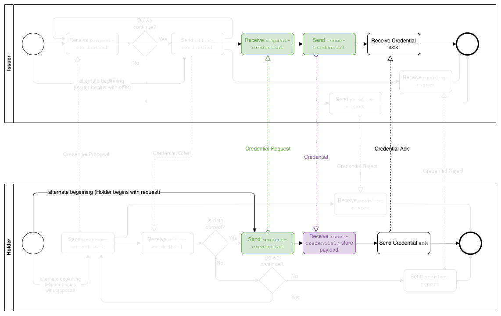

import Tabs from '@theme/Tabs';
import TabItem from '@theme/TabItem';

# Request Credential with DIDComm

This example is similar to [A User proposes a credential to an issuer] but here we start with the (future) holder of a credential **requesting a credential** from an issuer.

## Exchanging information and using protocols in VADE by combining plugins

The usage sample on this page follows an story where Alice can issue credentials and Bob wants to have a credential about his address. So Bob requests such a credential from Alice and she issues it.

So far we have discussed how plugins work individually and cater to specific functions but in real scenarios plugins work together and perform various functionalities seamlessly, we will try to understand and demonstrate it with the help of following flow:

- Alice holds a credential to prove a statement about her
- Bob wants a credential issued from Alice
- First of all they connect to each other via DIDcomm and Bob starts a Protocol “Issue Credential”
- Bob sends “request-credential” to Alice
- Alice receives it and creates a JWT credential and creates a “issue-credential” message which contains the created credential as payload and sends it back to Bob
- Bob receives the message and verifies the issued credential
- At last Bob sends back an “ack” message to Alice


Above scenario will be using [`vade-jwt-vc`] for JWT credential creation and signing, [`vade-didcomm`] for [`issue credential protocol`] and didcomm communication, [`vade-evan-cli`] for combining all plugins and using them seamlessly. The flow in this scenario is one way to traverse through the [`issue credential protocol`] flow, as pictured in the illustrations. Paths not relevant to the example described here have been brightened up a bit to keep the focus on the actually traversed paths.

## Secure communication

To allow secure communication between Alice and Bob they must exchange encryption keys. This can be handled in two ways:

- Both parties perform a DID exchange via [`did exchange protocol`]. The communication for this is done via [`vade-didcomm`] as well. Once the exchange is complete, the keys are stored in VADE and both parties can omit the `encryptionKeys` in the options.
- Both parties pass `encryptionKeys` in the options in every call they make for the exchange of the credential as they exchanged in some other way already. This approach increases the amount of data that must be passed to VADE but also allows to test the calls on this page more easily as the DID exchange can be skipped. This approach is used for the explanation here to focus on the actual credential exchange.

## Bob requests a credential from Alice

Bob can sends a `request-credential` message to Alice. For this Bob passes a draft of the `request-credential` message as `payload` whereby `/body/data_attach[0]/data` describes the requested credential in a way that Alice implementation of the protocol handling can understand.


In this example Bob sends his request as following:

```json
{
  "credentialSchema": "did:evan:zkp:0xd641c26161e769cef4b41760211972b274a8f37f135a34083e4e48b3f1035eda",
  "credentialValues": {
    "id":"did:evan:testcore:0x67ce8b01b3b75a9ba4a1462139a1edaa0d2f539f",
    "data":{
      "name": "Bob Bobson",
      "street":"711-2880 Nulla St.",
      "city":"Mankato Mississippi",
      "zip":"96522"
    }
  }
}
```

The JSON data is now stringified and base64 encoded. The base64 string is then used as `/body/data_attach[0]/data` in the next message (see payload below).

Note that this and the following messages will be encrypted so both parties have to provide sealing (encryption) keys in the `options` argument. So VADE takes the following arguments.

<Tabs groupId="vade_input">
<TabItem value="json_args" label="JSON args">

```json
options = {
  "encryptionKeys":{
    "encryptionMySecret":"5046adc1dba838867b2bbbfdd0c3423e58b57970b5267a90f57960924a87f156",
    "encryptionOthersPublic":"d92f5eeaa24fd4e66221c770f704a5e2639a476bab82cfec40bd2874abeb481f"
  }
}

payload = {
    "type": "https://didcomm.org/issue-credential/1.0/request-credential",
    "from": "did:key:z6MkiTBz1ymuepAQ4HEHYSF1H8quG5GLVVQR3djdX3mDooWp",
    "to": ["did:key:z6MkjchhfUsD6mmvni8mCdXHw216Xrm9bQe2mBH1P5RDjVJG"],
    "body": {
        "data_attach":[{
            "id":"id",
            "mime_type":"application/json",
            "data":"eyJjcmVkZW50aWFsU2NoZW1hIjoiZGlkOmV2YW46emtwOjB4ZDY0MWMyNjE2MWU3NjljZWY0YjQxNzYwMjExOTcyYjI3NGE4ZjM3ZjEzNWEzNDA4M2U0ZTQ4YjNmMTAzNWVkYSIsImNyZWRlbnRpYWxWYWx1ZXMiOnsiaWQiOiJkaWQ6ZXZhbjp0ZXN0Y29yZToweDY3Y2U4YjAxYjNiNzVhOWJhNGExNDYyMTM5YTFlZGFhMGQyZjUzOWYiLCJkYXRhIjp7Im5hbWUiOiJCb2IgQm9ic29uIiwic3RyZWV0IjoiNzExLTI4ODAgTnVsbGEgU3QuIiwiY2l0eSI6Ik1hbmthdG8gTWlzc2lzc2lwcGkiLCJ6aXAiOiI5NjUyMiJ9fX0="
        }]
    },
    "thid": "b4cad08b2d6e4cf8b73a4ec84bedf341"
}
```

</TabItem>
<TabItem value="vade_evan_cli" label="vade_evan_cli">

```sh
vade_options='{"encryptionKeys":{"encryptionMySecret":"5046adc1dba838867b2bbbfdd0c3423e58b57970b5267a90f57960924a87f156","encryptionOthersPublic":"d92f5eeaa24fd4e66221c770f704a5e2639a476bab82cfec40bd2874abeb481f"}}'

vade_payload='{"type":"https://didcomm.org/issue-credential/1.0/request-credential","from":"did:key:z6MkiTBz1ymuepAQ4HEHYSF1H8quG5GLVVQR3djdX3mDooWp","to":["did:key:z6MkjchhfUsD6mmvni8mCdXHw216Xrm9bQe2mBH1P5RDjVJG"],"body":{"data_attach":[{"id":"id","mime_type":"application/json","data":"eyJjcmVkZW50aWFsU2NoZW1hIjoiZGlkOmV2YW46emtwOjB4ZDY0MWMyNjE2MWU3NjljZWY0YjQxNzYwMjExOTcyYjI3NGE4ZjM3ZjEzNWEzNDA4M2U0ZTQ4YjNmMTAzNWVkYSIsImNyZWRlbnRpYWxWYWx1ZXMiOnsiaWQiOiJkaWQ6ZXZhbjp0ZXN0Y29yZToweDY3Y2U4YjAxYjNiNzVhOWJhNGExNDYyMTM5YTFlZGFhMGQyZjUzOWYiLCJkYXRhIjp7Im5hbWUiOiJCb2IgQm9ic29uIiwic3RyZWV0IjoiNzExLTI4ODAgTnVsbGEgU3QuIiwiY2l0eSI6Ik1hbmthdG8gTWlzc2lzc2lwcGkiLCJ6aXAiOiI5NjUyMiJ9fX0="}]},"thid":"b4cad08b2d6e4cf8b73a4ec84bedf341"}'

./vade_evan_cli didcomm send --options $vade_options --payload $vade_payload
```

</TabItem>
</Tabs>

This returns an encrypted message in the property `message` and the message before its encryption as `messageRaw`. `messageRaw` mostly resembles the message, Bob passed into the VADE call, but has fields like `id` and `created_time` automatically filled.

<Tabs groupId="vade_result">
<TabItem value="message" label="message">

```json
{
  "protected": "eyJ0eXAiOiJhcHBsaWNhdGlvbi9kaWRjb21tLWVuY3J5cHRlZCtqc29uIiwiZW5jIjoiWEMyMFAiLCJraWQiOiIyUzllNnFKUDFPWmlJY2R3OXdTbDRtT2FSMnVyZ3Nfc1FMMG9kS3ZyU0I4Iiwic2tpZCI6ImRpZDprZXk6ejZNa2lUQnoxeW11ZXBBUTRIRUhZU0YxSDhxdUc1R0xWVlFSM2RqZFgzbURvb1dwIiwiYWxnIjoiRUNESC0xUFUrWEMyMFBLVyJ9",
  "recipients": [
    {
      "header": {
        "key_ops": [],
        "alg": "ECDH-1PU+XC20PKW",
        "kid": "did:key:z6MkjchhfUsD6mmvni8mCdXHw216Xrm9bQe2mBH1P5RDjVJG",
        "epk": {
          "kty": "OKP",
          "crv": "X25519",
          "x": "lQNYqhhGkYpHgzs8uJAazaYSgP8yM-SBvodyH1NIY14"
        },
        "iv": "iNIl9yPpsnyg88hjoeiCpWb_o-1VKsUf",
        "tag": "HYPxMn_lWwkFtRAUYnRhYg"
      },
      "encrypted_key": "NmwEqdmPuDq8oIYOMTTf1lGXXCyU0eg6NXMlODdvAis"
    }
  ],
  "ciphertext": "wpJoii0dZsrJjvF3P8uA7Q_Gph9Fx648m8DcG6zs2QLIk34hZFtBJn5tiXuw1JZIRGhjjXRWUghXcnJCqG39iMIn_rJnU5kShSPc4AGNIX2TeU2XXgPvzy33eyL9ZdW3asnH6WblRLdbSYFcVDz7i1Yz77JzdjzPb1B3hQ9dxyqh1_VrwxWw2QO_g-ARX1f6BhsW5w_iyvpy3HHtxHfcijl5ql3ToXnfZhPfPAuk_uOmPyqMTsAtaV-WR2SA4v4q7zb1kgxAflNmVXPtmzQb-2UBk2oybVuu93hVm6kS8-PxyyYhZkN1FOho5Rok-w5bVoqcnVRDnPz7McDHF4D5fqMqBxEunX4qQlfWJd0OOod25_o4qKpdC6OTOc7Q7Ljqas6FWRAJeYLU7wTxqafA5uCuTYXgt5UD922L5HLvGmjxrjF937ozZE6U-qiwar2NVOHeY7zTGGVsHx4UmA_cQm6PnUWj9GNozkzGMDK-URfb91Y8SXYCNyo4ep5uZLgUIntZnkqNVcD9iXAAT8zcOBFVGQxM1lux3JW8uWValXIKpCelLgal_7Icy2KbKjvt924QUpGExX9yUzWhuFk8NWLmcq_oOP6k0ypRT14P0oUSexLkK2QJuuWfLZvfRVGK0jV1L5uYLJkC4OFKAKMVpr9-LHhsLqu7zRM0Z55IVOZQQloBr-wqQSLcyuYf4njVuThugm9TNkmdrh_LAMmjJTxgFslQPdum-FS1bxbbRDy9Smfk3iW4_5VrfFn35NmFa69tsuyEiX-9jpxiAO3fhimWWHaC9eLoqpksjv8QChEhLOE5Xoyw-N-96DmQ1Gg1yLZmvC_p7MvEwkt67BNYYLCMMqHaq7Y9YvupkQwCXulw5tlmI4rVAo4073-MHSVqQMuNpBahhtv9SChiehEBwlsCrK-0ObYQN1vkRU37JF6BM88ptJrnUUVni0DFY-uOuCufhFI9Y8VW1IE2x9X3hLBWZrf4fO95OHN78UZ6YUa7XjKHQQj9dYWr2BU4tCLq2YEjOyKYCP0fePet3jhZoi5M3aSsJwDZEziJEcEEK_fYiDtb_OmFzLTIR_GAHQU7VKBiVibLCo67IySTttnVjRIPPRjduQYb7vJKMskKkf7yS5zYUAmdYEHk0t1HPddNr5yN-A-NH66sUy6iNO1NBee8lBWB3bEIzFMf6FBtRp-TUxHBsdpwNnD0tGns_kKgXJC9kK4hyJkJkOOmG72QOtMFNDIOuYdiTt5OuzGPnQrYYFzs1Al8QGvghE6kkf7MDjgZbXK98BskqTHeDpF61gb8dSDZSJ_Y0UyRyxdBYy_YMzPaXtVD_zXSs_4BnH4xNIQ4kVLa29u4IWPPh4MpuwL2yNl31ut-mzVaJea2CPvVDVlD8_oYKYaQcq2L7iugdqjEwJ1eEGxlyqoED3X9Q3fEoD8ii84vX1e1iOma4FAlhacAmx8QsJafAirwQyJ6rcW4u7njHhagNggqoWJj7SFHYwFQxJs7_eRWZcJYb_bkoTRBj0CRTT79GjjlnU7WjZeTRXa6_V_5Jo_740emQ4eFl0htkiyz4BC-Hrw7eas75uTHaYcv_vINveioc2UbmmUfVZ7tmz6aulz1llDBqd8ACAyoSeMhaCVVaUme4XrCYkM6peTjQgCFwyLjPe-87gsECO0W42VWg8MJ55mIZO6sIbWZUmRefj_9NYKMDFciLCsDRt2fz4g05Rpw2ALTk5neBbGXcwgb3gAwjXNvNZPFwir2PTRc3UPSFN8XUwXf71uHa7qmczP6sq2520ODwnG3kIsGoMUv-5-d-p3MStcKuMY1Ymv4CBLuxh9i5sbE8yVtuNy16XSd0cURS4UW9SO8Jz9c-G0skBW-RkN6C5oWtIqBKTjxQaU_78ulMfMUqpHw0ZVoqoQkpdn5FEbgaJIf3Plu_kmGZnRUC4rSLoshEpIZvyuhZ5TWozratrjest8pWrzEuUZoKK3wE08FUXoiIVheAm0J5lgs8cQ",
  "iv": "DY3aBpmF_q8xodw_0Kr7gC26IObJ_sED",
  "tag": "hGzf3gEANde45oETa-dR0A"
}
```

</TabItem>
<TabItem value="fullResult" label="full result">

```json
{
  "message": {
    "protected": "eyJ0eXAiOiJhcHBsaWNhdGlvbi9kaWRjb21tLWVuY3J5cHRlZCtqc29uIiwiZW5jIjoiWEMyMFAiLCJraWQiOiIyUzllNnFKUDFPWmlJY2R3OXdTbDRtT2FSMnVyZ3Nfc1FMMG9kS3ZyU0I4Iiwic2tpZCI6ImRpZDprZXk6ejZNa2lUQnoxeW11ZXBBUTRIRUhZU0YxSDhxdUc1R0xWVlFSM2RqZFgzbURvb1dwIiwiYWxnIjoiRUNESC0xUFUrWEMyMFBLVyJ9",
    "recipients": [
      {
        "header": {
          "key_ops": [],
          "alg": "ECDH-1PU+XC20PKW",
          "kid": "did:key:z6MkjchhfUsD6mmvni8mCdXHw216Xrm9bQe2mBH1P5RDjVJG",
          "epk": {
            "kty": "OKP",
            "crv": "X25519",
            "x": "lQNYqhhGkYpHgzs8uJAazaYSgP8yM-SBvodyH1NIY14"
          },
          "iv": "iNIl9yPpsnyg88hjoeiCpWb_o-1VKsUf",
          "tag": "HYPxMn_lWwkFtRAUYnRhYg"
        },
        "encrypted_key": "NmwEqdmPuDq8oIYOMTTf1lGXXCyU0eg6NXMlODdvAis"
      }
    ],
    "ciphertext": "wpJoii0dZsrJjvF3P8uA7Q_Gph9Fx648m8DcG6zs2QLIk34hZFtBJn5tiXuw1JZIRGhjjXRWUghXcnJCqG39iMIn_rJnU5kShSPc4AGNIX2TeU2XXgPvzy33eyL9ZdW3asnH6WblRLdbSYFcVDz7i1Yz77JzdjzPb1B3hQ9dxyqh1_VrwxWw2QO_g-ARX1f6BhsW5w_iyvpy3HHtxHfcijl5ql3ToXnfZhPfPAuk_uOmPyqMTsAtaV-WR2SA4v4q7zb1kgxAflNmVXPtmzQb-2UBk2oybVuu93hVm6kS8-PxyyYhZkN1FOho5Rok-w5bVoqcnVRDnPz7McDHF4D5fqMqBxEunX4qQlfWJd0OOod25_o4qKpdC6OTOc7Q7Ljqas6FWRAJeYLU7wTxqafA5uCuTYXgt5UD922L5HLvGmjxrjF937ozZE6U-qiwar2NVOHeY7zTGGVsHx4UmA_cQm6PnUWj9GNozkzGMDK-URfb91Y8SXYCNyo4ep5uZLgUIntZnkqNVcD9iXAAT8zcOBFVGQxM1lux3JW8uWValXIKpCelLgal_7Icy2KbKjvt924QUpGExX9yUzWhuFk8NWLmcq_oOP6k0ypRT14P0oUSexLkK2QJuuWfLZvfRVGK0jV1L5uYLJkC4OFKAKMVpr9-LHhsLqu7zRM0Z55IVOZQQloBr-wqQSLcyuYf4njVuThugm9TNkmdrh_LAMmjJTxgFslQPdum-FS1bxbbRDy9Smfk3iW4_5VrfFn35NmFa69tsuyEiX-9jpxiAO3fhimWWHaC9eLoqpksjv8QChEhLOE5Xoyw-N-96DmQ1Gg1yLZmvC_p7MvEwkt67BNYYLCMMqHaq7Y9YvupkQwCXulw5tlmI4rVAo4073-MHSVqQMuNpBahhtv9SChiehEBwlsCrK-0ObYQN1vkRU37JF6BM88ptJrnUUVni0DFY-uOuCufhFI9Y8VW1IE2x9X3hLBWZrf4fO95OHN78UZ6YUa7XjKHQQj9dYWr2BU4tCLq2YEjOyKYCP0fePet3jhZoi5M3aSsJwDZEziJEcEEK_fYiDtb_OmFzLTIR_GAHQU7VKBiVibLCo67IySTttnVjRIPPRjduQYb7vJKMskKkf7yS5zYUAmdYEHk0t1HPddNr5yN-A-NH66sUy6iNO1NBee8lBWB3bEIzFMf6FBtRp-TUxHBsdpwNnD0tGns_kKgXJC9kK4hyJkJkOOmG72QOtMFNDIOuYdiTt5OuzGPnQrYYFzs1Al8QGvghE6kkf7MDjgZbXK98BskqTHeDpF61gb8dSDZSJ_Y0UyRyxdBYy_YMzPaXtVD_zXSs_4BnH4xNIQ4kVLa29u4IWPPh4MpuwL2yNl31ut-mzVaJea2CPvVDVlD8_oYKYaQcq2L7iugdqjEwJ1eEGxlyqoED3X9Q3fEoD8ii84vX1e1iOma4FAlhacAmx8QsJafAirwQyJ6rcW4u7njHhagNggqoWJj7SFHYwFQxJs7_eRWZcJYb_bkoTRBj0CRTT79GjjlnU7WjZeTRXa6_V_5Jo_740emQ4eFl0htkiyz4BC-Hrw7eas75uTHaYcv_vINveioc2UbmmUfVZ7tmz6aulz1llDBqd8ACAyoSeMhaCVVaUme4XrCYkM6peTjQgCFwyLjPe-87gsECO0W42VWg8MJ55mIZO6sIbWZUmRefj_9NYKMDFciLCsDRt2fz4g05Rpw2ALTk5neBbGXcwgb3gAwjXNvNZPFwir2PTRc3UPSFN8XUwXf71uHa7qmczP6sq2520ODwnG3kIsGoMUv-5-d-p3MStcKuMY1Ymv4CBLuxh9i5sbE8yVtuNy16XSd0cURS4UW9SO8Jz9c-G0skBW-RkN6C5oWtIqBKTjxQaU_78ulMfMUqpHw0ZVoqoQkpdn5FEbgaJIf3Plu_kmGZnRUC4rSLoshEpIZvyuhZ5TWozratrjest8pWrzEuUZoKK3wE08FUXoiIVheAm0J5lgs8cQ",
    "iv": "DY3aBpmF_q8xodw_0Kr7gC26IObJ_sED",
    "tag": "hGzf3gEANde45oETa-dR0A"
  },
  "messageRaw": {
    "body": {
      "data_attach": [
        {
          "id": "id",
          "mime_type": "application/json",
          "data": "eyJjcmVkZW50aWFsU2NoZW1hIjoiZGlkOmV2YW46emtwOjB4ZDY0MWMyNjE2MWU3NjljZWY0YjQxNzYwMjExOTcyYjI3NGE4ZjM3ZjEzNWEzNDA4M2U0ZTQ4YjNmMTAzNWVkYSIsImNyZWRlbnRpYWxWYWx1ZXMiOnsiaWQiOiJkaWQ6ZXZhbjp0ZXN0Y29yZToweDY3Y2U4YjAxYjNiNzVhOWJhNGExNDYyMTM5YTFlZGFhMGQyZjUzOWYiLCJkYXRhIjp7Im5hbWUiOiJCb2IgQm9ic29uIiwic3RyZWV0IjoiNzExLTI4ODAgTnVsbGEgU3QuIiwiY2l0eSI6Ik1hbmthdG8gTWlzc2lzc2lwcGkiLCJ6aXAiOiI5NjUyMiJ9fX0="
        }
      ]
    },
    "created_time": 1642507530,
    "expires_time": null,
    "from": "did:key:z6MkiTBz1ymuepAQ4HEHYSF1H8quG5GLVVQR3djdX3mDooWp",
    "id": "f682d4e8-7624-4f39-8843-b83d7d08d1e4",
    "pthid": null,
    "type": "https://didcomm.org/issue-credential/1.0/request-credential",
    "thid": "b4cad08b2d6e4cf8b73a4ec84bedf341",
    "to": [
      "did:key:z6MkjchhfUsD6mmvni8mCdXHw216Xrm9bQe2mBH1P5RDjVJG"
    ]
  },
  "metadata": {}
}
```

</TabItem>
</Tabs>

Bob then transfers `message` to Alice via a communication channel they aggreed on, e.g. HTTP(S).

## Alice receives the request

### Receiving the message


Alice receives `request-credential` message from Bob and passes it to vade to unpack it and get its details:

<Tabs groupId="vade_input">
<TabItem value="json_args" label="JSON args">

```json
options = {
   "encryptionKeys":{
      "encryptionMySecret":"f068e2f7ccc3eee220065e1dc937d34d548ec59be6488fea5ae1397e63f81c52",
      "encryptionOthersPublic":"5bf55c73b82ebe22be80f3430667af570fae2556a6415e6b30d4065300aa947d"
   }
}

payload = {
  "protected": "eyJ0eXAiOiJhcHBsaWNhdGlvbi9kaWRjb21tLWVuY3J5cHRlZCtqc29uIiwiZW5jIjoiWEMyMFAiLCJraWQiOiIyUzllNnFKUDFPWmlJY2R3OXdTbDRtT2FSMnVyZ3Nfc1FMMG9kS3ZyU0I4Iiwic2tpZCI6ImRpZDprZXk6ejZNa2lUQnoxeW11ZXBBUTRIRUhZU0YxSDhxdUc1R0xWVlFSM2RqZFgzbURvb1dwIiwiYWxnIjoiRUNESC0xUFUrWEMyMFBLVyJ9",
  "recipients": [
    {
      "header": {
        "key_ops": [],
        "alg": "ECDH-1PU+XC20PKW",
        "kid": "did:key:z6MkjchhfUsD6mmvni8mCdXHw216Xrm9bQe2mBH1P5RDjVJG",
        "epk": {
          "kty": "OKP",
          "crv": "X25519",
          "x": "lQNYqhhGkYpHgzs8uJAazaYSgP8yM-SBvodyH1NIY14"
        },
        "iv": "iNIl9yPpsnyg88hjoeiCpWb_o-1VKsUf",
        "tag": "HYPxMn_lWwkFtRAUYnRhYg"
      },
      "encrypted_key": "NmwEqdmPuDq8oIYOMTTf1lGXXCyU0eg6NXMlODdvAis"
    }
  ],
  "ciphertext": "wpJoii0dZsrJjvF3P8uA7Q_Gph9Fx648m8DcG6zs2QLIk34hZFtBJn5tiXuw1JZIRGhjjXRWUghXcnJCqG39iMIn_rJnU5kShSPc4AGNIX2TeU2XXgPvzy33eyL9ZdW3asnH6WblRLdbSYFcVDz7i1Yz77JzdjzPb1B3hQ9dxyqh1_VrwxWw2QO_g-ARX1f6BhsW5w_iyvpy3HHtxHfcijl5ql3ToXnfZhPfPAuk_uOmPyqMTsAtaV-WR2SA4v4q7zb1kgxAflNmVXPtmzQb-2UBk2oybVuu93hVm6kS8-PxyyYhZkN1FOho5Rok-w5bVoqcnVRDnPz7McDHF4D5fqMqBxEunX4qQlfWJd0OOod25_o4qKpdC6OTOc7Q7Ljqas6FWRAJeYLU7wTxqafA5uCuTYXgt5UD922L5HLvGmjxrjF937ozZE6U-qiwar2NVOHeY7zTGGVsHx4UmA_cQm6PnUWj9GNozkzGMDK-URfb91Y8SXYCNyo4ep5uZLgUIntZnkqNVcD9iXAAT8zcOBFVGQxM1lux3JW8uWValXIKpCelLgal_7Icy2KbKjvt924QUpGExX9yUzWhuFk8NWLmcq_oOP6k0ypRT14P0oUSexLkK2QJuuWfLZvfRVGK0jV1L5uYLJkC4OFKAKMVpr9-LHhsLqu7zRM0Z55IVOZQQloBr-wqQSLcyuYf4njVuThugm9TNkmdrh_LAMmjJTxgFslQPdum-FS1bxbbRDy9Smfk3iW4_5VrfFn35NmFa69tsuyEiX-9jpxiAO3fhimWWHaC9eLoqpksjv8QChEhLOE5Xoyw-N-96DmQ1Gg1yLZmvC_p7MvEwkt67BNYYLCMMqHaq7Y9YvupkQwCXulw5tlmI4rVAo4073-MHSVqQMuNpBahhtv9SChiehEBwlsCrK-0ObYQN1vkRU37JF6BM88ptJrnUUVni0DFY-uOuCufhFI9Y8VW1IE2x9X3hLBWZrf4fO95OHN78UZ6YUa7XjKHQQj9dYWr2BU4tCLq2YEjOyKYCP0fePet3jhZoi5M3aSsJwDZEziJEcEEK_fYiDtb_OmFzLTIR_GAHQU7VKBiVibLCo67IySTttnVjRIPPRjduQYb7vJKMskKkf7yS5zYUAmdYEHk0t1HPddNr5yN-A-NH66sUy6iNO1NBee8lBWB3bEIzFMf6FBtRp-TUxHBsdpwNnD0tGns_kKgXJC9kK4hyJkJkOOmG72QOtMFNDIOuYdiTt5OuzGPnQrYYFzs1Al8QGvghE6kkf7MDjgZbXK98BskqTHeDpF61gb8dSDZSJ_Y0UyRyxdBYy_YMzPaXtVD_zXSs_4BnH4xNIQ4kVLa29u4IWPPh4MpuwL2yNl31ut-mzVaJea2CPvVDVlD8_oYKYaQcq2L7iugdqjEwJ1eEGxlyqoED3X9Q3fEoD8ii84vX1e1iOma4FAlhacAmx8QsJafAirwQyJ6rcW4u7njHhagNggqoWJj7SFHYwFQxJs7_eRWZcJYb_bkoTRBj0CRTT79GjjlnU7WjZeTRXa6_V_5Jo_740emQ4eFl0htkiyz4BC-Hrw7eas75uTHaYcv_vINveioc2UbmmUfVZ7tmz6aulz1llDBqd8ACAyoSeMhaCVVaUme4XrCYkM6peTjQgCFwyLjPe-87gsECO0W42VWg8MJ55mIZO6sIbWZUmRefj_9NYKMDFciLCsDRt2fz4g05Rpw2ALTk5neBbGXcwgb3gAwjXNvNZPFwir2PTRc3UPSFN8XUwXf71uHa7qmczP6sq2520ODwnG3kIsGoMUv-5-d-p3MStcKuMY1Ymv4CBLuxh9i5sbE8yVtuNy16XSd0cURS4UW9SO8Jz9c-G0skBW-RkN6C5oWtIqBKTjxQaU_78ulMfMUqpHw0ZVoqoQkpdn5FEbgaJIf3Plu_kmGZnRUC4rSLoshEpIZvyuhZ5TWozratrjest8pWrzEuUZoKK3wE08FUXoiIVheAm0J5lgs8cQ",
  "iv": "DY3aBpmF_q8xodw_0Kr7gC26IObJ_sED",
  "tag": "hGzf3gEANde45oETa-dR0A"
}
```

</TabItem>
<TabItem value="vade_evan_cli" label="vade_evan_cli">

```sh
vade_options='{"encryptionKeys":{"encryptionMySecret":"f068e2f7ccc3eee220065e1dc937d34d548ec59be6488fea5ae1397e63f81c52","encryptionOthersPublic":"5bf55c73b82ebe22be80f3430667af570fae2556a6415e6b30d4065300aa947d"}}'

vade_payload='{"protected":"eyJ0eXAiOiJhcHBsaWNhdGlvbi9kaWRjb21tLWVuY3J5cHRlZCtqc29uIiwiZW5jIjoiWEMyMFAiLCJraWQiOiIyUzllNnFKUDFPWmlJY2R3OXdTbDRtT2FSMnVyZ3Nfc1FMMG9kS3ZyU0I4Iiwic2tpZCI6ImRpZDprZXk6ejZNa2lUQnoxeW11ZXBBUTRIRUhZU0YxSDhxdUc1R0xWVlFSM2RqZFgzbURvb1dwIiwiYWxnIjoiRUNESC0xUFUrWEMyMFBLVyJ9","recipients":[{"header":{"key_ops":[],"alg":"ECDH-1PU+XC20PKW","kid":"did:key:z6MkjchhfUsD6mmvni8mCdXHw216Xrm9bQe2mBH1P5RDjVJG","epk":{"kty":"OKP","crv":"X25519","x":"lQNYqhhGkYpHgzs8uJAazaYSgP8yM-SBvodyH1NIY14"},"iv":"iNIl9yPpsnyg88hjoeiCpWb_o-1VKsUf","tag":"HYPxMn_lWwkFtRAUYnRhYg"},"encrypted_key":"NmwEqdmPuDq8oIYOMTTf1lGXXCyU0eg6NXMlODdvAis"}],"ciphertext":"wpJoii0dZsrJjvF3P8uA7Q_Gph9Fx648m8DcG6zs2QLIk34hZFtBJn5tiXuw1JZIRGhjjXRWUghXcnJCqG39iMIn_rJnU5kShSPc4AGNIX2TeU2XXgPvzy33eyL9ZdW3asnH6WblRLdbSYFcVDz7i1Yz77JzdjzPb1B3hQ9dxyqh1_VrwxWw2QO_g-ARX1f6BhsW5w_iyvpy3HHtxHfcijl5ql3ToXnfZhPfPAuk_uOmPyqMTsAtaV-WR2SA4v4q7zb1kgxAflNmVXPtmzQb-2UBk2oybVuu93hVm6kS8-PxyyYhZkN1FOho5Rok-w5bVoqcnVRDnPz7McDHF4D5fqMqBxEunX4qQlfWJd0OOod25_o4qKpdC6OTOc7Q7Ljqas6FWRAJeYLU7wTxqafA5uCuTYXgt5UD922L5HLvGmjxrjF937ozZE6U-qiwar2NVOHeY7zTGGVsHx4UmA_cQm6PnUWj9GNozkzGMDK-URfb91Y8SXYCNyo4ep5uZLgUIntZnkqNVcD9iXAAT8zcOBFVGQxM1lux3JW8uWValXIKpCelLgal_7Icy2KbKjvt924QUpGExX9yUzWhuFk8NWLmcq_oOP6k0ypRT14P0oUSexLkK2QJuuWfLZvfRVGK0jV1L5uYLJkC4OFKAKMVpr9-LHhsLqu7zRM0Z55IVOZQQloBr-wqQSLcyuYf4njVuThugm9TNkmdrh_LAMmjJTxgFslQPdum-FS1bxbbRDy9Smfk3iW4_5VrfFn35NmFa69tsuyEiX-9jpxiAO3fhimWWHaC9eLoqpksjv8QChEhLOE5Xoyw-N-96DmQ1Gg1yLZmvC_p7MvEwkt67BNYYLCMMqHaq7Y9YvupkQwCXulw5tlmI4rVAo4073-MHSVqQMuNpBahhtv9SChiehEBwlsCrK-0ObYQN1vkRU37JF6BM88ptJrnUUVni0DFY-uOuCufhFI9Y8VW1IE2x9X3hLBWZrf4fO95OHN78UZ6YUa7XjKHQQj9dYWr2BU4tCLq2YEjOyKYCP0fePet3jhZoi5M3aSsJwDZEziJEcEEK_fYiDtb_OmFzLTIR_GAHQU7VKBiVibLCo67IySTttnVjRIPPRjduQYb7vJKMskKkf7yS5zYUAmdYEHk0t1HPddNr5yN-A-NH66sUy6iNO1NBee8lBWB3bEIzFMf6FBtRp-TUxHBsdpwNnD0tGns_kKgXJC9kK4hyJkJkOOmG72QOtMFNDIOuYdiTt5OuzGPnQrYYFzs1Al8QGvghE6kkf7MDjgZbXK98BskqTHeDpF61gb8dSDZSJ_Y0UyRyxdBYy_YMzPaXtVD_zXSs_4BnH4xNIQ4kVLa29u4IWPPh4MpuwL2yNl31ut-mzVaJea2CPvVDVlD8_oYKYaQcq2L7iugdqjEwJ1eEGxlyqoED3X9Q3fEoD8ii84vX1e1iOma4FAlhacAmx8QsJafAirwQyJ6rcW4u7njHhagNggqoWJj7SFHYwFQxJs7_eRWZcJYb_bkoTRBj0CRTT79GjjlnU7WjZeTRXa6_V_5Jo_740emQ4eFl0htkiyz4BC-Hrw7eas75uTHaYcv_vINveioc2UbmmUfVZ7tmz6aulz1llDBqd8ACAyoSeMhaCVVaUme4XrCYkM6peTjQgCFwyLjPe-87gsECO0W42VWg8MJ55mIZO6sIbWZUmRefj_9NYKMDFciLCsDRt2fz4g05Rpw2ALTk5neBbGXcwgb3gAwjXNvNZPFwir2PTRc3UPSFN8XUwXf71uHa7qmczP6sq2520ODwnG3kIsGoMUv-5-d-p3MStcKuMY1Ymv4CBLuxh9i5sbE8yVtuNy16XSd0cURS4UW9SO8Jz9c-G0skBW-RkN6C5oWtIqBKTjxQaU_78ulMfMUqpHw0ZVoqoQkpdn5FEbgaJIf3Plu_kmGZnRUC4rSLoshEpIZvyuhZ5TWozratrjest8pWrzEuUZoKK3wE08FUXoiIVheAm0J5lgs8cQ","iv":"DY3aBpmF_q8xodw_0Kr7gC26IObJ_sED","tag":"hGzf3gEANde45oETa-dR0A"}'

./vade_evan_cli didcomm receive --options $vade_options --payload $vade_payload
```

</TabItem>
</Tabs>

From this Alice receives the unpacked message:

<Tabs groupId="vade_result">
<TabItem value="message" label="message">

```json
{
  "body": {
    "data_attach": [
      {
        "id": "id",
        "mime_type": "application/json",
        "data": "eyJjcmVkZW50aWFsU2NoZW1hIjoiZGlkOmV2YW46emtwOjB4ZDY0MWMyNjE2MWU3NjljZWY0YjQxNzYwMjExOTcyYjI3NGE4ZjM3ZjEzNWEzNDA4M2U0ZTQ4YjNmMTAzNWVkYSIsImNyZWRlbnRpYWxWYWx1ZXMiOnsiaWQiOiJkaWQ6ZXZhbjp0ZXN0Y29yZToweDY3Y2U4YjAxYjNiNzVhOWJhNGExNDYyMTM5YTFlZGFhMGQyZjUzOWYiLCJkYXRhIjp7Im5hbWUiOiJCb2IgQm9ic29uIiwic3RyZWV0IjoiNzExLTI4ODAgTnVsbGEgU3QuIiwiY2l0eSI6Ik1hbmthdG8gTWlzc2lzc2lwcGkiLCJ6aXAiOiI5NjUyMiJ9fX0="
      }
    ]
  },
  "created_time": 1642507686,
  "expires_time": null,
  "from": "did:key:z6MkiTBz1ymuepAQ4HEHYSF1H8quG5GLVVQR3djdX3mDooWp",
  "id": "2e0baf4ebd7d4c2596b7c80ba603348f",
  "pthid": "2e0baf4ebd7d4c2596b7c80ba603348f#issue-credential",
  "type": "https://didcomm.org/issue-credential/1.0/request-credential",
  "thid": "b4cad08b2d6e4cf8b73a4ec84bedf341",
  "to": [
    "did:key:z6MkjchhfUsD6mmvni8mCdXHw216Xrm9bQe2mBH1P5RDjVJG"
  ]
}
```

</TabItem>
<TabItem value="fullResult" label="full result">

```json
{
  "message": {
    "body": {
      "data_attach": [
        {
          "id": "id",
          "mime_type": "application/json",
          "data": "eyJjcmVkZW50aWFsU2NoZW1hIjoiZGlkOmV2YW46emtwOjB4ZDY0MWMyNjE2MWU3NjljZWY0YjQxNzYwMjExOTcyYjI3NGE4ZjM3ZjEzNWEzNDA4M2U0ZTQ4YjNmMTAzNWVkYSIsImNyZWRlbnRpYWxWYWx1ZXMiOnsiaWQiOiJkaWQ6ZXZhbjp0ZXN0Y29yZToweDY3Y2U4YjAxYjNiNzVhOWJhNGExNDYyMTM5YTFlZGFhMGQyZjUzOWYiLCJkYXRhIjp7Im5hbWUiOiJCb2IgQm9ic29uIiwic3RyZWV0IjoiNzExLTI4ODAgTnVsbGEgU3QuIiwiY2l0eSI6Ik1hbmthdG8gTWlzc2lzc2lwcGkiLCJ6aXAiOiI5NjUyMiJ9fX0="
        }
      ]
    },
    "created_time": 1642507686,
    "expires_time": null,
    "from": "did:key:z6MkiTBz1ymuepAQ4HEHYSF1H8quG5GLVVQR3djdX3mDooWp",
    "id": "2e0baf4ebd7d4c2596b7c80ba603348f",
    "pthid": "2e0baf4ebd7d4c2596b7c80ba603348f#issue-credential",
    "type": "https://didcomm.org/issue-credential/1.0/request-credential",
    "thid": "b4cad08b2d6e4cf8b73a4ec84bedf341",
    "to": [
      "did:key:z6MkjchhfUsD6mmvni8mCdXHw216Xrm9bQe2mBH1P5RDjVJG"
    ]
  },
  "messageRaw": {
    "body": {
      "data_attach": [
        {
          "id": "id",
          "mime_type": "application/json",
          "data": "eyJjcmVkZW50aWFsU2NoZW1hIjoiZGlkOmV2YW46emtwOjB4ZDY0MWMyNjE2MWU3NjljZWY0YjQxNzYwMjExOTcyYjI3NGE4ZjM3ZjEzNWEzNDA4M2U0ZTQ4YjNmMTAzNWVkYSIsImNyZWRlbnRpYWxWYWx1ZXMiOnsiaWQiOiJkaWQ6ZXZhbjp0ZXN0Y29yZToweDY3Y2U4YjAxYjNiNzVhOWJhNGExNDYyMTM5YTFlZGFhMGQyZjUzOWYiLCJkYXRhIjp7Im5hbWUiOiJCb2IgQm9ic29uIiwic3RyZWV0IjoiNzExLTI4ODAgTnVsbGEgU3QuIiwiY2l0eSI6Ik1hbmthdG8gTWlzc2lzc2lwcGkiLCJ6aXAiOiI5NjUyMiJ9fX0="
        }
      ]
    },
    "created_time": 1642507686,
    "expires_time": null,
    "from": "did:key:z6MkiTBz1ymuepAQ4HEHYSF1H8quG5GLVVQR3djdX3mDooWp",
    "id": "2e0baf4ebd7d4c2596b7c80ba603348f",
    "pthid": "2e0baf4ebd7d4c2596b7c80ba603348f#issue-credential",
    "type": "https://didcomm.org/issue-credential/1.0/request-credential",
    "thid": "b4cad08b2d6e4cf8b73a4ec84bedf341",
    "to": [
      "did:key:z6MkjchhfUsD6mmvni8mCdXHw216Xrm9bQe2mBH1P5RDjVJG"
    ]
  },
  "metadata": {}
}
```

</TabItem>
</Tabs>

### Alices issues a credential for Bob

Alice can now base64 decode `/body/data_attach[0]/data` and gets the details about the credential she is asked for:

```json
{
  "credentialSchema": "did:evan:zkp:0xd641c26161e769cef4b41760211972b274a8f37f135a34083e4e48b3f1035eda",
  "credentialValues": {
    "id": "did:evan:testcore:0x67ce8b01b3b75a9ba4a1462139a1edaa0d2f539f",
    "data": {
      "name": "Bob Bobson",
      "street": "711-2880 Nulla St.",
      "city": "Mankato Mississippi",
      "zip": "96522"
    }
  }
}
```

Now Alice can issue a credential for bob:

<Tabs groupId="vade_input">
<TabItem value="json_args" label="JSON args">

```json
method = "did:evan"

options = {
  "privateKey":"dfcdcb6d5d09411ae9cbe1b0fd9751ba8803dd4b276d5bf9488ae4ede2669106",
  "identity":"did:evan:testcore:0x0d87204c3957d73b68ae28d0af961d3c72403906",
  "type":"jwt"
}

payload = {
  "unsignedVc":{
    "@context":[
     "https://www.w3.org/2018/credentials/v1",
     "https:://schema.org",
     "https://w3id.org/vc-status-list-2021/v1"
    ],
    "id":"94450c72-5dc4-4e46-8df0-106819064656",
    "type":[
     "VerifiableCredential"
    ],
    "issuer":"did:evan:testcore:0x6240cedfc840579b7fdcd686bdc65a9a8c42dea6",
    "issuanceDate":"2021-04-20T08:35:56+0000",
    "credentialSubject":{
      "id":"did:evan:testcore:0x67ce8b01b3b75a9ba4a1462139a1edaa0d2f539f",
      "data":{
        "name": "Bob Bobson",
        "street": "711-2880 Nulla St.",
        "city": "Mankato Mississippi",
        "zip": "96522"
      }
    },
    "credentialSchema":{
      "id":"did:evan:zkp:0xd641c26161e769cef4b41760211972b274a8f37f135a34083e4e48b3f1035eda",
      "type":"EvanZKPSchema"
    },
    "credentialStatus":{
      "id":"did:evan:zkp:0xcac3f4186e273083820c8c59f3c52efb713a755de255d0eb997b4990253ea388#0",
      "type":"RevocationList2021Status",
      "revocationListIndex":"1",
      "revocationListCredential":"did:evan:zkp:0xcac3f4186e273083820c8c59f3c52efb713a755de255d0eb997b4990253ea388"
    }
  },
  "issuerPublicKeyId":"did:evan:testcore:0x6240cedfc840579b7fdcd686bdc65a9a8c42dea6#key-1",
  "issuerPublicKey":"jCv7l26izalfcsFe6j/IqtVlDolo2Y3lNld7xOG63GjSNHBVWrvZQe2O859q9JeVEV4yXtfYofGQSWrMVfgH5ySbuHpQj4fSgLu4xXyFgMidUO1sIe0NHRcXpOorP01o"
}
```

</TabItem>
<TabItem value="vade_evan_cli" label="vade_evan_cli">

```sh
vade_method='did:evan'

vade_options='{"privateKey":"dfcdcb6d5d09411ae9cbe1b0fd9751ba8803dd4b276d5bf9488ae4ede2669106","identity":"did:evan:testcore:0x0d87204c3957d73b68ae28d0af961d3c72403906","type":"jwt"}'

vade_payload='{"unsignedVc":{"@context":["https://www.w3.org/2018/credentials/v1","https:://schema.org","https://w3id.org/vc-status-list-2021/v1"],"id":"94450c72-5dc4-4e46-8df0-106819064656","type":["VerifiableCredential"],"issuer":"did:evan:testcore:0x6240cedfc840579b7fdcd686bdc65a9a8c42dea6","issuanceDate":"2021-04-20T08:35:56+0000","credentialSubject":{"id":"did:evan:testcore:0x67ce8b01b3b75a9ba4a1462139a1edaa0d2f539f","data":{"name":"Bob Bobson","street":"711-2880 Nulla St.","city":"Mankato Mississippi","zip":"96522"}},"credentialSchema":{"id":"did:evan:zkp:0xd641c26161e769cef4b41760211972b274a8f37f135a34083e4e48b3f1035eda","type":"EvanZKPSchema"},"credentialStatus":{"id":"did:evan:zkp:0xcac3f4186e273083820c8c59f3c52efb713a755de255d0eb997b4990253ea388#0","type":"RevocationList2021Status","revocationListIndex":"1","revocationListCredential":"did:evan:zkp:0xcac3f4186e273083820c8c59f3c52efb713a755de255d0eb997b4990253ea388"}},"issuerPublicKeyId":"did:evan:testcore:0x6240cedfc840579b7fdcd686bdc65a9a8c42dea6#key-1","issuerPublicKey":"jCv7l26izalfcsFe6j/IqtVlDolo2Y3lNld7xOG63GjSNHBVWrvZQe2O859q9JeVEV4yXtfYofGQSWrMVfgH5ySbuHpQj4fSgLu4xXyFgMidUO1sIe0NHRcXpOorP01o"}'

./vade_evan_cli vc_zkp issue_credential --method $vade_method --options $vade_options --payload $vade_payload
```

</TabItem>
</Tabs>

And has created a new credential:

```json
{
  "@context": [
    "https://www.w3.org/2018/credentials/v1",
    "https:://schema.org",
    "https://w3id.org/vc-status-list-2021/v1"
  ],
  "id": "94450c72-5dc4-4e46-8df0-106819064656",
  "type": [
    "VerifiableCredential"
  ],
  "issuer": "did:evan:testcore:0x6240cedfc840579b7fdcd686bdc65a9a8c42dea6",
  "issuanceDate": "2021-04-20T08:35:56+0000",
  "credentialSubject": {
    "id": "did:evan:testcore:0x67ce8b01b3b75a9ba4a1462139a1edaa0d2f539f",
    "data": {
      "street": "711-2880 Nulla St.",
      "name": "Bob Bobson",
      "zip": "96522",
      "city": "Mankato Mississippi"
    }
  },
  "credentialSchema": {
    "id": "did:evan:zkp:0xd641c26161e769cef4b41760211972b274a8f37f135a34083e4e48b3f1035eda",
    "type": "EvanZKPSchema"
  },
  "credentialStatus": {
    "id": "did:evan:zkp:0xcac3f4186e273083820c8c59f3c52efb713a755de255d0eb997b4990253ea388#0",
    "type": "RevocationList2021Status",
    "revocationListIndex": "1",
    "revocationListCredential": "did:evan:zkp:0xcac3f4186e273083820c8c59f3c52efb713a755de255d0eb997b4990253ea388"
  },
  "proof": {
    "type": "EcdsaPublicKeySecp256k1",
    "created": "2022-01-18T10:40:01.000Z",
    "proofPurpose": "assertionMethod",
    "verificationMethod": "did:evan:testcore:0x6240cedfc840579b7fdcd686bdc65a9a8c42dea6#key-1",
    "jws": "eyJ0eXAiOiJKV1QiLCJhbGciOiJFUzI1NkstUiJ9.eyJpYXQiOiIyMDIyLTAxLTE4VDEwOjQwOjAxLjAwMFoiLCJkb2MiOnsiQGNvbnRleHQiOlsiaHR0cHM6Ly93d3cudzMub3JnLzIwMTgvY3JlZGVudGlhbHMvdjEiLCJodHRwczo6Ly9zY2hlbWEub3JnIiwiaHR0cHM6Ly93M2lkLm9yZy92Yy1zdGF0dXMtbGlzdC0yMDIxL3YxIl0sImlkIjoiOTQ0NTBjNzItNWRjNC00ZTQ2LThkZjAtMTA2ODE5MDY0NjU2IiwidHlwZSI6WyJWZXJpZmlhYmxlQ3JlZGVudGlhbCJdLCJpc3N1ZXIiOiJkaWQ6ZXZhbjp0ZXN0Y29yZToweDYyNDBjZWRmYzg0MDU3OWI3ZmRjZDY4NmJkYzY1YTlhOGM0MmRlYTYiLCJpc3N1YW5jZURhdGUiOiIyMDIxLTA0LTIwVDA4OjM1OjU2KzAwMDAiLCJjcmVkZW50aWFsU3ViamVjdCI6eyJpZCI6ImRpZDpldmFuOnRlc3Rjb3JlOjB4NjdjZThiMDFiM2I3NWE5YmE0YTE0NjIxMzlhMWVkYWEwZDJmNTM5ZiIsImRhdGEiOnsic3RyZWV0IjoiNzExLTI4ODAgTnVsbGEgU3QuIiwibmFtZSI6IkJvYiBCb2Jzb24iLCJ6aXAiOiI5NjUyMiIsImNpdHkiOiJNYW5rYXRvIE1pc3Npc3NpcHBpIn19LCJjcmVkZW50aWFsU2NoZW1hIjp7ImlkIjoiZGlkOmV2YW46emtwOjB4ZDY0MWMyNjE2MWU3NjljZWY0YjQxNzYwMjExOTcyYjI3NGE4ZjM3ZjEzNWEzNDA4M2U0ZTQ4YjNmMTAzNWVkYSIsInR5cGUiOiJFdmFuWktQU2NoZW1hIn0sImNyZWRlbnRpYWxTdGF0dXMiOnsiaWQiOiJkaWQ6ZXZhbjp6a3A6MHhjYWMzZjQxODZlMjczMDgzODIwYzhjNTlmM2M1MmVmYjcxM2E3NTVkZTI1NWQwZWI5OTdiNDk5MDI1M2VhMzg4IzAiLCJ0eXBlIjoiUmV2b2NhdGlvbkxpc3QyMDIxU3RhdHVzIiwicmV2b2NhdGlvbkxpc3RJbmRleCI6IjEiLCJyZXZvY2F0aW9uTGlzdENyZWRlbnRpYWwiOiJkaWQ6ZXZhbjp6a3A6MHhjYWMzZjQxODZlMjczMDgzODIwYzhjNTlmM2M1MmVmYjcxM2E3NTVkZTI1NWQwZWI5OTdiNDk5MDI1M2VhMzg4In19LCJpc3MiOiJkaWQ6ZXZhbjp0ZXN0Y29yZToweDYyNDBjZWRmYzg0MDU3OWI3ZmRjZDY4NmJkYzY1YTlhOGM0MmRlYTYifQ.qMopFGKAHqREKsoqbDY9uPTgexn50o-6j27jSoZFejA3t-AriWqGknNRL4Ymh8Am9gUZDf5KufqgGTt-R3CZJgE"
  }
}
```

## Sending the Credential to Bob


The credential is now JSON.strinify'ed, base64 encoded and then used as `/body/data_attach[0]/data` when sending the message to Bob:

<Tabs groupId="vade_input">
<TabItem value="json_args" label="JSON args">

```json
options = {
   "encryptionKeys":{
      "encryptionMySecret":"f068e2f7ccc3eee220065e1dc937d34d548ec59be6488fea5ae1397e63f81c52",
      "encryptionOthersPublic":"5bf55c73b82ebe22be80f3430667af570fae2556a6415e6b30d4065300aa947d"
   }
}

payload = {
   "type":"https://didcomm.org/issue-credential/1.0/issue-credential",
   "from":"did:key:z6MkjchhfUsD6mmvni8mCdXHw216Xrm9bQe2mBH1P5RDjVJG",
   "to":[
      "did:key:z6MkiTBz1ymuepAQ4HEHYSF1H8quG5GLVVQR3djdX3mDooWp"
   ],
   "body":{
      "data_attach":[
         {
            "id":"id",
            "mime_type":"text",
            "data":"eyJAY29udGV4dCI6WyJodHRwczovL3d3dy53My5vcmcvMjAxOC9jcmVkZW50aWFscy92MSIsImh0dHBzOjovL3NjaGVtYS5vcmciLCJodHRwczovL3czaWQub3JnL3ZjLXN0YXR1cy1saXN0LTIwMjEvdjEiXSwiaWQiOiI5NDQ1MGM3Mi01ZGM0LTRlNDYtOGRmMC0xMDY4MTkwNjQ2NTYiLCJ0eXBlIjpbIlZlcmlmaWFibGVDcmVkZW50aWFsIl0sImlzc3VlciI6ImRpZDpldmFuOnRlc3Rjb3JlOjB4NjI0MGNlZGZjODQwNTc5YjdmZGNkNjg2YmRjNjVhOWE4YzQyZGVhNiIsImlzc3VhbmNlRGF0ZSI6IjIwMjEtMDQtMjBUMDg6MzU6NTYrMDAwMCIsImNyZWRlbnRpYWxTdWJqZWN0Ijp7ImlkIjoiZGlkOmV2YW46dGVzdGNvcmU6MHg2N2NlOGIwMWIzYjc1YTliYTRhMTQ2MjEzOWExZWRhYTBkMmY1MzlmIiwiZGF0YSI6eyJzdHJlZXQiOiI3MTEtMjg4MCBOdWxsYSBTdC4iLCJuYW1lIjoiQm9iIEJvYnNvbiIsInppcCI6Ijk2NTIyIiwiY2l0eSI6Ik1hbmthdG8gTWlzc2lzc2lwcGkifX0sImNyZWRlbnRpYWxTY2hlbWEiOnsiaWQiOiJkaWQ6ZXZhbjp6a3A6MHhkNjQxYzI2MTYxZTc2OWNlZjRiNDE3NjAyMTE5NzJiMjc0YThmMzdmMTM1YTM0MDgzZTRlNDhiM2YxMDM1ZWRhIiwidHlwZSI6IkV2YW5aS1BTY2hlbWEifSwiY3JlZGVudGlhbFN0YXR1cyI6eyJpZCI6ImRpZDpldmFuOnprcDoweGNhYzNmNDE4NmUyNzMwODM4MjBjOGM1OWYzYzUyZWZiNzEzYTc1NWRlMjU1ZDBlYjk5N2I0OTkwMjUzZWEzODgjMCIsInR5cGUiOiJSZXZvY2F0aW9uTGlzdDIwMjFTdGF0dXMiLCJyZXZvY2F0aW9uTGlzdEluZGV4IjoiMSIsInJldm9jYXRpb25MaXN0Q3JlZGVudGlhbCI6ImRpZDpldmFuOnprcDoweGNhYzNmNDE4NmUyNzMwODM4MjBjOGM1OWYzYzUyZWZiNzEzYTc1NWRlMjU1ZDBlYjk5N2I0OTkwMjUzZWEzODgifSwicHJvb2YiOnsidHlwZSI6IkVjZHNhUHVibGljS2V5U2VjcDI1NmsxIiwiY3JlYXRlZCI6IjIwMjItMDEtMThUMTA6NDA6MDEuMDAwWiIsInByb29mUHVycG9zZSI6ImFzc2VydGlvbk1ldGhvZCIsInZlcmlmaWNhdGlvbk1ldGhvZCI6ImRpZDpldmFuOnRlc3Rjb3JlOjB4NjI0MGNlZGZjODQwNTc5YjdmZGNkNjg2YmRjNjVhOWE4YzQyZGVhNiNrZXktMSIsImp3cyI6ImV5SjBlWEFpT2lKS1YxUWlMQ0poYkdjaU9pSkZVekkxTmtzdFVpSjkuZXlKcFlYUWlPaUl5TURJeUxUQXhMVEU0VkRFd09qUXdPakF4TGpBd01Gb2lMQ0prYjJNaU9uc2lRR052Ym5SbGVIUWlPbHNpYUhSMGNITTZMeTkzZDNjdWR6TXViM0puTHpJd01UZ3ZZM0psWkdWdWRHbGhiSE12ZGpFaUxDSm9kSFJ3Y3pvNkx5OXpZMmhsYldFdWIzSm5JaXdpYUhSMGNITTZMeTkzTTJsa0xtOXlaeTkyWXkxemRHRjBkWE10YkdsemRDMHlNREl4TDNZeElsMHNJbWxrSWpvaU9UUTBOVEJqTnpJdE5XUmpOQzAwWlRRMkxUaGtaakF0TVRBMk9ERTVNRFkwTmpVMklpd2lkSGx3WlNJNld5SldaWEpwWm1saFlteGxRM0psWkdWdWRHbGhiQ0pkTENKcGMzTjFaWElpT2lKa2FXUTZaWFpoYmpwMFpYTjBZMjl5WlRvd2VEWXlOREJqWldSbVl6ZzBNRFUzT1dJM1ptUmpaRFk0Tm1Ka1l6WTFZVGxoT0dNME1tUmxZVFlpTENKcGMzTjFZVzVqWlVSaGRHVWlPaUl5TURJeExUQTBMVEl3VkRBNE9qTTFPalUyS3pBd01EQWlMQ0pqY21Wa1pXNTBhV0ZzVTNWaWFtVmpkQ0k2ZXlKcFpDSTZJbVJwWkRwbGRtRnVPblJsYzNSamIzSmxPakI0TmpkalpUaGlNREZpTTJJM05XRTVZbUUwWVRFME5qSXhNemxoTVdWa1lXRXdaREptTlRNNVppSXNJbVJoZEdFaU9uc2ljM1J5WldWMElqb2lOekV4TFRJNE9EQWdUblZzYkdFZ1UzUXVJaXdpYm1GdFpTSTZJa0p2WWlCQ2IySnpiMjRpTENKNmFYQWlPaUk1TmpVeU1pSXNJbU5wZEhraU9pSk5ZVzVyWVhSdklFMXBjM05wYzNOcGNIQnBJbjE5TENKamNtVmtaVzUwYVdGc1UyTm9aVzFoSWpwN0ltbGtJam9pWkdsa09tVjJZVzQ2ZW10d09qQjRaRFkwTVdNeU5qRTJNV1UzTmpsalpXWTBZalF4TnpZd01qRXhPVGN5WWpJM05HRTRaak0zWmpFek5XRXpOREE0TTJVMFpUUTRZak5tTVRBek5XVmtZU0lzSW5SNWNHVWlPaUpGZG1GdVdrdFFVMk5vWlcxaEluMHNJbU55WldSbGJuUnBZV3hUZEdGMGRYTWlPbnNpYVdRaU9pSmthV1E2WlhaaGJqcDZhM0E2TUhoallXTXpaalF4T0RabE1qY3pNRGd6T0RJd1l6aGpOVGxtTTJNMU1tVm1ZamN4TTJFM05UVmtaVEkxTldRd1pXSTVPVGRpTkRrNU1ESTFNMlZoTXpnNEl6QWlMQ0owZVhCbElqb2lVbVYyYjJOaGRHbHZia3hwYzNReU1ESXhVM1JoZEhWeklpd2ljbVYyYjJOaGRHbHZia3hwYzNSSmJtUmxlQ0k2SWpFaUxDSnlaWFp2WTJGMGFXOXVUR2x6ZEVOeVpXUmxiblJwWVd3aU9pSmthV1E2WlhaaGJqcDZhM0E2TUhoallXTXpaalF4T0RabE1qY3pNRGd6T0RJd1l6aGpOVGxtTTJNMU1tVm1ZamN4TTJFM05UVmtaVEkxTldRd1pXSTVPVGRpTkRrNU1ESTFNMlZoTXpnNEluMTlMQ0pwYzNNaU9pSmthV1E2WlhaaGJqcDBaWE4wWTI5eVpUb3dlRFl5TkRCalpXUm1ZemcwTURVM09XSTNabVJqWkRZNE5tSmtZelkxWVRsaE9HTTBNbVJsWVRZaWZRLnFNb3BGR0tBSHFSRUtzb3FiRFk5dVBUZ2V4bjUwby02ajI3alNvWkZlakEzdC1BcmlXcUdrbk5STDRZbWg4QW05Z1VaRGY1S3VmcWdHVHQtUjNDWkpnRSJ9fQ=="
         }
      ]
   },
   "thid":"b4cad08b2d6e4cf8b73a4ec84bedf341"
}
```

</TabItem>
<TabItem value="vade_evan_cli" label="vade_evan_cli">

```sh
vade_options='{"encryptionKeys":{"encryptionMySecret":"f068e2f7ccc3eee220065e1dc937d34d548ec59be6488fea5ae1397e63f81c52","encryptionOthersPublic":"5bf55c73b82ebe22be80f3430667af570fae2556a6415e6b30d4065300aa947d"}}'

vade_payload='{"type":"https://didcomm.org/issue-credential/1.0/issue-credential","from":"did:key:z6MkjchhfUsD6mmvni8mCdXHw216Xrm9bQe2mBH1P5RDjVJG","to":["did:key:z6MkiTBz1ymuepAQ4HEHYSF1H8quG5GLVVQR3djdX3mDooWp"],"body":{"data_attach":[{"id":"id","mime_type":"text","data":"eyJAY29udGV4dCI6WyJodHRwczovL3d3dy53My5vcmcvMjAxOC9jcmVkZW50aWFscy92MSIsImh0dHBzOjovL3NjaGVtYS5vcmciLCJodHRwczovL3czaWQub3JnL3ZjLXN0YXR1cy1saXN0LTIwMjEvdjEiXSwiaWQiOiI5NDQ1MGM3Mi01ZGM0LTRlNDYtOGRmMC0xMDY4MTkwNjQ2NTYiLCJ0eXBlIjpbIlZlcmlmaWFibGVDcmVkZW50aWFsIl0sImlzc3VlciI6ImRpZDpldmFuOnRlc3Rjb3JlOjB4NjI0MGNlZGZjODQwNTc5YjdmZGNkNjg2YmRjNjVhOWE4YzQyZGVhNiIsImlzc3VhbmNlRGF0ZSI6IjIwMjEtMDQtMjBUMDg6MzU6NTYrMDAwMCIsImNyZWRlbnRpYWxTdWJqZWN0Ijp7ImlkIjoiZGlkOmV2YW46dGVzdGNvcmU6MHg2N2NlOGIwMWIzYjc1YTliYTRhMTQ2MjEzOWExZWRhYTBkMmY1MzlmIiwiZGF0YSI6eyJzdHJlZXQiOiI3MTEtMjg4MCBOdWxsYSBTdC4iLCJuYW1lIjoiQm9iIEJvYnNvbiIsInppcCI6Ijk2NTIyIiwiY2l0eSI6Ik1hbmthdG8gTWlzc2lzc2lwcGkifX0sImNyZWRlbnRpYWxTY2hlbWEiOnsiaWQiOiJkaWQ6ZXZhbjp6a3A6MHhkNjQxYzI2MTYxZTc2OWNlZjRiNDE3NjAyMTE5NzJiMjc0YThmMzdmMTM1YTM0MDgzZTRlNDhiM2YxMDM1ZWRhIiwidHlwZSI6IkV2YW5aS1BTY2hlbWEifSwiY3JlZGVudGlhbFN0YXR1cyI6eyJpZCI6ImRpZDpldmFuOnprcDoweGNhYzNmNDE4NmUyNzMwODM4MjBjOGM1OWYzYzUyZWZiNzEzYTc1NWRlMjU1ZDBlYjk5N2I0OTkwMjUzZWEzODgjMCIsInR5cGUiOiJSZXZvY2F0aW9uTGlzdDIwMjFTdGF0dXMiLCJyZXZvY2F0aW9uTGlzdEluZGV4IjoiMSIsInJldm9jYXRpb25MaXN0Q3JlZGVudGlhbCI6ImRpZDpldmFuOnprcDoweGNhYzNmNDE4NmUyNzMwODM4MjBjOGM1OWYzYzUyZWZiNzEzYTc1NWRlMjU1ZDBlYjk5N2I0OTkwMjUzZWEzODgifSwicHJvb2YiOnsidHlwZSI6IkVjZHNhUHVibGljS2V5U2VjcDI1NmsxIiwiY3JlYXRlZCI6IjIwMjItMDEtMThUMTA6NDA6MDEuMDAwWiIsInByb29mUHVycG9zZSI6ImFzc2VydGlvbk1ldGhvZCIsInZlcmlmaWNhdGlvbk1ldGhvZCI6ImRpZDpldmFuOnRlc3Rjb3JlOjB4NjI0MGNlZGZjODQwNTc5YjdmZGNkNjg2YmRjNjVhOWE4YzQyZGVhNiNrZXktMSIsImp3cyI6ImV5SjBlWEFpT2lKS1YxUWlMQ0poYkdjaU9pSkZVekkxTmtzdFVpSjkuZXlKcFlYUWlPaUl5TURJeUxUQXhMVEU0VkRFd09qUXdPakF4TGpBd01Gb2lMQ0prYjJNaU9uc2lRR052Ym5SbGVIUWlPbHNpYUhSMGNITTZMeTkzZDNjdWR6TXViM0puTHpJd01UZ3ZZM0psWkdWdWRHbGhiSE12ZGpFaUxDSm9kSFJ3Y3pvNkx5OXpZMmhsYldFdWIzSm5JaXdpYUhSMGNITTZMeTkzTTJsa0xtOXlaeTkyWXkxemRHRjBkWE10YkdsemRDMHlNREl4TDNZeElsMHNJbWxrSWpvaU9UUTBOVEJqTnpJdE5XUmpOQzAwWlRRMkxUaGtaakF0TVRBMk9ERTVNRFkwTmpVMklpd2lkSGx3WlNJNld5SldaWEpwWm1saFlteGxRM0psWkdWdWRHbGhiQ0pkTENKcGMzTjFaWElpT2lKa2FXUTZaWFpoYmpwMFpYTjBZMjl5WlRvd2VEWXlOREJqWldSbVl6ZzBNRFUzT1dJM1ptUmpaRFk0Tm1Ka1l6WTFZVGxoT0dNME1tUmxZVFlpTENKcGMzTjFZVzVqWlVSaGRHVWlPaUl5TURJeExUQTBMVEl3VkRBNE9qTTFPalUyS3pBd01EQWlMQ0pqY21Wa1pXNTBhV0ZzVTNWaWFtVmpkQ0k2ZXlKcFpDSTZJbVJwWkRwbGRtRnVPblJsYzNSamIzSmxPakI0TmpkalpUaGlNREZpTTJJM05XRTVZbUUwWVRFME5qSXhNemxoTVdWa1lXRXdaREptTlRNNVppSXNJbVJoZEdFaU9uc2ljM1J5WldWMElqb2lOekV4TFRJNE9EQWdUblZzYkdFZ1UzUXVJaXdpYm1GdFpTSTZJa0p2WWlCQ2IySnpiMjRpTENKNmFYQWlPaUk1TmpVeU1pSXNJbU5wZEhraU9pSk5ZVzVyWVhSdklFMXBjM05wYzNOcGNIQnBJbjE5TENKamNtVmtaVzUwYVdGc1UyTm9aVzFoSWpwN0ltbGtJam9pWkdsa09tVjJZVzQ2ZW10d09qQjRaRFkwTVdNeU5qRTJNV1UzTmpsalpXWTBZalF4TnpZd01qRXhPVGN5WWpJM05HRTRaak0zWmpFek5XRXpOREE0TTJVMFpUUTRZak5tTVRBek5XVmtZU0lzSW5SNWNHVWlPaUpGZG1GdVdrdFFVMk5vWlcxaEluMHNJbU55WldSbGJuUnBZV3hUZEdGMGRYTWlPbnNpYVdRaU9pSmthV1E2WlhaaGJqcDZhM0E2TUhoallXTXpaalF4T0RabE1qY3pNRGd6T0RJd1l6aGpOVGxtTTJNMU1tVm1ZamN4TTJFM05UVmtaVEkxTldRd1pXSTVPVGRpTkRrNU1ESTFNMlZoTXpnNEl6QWlMQ0owZVhCbElqb2lVbVYyYjJOaGRHbHZia3hwYzNReU1ESXhVM1JoZEhWeklpd2ljbVYyYjJOaGRHbHZia3hwYzNSSmJtUmxlQ0k2SWpFaUxDSnlaWFp2WTJGMGFXOXVUR2x6ZEVOeVpXUmxiblJwWVd3aU9pSmthV1E2WlhaaGJqcDZhM0E2TUhoallXTXpaalF4T0RabE1qY3pNRGd6T0RJd1l6aGpOVGxtTTJNMU1tVm1ZamN4TTJFM05UVmtaVEkxTldRd1pXSTVPVGRpTkRrNU1ESTFNMlZoTXpnNEluMTlMQ0pwYzNNaU9pSmthV1E2WlhaaGJqcDBaWE4wWTI5eVpUb3dlRFl5TkRCalpXUm1ZemcwTURVM09XSTNabVJqWkRZNE5tSmtZelkxWVRsaE9HTTBNbVJsWVRZaWZRLnFNb3BGR0tBSHFSRUtzb3FiRFk5dVBUZ2V4bjUwby02ajI3alNvWkZlakEzdC1BcmlXcUdrbk5STDRZbWg4QW05Z1VaRGY1S3VmcWdHVHQtUjNDWkpnRSJ9fQ=="}]},"thid":"b4cad08b2d6e4cf8b73a4ec84bedf341"}'

./vade_evan_cli didcomm send --options $vade_options --payload $vade_payload
```

</TabItem>
</Tabs>

Alice now sends `message` from the result to Bob:

<Tabs groupId="vade_result">
<TabItem value="message" label="message">

```json
{
  "protected": "eyJ0eXAiOiJhcHBsaWNhdGlvbi9kaWRjb21tLWVuY3J5cHRlZCtqc29uIiwiZW5jIjoiWEMyMFAiLCJraWQiOiJXX1ZjYzdndXZpSy1nUE5EQm1ldlZ3LXVKVmFtUVY1ck1OUUdVd0NxbEgwIiwic2tpZCI6ImRpZDprZXk6ejZNa2pjaGhmVXNENm1tdm5pOG1DZFhIdzIxNlhybTliUWUybUJIMVA1UkRqVkpHIiwiYWxnIjoiRUNESC0xUFUrWEMyMFBLVyJ9",
  "recipients": [
    {
      "header": {
        "key_ops": [],
        "alg": "ECDH-1PU+XC20PKW",
        "kid": "did:key:z6MkiTBz1ymuepAQ4HEHYSF1H8quG5GLVVQR3djdX3mDooWp",
        "epk": {
          "kty": "OKP",
          "crv": "X25519",
          "x": "TxRfMW_fcIH52kck3e4y1zRSsswmxNlzoIcvpo4vuDk"
        },
        "tag": "L1TVe6xbr8N7eSjlW7WrUw",
        "iv": "T3V2Kyw2R1cWmqJA7Yt60MVUwKvj5oQW"
      },
      "encrypted_key": "pZ-MFaeH2f6Yb8QYQq29unxvy5WfU1KInWWXiY7f4hU"
    }
  ],
  "ciphertext": "kzN284-NjUG-U6neSkZTfEfxEtCHme2bOtP3_2ffBiAZ651_Vu3zncbxhsefa5XrD07R9IJ1irB1wTtS3uyOTMQ4rPwMQ0do1MZlPD8F7g9Xyo2zH_tAKnGhUYmhTCXn91fiiy8m3Yud_q4pFVwUuO3UsjyzE7_79dsv-rvq2xsHQ5e2BplmCKMOHzQq9D5y3whBEbVAnZwBW4kdGdFybk7oAJsiuno5xuF2KdP9orM5NKveV2QhSX1dSS4iqxTDxrTYm2SbS5G6iP0OmfnSvT10WlGZDJsnUWbxIBgQPGxLkMFUNZHzPY7ZOnOrU2Sd-hMw0cMobUmhf427mGwZ14ngV1ABU75dJIjlNo7XuvmgKnVd5lUSdKsD75xfa2_NuPOJlxdJ9__i4ayFksjnQpfmqSxZk1aIBevYMEc0OoDEfPWtBuLQswCICL-UtfRVE_4MZuw_VNZ7vY9DRfFctiFN8nQbbBs6HdOcufh7gIZWAiT5OPe1svXbyHd0v8P3ugam1JaV2S9OcMiPrxspqCRHGjZpn9GrWB7gEo6024SOz_qhtTXe_mEFa6JlkHnkswtJm0ycRuXgpEP3DqVEXXeSKme5PnEgI6DAVIEJAPg4DZG0DmLkZihmTMvm70kntTFzTuNDiDIzU9pgT4igFsx8715TOQIQ9axlPeue8tXj2Vyaz6A-355matJAG8BRhMBzPvAqEa6igHmASAzSra7sUfkHIKfwkbmVv1Khn1cJJX5MoFAs3dYCcI5WWrXZSRxfjYc_Cui7dSIwwoMaGh0dhKD__xPSmbLkY7UX6f6CQM1zTfUPVTRVIvwv_kwtzzdS4xEQJuMT2_dL3dMCLVy87MM0j8J0yj_dWNs3Z_zkHg1JQAgAn5ePxN0Phkgak3H3bIYrmos0vqpA5fxzk6MEJm7ISLLUtUCYfZgDbF0hMFxwMqQJSv0E6St0Bd9nfSxyR9Jh_uX9AvtE-oqMuxrNSK7-3F4avsUqiLr0u1Sutti7V3jDThUI-SFUJsJEo6Sv6MaRQJDoXL44AaZ-iu8pWkBXF0tVrAF0fBMoXWe1GQJvf6Rx84bN4FUFk-4HxiekJ-Txl2ZICi5CwcuYUHB_hxDZw0yjtuu-voc7yGLDYJF50UjUvD5WfsdooweZyDWQzRiDteTR-uNdaWQKLFrjbZYlJfSw5RvnECrYOcWZqijsqqwM7wRm9FG0Av8e81dGGV7sPzmM3cb8UxJmz0H8U35ncDtoRzBij5Tso3J15uRdlE_l6AG7bdg8jl4Kd61FAZnbDWghDx58FZt_zpW8eR2kTPt1SnfU8KWjadstMRJOBHohZc3gFwFvV41NrUyzhMJdPN-FiQqw4v3ArwgUZOR3XavUgC53HpJD3tT8g0bel4xHXLPqzvDfWPvfCyJTj5rURUTyMux7KGnf0sb5VaH0z8nm4MPCnSSJym4j7LA8DVIG4QYOqRg2Zh1Nj_Z_6eRxvn1GUGO5X03PdFU7vLhrBVghaYzRZDAa1cRWlBrSltjjHKjcHIaf5m7EmxOj_wYtptHWqYe12-olVZfdWrqyO6gpltjs3uw530a0Xr7fV9SjishEnZCzYFS5oNdNXfOQRBMl5KDXOLKug0wEP7WWrD1sCTtvPhYfqQQDNB6kdPG0TkhJQCLZkdtP_XERwlPO24l6gg8P1btQua37mdE7DlIf-aRF2qIy3CnJf0NNZHCKwLdGS01c-W_6FrrlsfDJ7FLoz1V0vhtUljNbIFKykxKu9udRnE0of5tLP7mTG4Gk0fXw2KrL7gM2zfGvEb0eEoAjVQ24q6boovkhk65KKx9M6zRnQqchHQtZfy_QpPDZ_5HsbtD9W-qmzcGQDEbcTA_4HbP1d-zH0uClWAl8lrcU3dIAPKJgg2tzJ019-4zivgqXmHNLIfEbKGhHj-FjA98nK8nZ9zIJY6JMTpuwj-A5g607uZdxm7_Y7J8QY7CWtUXmJI-M2-i6uYDB2EgapmE4lpYkjsm1YA9KTUChHOaNxgiWxZ0RzpIlvoXyUygckxn1BVaFEJuMFCuB5iUhX76PCS3HNjHKqlndmkAaYlU_gO3LbdQAau2jHbDbQ1K-W_BajJdQdn8gQSoHtxotWX47vLA7u-uzskOZIb7ZW9tATElgDE9c9cld7UNF0ABSv2Gmt4OLKI7jpJHWy1Q0HkN56C1pMa8lKo8O7f_zjb_iYsOKUxoFtN7dFf7xyytA1vXLBFCkvt5eaIHOiv92NxFZYD3MIzl6I3k4m47z0Qpp_3HnPHuO3o145sYxmIFmTZGy4MF0NCX4FVPvfhpVgNK4RSCWMHB22d3VZzwY3cObU6bRCTU7tvLpXzPi1HUX5LZHa2Ue8lxJOz3t032ZqjtzKhAvl35_kxKcooOmM-ifhoK0TsXehfCYzXEVthr0oH1MqnQtkMmOzwOzsSYqCDTppCq_Lcfyku1Xe3x23EdLqe-Fdyj7bbXBw3hqpV7cyACoR3NptMw3mTCCfQPeWVrcwxYEYwvlQ_ECbGOdyFlNaPJGEOmilNOqbYCniSgC3cGcOPM_AdYyWVPrR-lCVHJBZODOt1oBOf0_xuq6iBkXyuTAVLAPWctJN1R8Ah-GxIcSMYvAK3pkKACXRKyFBl1-2MJIJby8wb-9uS2C8mp2QCHlq2pbQas1xhKQJAEJZMVhVqSMHe32o57VL1yCcTc-esuhs_nn8x8HpTOgc3Sz5Rd6a-orsoSKdPycJvuNvdNqz6uQULkv4p_tJ4Gmn4IQGU32ajNuFT7aYDtpyD_j704gQDY-ibHsAf1J0fQd_dX8kBqi_yIfNaQwzuESSt2RluKbUfENUMzrpoqoV_37j--ALB9Lug0BRwlrtBzgv7OpcIo0Sv2rThkcB4RBoED1JQ7ErWdICZ-3NhIFT3YW6fSmt8NGofbnOS4VLFL8MSJLrKjUFhoeihUtr_lqwAhgxM0G0JLINR838_bRDHtvozo0fGJTmwMGWac1F-NIeC186nujkd7UCullitoozpeEL_j_mZumGY5QfTFzzGoXnzC4mLe7kE9ctbp2sZkAeDSQW590RxX_RHkTJDPmDcxeYanNyCx2IecBiCZdNG55JDfJkvpCeBKU3pd4fCNJJwXwTTNH5BkPRJ_ndTM3IRYVbGEkugVfuqabytY7uLVZDePqCg9nysFMZKDZLPfILloGFbVZwAIWlYrrASs4jP7IBqbESuenOzNIasvL9HJX23UVZV1Znkhe-e-88fBQ0vfZLtvT3K8ohkHvdLCfA5DYmZJRGyjt83JnhuwBV-7MXjn4lAcfAVVyzzTrUIe6eXyFoIU_cmiOkHLGVdZU-2ziasV4VIYe4T3wqcpS-T2RXfuZKY32Lj7p5wcrdtpMVYBfNJ2hwimz9UzTDzhaMY6PfYdHlmClv4SIF8WDfcPbuuv-Lwrd5drDl0QAeuFUhAcMApiLtM6TE8guADlznVZQnWfsDKNivlTEfAzJqKhI9ipHRtdmh1PJjYpEqbWrmoqq3TZ1NBJeNK0BOu9b8yfQvBxy80JhY8wkKTgT_u5-5uRlp9FUan1Nf0jgmI6beL9Geqn0BVZF0Z9NOaj5J5-7MGxieNtvSGjOKJZVqeydsqGABM_-I6FRDqnbbKXwg15OWVKv1x7d7hMAxINTgbSujHW96KP-k6S6c6DAkxh7DxW1j8ybAyuXgjhw46tiVr5T47TB8XCEcY4jJ05nyxzc4WkZ0Bz2D0PCOtofmLBastCNdpmLd7k8hYEiiyinR3-ArzIQh6H2-JSImE2Q7menOMU_NkmaSAa8gqKJEGWhP3h9luekjDqeV0tzBQU8pmIEDke67f_ZzqP7sMo6TaF4tlDLMTg3KVcbQzTXFOF84GyLRDL9YWQ3OFProJJQ_g4PqfkdSzcNrkQGZ-VgsQvauafK16d-TBJ0zn51z3IPYDth6mfIx7xy8da4lQoR_bunNgvQsJuOU1iPB1btYk0-ukzPfsKYPjlaU8KSR1L7GRkvyxgxJXI15ndrG9zQ3EYvc36zSMFGt3avv_A6ni9m-aswUjuJbook4_6tMicMBWgOzp_VApvG5capxpve9yYvjy-pePHVVzoT650lEM58eIhhj3QQB35wvHgeANguIh3PBEPa4s62TiDxpfn7AGfLeh5nDVnZjNe0Q-oBrAM9doH8_gdHLGFe-Samv1j8UWTrpwVee6UJrp-uBXn_6ittND_SZiqKXiYsToneK1OUc0KIea1XRufLVHvh0s-3oI-m4w-AfJml9zvST18B7onxVIeCDoU4EitsfD3RT3Tf2W3dzSvToKJrKlOKLVQVaWFJSGUXjYmDKWbrOODNBfM1yMIX2ByFXaDJJjaObIIGS-tMXLx3MbOKZp9T50kVQIsSh_Ud1rtzBJCa3ew7FwGNTk-dl9ijXoKhzZPWrxrXSfSh_nm2Pm-_eX6d4FRukImz8whbsa-yepcSyafxXBrz2BNIkSRV90qhuaa31D2ypZ6wxwZgz5pJt5YXxkVJLZxVB-CxsiyHfTNtdNDgEwNfs4fjI00ec4EiS3RaJR8Aie0VJu2Wd05ycXYdITYzXj4aLs1BnLPon_C9ts_Y2VN1BtxoLnkO8U4r3Miaj0Wl-Pdnker9Ye_86iFf9Ew2QveNs3eNRKva6WoLALMkfeP-8L1kC_2Asj70vgbu_qObESg5i794ESFUm7YBYbjfy-YvC2cfipc76WF_1aXqlHqQGsxROomotQo1EXQCDKGGu3n6ccL4p7BXIIl2tZKdVmVIuj2KK_097T5_inSZxSpcruDXmC2BECdWLzRSAvYLMAWxpXy7WG-LVbB_UR24lG2XEE6vKTj25kIQT5giBUVQnq0zxx_9st1OMOJ9f8AnAfQgdwpM7PhDuj4yVSXIYz9HyWRorggoy6m9GZ8UCvNQui-uYB7KLvJhBUXqleYEcc7B3KaP0PUPr-bNxp-udLdoklixU6W5RvVdd_uwSbY7UOSuRAOrgWkPODnDOaNUhf2TxZlh4BIO_VEk28EPFPNVJj98FZGE0-3qT2PVkgGgBQ8pRyByNrbSYSvjvDXlFPsxMbFaIDIkO-7bzHmCC6_1Q_EhG2K6nGeAHGhVnar8ExfUbzOfpbQ01b0ynRK7UKmghIxcBN6ZmIC7Cegb9fY0Fi0u-oPoRIyFV7WTqr8uV0vplqb0layksbAtmsbBoDvamMTYtTa_G_Zu4npLcSK_PyIGPKvtKsvKA2cb-sUFfxnpnSzG3aTkiReNZ_cnwwwpGezE6bTtRQCplLVaDigKr6pbLSz_XbXm6bWyG-qTa8fqxlHUYbuDnWfbYZyvopumoUWnz6Wb-aWp93_I6T1TrL6Sqr5emUS2X8NhDIbMqd1kxeuxdEd2VLfcSauKOj8CViNnwbYuIbGKnH7rmTByu5Dpsvsgo9e0V1b_3KZK0QiZuYDh1qiyESLbwwYaaZWuUI3fbS94bCfDIhepmC6zIELxbVqkSDXiBl2kl8puJaxKW_pwPAXrxkGSoMRWwlqe_fqqzaNnyqm8e0HR_0TOGfXcPNPB85wl-ZduFGgwdMC2fw5iVsi0g6BmXbpmBfFMdEYAZdEwbPEEzhFLcm9oyJdLLI7Iyw7KHcAT3icfy0btvxD_QvY2s1GNtjjdBD4vovlGj_hJinOuHB2t5DW9sgzAKiSZ1671ZQMyirxV_40tZNpsjh2Yzz40mcQa5VGd8O_Y3Qtl1ozke70Il86GfdW91vAcSvnt4lJZfBUNPIps8zDnjU8w_ATQvcICFC9JDG1c7C_vF0U7Pm9feLzqQJCMesJgG0LCirvEx3DoybAdbHRCKewGdniPu_eImWRwifOxp8CkpSGKgIe4QsMV05vZiwWuWfS1hrGAh-RSN1LTxNwgeu2S6D44Q7JoMeM_oM1H0plCJFWH3O6DEEQSq8eSAuXOp2pBch__9GXoSZZAj0M8Wpr2iaRPfZCj9epjE6utgIFR1iTQ-LyGhExBi8i_AiI2EqimbSKHz9kFl5MkVrvKYy_NSy5fk0T2rbIUiRTfslhoCmVyufuDIwOtlKWtt1iDwEwpl9QtV6vd1HBxKePPZQ8wd7oubI1xK0h1OH9lq3c6SBSQ05c",
  "iv": "kHFIzdNfiVpoGuqucf9AnMvs8D_Y3uHb",
  "tag": "Q9YX-S5Y0Zhrfmju1-pZog"
}
```

</TabItem>
<TabItem value="fullResult" label="full result">

```json
{{
  "message": {
    "protected": "eyJ0eXAiOiJhcHBsaWNhdGlvbi9kaWRjb21tLWVuY3J5cHRlZCtqc29uIiwiZW5jIjoiWEMyMFAiLCJraWQiOiJXX1ZjYzdndXZpSy1nUE5EQm1ldlZ3LXVKVmFtUVY1ck1OUUdVd0NxbEgwIiwic2tpZCI6ImRpZDprZXk6ejZNa2pjaGhmVXNENm1tdm5pOG1DZFhIdzIxNlhybTliUWUybUJIMVA1UkRqVkpHIiwiYWxnIjoiRUNESC0xUFUrWEMyMFBLVyJ9",
    "recipients": [
      {
        "header": {
          "key_ops": [],
          "alg": "ECDH-1PU+XC20PKW",
          "kid": "did:key:z6MkiTBz1ymuepAQ4HEHYSF1H8quG5GLVVQR3djdX3mDooWp",
          "epk": {
            "kty": "OKP",
            "crv": "X25519",
            "x": "TxRfMW_fcIH52kck3e4y1zRSsswmxNlzoIcvpo4vuDk"
          },
          "tag": "L1TVe6xbr8N7eSjlW7WrUw",
          "iv": "T3V2Kyw2R1cWmqJA7Yt60MVUwKvj5oQW"
        },
        "encrypted_key": "pZ-MFaeH2f6Yb8QYQq29unxvy5WfU1KInWWXiY7f4hU"
      }
    ],
    "ciphertext": "kzN284-NjUG-U6neSkZTfEfxEtCHme2bOtP3_2ffBiAZ651_Vu3zncbxhsefa5XrD07R9IJ1irB1wTtS3uyOTMQ4rPwMQ0do1MZlPD8F7g9Xyo2zH_tAKnGhUYmhTCXn91fiiy8m3Yud_q4pFVwUuO3UsjyzE7_79dsv-rvq2xsHQ5e2BplmCKMOHzQq9D5y3whBEbVAnZwBW4kdGdFybk7oAJsiuno5xuF2KdP9orM5NKveV2QhSX1dSS4iqxTDxrTYm2SbS5G6iP0OmfnSvT10WlGZDJsnUWbxIBgQPGxLkMFUNZHzPY7ZOnOrU2Sd-hMw0cMobUmhf427mGwZ14ngV1ABU75dJIjlNo7XuvmgKnVd5lUSdKsD75xfa2_NuPOJlxdJ9__i4ayFksjnQpfmqSxZk1aIBevYMEc0OoDEfPWtBuLQswCICL-UtfRVE_4MZuw_VNZ7vY9DRfFctiFN8nQbbBs6HdOcufh7gIZWAiT5OPe1svXbyHd0v8P3ugam1JaV2S9OcMiPrxspqCRHGjZpn9GrWB7gEo6024SOz_qhtTXe_mEFa6JlkHnkswtJm0ycRuXgpEP3DqVEXXeSKme5PnEgI6DAVIEJAPg4DZG0DmLkZihmTMvm70kntTFzTuNDiDIzU9pgT4igFsx8715TOQIQ9axlPeue8tXj2Vyaz6A-355matJAG8BRhMBzPvAqEa6igHmASAzSra7sUfkHIKfwkbmVv1Khn1cJJX5MoFAs3dYCcI5WWrXZSRxfjYc_Cui7dSIwwoMaGh0dhKD__xPSmbLkY7UX6f6CQM1zTfUPVTRVIvwv_kwtzzdS4xEQJuMT2_dL3dMCLVy87MM0j8J0yj_dWNs3Z_zkHg1JQAgAn5ePxN0Phkgak3H3bIYrmos0vqpA5fxzk6MEJm7ISLLUtUCYfZgDbF0hMFxwMqQJSv0E6St0Bd9nfSxyR9Jh_uX9AvtE-oqMuxrNSK7-3F4avsUqiLr0u1Sutti7V3jDThUI-SFUJsJEo6Sv6MaRQJDoXL44AaZ-iu8pWkBXF0tVrAF0fBMoXWe1GQJvf6Rx84bN4FUFk-4HxiekJ-Txl2ZICi5CwcuYUHB_hxDZw0yjtuu-voc7yGLDYJF50UjUvD5WfsdooweZyDWQzRiDteTR-uNdaWQKLFrjbZYlJfSw5RvnECrYOcWZqijsqqwM7wRm9FG0Av8e81dGGV7sPzmM3cb8UxJmz0H8U35ncDtoRzBij5Tso3J15uRdlE_l6AG7bdg8jl4Kd61FAZnbDWghDx58FZt_zpW8eR2kTPt1SnfU8KWjadstMRJOBHohZc3gFwFvV41NrUyzhMJdPN-FiQqw4v3ArwgUZOR3XavUgC53HpJD3tT8g0bel4xHXLPqzvDfWPvfCyJTj5rURUTyMux7KGnf0sb5VaH0z8nm4MPCnSSJym4j7LA8DVIG4QYOqRg2Zh1Nj_Z_6eRxvn1GUGO5X03PdFU7vLhrBVghaYzRZDAa1cRWlBrSltjjHKjcHIaf5m7EmxOj_wYtptHWqYe12-olVZfdWrqyO6gpltjs3uw530a0Xr7fV9SjishEnZCzYFS5oNdNXfOQRBMl5KDXOLKug0wEP7WWrD1sCTtvPhYfqQQDNB6kdPG0TkhJQCLZkdtP_XERwlPO24l6gg8P1btQua37mdE7DlIf-aRF2qIy3CnJf0NNZHCKwLdGS01c-W_6FrrlsfDJ7FLoz1V0vhtUljNbIFKykxKu9udRnE0of5tLP7mTG4Gk0fXw2KrL7gM2zfGvEb0eEoAjVQ24q6boovkhk65KKx9M6zRnQqchHQtZfy_QpPDZ_5HsbtD9W-qmzcGQDEbcTA_4HbP1d-zH0uClWAl8lrcU3dIAPKJgg2tzJ019-4zivgqXmHNLIfEbKGhHj-FjA98nK8nZ9zIJY6JMTpuwj-A5g607uZdxm7_Y7J8QY7CWtUXmJI-M2-i6uYDB2EgapmE4lpYkjsm1YA9KTUChHOaNxgiWxZ0RzpIlvoXyUygckxn1BVaFEJuMFCuB5iUhX76PCS3HNjHKqlndmkAaYlU_gO3LbdQAau2jHbDbQ1K-W_BajJdQdn8gQSoHtxotWX47vLA7u-uzskOZIb7ZW9tATElgDE9c9cld7UNF0ABSv2Gmt4OLKI7jpJHWy1Q0HkN56C1pMa8lKo8O7f_zjb_iYsOKUxoFtN7dFf7xyytA1vXLBFCkvt5eaIHOiv92NxFZYD3MIzl6I3k4m47z0Qpp_3HnPHuO3o145sYxmIFmTZGy4MF0NCX4FVPvfhpVgNK4RSCWMHB22d3VZzwY3cObU6bRCTU7tvLpXzPi1HUX5LZHa2Ue8lxJOz3t032ZqjtzKhAvl35_kxKcooOmM-ifhoK0TsXehfCYzXEVthr0oH1MqnQtkMmOzwOzsSYqCDTppCq_Lcfyku1Xe3x23EdLqe-Fdyj7bbXBw3hqpV7cyACoR3NptMw3mTCCfQPeWVrcwxYEYwvlQ_ECbGOdyFlNaPJGEOmilNOqbYCniSgC3cGcOPM_AdYyWVPrR-lCVHJBZODOt1oBOf0_xuq6iBkXyuTAVLAPWctJN1R8Ah-GxIcSMYvAK3pkKACXRKyFBl1-2MJIJby8wb-9uS2C8mp2QCHlq2pbQas1xhKQJAEJZMVhVqSMHe32o57VL1yCcTc-esuhs_nn8x8HpTOgc3Sz5Rd6a-orsoSKdPycJvuNvdNqz6uQULkv4p_tJ4Gmn4IQGU32ajNuFT7aYDtpyD_j704gQDY-ibHsAf1J0fQd_dX8kBqi_yIfNaQwzuESSt2RluKbUfENUMzrpoqoV_37j--ALB9Lug0BRwlrtBzgv7OpcIo0Sv2rThkcB4RBoED1JQ7ErWdICZ-3NhIFT3YW6fSmt8NGofbnOS4VLFL8MSJLrKjUFhoeihUtr_lqwAhgxM0G0JLINR838_bRDHtvozo0fGJTmwMGWac1F-NIeC186nujkd7UCullitoozpeEL_j_mZumGY5QfTFzzGoXnzC4mLe7kE9ctbp2sZkAeDSQW590RxX_RHkTJDPmDcxeYanNyCx2IecBiCZdNG55JDfJkvpCeBKU3pd4fCNJJwXwTTNH5BkPRJ_ndTM3IRYVbGEkugVfuqabytY7uLVZDePqCg9nysFMZKDZLPfILloGFbVZwAIWlYrrASs4jP7IBqbESuenOzNIasvL9HJX23UVZV1Znkhe-e-88fBQ0vfZLtvT3K8ohkHvdLCfA5DYmZJRGyjt83JnhuwBV-7MXjn4lAcfAVVyzzTrUIe6eXyFoIU_cmiOkHLGVdZU-2ziasV4VIYe4T3wqcpS-T2RXfuZKY32Lj7p5wcrdtpMVYBfNJ2hwimz9UzTDzhaMY6PfYdHlmClv4SIF8WDfcPbuuv-Lwrd5drDl0QAeuFUhAcMApiLtM6TE8guADlznVZQnWfsDKNivlTEfAzJqKhI9ipHRtdmh1PJjYpEqbWrmoqq3TZ1NBJeNK0BOu9b8yfQvBxy80JhY8wkKTgT_u5-5uRlp9FUan1Nf0jgmI6beL9Geqn0BVZF0Z9NOaj5J5-7MGxieNtvSGjOKJZVqeydsqGABM_-I6FRDqnbbKXwg15OWVKv1x7d7hMAxINTgbSujHW96KP-k6S6c6DAkxh7DxW1j8ybAyuXgjhw46tiVr5T47TB8XCEcY4jJ05nyxzc4WkZ0Bz2D0PCOtofmLBastCNdpmLd7k8hYEiiyinR3-ArzIQh6H2-JSImE2Q7menOMU_NkmaSAa8gqKJEGWhP3h9luekjDqeV0tzBQU8pmIEDke67f_ZzqP7sMo6TaF4tlDLMTg3KVcbQzTXFOF84GyLRDL9YWQ3OFProJJQ_g4PqfkdSzcNrkQGZ-VgsQvauafK16d-TBJ0zn51z3IPYDth6mfIx7xy8da4lQoR_bunNgvQsJuOU1iPB1btYk0-ukzPfsKYPjlaU8KSR1L7GRkvyxgxJXI15ndrG9zQ3EYvc36zSMFGt3avv_A6ni9m-aswUjuJbook4_6tMicMBWgOzp_VApvG5capxpve9yYvjy-pePHVVzoT650lEM58eIhhj3QQB35wvHgeANguIh3PBEPa4s62TiDxpfn7AGfLeh5nDVnZjNe0Q-oBrAM9doH8_gdHLGFe-Samv1j8UWTrpwVee6UJrp-uBXn_6ittND_SZiqKXiYsToneK1OUc0KIea1XRufLVHvh0s-3oI-m4w-AfJml9zvST18B7onxVIeCDoU4EitsfD3RT3Tf2W3dzSvToKJrKlOKLVQVaWFJSGUXjYmDKWbrOODNBfM1yMIX2ByFXaDJJjaObIIGS-tMXLx3MbOKZp9T50kVQIsSh_Ud1rtzBJCa3ew7FwGNTk-dl9ijXoKhzZPWrxrXSfSh_nm2Pm-_eX6d4FRukImz8whbsa-yepcSyafxXBrz2BNIkSRV90qhuaa31D2ypZ6wxwZgz5pJt5YXxkVJLZxVB-CxsiyHfTNtdNDgEwNfs4fjI00ec4EiS3RaJR8Aie0VJu2Wd05ycXYdITYzXj4aLs1BnLPon_C9ts_Y2VN1BtxoLnkO8U4r3Miaj0Wl-Pdnker9Ye_86iFf9Ew2QveNs3eNRKva6WoLALMkfeP-8L1kC_2Asj70vgbu_qObESg5i794ESFUm7YBYbjfy-YvC2cfipc76WF_1aXqlHqQGsxROomotQo1EXQCDKGGu3n6ccL4p7BXIIl2tZKdVmVIuj2KK_097T5_inSZxSpcruDXmC2BECdWLzRSAvYLMAWxpXy7WG-LVbB_UR24lG2XEE6vKTj25kIQT5giBUVQnq0zxx_9st1OMOJ9f8AnAfQgdwpM7PhDuj4yVSXIYz9HyWRorggoy6m9GZ8UCvNQui-uYB7KLvJhBUXqleYEcc7B3KaP0PUPr-bNxp-udLdoklixU6W5RvVdd_uwSbY7UOSuRAOrgWkPODnDOaNUhf2TxZlh4BIO_VEk28EPFPNVJj98FZGE0-3qT2PVkgGgBQ8pRyByNrbSYSvjvDXlFPsxMbFaIDIkO-7bzHmCC6_1Q_EhG2K6nGeAHGhVnar8ExfUbzOfpbQ01b0ynRK7UKmghIxcBN6ZmIC7Cegb9fY0Fi0u-oPoRIyFV7WTqr8uV0vplqb0layksbAtmsbBoDvamMTYtTa_G_Zu4npLcSK_PyIGPKvtKsvKA2cb-sUFfxnpnSzG3aTkiReNZ_cnwwwpGezE6bTtRQCplLVaDigKr6pbLSz_XbXm6bWyG-qTa8fqxlHUYbuDnWfbYZyvopumoUWnz6Wb-aWp93_I6T1TrL6Sqr5emUS2X8NhDIbMqd1kxeuxdEd2VLfcSauKOj8CViNnwbYuIbGKnH7rmTByu5Dpsvsgo9e0V1b_3KZK0QiZuYDh1qiyESLbwwYaaZWuUI3fbS94bCfDIhepmC6zIELxbVqkSDXiBl2kl8puJaxKW_pwPAXrxkGSoMRWwlqe_fqqzaNnyqm8e0HR_0TOGfXcPNPB85wl-ZduFGgwdMC2fw5iVsi0g6BmXbpmBfFMdEYAZdEwbPEEzhFLcm9oyJdLLI7Iyw7KHcAT3icfy0btvxD_QvY2s1GNtjjdBD4vovlGj_hJinOuHB2t5DW9sgzAKiSZ1671ZQMyirxV_40tZNpsjh2Yzz40mcQa5VGd8O_Y3Qtl1ozke70Il86GfdW91vAcSvnt4lJZfBUNPIps8zDnjU8w_ATQvcICFC9JDG1c7C_vF0U7Pm9feLzqQJCMesJgG0LCirvEx3DoybAdbHRCKewGdniPu_eImWRwifOxp8CkpSGKgIe4QsMV05vZiwWuWfS1hrGAh-RSN1LTxNwgeu2S6D44Q7JoMeM_oM1H0plCJFWH3O6DEEQSq8eSAuXOp2pBch__9GXoSZZAj0M8Wpr2iaRPfZCj9epjE6utgIFR1iTQ-LyGhExBi8i_AiI2EqimbSKHz9kFl5MkVrvKYy_NSy5fk0T2rbIUiRTfslhoCmVyufuDIwOtlKWtt1iDwEwpl9QtV6vd1HBxKePPZQ8wd7oubI1xK0h1OH9lq3c6SBSQ05c",
    "iv": "kHFIzdNfiVpoGuqucf9AnMvs8D_Y3uHb",
    "tag": "Q9YX-S5Y0Zhrfmju1-pZog"
  },
  "messageRaw": {
    "body": {
      "data_attach": [
        {
          "id": "id",
          "mime_type": "text",
          "data": "eyJAY29udGV4dCI6WyJodHRwczovL3d3dy53My5vcmcvMjAxOC9jcmVkZW50aWFscy92MSIsImh0dHBzOjovL3NjaGVtYS5vcmciLCJodHRwczovL3czaWQub3JnL3ZjLXN0YXR1cy1saXN0LTIwMjEvdjEiXSwiaWQiOiI5NDQ1MGM3Mi01ZGM0LTRlNDYtOGRmMC0xMDY4MTkwNjQ2NTYiLCJ0eXBlIjpbIlZlcmlmaWFibGVDcmVkZW50aWFsIl0sImlzc3VlciI6ImRpZDpldmFuOnRlc3Rjb3JlOjB4NjI0MGNlZGZjODQwNTc5YjdmZGNkNjg2YmRjNjVhOWE4YzQyZGVhNiIsImlzc3VhbmNlRGF0ZSI6IjIwMjEtMDQtMjBUMDg6MzU6NTYrMDAwMCIsImNyZWRlbnRpYWxTdWJqZWN0Ijp7ImlkIjoiZGlkOmV2YW46dGVzdGNvcmU6MHg2N2NlOGIwMWIzYjc1YTliYTRhMTQ2MjEzOWExZWRhYTBkMmY1MzlmIiwiZGF0YSI6eyJzdHJlZXQiOiI3MTEtMjg4MCBOdWxsYSBTdC4iLCJuYW1lIjoiQm9iIEJvYnNvbiIsInppcCI6Ijk2NTIyIiwiY2l0eSI6Ik1hbmthdG8gTWlzc2lzc2lwcGkifX0sImNyZWRlbnRpYWxTY2hlbWEiOnsiaWQiOiJkaWQ6ZXZhbjp6a3A6MHhkNjQxYzI2MTYxZTc2OWNlZjRiNDE3NjAyMTE5NzJiMjc0YThmMzdmMTM1YTM0MDgzZTRlNDhiM2YxMDM1ZWRhIiwidHlwZSI6IkV2YW5aS1BTY2hlbWEifSwiY3JlZGVudGlhbFN0YXR1cyI6eyJpZCI6ImRpZDpldmFuOnprcDoweGNhYzNmNDE4NmUyNzMwODM4MjBjOGM1OWYzYzUyZWZiNzEzYTc1NWRlMjU1ZDBlYjk5N2I0OTkwMjUzZWEzODgjMCIsInR5cGUiOiJSZXZvY2F0aW9uTGlzdDIwMjFTdGF0dXMiLCJyZXZvY2F0aW9uTGlzdEluZGV4IjoiMSIsInJldm9jYXRpb25MaXN0Q3JlZGVudGlhbCI6ImRpZDpldmFuOnprcDoweGNhYzNmNDE4NmUyNzMwODM4MjBjOGM1OWYzYzUyZWZiNzEzYTc1NWRlMjU1ZDBlYjk5N2I0OTkwMjUzZWEzODgifSwicHJvb2YiOnsidHlwZSI6IkVjZHNhUHVibGljS2V5U2VjcDI1NmsxIiwiY3JlYXRlZCI6IjIwMjItMDEtMThUMTA6NDA6MDEuMDAwWiIsInByb29mUHVycG9zZSI6ImFzc2VydGlvbk1ldGhvZCIsInZlcmlmaWNhdGlvbk1ldGhvZCI6ImRpZDpldmFuOnRlc3Rjb3JlOjB4NjI0MGNlZGZjODQwNTc5YjdmZGNkNjg2YmRjNjVhOWE4YzQyZGVhNiNrZXktMSIsImp3cyI6ImV5SjBlWEFpT2lKS1YxUWlMQ0poYkdjaU9pSkZVekkxTmtzdFVpSjkuZXlKcFlYUWlPaUl5TURJeUxUQXhMVEU0VkRFd09qUXdPakF4TGpBd01Gb2lMQ0prYjJNaU9uc2lRR052Ym5SbGVIUWlPbHNpYUhSMGNITTZMeTkzZDNjdWR6TXViM0puTHpJd01UZ3ZZM0psWkdWdWRHbGhiSE12ZGpFaUxDSm9kSFJ3Y3pvNkx5OXpZMmhsYldFdWIzSm5JaXdpYUhSMGNITTZMeTkzTTJsa0xtOXlaeTkyWXkxemRHRjBkWE10YkdsemRDMHlNREl4TDNZeElsMHNJbWxrSWpvaU9UUTBOVEJqTnpJdE5XUmpOQzAwWlRRMkxUaGtaakF0TVRBMk9ERTVNRFkwTmpVMklpd2lkSGx3WlNJNld5SldaWEpwWm1saFlteGxRM0psWkdWdWRHbGhiQ0pkTENKcGMzTjFaWElpT2lKa2FXUTZaWFpoYmpwMFpYTjBZMjl5WlRvd2VEWXlOREJqWldSbVl6ZzBNRFUzT1dJM1ptUmpaRFk0Tm1Ka1l6WTFZVGxoT0dNME1tUmxZVFlpTENKcGMzTjFZVzVqWlVSaGRHVWlPaUl5TURJeExUQTBMVEl3VkRBNE9qTTFPalUyS3pBd01EQWlMQ0pqY21Wa1pXNTBhV0ZzVTNWaWFtVmpkQ0k2ZXlKcFpDSTZJbVJwWkRwbGRtRnVPblJsYzNSamIzSmxPakI0TmpkalpUaGlNREZpTTJJM05XRTVZbUUwWVRFME5qSXhNemxoTVdWa1lXRXdaREptTlRNNVppSXNJbVJoZEdFaU9uc2ljM1J5WldWMElqb2lOekV4TFRJNE9EQWdUblZzYkdFZ1UzUXVJaXdpYm1GdFpTSTZJa0p2WWlCQ2IySnpiMjRpTENKNmFYQWlPaUk1TmpVeU1pSXNJbU5wZEhraU9pSk5ZVzVyWVhSdklFMXBjM05wYzNOcGNIQnBJbjE5TENKamNtVmtaVzUwYVdGc1UyTm9aVzFoSWpwN0ltbGtJam9pWkdsa09tVjJZVzQ2ZW10d09qQjRaRFkwTVdNeU5qRTJNV1UzTmpsalpXWTBZalF4TnpZd01qRXhPVGN5WWpJM05HRTRaak0zWmpFek5XRXpOREE0TTJVMFpUUTRZak5tTVRBek5XVmtZU0lzSW5SNWNHVWlPaUpGZG1GdVdrdFFVMk5vWlcxaEluMHNJbU55WldSbGJuUnBZV3hUZEdGMGRYTWlPbnNpYVdRaU9pSmthV1E2WlhaaGJqcDZhM0E2TUhoallXTXpaalF4T0RabE1qY3pNRGd6T0RJd1l6aGpOVGxtTTJNMU1tVm1ZamN4TTJFM05UVmtaVEkxTldRd1pXSTVPVGRpTkRrNU1ESTFNMlZoTXpnNEl6QWlMQ0owZVhCbElqb2lVbVYyYjJOaGRHbHZia3hwYzNReU1ESXhVM1JoZEhWeklpd2ljbVYyYjJOaGRHbHZia3hwYzNSSmJtUmxlQ0k2SWpFaUxDSnlaWFp2WTJGMGFXOXVUR2x6ZEVOeVpXUmxiblJwWVd3aU9pSmthV1E2WlhaaGJqcDZhM0E2TUhoallXTXpaalF4T0RabE1qY3pNRGd6T0RJd1l6aGpOVGxtTTJNMU1tVm1ZamN4TTJFM05UVmtaVEkxTldRd1pXSTVPVGRpTkRrNU1ESTFNMlZoTXpnNEluMTlMQ0pwYzNNaU9pSmthV1E2WlhaaGJqcDBaWE4wWTI5eVpUb3dlRFl5TkRCalpXUm1ZemcwTURVM09XSTNabVJqWkRZNE5tSmtZelkxWVRsaE9HTTBNbVJsWVRZaWZRLnFNb3BGR0tBSHFSRUtzb3FiRFk5dVBUZ2V4bjUwby02ajI3alNvWkZlakEzdC1BcmlXcUdrbk5STDRZbWg4QW05Z1VaRGY1S3VmcWdHVHQtUjNDWkpnRSJ9fQ=="
        }
      ]
    },
    "created_time": 1642514035,
    "expires_time": null,
    "from": "did:key:z6MkjchhfUsD6mmvni8mCdXHw216Xrm9bQe2mBH1P5RDjVJG",
    "id": "b33703d1-717b-4872-a148-7f41ebd201a3",
    "pthid": null,
    "type": "https://didcomm.org/issue-credential/1.0/issue-credential",
    "thid": "b4cad08b2d6e4cf8b73a4ec84bedf341",
    "to": [
      "did:key:z6MkiTBz1ymuepAQ4HEHYSF1H8quG5GLVVQR3djdX3mDooWp"
    ]
  },
  "metadata": {}
}
```

</TabItem>
</Tabs>

## Bob receives the credential

### Receiving the message



Bob received the the message with the credential and unpacks it with VADE:

<Tabs groupId="vade_input">
<TabItem value="json_args" label="JSON args">

```json
options = {
  "encryptionKeys":{
    "encryptionMySecret":"5046adc1dba838867b2bbbfdd0c3423e58b57970b5267a90f57960924a87f156",
    "encryptionOthersPublic":"d92f5eeaa24fd4e66221c770f704a5e2639a476bab82cfec40bd2874abeb481f"
  }
}

payload = {
  "protected": "eyJ0eXAiOiJhcHBsaWNhdGlvbi9kaWRjb21tLWVuY3J5cHRlZCtqc29uIiwiZW5jIjoiWEMyMFAiLCJraWQiOiJXX1ZjYzdndXZpSy1nUE5EQm1ldlZ3LXVKVmFtUVY1ck1OUUdVd0NxbEgwIiwic2tpZCI6ImRpZDprZXk6ejZNa2pjaGhmVXNENm1tdm5pOG1DZFhIdzIxNlhybTliUWUybUJIMVA1UkRqVkpHIiwiYWxnIjoiRUNESC0xUFUrWEMyMFBLVyJ9",
  "recipients": [
    {
      "header": {
        "key_ops": [],
        "alg": "ECDH-1PU+XC20PKW",
        "kid": "did:key:z6MkiTBz1ymuepAQ4HEHYSF1H8quG5GLVVQR3djdX3mDooWp",
        "epk": {
          "kty": "OKP",
          "crv": "X25519",
          "x": "TxRfMW_fcIH52kck3e4y1zRSsswmxNlzoIcvpo4vuDk"
        },
        "tag": "L1TVe6xbr8N7eSjlW7WrUw",
        "iv": "T3V2Kyw2R1cWmqJA7Yt60MVUwKvj5oQW"
      },
      "encrypted_key": "pZ-MFaeH2f6Yb8QYQq29unxvy5WfU1KInWWXiY7f4hU"
    }
  ],
  "ciphertext": "kzN284-NjUG-U6neSkZTfEfxEtCHme2bOtP3_2ffBiAZ651_Vu3zncbxhsefa5XrD07R9IJ1irB1wTtS3uyOTMQ4rPwMQ0do1MZlPD8F7g9Xyo2zH_tAKnGhUYmhTCXn91fiiy8m3Yud_q4pFVwUuO3UsjyzE7_79dsv-rvq2xsHQ5e2BplmCKMOHzQq9D5y3whBEbVAnZwBW4kdGdFybk7oAJsiuno5xuF2KdP9orM5NKveV2QhSX1dSS4iqxTDxrTYm2SbS5G6iP0OmfnSvT10WlGZDJsnUWbxIBgQPGxLkMFUNZHzPY7ZOnOrU2Sd-hMw0cMobUmhf427mGwZ14ngV1ABU75dJIjlNo7XuvmgKnVd5lUSdKsD75xfa2_NuPOJlxdJ9__i4ayFksjnQpfmqSxZk1aIBevYMEc0OoDEfPWtBuLQswCICL-UtfRVE_4MZuw_VNZ7vY9DRfFctiFN8nQbbBs6HdOcufh7gIZWAiT5OPe1svXbyHd0v8P3ugam1JaV2S9OcMiPrxspqCRHGjZpn9GrWB7gEo6024SOz_qhtTXe_mEFa6JlkHnkswtJm0ycRuXgpEP3DqVEXXeSKme5PnEgI6DAVIEJAPg4DZG0DmLkZihmTMvm70kntTFzTuNDiDIzU9pgT4igFsx8715TOQIQ9axlPeue8tXj2Vyaz6A-355matJAG8BRhMBzPvAqEa6igHmASAzSra7sUfkHIKfwkbmVv1Khn1cJJX5MoFAs3dYCcI5WWrXZSRxfjYc_Cui7dSIwwoMaGh0dhKD__xPSmbLkY7UX6f6CQM1zTfUPVTRVIvwv_kwtzzdS4xEQJuMT2_dL3dMCLVy87MM0j8J0yj_dWNs3Z_zkHg1JQAgAn5ePxN0Phkgak3H3bIYrmos0vqpA5fxzk6MEJm7ISLLUtUCYfZgDbF0hMFxwMqQJSv0E6St0Bd9nfSxyR9Jh_uX9AvtE-oqMuxrNSK7-3F4avsUqiLr0u1Sutti7V3jDThUI-SFUJsJEo6Sv6MaRQJDoXL44AaZ-iu8pWkBXF0tVrAF0fBMoXWe1GQJvf6Rx84bN4FUFk-4HxiekJ-Txl2ZICi5CwcuYUHB_hxDZw0yjtuu-voc7yGLDYJF50UjUvD5WfsdooweZyDWQzRiDteTR-uNdaWQKLFrjbZYlJfSw5RvnECrYOcWZqijsqqwM7wRm9FG0Av8e81dGGV7sPzmM3cb8UxJmz0H8U35ncDtoRzBij5Tso3J15uRdlE_l6AG7bdg8jl4Kd61FAZnbDWghDx58FZt_zpW8eR2kTPt1SnfU8KWjadstMRJOBHohZc3gFwFvV41NrUyzhMJdPN-FiQqw4v3ArwgUZOR3XavUgC53HpJD3tT8g0bel4xHXLPqzvDfWPvfCyJTj5rURUTyMux7KGnf0sb5VaH0z8nm4MPCnSSJym4j7LA8DVIG4QYOqRg2Zh1Nj_Z_6eRxvn1GUGO5X03PdFU7vLhrBVghaYzRZDAa1cRWlBrSltjjHKjcHIaf5m7EmxOj_wYtptHWqYe12-olVZfdWrqyO6gpltjs3uw530a0Xr7fV9SjishEnZCzYFS5oNdNXfOQRBMl5KDXOLKug0wEP7WWrD1sCTtvPhYfqQQDNB6kdPG0TkhJQCLZkdtP_XERwlPO24l6gg8P1btQua37mdE7DlIf-aRF2qIy3CnJf0NNZHCKwLdGS01c-W_6FrrlsfDJ7FLoz1V0vhtUljNbIFKykxKu9udRnE0of5tLP7mTG4Gk0fXw2KrL7gM2zfGvEb0eEoAjVQ24q6boovkhk65KKx9M6zRnQqchHQtZfy_QpPDZ_5HsbtD9W-qmzcGQDEbcTA_4HbP1d-zH0uClWAl8lrcU3dIAPKJgg2tzJ019-4zivgqXmHNLIfEbKGhHj-FjA98nK8nZ9zIJY6JMTpuwj-A5g607uZdxm7_Y7J8QY7CWtUXmJI-M2-i6uYDB2EgapmE4lpYkjsm1YA9KTUChHOaNxgiWxZ0RzpIlvoXyUygckxn1BVaFEJuMFCuB5iUhX76PCS3HNjHKqlndmkAaYlU_gO3LbdQAau2jHbDbQ1K-W_BajJdQdn8gQSoHtxotWX47vLA7u-uzskOZIb7ZW9tATElgDE9c9cld7UNF0ABSv2Gmt4OLKI7jpJHWy1Q0HkN56C1pMa8lKo8O7f_zjb_iYsOKUxoFtN7dFf7xyytA1vXLBFCkvt5eaIHOiv92NxFZYD3MIzl6I3k4m47z0Qpp_3HnPHuO3o145sYxmIFmTZGy4MF0NCX4FVPvfhpVgNK4RSCWMHB22d3VZzwY3cObU6bRCTU7tvLpXzPi1HUX5LZHa2Ue8lxJOz3t032ZqjtzKhAvl35_kxKcooOmM-ifhoK0TsXehfCYzXEVthr0oH1MqnQtkMmOzwOzsSYqCDTppCq_Lcfyku1Xe3x23EdLqe-Fdyj7bbXBw3hqpV7cyACoR3NptMw3mTCCfQPeWVrcwxYEYwvlQ_ECbGOdyFlNaPJGEOmilNOqbYCniSgC3cGcOPM_AdYyWVPrR-lCVHJBZODOt1oBOf0_xuq6iBkXyuTAVLAPWctJN1R8Ah-GxIcSMYvAK3pkKACXRKyFBl1-2MJIJby8wb-9uS2C8mp2QCHlq2pbQas1xhKQJAEJZMVhVqSMHe32o57VL1yCcTc-esuhs_nn8x8HpTOgc3Sz5Rd6a-orsoSKdPycJvuNvdNqz6uQULkv4p_tJ4Gmn4IQGU32ajNuFT7aYDtpyD_j704gQDY-ibHsAf1J0fQd_dX8kBqi_yIfNaQwzuESSt2RluKbUfENUMzrpoqoV_37j--ALB9Lug0BRwlrtBzgv7OpcIo0Sv2rThkcB4RBoED1JQ7ErWdICZ-3NhIFT3YW6fSmt8NGofbnOS4VLFL8MSJLrKjUFhoeihUtr_lqwAhgxM0G0JLINR838_bRDHtvozo0fGJTmwMGWac1F-NIeC186nujkd7UCullitoozpeEL_j_mZumGY5QfTFzzGoXnzC4mLe7kE9ctbp2sZkAeDSQW590RxX_RHkTJDPmDcxeYanNyCx2IecBiCZdNG55JDfJkvpCeBKU3pd4fCNJJwXwTTNH5BkPRJ_ndTM3IRYVbGEkugVfuqabytY7uLVZDePqCg9nysFMZKDZLPfILloGFbVZwAIWlYrrASs4jP7IBqbESuenOzNIasvL9HJX23UVZV1Znkhe-e-88fBQ0vfZLtvT3K8ohkHvdLCfA5DYmZJRGyjt83JnhuwBV-7MXjn4lAcfAVVyzzTrUIe6eXyFoIU_cmiOkHLGVdZU-2ziasV4VIYe4T3wqcpS-T2RXfuZKY32Lj7p5wcrdtpMVYBfNJ2hwimz9UzTDzhaMY6PfYdHlmClv4SIF8WDfcPbuuv-Lwrd5drDl0QAeuFUhAcMApiLtM6TE8guADlznVZQnWfsDKNivlTEfAzJqKhI9ipHRtdmh1PJjYpEqbWrmoqq3TZ1NBJeNK0BOu9b8yfQvBxy80JhY8wkKTgT_u5-5uRlp9FUan1Nf0jgmI6beL9Geqn0BVZF0Z9NOaj5J5-7MGxieNtvSGjOKJZVqeydsqGABM_-I6FRDqnbbKXwg15OWVKv1x7d7hMAxINTgbSujHW96KP-k6S6c6DAkxh7DxW1j8ybAyuXgjhw46tiVr5T47TB8XCEcY4jJ05nyxzc4WkZ0Bz2D0PCOtofmLBastCNdpmLd7k8hYEiiyinR3-ArzIQh6H2-JSImE2Q7menOMU_NkmaSAa8gqKJEGWhP3h9luekjDqeV0tzBQU8pmIEDke67f_ZzqP7sMo6TaF4tlDLMTg3KVcbQzTXFOF84GyLRDL9YWQ3OFProJJQ_g4PqfkdSzcNrkQGZ-VgsQvauafK16d-TBJ0zn51z3IPYDth6mfIx7xy8da4lQoR_bunNgvQsJuOU1iPB1btYk0-ukzPfsKYPjlaU8KSR1L7GRkvyxgxJXI15ndrG9zQ3EYvc36zSMFGt3avv_A6ni9m-aswUjuJbook4_6tMicMBWgOzp_VApvG5capxpve9yYvjy-pePHVVzoT650lEM58eIhhj3QQB35wvHgeANguIh3PBEPa4s62TiDxpfn7AGfLeh5nDVnZjNe0Q-oBrAM9doH8_gdHLGFe-Samv1j8UWTrpwVee6UJrp-uBXn_6ittND_SZiqKXiYsToneK1OUc0KIea1XRufLVHvh0s-3oI-m4w-AfJml9zvST18B7onxVIeCDoU4EitsfD3RT3Tf2W3dzSvToKJrKlOKLVQVaWFJSGUXjYmDKWbrOODNBfM1yMIX2ByFXaDJJjaObIIGS-tMXLx3MbOKZp9T50kVQIsSh_Ud1rtzBJCa3ew7FwGNTk-dl9ijXoKhzZPWrxrXSfSh_nm2Pm-_eX6d4FRukImz8whbsa-yepcSyafxXBrz2BNIkSRV90qhuaa31D2ypZ6wxwZgz5pJt5YXxkVJLZxVB-CxsiyHfTNtdNDgEwNfs4fjI00ec4EiS3RaJR8Aie0VJu2Wd05ycXYdITYzXj4aLs1BnLPon_C9ts_Y2VN1BtxoLnkO8U4r3Miaj0Wl-Pdnker9Ye_86iFf9Ew2QveNs3eNRKva6WoLALMkfeP-8L1kC_2Asj70vgbu_qObESg5i794ESFUm7YBYbjfy-YvC2cfipc76WF_1aXqlHqQGsxROomotQo1EXQCDKGGu3n6ccL4p7BXIIl2tZKdVmVIuj2KK_097T5_inSZxSpcruDXmC2BECdWLzRSAvYLMAWxpXy7WG-LVbB_UR24lG2XEE6vKTj25kIQT5giBUVQnq0zxx_9st1OMOJ9f8AnAfQgdwpM7PhDuj4yVSXIYz9HyWRorggoy6m9GZ8UCvNQui-uYB7KLvJhBUXqleYEcc7B3KaP0PUPr-bNxp-udLdoklixU6W5RvVdd_uwSbY7UOSuRAOrgWkPODnDOaNUhf2TxZlh4BIO_VEk28EPFPNVJj98FZGE0-3qT2PVkgGgBQ8pRyByNrbSYSvjvDXlFPsxMbFaIDIkO-7bzHmCC6_1Q_EhG2K6nGeAHGhVnar8ExfUbzOfpbQ01b0ynRK7UKmghIxcBN6ZmIC7Cegb9fY0Fi0u-oPoRIyFV7WTqr8uV0vplqb0layksbAtmsbBoDvamMTYtTa_G_Zu4npLcSK_PyIGPKvtKsvKA2cb-sUFfxnpnSzG3aTkiReNZ_cnwwwpGezE6bTtRQCplLVaDigKr6pbLSz_XbXm6bWyG-qTa8fqxlHUYbuDnWfbYZyvopumoUWnz6Wb-aWp93_I6T1TrL6Sqr5emUS2X8NhDIbMqd1kxeuxdEd2VLfcSauKOj8CViNnwbYuIbGKnH7rmTByu5Dpsvsgo9e0V1b_3KZK0QiZuYDh1qiyESLbwwYaaZWuUI3fbS94bCfDIhepmC6zIELxbVqkSDXiBl2kl8puJaxKW_pwPAXrxkGSoMRWwlqe_fqqzaNnyqm8e0HR_0TOGfXcPNPB85wl-ZduFGgwdMC2fw5iVsi0g6BmXbpmBfFMdEYAZdEwbPEEzhFLcm9oyJdLLI7Iyw7KHcAT3icfy0btvxD_QvY2s1GNtjjdBD4vovlGj_hJinOuHB2t5DW9sgzAKiSZ1671ZQMyirxV_40tZNpsjh2Yzz40mcQa5VGd8O_Y3Qtl1ozke70Il86GfdW91vAcSvnt4lJZfBUNPIps8zDnjU8w_ATQvcICFC9JDG1c7C_vF0U7Pm9feLzqQJCMesJgG0LCirvEx3DoybAdbHRCKewGdniPu_eImWRwifOxp8CkpSGKgIe4QsMV05vZiwWuWfS1hrGAh-RSN1LTxNwgeu2S6D44Q7JoMeM_oM1H0plCJFWH3O6DEEQSq8eSAuXOp2pBch__9GXoSZZAj0M8Wpr2iaRPfZCj9epjE6utgIFR1iTQ-LyGhExBi8i_AiI2EqimbSKHz9kFl5MkVrvKYy_NSy5fk0T2rbIUiRTfslhoCmVyufuDIwOtlKWtt1iDwEwpl9QtV6vd1HBxKePPZQ8wd7oubI1xK0h1OH9lq3c6SBSQ05c",
  "iv": "kHFIzdNfiVpoGuqucf9AnMvs8D_Y3uHb",
  "tag": "Q9YX-S5Y0Zhrfmju1-pZog"
}
```

</TabItem>
<TabItem value="vade_evan_cli" label="vade_evan_cli">

```sh
vade_options='{"encryptionKeys":{"encryptionMySecret":"5046adc1dba838867b2bbbfdd0c3423e58b57970b5267a90f57960924a87f156","encryptionOthersPublic":"d92f5eeaa24fd4e66221c770f704a5e2639a476bab82cfec40bd2874abeb481f"}}'

vade_payload='{"protected":"eyJ0eXAiOiJhcHBsaWNhdGlvbi9kaWRjb21tLWVuY3J5cHRlZCtqc29uIiwiZW5jIjoiWEMyMFAiLCJraWQiOiJXX1ZjYzdndXZpSy1nUE5EQm1ldlZ3LXVKVmFtUVY1ck1OUUdVd0NxbEgwIiwic2tpZCI6ImRpZDprZXk6ejZNa2pjaGhmVXNENm1tdm5pOG1DZFhIdzIxNlhybTliUWUybUJIMVA1UkRqVkpHIiwiYWxnIjoiRUNESC0xUFUrWEMyMFBLVyJ9","recipients":[{"header":{"key_ops":[],"alg":"ECDH-1PU+XC20PKW","kid":"did:key:z6MkiTBz1ymuepAQ4HEHYSF1H8quG5GLVVQR3djdX3mDooWp","epk":{"kty":"OKP","crv":"X25519","x":"TxRfMW_fcIH52kck3e4y1zRSsswmxNlzoIcvpo4vuDk"},"tag":"L1TVe6xbr8N7eSjlW7WrUw","iv":"T3V2Kyw2R1cWmqJA7Yt60MVUwKvj5oQW"},"encrypted_key":"pZ-MFaeH2f6Yb8QYQq29unxvy5WfU1KInWWXiY7f4hU"}],"ciphertext":"kzN284-NjUG-U6neSkZTfEfxEtCHme2bOtP3_2ffBiAZ651_Vu3zncbxhsefa5XrD07R9IJ1irB1wTtS3uyOTMQ4rPwMQ0do1MZlPD8F7g9Xyo2zH_tAKnGhUYmhTCXn91fiiy8m3Yud_q4pFVwUuO3UsjyzE7_79dsv-rvq2xsHQ5e2BplmCKMOHzQq9D5y3whBEbVAnZwBW4kdGdFybk7oAJsiuno5xuF2KdP9orM5NKveV2QhSX1dSS4iqxTDxrTYm2SbS5G6iP0OmfnSvT10WlGZDJsnUWbxIBgQPGxLkMFUNZHzPY7ZOnOrU2Sd-hMw0cMobUmhf427mGwZ14ngV1ABU75dJIjlNo7XuvmgKnVd5lUSdKsD75xfa2_NuPOJlxdJ9__i4ayFksjnQpfmqSxZk1aIBevYMEc0OoDEfPWtBuLQswCICL-UtfRVE_4MZuw_VNZ7vY9DRfFctiFN8nQbbBs6HdOcufh7gIZWAiT5OPe1svXbyHd0v8P3ugam1JaV2S9OcMiPrxspqCRHGjZpn9GrWB7gEo6024SOz_qhtTXe_mEFa6JlkHnkswtJm0ycRuXgpEP3DqVEXXeSKme5PnEgI6DAVIEJAPg4DZG0DmLkZihmTMvm70kntTFzTuNDiDIzU9pgT4igFsx8715TOQIQ9axlPeue8tXj2Vyaz6A-355matJAG8BRhMBzPvAqEa6igHmASAzSra7sUfkHIKfwkbmVv1Khn1cJJX5MoFAs3dYCcI5WWrXZSRxfjYc_Cui7dSIwwoMaGh0dhKD__xPSmbLkY7UX6f6CQM1zTfUPVTRVIvwv_kwtzzdS4xEQJuMT2_dL3dMCLVy87MM0j8J0yj_dWNs3Z_zkHg1JQAgAn5ePxN0Phkgak3H3bIYrmos0vqpA5fxzk6MEJm7ISLLUtUCYfZgDbF0hMFxwMqQJSv0E6St0Bd9nfSxyR9Jh_uX9AvtE-oqMuxrNSK7-3F4avsUqiLr0u1Sutti7V3jDThUI-SFUJsJEo6Sv6MaRQJDoXL44AaZ-iu8pWkBXF0tVrAF0fBMoXWe1GQJvf6Rx84bN4FUFk-4HxiekJ-Txl2ZICi5CwcuYUHB_hxDZw0yjtuu-voc7yGLDYJF50UjUvD5WfsdooweZyDWQzRiDteTR-uNdaWQKLFrjbZYlJfSw5RvnECrYOcWZqijsqqwM7wRm9FG0Av8e81dGGV7sPzmM3cb8UxJmz0H8U35ncDtoRzBij5Tso3J15uRdlE_l6AG7bdg8jl4Kd61FAZnbDWghDx58FZt_zpW8eR2kTPt1SnfU8KWjadstMRJOBHohZc3gFwFvV41NrUyzhMJdPN-FiQqw4v3ArwgUZOR3XavUgC53HpJD3tT8g0bel4xHXLPqzvDfWPvfCyJTj5rURUTyMux7KGnf0sb5VaH0z8nm4MPCnSSJym4j7LA8DVIG4QYOqRg2Zh1Nj_Z_6eRxvn1GUGO5X03PdFU7vLhrBVghaYzRZDAa1cRWlBrSltjjHKjcHIaf5m7EmxOj_wYtptHWqYe12-olVZfdWrqyO6gpltjs3uw530a0Xr7fV9SjishEnZCzYFS5oNdNXfOQRBMl5KDXOLKug0wEP7WWrD1sCTtvPhYfqQQDNB6kdPG0TkhJQCLZkdtP_XERwlPO24l6gg8P1btQua37mdE7DlIf-aRF2qIy3CnJf0NNZHCKwLdGS01c-W_6FrrlsfDJ7FLoz1V0vhtUljNbIFKykxKu9udRnE0of5tLP7mTG4Gk0fXw2KrL7gM2zfGvEb0eEoAjVQ24q6boovkhk65KKx9M6zRnQqchHQtZfy_QpPDZ_5HsbtD9W-qmzcGQDEbcTA_4HbP1d-zH0uClWAl8lrcU3dIAPKJgg2tzJ019-4zivgqXmHNLIfEbKGhHj-FjA98nK8nZ9zIJY6JMTpuwj-A5g607uZdxm7_Y7J8QY7CWtUXmJI-M2-i6uYDB2EgapmE4lpYkjsm1YA9KTUChHOaNxgiWxZ0RzpIlvoXyUygckxn1BVaFEJuMFCuB5iUhX76PCS3HNjHKqlndmkAaYlU_gO3LbdQAau2jHbDbQ1K-W_BajJdQdn8gQSoHtxotWX47vLA7u-uzskOZIb7ZW9tATElgDE9c9cld7UNF0ABSv2Gmt4OLKI7jpJHWy1Q0HkN56C1pMa8lKo8O7f_zjb_iYsOKUxoFtN7dFf7xyytA1vXLBFCkvt5eaIHOiv92NxFZYD3MIzl6I3k4m47z0Qpp_3HnPHuO3o145sYxmIFmTZGy4MF0NCX4FVPvfhpVgNK4RSCWMHB22d3VZzwY3cObU6bRCTU7tvLpXzPi1HUX5LZHa2Ue8lxJOz3t032ZqjtzKhAvl35_kxKcooOmM-ifhoK0TsXehfCYzXEVthr0oH1MqnQtkMmOzwOzsSYqCDTppCq_Lcfyku1Xe3x23EdLqe-Fdyj7bbXBw3hqpV7cyACoR3NptMw3mTCCfQPeWVrcwxYEYwvlQ_ECbGOdyFlNaPJGEOmilNOqbYCniSgC3cGcOPM_AdYyWVPrR-lCVHJBZODOt1oBOf0_xuq6iBkXyuTAVLAPWctJN1R8Ah-GxIcSMYvAK3pkKACXRKyFBl1-2MJIJby8wb-9uS2C8mp2QCHlq2pbQas1xhKQJAEJZMVhVqSMHe32o57VL1yCcTc-esuhs_nn8x8HpTOgc3Sz5Rd6a-orsoSKdPycJvuNvdNqz6uQULkv4p_tJ4Gmn4IQGU32ajNuFT7aYDtpyD_j704gQDY-ibHsAf1J0fQd_dX8kBqi_yIfNaQwzuESSt2RluKbUfENUMzrpoqoV_37j--ALB9Lug0BRwlrtBzgv7OpcIo0Sv2rThkcB4RBoED1JQ7ErWdICZ-3NhIFT3YW6fSmt8NGofbnOS4VLFL8MSJLrKjUFhoeihUtr_lqwAhgxM0G0JLINR838_bRDHtvozo0fGJTmwMGWac1F-NIeC186nujkd7UCullitoozpeEL_j_mZumGY5QfTFzzGoXnzC4mLe7kE9ctbp2sZkAeDSQW590RxX_RHkTJDPmDcxeYanNyCx2IecBiCZdNG55JDfJkvpCeBKU3pd4fCNJJwXwTTNH5BkPRJ_ndTM3IRYVbGEkugVfuqabytY7uLVZDePqCg9nysFMZKDZLPfILloGFbVZwAIWlYrrASs4jP7IBqbESuenOzNIasvL9HJX23UVZV1Znkhe-e-88fBQ0vfZLtvT3K8ohkHvdLCfA5DYmZJRGyjt83JnhuwBV-7MXjn4lAcfAVVyzzTrUIe6eXyFoIU_cmiOkHLGVdZU-2ziasV4VIYe4T3wqcpS-T2RXfuZKY32Lj7p5wcrdtpMVYBfNJ2hwimz9UzTDzhaMY6PfYdHlmClv4SIF8WDfcPbuuv-Lwrd5drDl0QAeuFUhAcMApiLtM6TE8guADlznVZQnWfsDKNivlTEfAzJqKhI9ipHRtdmh1PJjYpEqbWrmoqq3TZ1NBJeNK0BOu9b8yfQvBxy80JhY8wkKTgT_u5-5uRlp9FUan1Nf0jgmI6beL9Geqn0BVZF0Z9NOaj5J5-7MGxieNtvSGjOKJZVqeydsqGABM_-I6FRDqnbbKXwg15OWVKv1x7d7hMAxINTgbSujHW96KP-k6S6c6DAkxh7DxW1j8ybAyuXgjhw46tiVr5T47TB8XCEcY4jJ05nyxzc4WkZ0Bz2D0PCOtofmLBastCNdpmLd7k8hYEiiyinR3-ArzIQh6H2-JSImE2Q7menOMU_NkmaSAa8gqKJEGWhP3h9luekjDqeV0tzBQU8pmIEDke67f_ZzqP7sMo6TaF4tlDLMTg3KVcbQzTXFOF84GyLRDL9YWQ3OFProJJQ_g4PqfkdSzcNrkQGZ-VgsQvauafK16d-TBJ0zn51z3IPYDth6mfIx7xy8da4lQoR_bunNgvQsJuOU1iPB1btYk0-ukzPfsKYPjlaU8KSR1L7GRkvyxgxJXI15ndrG9zQ3EYvc36zSMFGt3avv_A6ni9m-aswUjuJbook4_6tMicMBWgOzp_VApvG5capxpve9yYvjy-pePHVVzoT650lEM58eIhhj3QQB35wvHgeANguIh3PBEPa4s62TiDxpfn7AGfLeh5nDVnZjNe0Q-oBrAM9doH8_gdHLGFe-Samv1j8UWTrpwVee6UJrp-uBXn_6ittND_SZiqKXiYsToneK1OUc0KIea1XRufLVHvh0s-3oI-m4w-AfJml9zvST18B7onxVIeCDoU4EitsfD3RT3Tf2W3dzSvToKJrKlOKLVQVaWFJSGUXjYmDKWbrOODNBfM1yMIX2ByFXaDJJjaObIIGS-tMXLx3MbOKZp9T50kVQIsSh_Ud1rtzBJCa3ew7FwGNTk-dl9ijXoKhzZPWrxrXSfSh_nm2Pm-_eX6d4FRukImz8whbsa-yepcSyafxXBrz2BNIkSRV90qhuaa31D2ypZ6wxwZgz5pJt5YXxkVJLZxVB-CxsiyHfTNtdNDgEwNfs4fjI00ec4EiS3RaJR8Aie0VJu2Wd05ycXYdITYzXj4aLs1BnLPon_C9ts_Y2VN1BtxoLnkO8U4r3Miaj0Wl-Pdnker9Ye_86iFf9Ew2QveNs3eNRKva6WoLALMkfeP-8L1kC_2Asj70vgbu_qObESg5i794ESFUm7YBYbjfy-YvC2cfipc76WF_1aXqlHqQGsxROomotQo1EXQCDKGGu3n6ccL4p7BXIIl2tZKdVmVIuj2KK_097T5_inSZxSpcruDXmC2BECdWLzRSAvYLMAWxpXy7WG-LVbB_UR24lG2XEE6vKTj25kIQT5giBUVQnq0zxx_9st1OMOJ9f8AnAfQgdwpM7PhDuj4yVSXIYz9HyWRorggoy6m9GZ8UCvNQui-uYB7KLvJhBUXqleYEcc7B3KaP0PUPr-bNxp-udLdoklixU6W5RvVdd_uwSbY7UOSuRAOrgWkPODnDOaNUhf2TxZlh4BIO_VEk28EPFPNVJj98FZGE0-3qT2PVkgGgBQ8pRyByNrbSYSvjvDXlFPsxMbFaIDIkO-7bzHmCC6_1Q_EhG2K6nGeAHGhVnar8ExfUbzOfpbQ01b0ynRK7UKmghIxcBN6ZmIC7Cegb9fY0Fi0u-oPoRIyFV7WTqr8uV0vplqb0layksbAtmsbBoDvamMTYtTa_G_Zu4npLcSK_PyIGPKvtKsvKA2cb-sUFfxnpnSzG3aTkiReNZ_cnwwwpGezE6bTtRQCplLVaDigKr6pbLSz_XbXm6bWyG-qTa8fqxlHUYbuDnWfbYZyvopumoUWnz6Wb-aWp93_I6T1TrL6Sqr5emUS2X8NhDIbMqd1kxeuxdEd2VLfcSauKOj8CViNnwbYuIbGKnH7rmTByu5Dpsvsgo9e0V1b_3KZK0QiZuYDh1qiyESLbwwYaaZWuUI3fbS94bCfDIhepmC6zIELxbVqkSDXiBl2kl8puJaxKW_pwPAXrxkGSoMRWwlqe_fqqzaNnyqm8e0HR_0TOGfXcPNPB85wl-ZduFGgwdMC2fw5iVsi0g6BmXbpmBfFMdEYAZdEwbPEEzhFLcm9oyJdLLI7Iyw7KHcAT3icfy0btvxD_QvY2s1GNtjjdBD4vovlGj_hJinOuHB2t5DW9sgzAKiSZ1671ZQMyirxV_40tZNpsjh2Yzz40mcQa5VGd8O_Y3Qtl1ozke70Il86GfdW91vAcSvnt4lJZfBUNPIps8zDnjU8w_ATQvcICFC9JDG1c7C_vF0U7Pm9feLzqQJCMesJgG0LCirvEx3DoybAdbHRCKewGdniPu_eImWRwifOxp8CkpSGKgIe4QsMV05vZiwWuWfS1hrGAh-RSN1LTxNwgeu2S6D44Q7JoMeM_oM1H0plCJFWH3O6DEEQSq8eSAuXOp2pBch__9GXoSZZAj0M8Wpr2iaRPfZCj9epjE6utgIFR1iTQ-LyGhExBi8i_AiI2EqimbSKHz9kFl5MkVrvKYy_NSy5fk0T2rbIUiRTfslhoCmVyufuDIwOtlKWtt1iDwEwpl9QtV6vd1HBxKePPZQ8wd7oubI1xK0h1OH9lq3c6SBSQ05c","iv":"kHFIzdNfiVpoGuqucf9AnMvs8D_Y3uHb","tag":"Q9YX-S5Y0Zhrfmju1-pZog"}'

./vade_evan_cli didcomm receive --options $vade_options --payload $vade_payload
```

</TabItem>
</Tabs>

Which results in:

<Tabs groupId="vade_result">
<TabItem value="message" label="message">

```json
{
  "body": {
    "data_attach": [
      {
        "id": "id",
        "mime_type": "text",
        "data": "eyJAY29udGV4dCI6WyJodHRwczovL3d3dy53My5vcmcvMjAxOC9jcmVkZW50aWFscy92MSIsImh0dHBzOjovL3NjaGVtYS5vcmciLCJodHRwczovL3czaWQub3JnL3ZjLXN0YXR1cy1saXN0LTIwMjEvdjEiXSwiaWQiOiI5NDQ1MGM3Mi01ZGM0LTRlNDYtOGRmMC0xMDY4MTkwNjQ2NTYiLCJ0eXBlIjpbIlZlcmlmaWFibGVDcmVkZW50aWFsIl0sImlzc3VlciI6ImRpZDpldmFuOnRlc3Rjb3JlOjB4NjI0MGNlZGZjODQwNTc5YjdmZGNkNjg2YmRjNjVhOWE4YzQyZGVhNiIsImlzc3VhbmNlRGF0ZSI6IjIwMjEtMDQtMjBUMDg6MzU6NTYrMDAwMCIsImNyZWRlbnRpYWxTdWJqZWN0Ijp7ImlkIjoiZGlkOmV2YW46dGVzdGNvcmU6MHg2N2NlOGIwMWIzYjc1YTliYTRhMTQ2MjEzOWExZWRhYTBkMmY1MzlmIiwiZGF0YSI6eyJzdHJlZXQiOiI3MTEtMjg4MCBOdWxsYSBTdC4iLCJuYW1lIjoiQm9iIEJvYnNvbiIsInppcCI6Ijk2NTIyIiwiY2l0eSI6Ik1hbmthdG8gTWlzc2lzc2lwcGkifX0sImNyZWRlbnRpYWxTY2hlbWEiOnsiaWQiOiJkaWQ6ZXZhbjp6a3A6MHhkNjQxYzI2MTYxZTc2OWNlZjRiNDE3NjAyMTE5NzJiMjc0YThmMzdmMTM1YTM0MDgzZTRlNDhiM2YxMDM1ZWRhIiwidHlwZSI6IkV2YW5aS1BTY2hlbWEifSwiY3JlZGVudGlhbFN0YXR1cyI6eyJpZCI6ImRpZDpldmFuOnprcDoweGNhYzNmNDE4NmUyNzMwODM4MjBjOGM1OWYzYzUyZWZiNzEzYTc1NWRlMjU1ZDBlYjk5N2I0OTkwMjUzZWEzODgjMCIsInR5cGUiOiJSZXZvY2F0aW9uTGlzdDIwMjFTdGF0dXMiLCJyZXZvY2F0aW9uTGlzdEluZGV4IjoiMSIsInJldm9jYXRpb25MaXN0Q3JlZGVudGlhbCI6ImRpZDpldmFuOnprcDoweGNhYzNmNDE4NmUyNzMwODM4MjBjOGM1OWYzYzUyZWZiNzEzYTc1NWRlMjU1ZDBlYjk5N2I0OTkwMjUzZWEzODgifSwicHJvb2YiOnsidHlwZSI6IkVjZHNhUHVibGljS2V5U2VjcDI1NmsxIiwiY3JlYXRlZCI6IjIwMjItMDEtMThUMTA6NDA6MDEuMDAwWiIsInByb29mUHVycG9zZSI6ImFzc2VydGlvbk1ldGhvZCIsInZlcmlmaWNhdGlvbk1ldGhvZCI6ImRpZDpldmFuOnRlc3Rjb3JlOjB4NjI0MGNlZGZjODQwNTc5YjdmZGNkNjg2YmRjNjVhOWE4YzQyZGVhNiNrZXktMSIsImp3cyI6ImV5SjBlWEFpT2lKS1YxUWlMQ0poYkdjaU9pSkZVekkxTmtzdFVpSjkuZXlKcFlYUWlPaUl5TURJeUxUQXhMVEU0VkRFd09qUXdPakF4TGpBd01Gb2lMQ0prYjJNaU9uc2lRR052Ym5SbGVIUWlPbHNpYUhSMGNITTZMeTkzZDNjdWR6TXViM0puTHpJd01UZ3ZZM0psWkdWdWRHbGhiSE12ZGpFaUxDSm9kSFJ3Y3pvNkx5OXpZMmhsYldFdWIzSm5JaXdpYUhSMGNITTZMeTkzTTJsa0xtOXlaeTkyWXkxemRHRjBkWE10YkdsemRDMHlNREl4TDNZeElsMHNJbWxrSWpvaU9UUTBOVEJqTnpJdE5XUmpOQzAwWlRRMkxUaGtaakF0TVRBMk9ERTVNRFkwTmpVMklpd2lkSGx3WlNJNld5SldaWEpwWm1saFlteGxRM0psWkdWdWRHbGhiQ0pkTENKcGMzTjFaWElpT2lKa2FXUTZaWFpoYmpwMFpYTjBZMjl5WlRvd2VEWXlOREJqWldSbVl6ZzBNRFUzT1dJM1ptUmpaRFk0Tm1Ka1l6WTFZVGxoT0dNME1tUmxZVFlpTENKcGMzTjFZVzVqWlVSaGRHVWlPaUl5TURJeExUQTBMVEl3VkRBNE9qTTFPalUyS3pBd01EQWlMQ0pqY21Wa1pXNTBhV0ZzVTNWaWFtVmpkQ0k2ZXlKcFpDSTZJbVJwWkRwbGRtRnVPblJsYzNSamIzSmxPakI0TmpkalpUaGlNREZpTTJJM05XRTVZbUUwWVRFME5qSXhNemxoTVdWa1lXRXdaREptTlRNNVppSXNJbVJoZEdFaU9uc2ljM1J5WldWMElqb2lOekV4TFRJNE9EQWdUblZzYkdFZ1UzUXVJaXdpYm1GdFpTSTZJa0p2WWlCQ2IySnpiMjRpTENKNmFYQWlPaUk1TmpVeU1pSXNJbU5wZEhraU9pSk5ZVzVyWVhSdklFMXBjM05wYzNOcGNIQnBJbjE5TENKamNtVmtaVzUwYVdGc1UyTm9aVzFoSWpwN0ltbGtJam9pWkdsa09tVjJZVzQ2ZW10d09qQjRaRFkwTVdNeU5qRTJNV1UzTmpsalpXWTBZalF4TnpZd01qRXhPVGN5WWpJM05HRTRaak0zWmpFek5XRXpOREE0TTJVMFpUUTRZak5tTVRBek5XVmtZU0lzSW5SNWNHVWlPaUpGZG1GdVdrdFFVMk5vWlcxaEluMHNJbU55WldSbGJuUnBZV3hUZEdGMGRYTWlPbnNpYVdRaU9pSmthV1E2WlhaaGJqcDZhM0E2TUhoallXTXpaalF4T0RabE1qY3pNRGd6T0RJd1l6aGpOVGxtTTJNMU1tVm1ZamN4TTJFM05UVmtaVEkxTldRd1pXSTVPVGRpTkRrNU1ESTFNMlZoTXpnNEl6QWlMQ0owZVhCbElqb2lVbVYyYjJOaGRHbHZia3hwYzNReU1ESXhVM1JoZEhWeklpd2ljbVYyYjJOaGRHbHZia3hwYzNSSmJtUmxlQ0k2SWpFaUxDSnlaWFp2WTJGMGFXOXVUR2x6ZEVOeVpXUmxiblJwWVd3aU9pSmthV1E2WlhaaGJqcDZhM0E2TUhoallXTXpaalF4T0RabE1qY3pNRGd6T0RJd1l6aGpOVGxtTTJNMU1tVm1ZamN4TTJFM05UVmtaVEkxTldRd1pXSTVPVGRpTkRrNU1ESTFNMlZoTXpnNEluMTlMQ0pwYzNNaU9pSmthV1E2WlhaaGJqcDBaWE4wWTI5eVpUb3dlRFl5TkRCalpXUm1ZemcwTURVM09XSTNabVJqWkRZNE5tSmtZelkxWVRsaE9HTTBNbVJsWVRZaWZRLnFNb3BGR0tBSHFSRUtzb3FiRFk5dVBUZ2V4bjUwby02ajI3alNvWkZlakEzdC1BcmlXcUdrbk5STDRZbWg4QW05Z1VaRGY1S3VmcWdHVHQtUjNDWkpnRSJ9fQ=="
      }
    ]
  },
  "created_time": 1642514137,
  "expires_time": null,
  "from": "did:key:z6MkjchhfUsD6mmvni8mCdXHw216Xrm9bQe2mBH1P5RDjVJG",
  "id": "1030560e3916411789a51b6dc50dba51",
  "pthid": "1030560e3916411789a51b6dc50dba51#issue-credential",
  "type": "https://didcomm.org/issue-credential/1.0/issue-credential",
  "thid": "b4cad08b2d6e4cf8b73a4ec84bedf341",
  "to": [
    "did:key:z6MkiTBz1ymuepAQ4HEHYSF1H8quG5GLVVQR3djdX3mDooWp"
  ]
}
```

</TabItem>
<TabItem value="fullResult" label="full result">

```json
{
  "message": {
    "body": {
      "data_attach": [
        {
          "id": "id",
          "mime_type": "text",
          "data": "eyJAY29udGV4dCI6WyJodHRwczovL3d3dy53My5vcmcvMjAxOC9jcmVkZW50aWFscy92MSIsImh0dHBzOjovL3NjaGVtYS5vcmciLCJodHRwczovL3czaWQub3JnL3ZjLXN0YXR1cy1saXN0LTIwMjEvdjEiXSwiaWQiOiI5NDQ1MGM3Mi01ZGM0LTRlNDYtOGRmMC0xMDY4MTkwNjQ2NTYiLCJ0eXBlIjpbIlZlcmlmaWFibGVDcmVkZW50aWFsIl0sImlzc3VlciI6ImRpZDpldmFuOnRlc3Rjb3JlOjB4NjI0MGNlZGZjODQwNTc5YjdmZGNkNjg2YmRjNjVhOWE4YzQyZGVhNiIsImlzc3VhbmNlRGF0ZSI6IjIwMjEtMDQtMjBUMDg6MzU6NTYrMDAwMCIsImNyZWRlbnRpYWxTdWJqZWN0Ijp7ImlkIjoiZGlkOmV2YW46dGVzdGNvcmU6MHg2N2NlOGIwMWIzYjc1YTliYTRhMTQ2MjEzOWExZWRhYTBkMmY1MzlmIiwiZGF0YSI6eyJzdHJlZXQiOiI3MTEtMjg4MCBOdWxsYSBTdC4iLCJuYW1lIjoiQm9iIEJvYnNvbiIsInppcCI6Ijk2NTIyIiwiY2l0eSI6Ik1hbmthdG8gTWlzc2lzc2lwcGkifX0sImNyZWRlbnRpYWxTY2hlbWEiOnsiaWQiOiJkaWQ6ZXZhbjp6a3A6MHhkNjQxYzI2MTYxZTc2OWNlZjRiNDE3NjAyMTE5NzJiMjc0YThmMzdmMTM1YTM0MDgzZTRlNDhiM2YxMDM1ZWRhIiwidHlwZSI6IkV2YW5aS1BTY2hlbWEifSwiY3JlZGVudGlhbFN0YXR1cyI6eyJpZCI6ImRpZDpldmFuOnprcDoweGNhYzNmNDE4NmUyNzMwODM4MjBjOGM1OWYzYzUyZWZiNzEzYTc1NWRlMjU1ZDBlYjk5N2I0OTkwMjUzZWEzODgjMCIsInR5cGUiOiJSZXZvY2F0aW9uTGlzdDIwMjFTdGF0dXMiLCJyZXZvY2F0aW9uTGlzdEluZGV4IjoiMSIsInJldm9jYXRpb25MaXN0Q3JlZGVudGlhbCI6ImRpZDpldmFuOnprcDoweGNhYzNmNDE4NmUyNzMwODM4MjBjOGM1OWYzYzUyZWZiNzEzYTc1NWRlMjU1ZDBlYjk5N2I0OTkwMjUzZWEzODgifSwicHJvb2YiOnsidHlwZSI6IkVjZHNhUHVibGljS2V5U2VjcDI1NmsxIiwiY3JlYXRlZCI6IjIwMjItMDEtMThUMTA6NDA6MDEuMDAwWiIsInByb29mUHVycG9zZSI6ImFzc2VydGlvbk1ldGhvZCIsInZlcmlmaWNhdGlvbk1ldGhvZCI6ImRpZDpldmFuOnRlc3Rjb3JlOjB4NjI0MGNlZGZjODQwNTc5YjdmZGNkNjg2YmRjNjVhOWE4YzQyZGVhNiNrZXktMSIsImp3cyI6ImV5SjBlWEFpT2lKS1YxUWlMQ0poYkdjaU9pSkZVekkxTmtzdFVpSjkuZXlKcFlYUWlPaUl5TURJeUxUQXhMVEU0VkRFd09qUXdPakF4TGpBd01Gb2lMQ0prYjJNaU9uc2lRR052Ym5SbGVIUWlPbHNpYUhSMGNITTZMeTkzZDNjdWR6TXViM0puTHpJd01UZ3ZZM0psWkdWdWRHbGhiSE12ZGpFaUxDSm9kSFJ3Y3pvNkx5OXpZMmhsYldFdWIzSm5JaXdpYUhSMGNITTZMeTkzTTJsa0xtOXlaeTkyWXkxemRHRjBkWE10YkdsemRDMHlNREl4TDNZeElsMHNJbWxrSWpvaU9UUTBOVEJqTnpJdE5XUmpOQzAwWlRRMkxUaGtaakF0TVRBMk9ERTVNRFkwTmpVMklpd2lkSGx3WlNJNld5SldaWEpwWm1saFlteGxRM0psWkdWdWRHbGhiQ0pkTENKcGMzTjFaWElpT2lKa2FXUTZaWFpoYmpwMFpYTjBZMjl5WlRvd2VEWXlOREJqWldSbVl6ZzBNRFUzT1dJM1ptUmpaRFk0Tm1Ka1l6WTFZVGxoT0dNME1tUmxZVFlpTENKcGMzTjFZVzVqWlVSaGRHVWlPaUl5TURJeExUQTBMVEl3VkRBNE9qTTFPalUyS3pBd01EQWlMQ0pqY21Wa1pXNTBhV0ZzVTNWaWFtVmpkQ0k2ZXlKcFpDSTZJbVJwWkRwbGRtRnVPblJsYzNSamIzSmxPakI0TmpkalpUaGlNREZpTTJJM05XRTVZbUUwWVRFME5qSXhNemxoTVdWa1lXRXdaREptTlRNNVppSXNJbVJoZEdFaU9uc2ljM1J5WldWMElqb2lOekV4TFRJNE9EQWdUblZzYkdFZ1UzUXVJaXdpYm1GdFpTSTZJa0p2WWlCQ2IySnpiMjRpTENKNmFYQWlPaUk1TmpVeU1pSXNJbU5wZEhraU9pSk5ZVzVyWVhSdklFMXBjM05wYzNOcGNIQnBJbjE5TENKamNtVmtaVzUwYVdGc1UyTm9aVzFoSWpwN0ltbGtJam9pWkdsa09tVjJZVzQ2ZW10d09qQjRaRFkwTVdNeU5qRTJNV1UzTmpsalpXWTBZalF4TnpZd01qRXhPVGN5WWpJM05HRTRaak0zWmpFek5XRXpOREE0TTJVMFpUUTRZak5tTVRBek5XVmtZU0lzSW5SNWNHVWlPaUpGZG1GdVdrdFFVMk5vWlcxaEluMHNJbU55WldSbGJuUnBZV3hUZEdGMGRYTWlPbnNpYVdRaU9pSmthV1E2WlhaaGJqcDZhM0E2TUhoallXTXpaalF4T0RabE1qY3pNRGd6T0RJd1l6aGpOVGxtTTJNMU1tVm1ZamN4TTJFM05UVmtaVEkxTldRd1pXSTVPVGRpTkRrNU1ESTFNMlZoTXpnNEl6QWlMQ0owZVhCbElqb2lVbVYyYjJOaGRHbHZia3hwYzNReU1ESXhVM1JoZEhWeklpd2ljbVYyYjJOaGRHbHZia3hwYzNSSmJtUmxlQ0k2SWpFaUxDSnlaWFp2WTJGMGFXOXVUR2x6ZEVOeVpXUmxiblJwWVd3aU9pSmthV1E2WlhaaGJqcDZhM0E2TUhoallXTXpaalF4T0RabE1qY3pNRGd6T0RJd1l6aGpOVGxtTTJNMU1tVm1ZamN4TTJFM05UVmtaVEkxTldRd1pXSTVPVGRpTkRrNU1ESTFNMlZoTXpnNEluMTlMQ0pwYzNNaU9pSmthV1E2WlhaaGJqcDBaWE4wWTI5eVpUb3dlRFl5TkRCalpXUm1ZemcwTURVM09XSTNabVJqWkRZNE5tSmtZelkxWVRsaE9HTTBNbVJsWVRZaWZRLnFNb3BGR0tBSHFSRUtzb3FiRFk5dVBUZ2V4bjUwby02ajI3alNvWkZlakEzdC1BcmlXcUdrbk5STDRZbWg4QW05Z1VaRGY1S3VmcWdHVHQtUjNDWkpnRSJ9fQ=="
        }
      ]
    },
    "created_time": 1642514137,
    "expires_time": null,
    "from": "did:key:z6MkjchhfUsD6mmvni8mCdXHw216Xrm9bQe2mBH1P5RDjVJG",
    "id": "1030560e3916411789a51b6dc50dba51",
    "pthid": "1030560e3916411789a51b6dc50dba51#issue-credential",
    "type": "https://didcomm.org/issue-credential/1.0/issue-credential",
    "thid": "b4cad08b2d6e4cf8b73a4ec84bedf341",
    "to": [
      "did:key:z6MkiTBz1ymuepAQ4HEHYSF1H8quG5GLVVQR3djdX3mDooWp"
    ]
  },
  "messageRaw": {
    "body": {
      "data_attach": [
        {
          "id": "id",
          "mime_type": "text",
          "data": "eyJAY29udGV4dCI6WyJodHRwczovL3d3dy53My5vcmcvMjAxOC9jcmVkZW50aWFscy92MSIsImh0dHBzOjovL3NjaGVtYS5vcmciLCJodHRwczovL3czaWQub3JnL3ZjLXN0YXR1cy1saXN0LTIwMjEvdjEiXSwiaWQiOiI5NDQ1MGM3Mi01ZGM0LTRlNDYtOGRmMC0xMDY4MTkwNjQ2NTYiLCJ0eXBlIjpbIlZlcmlmaWFibGVDcmVkZW50aWFsIl0sImlzc3VlciI6ImRpZDpldmFuOnRlc3Rjb3JlOjB4NjI0MGNlZGZjODQwNTc5YjdmZGNkNjg2YmRjNjVhOWE4YzQyZGVhNiIsImlzc3VhbmNlRGF0ZSI6IjIwMjEtMDQtMjBUMDg6MzU6NTYrMDAwMCIsImNyZWRlbnRpYWxTdWJqZWN0Ijp7ImlkIjoiZGlkOmV2YW46dGVzdGNvcmU6MHg2N2NlOGIwMWIzYjc1YTliYTRhMTQ2MjEzOWExZWRhYTBkMmY1MzlmIiwiZGF0YSI6eyJzdHJlZXQiOiI3MTEtMjg4MCBOdWxsYSBTdC4iLCJuYW1lIjoiQm9iIEJvYnNvbiIsInppcCI6Ijk2NTIyIiwiY2l0eSI6Ik1hbmthdG8gTWlzc2lzc2lwcGkifX0sImNyZWRlbnRpYWxTY2hlbWEiOnsiaWQiOiJkaWQ6ZXZhbjp6a3A6MHhkNjQxYzI2MTYxZTc2OWNlZjRiNDE3NjAyMTE5NzJiMjc0YThmMzdmMTM1YTM0MDgzZTRlNDhiM2YxMDM1ZWRhIiwidHlwZSI6IkV2YW5aS1BTY2hlbWEifSwiY3JlZGVudGlhbFN0YXR1cyI6eyJpZCI6ImRpZDpldmFuOnprcDoweGNhYzNmNDE4NmUyNzMwODM4MjBjOGM1OWYzYzUyZWZiNzEzYTc1NWRlMjU1ZDBlYjk5N2I0OTkwMjUzZWEzODgjMCIsInR5cGUiOiJSZXZvY2F0aW9uTGlzdDIwMjFTdGF0dXMiLCJyZXZvY2F0aW9uTGlzdEluZGV4IjoiMSIsInJldm9jYXRpb25MaXN0Q3JlZGVudGlhbCI6ImRpZDpldmFuOnprcDoweGNhYzNmNDE4NmUyNzMwODM4MjBjOGM1OWYzYzUyZWZiNzEzYTc1NWRlMjU1ZDBlYjk5N2I0OTkwMjUzZWEzODgifSwicHJvb2YiOnsidHlwZSI6IkVjZHNhUHVibGljS2V5U2VjcDI1NmsxIiwiY3JlYXRlZCI6IjIwMjItMDEtMThUMTA6NDA6MDEuMDAwWiIsInByb29mUHVycG9zZSI6ImFzc2VydGlvbk1ldGhvZCIsInZlcmlmaWNhdGlvbk1ldGhvZCI6ImRpZDpldmFuOnRlc3Rjb3JlOjB4NjI0MGNlZGZjODQwNTc5YjdmZGNkNjg2YmRjNjVhOWE4YzQyZGVhNiNrZXktMSIsImp3cyI6ImV5SjBlWEFpT2lKS1YxUWlMQ0poYkdjaU9pSkZVekkxTmtzdFVpSjkuZXlKcFlYUWlPaUl5TURJeUxUQXhMVEU0VkRFd09qUXdPakF4TGpBd01Gb2lMQ0prYjJNaU9uc2lRR052Ym5SbGVIUWlPbHNpYUhSMGNITTZMeTkzZDNjdWR6TXViM0puTHpJd01UZ3ZZM0psWkdWdWRHbGhiSE12ZGpFaUxDSm9kSFJ3Y3pvNkx5OXpZMmhsYldFdWIzSm5JaXdpYUhSMGNITTZMeTkzTTJsa0xtOXlaeTkyWXkxemRHRjBkWE10YkdsemRDMHlNREl4TDNZeElsMHNJbWxrSWpvaU9UUTBOVEJqTnpJdE5XUmpOQzAwWlRRMkxUaGtaakF0TVRBMk9ERTVNRFkwTmpVMklpd2lkSGx3WlNJNld5SldaWEpwWm1saFlteGxRM0psWkdWdWRHbGhiQ0pkTENKcGMzTjFaWElpT2lKa2FXUTZaWFpoYmpwMFpYTjBZMjl5WlRvd2VEWXlOREJqWldSbVl6ZzBNRFUzT1dJM1ptUmpaRFk0Tm1Ka1l6WTFZVGxoT0dNME1tUmxZVFlpTENKcGMzTjFZVzVqWlVSaGRHVWlPaUl5TURJeExUQTBMVEl3VkRBNE9qTTFPalUyS3pBd01EQWlMQ0pqY21Wa1pXNTBhV0ZzVTNWaWFtVmpkQ0k2ZXlKcFpDSTZJbVJwWkRwbGRtRnVPblJsYzNSamIzSmxPakI0TmpkalpUaGlNREZpTTJJM05XRTVZbUUwWVRFME5qSXhNemxoTVdWa1lXRXdaREptTlRNNVppSXNJbVJoZEdFaU9uc2ljM1J5WldWMElqb2lOekV4TFRJNE9EQWdUblZzYkdFZ1UzUXVJaXdpYm1GdFpTSTZJa0p2WWlCQ2IySnpiMjRpTENKNmFYQWlPaUk1TmpVeU1pSXNJbU5wZEhraU9pSk5ZVzVyWVhSdklFMXBjM05wYzNOcGNIQnBJbjE5TENKamNtVmtaVzUwYVdGc1UyTm9aVzFoSWpwN0ltbGtJam9pWkdsa09tVjJZVzQ2ZW10d09qQjRaRFkwTVdNeU5qRTJNV1UzTmpsalpXWTBZalF4TnpZd01qRXhPVGN5WWpJM05HRTRaak0zWmpFek5XRXpOREE0TTJVMFpUUTRZak5tTVRBek5XVmtZU0lzSW5SNWNHVWlPaUpGZG1GdVdrdFFVMk5vWlcxaEluMHNJbU55WldSbGJuUnBZV3hUZEdGMGRYTWlPbnNpYVdRaU9pSmthV1E2WlhaaGJqcDZhM0E2TUhoallXTXpaalF4T0RabE1qY3pNRGd6T0RJd1l6aGpOVGxtTTJNMU1tVm1ZamN4TTJFM05UVmtaVEkxTldRd1pXSTVPVGRpTkRrNU1ESTFNMlZoTXpnNEl6QWlMQ0owZVhCbElqb2lVbVYyYjJOaGRHbHZia3hwYzNReU1ESXhVM1JoZEhWeklpd2ljbVYyYjJOaGRHbHZia3hwYzNSSmJtUmxlQ0k2SWpFaUxDSnlaWFp2WTJGMGFXOXVUR2x6ZEVOeVpXUmxiblJwWVd3aU9pSmthV1E2WlhaaGJqcDZhM0E2TUhoallXTXpaalF4T0RabE1qY3pNRGd6T0RJd1l6aGpOVGxtTTJNMU1tVm1ZamN4TTJFM05UVmtaVEkxTldRd1pXSTVPVGRpTkRrNU1ESTFNMlZoTXpnNEluMTlMQ0pwYzNNaU9pSmthV1E2WlhaaGJqcDBaWE4wWTI5eVpUb3dlRFl5TkRCalpXUm1ZemcwTURVM09XSTNabVJqWkRZNE5tSmtZelkxWVRsaE9HTTBNbVJsWVRZaWZRLnFNb3BGR0tBSHFSRUtzb3FiRFk5dVBUZ2V4bjUwby02ajI3alNvWkZlakEzdC1BcmlXcUdrbk5STDRZbWg4QW05Z1VaRGY1S3VmcWdHVHQtUjNDWkpnRSJ9fQ=="
        }
      ]
    },
    "created_time": 1642514137,
    "expires_time": null,
    "from": "did:key:z6MkjchhfUsD6mmvni8mCdXHw216Xrm9bQe2mBH1P5RDjVJG",
    "id": "1030560e3916411789a51b6dc50dba51",
    "pthid": "1030560e3916411789a51b6dc50dba51#issue-credential",
    "type": "https://didcomm.org/issue-credential/1.0/issue-credential",
    "thid": "b4cad08b2d6e4cf8b73a4ec84bedf341",
    "to": [
      "did:key:z6MkiTBz1ymuepAQ4HEHYSF1H8quG5GLVVQR3djdX3mDooWp"
    ]
  },
  "metadata": {}
}
```

</TabItem>
</Tabs>

Then he base64 decodes `/body/data_attach[0]/data` and gets his credential:

```json
{
  "@context": [
    "https://www.w3.org/2018/credentials/v1",
    "https:://schema.org",
    "https://w3id.org/vc-status-list-2021/v1"
  ],
  "id": "94450c72-5dc4-4e46-8df0-106819064656",
  "type": [
    "VerifiableCredential"
  ],
  "issuer": "did:evan:testcore:0x6240cedfc840579b7fdcd686bdc65a9a8c42dea6",
  "issuanceDate": "2021-04-20T08:35:56+0000",
  "credentialSubject": {
    "id": "did:evan:testcore:0x67ce8b01b3b75a9ba4a1462139a1edaa0d2f539f",
    "data": {
      "street": "711-2880 Nulla St.",
      "name": "Bob Bobson",
      "zip": "96522",
      "city": "Mankato Mississippi"
    }
  },
  "credentialSchema": {
    "id": "did:evan:zkp:0xd641c26161e769cef4b41760211972b274a8f37f135a34083e4e48b3f1035eda",
    "type": "EvanZKPSchema"
  },
  "credentialStatus": {
    "id": "did:evan:zkp:0xcac3f4186e273083820c8c59f3c52efb713a755de255d0eb997b4990253ea388#0",
    "type": "RevocationList2021Status",
    "revocationListIndex": "1",
    "revocationListCredential": "did:evan:zkp:0xcac3f4186e273083820c8c59f3c52efb713a755de255d0eb997b4990253ea388"
  },
  "proof": {
    "type": "EcdsaPublicKeySecp256k1",
    "created": "2022-01-18T10:40:01.000Z",
    "proofPurpose": "assertionMethod",
    "verificationMethod": "did:evan:testcore:0x6240cedfc840579b7fdcd686bdc65a9a8c42dea6#key-1",
    "jws": "eyJ0eXAiOiJKV1QiLCJhbGciOiJFUzI1NkstUiJ9.eyJpYXQiOiIyMDIyLTAxLTE4VDEwOjQwOjAxLjAwMFoiLCJkb2MiOnsiQGNvbnRleHQiOlsiaHR0cHM6Ly93d3cudzMub3JnLzIwMTgvY3JlZGVudGlhbHMvdjEiLCJodHRwczo6Ly9zY2hlbWEub3JnIiwiaHR0cHM6Ly93M2lkLm9yZy92Yy1zdGF0dXMtbGlzdC0yMDIxL3YxIl0sImlkIjoiOTQ0NTBjNzItNWRjNC00ZTQ2LThkZjAtMTA2ODE5MDY0NjU2IiwidHlwZSI6WyJWZXJpZmlhYmxlQ3JlZGVudGlhbCJdLCJpc3N1ZXIiOiJkaWQ6ZXZhbjp0ZXN0Y29yZToweDYyNDBjZWRmYzg0MDU3OWI3ZmRjZDY4NmJkYzY1YTlhOGM0MmRlYTYiLCJpc3N1YW5jZURhdGUiOiIyMDIxLTA0LTIwVDA4OjM1OjU2KzAwMDAiLCJjcmVkZW50aWFsU3ViamVjdCI6eyJpZCI6ImRpZDpldmFuOnRlc3Rjb3JlOjB4NjdjZThiMDFiM2I3NWE5YmE0YTE0NjIxMzlhMWVkYWEwZDJmNTM5ZiIsImRhdGEiOnsic3RyZWV0IjoiNzExLTI4ODAgTnVsbGEgU3QuIiwibmFtZSI6IkJvYiBCb2Jzb24iLCJ6aXAiOiI5NjUyMiIsImNpdHkiOiJNYW5rYXRvIE1pc3Npc3NpcHBpIn19LCJjcmVkZW50aWFsU2NoZW1hIjp7ImlkIjoiZGlkOmV2YW46emtwOjB4ZDY0MWMyNjE2MWU3NjljZWY0YjQxNzYwMjExOTcyYjI3NGE4ZjM3ZjEzNWEzNDA4M2U0ZTQ4YjNmMTAzNWVkYSIsInR5cGUiOiJFdmFuWktQU2NoZW1hIn0sImNyZWRlbnRpYWxTdGF0dXMiOnsiaWQiOiJkaWQ6ZXZhbjp6a3A6MHhjYWMzZjQxODZlMjczMDgzODIwYzhjNTlmM2M1MmVmYjcxM2E3NTVkZTI1NWQwZWI5OTdiNDk5MDI1M2VhMzg4IzAiLCJ0eXBlIjoiUmV2b2NhdGlvbkxpc3QyMDIxU3RhdHVzIiwicmV2b2NhdGlvbkxpc3RJbmRleCI6IjEiLCJyZXZvY2F0aW9uTGlzdENyZWRlbnRpYWwiOiJkaWQ6ZXZhbjp6a3A6MHhjYWMzZjQxODZlMjczMDgzODIwYzhjNTlmM2M1MmVmYjcxM2E3NTVkZTI1NWQwZWI5OTdiNDk5MDI1M2VhMzg4In19LCJpc3MiOiJkaWQ6ZXZhbjp0ZXN0Y29yZToweDYyNDBjZWRmYzg0MDU3OWI3ZmRjZDY4NmJkYzY1YTlhOGM0MmRlYTYifQ.qMopFGKAHqREKsoqbDY9uPTgexn50o-6j27jSoZFejA3t-AriWqGknNRL4Ymh8Am9gUZDf5KufqgGTt-R3CZJgE"
  }
}
```

### Bob validates the credential

Bob verifies the signed credential with [`vade-jwt-vc`].

<Tabs groupId="vade_input">
<TabItem value="json_args" label="JSON args">

```json
method = "did:evan"

options = {"type":"jwt"}

payload = {
  "credential": {
    "@context": [
      "https://www.w3.org/2018/credentials/v1",
      "https:://schema.org",
      "https://w3id.org/vc-status-list-2021/v1"
    ],
    "id": "94450c72-5dc4-4e46-8df0-106819064656",
    "type": [
      "VerifiableCredential"
    ],
    "issuer": "did:evan:testcore:0x6240cedfc840579b7fdcd686bdc65a9a8c42dea6",
    "issuanceDate": "2021-04-20T08:35:56+0000",
    "credentialSubject": {
      "id": "did:evan:testcore:0x67ce8b01b3b75a9ba4a1462139a1edaa0d2f539f",
      "data": {
        "street": "711-2880 Nulla St.",
        "name": "Bob Bobson",
        "zip": "96522",
        "city": "Mankato Mississippi"
      }
    },
    "credentialSchema": {
      "id": "did:evan:zkp:0xd641c26161e769cef4b41760211972b274a8f37f135a34083e4e48b3f1035eda",
      "type": "EvanZKPSchema"
    },
    "credentialStatus": {
      "id": "did:evan:zkp:0xcac3f4186e273083820c8c59f3c52efb713a755de255d0eb997b4990253ea388#0",
      "type": "RevocationList2021Status",
      "revocationListIndex": "1",
      "revocationListCredential": "did:evan:zkp:0xcac3f4186e273083820c8c59f3c52efb713a755de255d0eb997b4990253ea388"
    },
    "proof": {
      "type": "EcdsaPublicKeySecp256k1",
      "created": "2022-01-18T10:40:01.000Z",
      "proofPurpose": "assertionMethod",
      "verificationMethod": "did:evan:testcore:0x6240cedfc840579b7fdcd686bdc65a9a8c42dea6#key-1",
      "jws": "eyJ0eXAiOiJKV1QiLCJhbGciOiJFUzI1NkstUiJ9.eyJpYXQiOiIyMDIyLTAxLTE4VDEwOjQwOjAxLjAwMFoiLCJkb2MiOnsiQGNvbnRleHQiOlsiaHR0cHM6Ly93d3cudzMub3JnLzIwMTgvY3JlZGVudGlhbHMvdjEiLCJodHRwczo6Ly9zY2hlbWEub3JnIiwiaHR0cHM6Ly93M2lkLm9yZy92Yy1zdGF0dXMtbGlzdC0yMDIxL3YxIl0sImlkIjoiOTQ0NTBjNzItNWRjNC00ZTQ2LThkZjAtMTA2ODE5MDY0NjU2IiwidHlwZSI6WyJWZXJpZmlhYmxlQ3JlZGVudGlhbCJdLCJpc3N1ZXIiOiJkaWQ6ZXZhbjp0ZXN0Y29yZToweDYyNDBjZWRmYzg0MDU3OWI3ZmRjZDY4NmJkYzY1YTlhOGM0MmRlYTYiLCJpc3N1YW5jZURhdGUiOiIyMDIxLTA0LTIwVDA4OjM1OjU2KzAwMDAiLCJjcmVkZW50aWFsU3ViamVjdCI6eyJpZCI6ImRpZDpldmFuOnRlc3Rjb3JlOjB4NjdjZThiMDFiM2I3NWE5YmE0YTE0NjIxMzlhMWVkYWEwZDJmNTM5ZiIsImRhdGEiOnsic3RyZWV0IjoiNzExLTI4ODAgTnVsbGEgU3QuIiwibmFtZSI6IkJvYiBCb2Jzb24iLCJ6aXAiOiI5NjUyMiIsImNpdHkiOiJNYW5rYXRvIE1pc3Npc3NpcHBpIn19LCJjcmVkZW50aWFsU2NoZW1hIjp7ImlkIjoiZGlkOmV2YW46emtwOjB4ZDY0MWMyNjE2MWU3NjljZWY0YjQxNzYwMjExOTcyYjI3NGE4ZjM3ZjEzNWEzNDA4M2U0ZTQ4YjNmMTAzNWVkYSIsInR5cGUiOiJFdmFuWktQU2NoZW1hIn0sImNyZWRlbnRpYWxTdGF0dXMiOnsiaWQiOiJkaWQ6ZXZhbjp6a3A6MHhjYWMzZjQxODZlMjczMDgzODIwYzhjNTlmM2M1MmVmYjcxM2E3NTVkZTI1NWQwZWI5OTdiNDk5MDI1M2VhMzg4IzAiLCJ0eXBlIjoiUmV2b2NhdGlvbkxpc3QyMDIxU3RhdHVzIiwicmV2b2NhdGlvbkxpc3RJbmRleCI6IjEiLCJyZXZvY2F0aW9uTGlzdENyZWRlbnRpYWwiOiJkaWQ6ZXZhbjp6a3A6MHhjYWMzZjQxODZlMjczMDgzODIwYzhjNTlmM2M1MmVmYjcxM2E3NTVkZTI1NWQwZWI5OTdiNDk5MDI1M2VhMzg4In19LCJpc3MiOiJkaWQ6ZXZhbjp0ZXN0Y29yZToweDYyNDBjZWRmYzg0MDU3OWI3ZmRjZDY4NmJkYzY1YTlhOGM0MmRlYTYifQ.qMopFGKAHqREKsoqbDY9uPTgexn50o-6j27jSoZFejA3t-AriWqGknNRL4Ymh8Am9gUZDf5KufqgGTt-R3CZJgE"
    }
  },
  "signerAddress": "0xcd5e1dbb5552c2baa1943e6b5f66d22107e9c05c"
}
```

</TabItem>
<TabItem value="vade_evan_cli" label="vade_evan_cli">

```sh
vade_method='did:evan'

vade_options='{"type":"jwt"}'

vade_payload='{"credential":{"@context":["https://www.w3.org/2018/credentials/v1","https:://schema.org","https://w3id.org/vc-status-list-2021/v1"],"id":"94450c72-5dc4-4e46-8df0-106819064656","type":["VerifiableCredential"],"issuer":"did:evan:testcore:0x6240cedfc840579b7fdcd686bdc65a9a8c42dea6","issuanceDate":"2021-04-20T08:35:56+0000","credentialSubject":{"id":"did:evan:testcore:0x67ce8b01b3b75a9ba4a1462139a1edaa0d2f539f","data":{"street":"711-2880 Nulla St.","name":"Bob Bobson","zip":"96522","city":"Mankato Mississippi"}},"credentialSchema":{"id":"did:evan:zkp:0xd641c26161e769cef4b41760211972b274a8f37f135a34083e4e48b3f1035eda","type":"EvanZKPSchema"},"credentialStatus":{"id":"did:evan:zkp:0xcac3f4186e273083820c8c59f3c52efb713a755de255d0eb997b4990253ea388#0","type":"RevocationList2021Status","revocationListIndex":"1","revocationListCredential":"did:evan:zkp:0xcac3f4186e273083820c8c59f3c52efb713a755de255d0eb997b4990253ea388"},"proof":{"type":"EcdsaPublicKeySecp256k1","created":"2022-01-18T10:40:01.000Z","proofPurpose":"assertionMethod","verificationMethod":"did:evan:testcore:0x6240cedfc840579b7fdcd686bdc65a9a8c42dea6#key-1","jws":"eyJ0eXAiOiJKV1QiLCJhbGciOiJFUzI1NkstUiJ9.eyJpYXQiOiIyMDIyLTAxLTE4VDEwOjQwOjAxLjAwMFoiLCJkb2MiOnsiQGNvbnRleHQiOlsiaHR0cHM6Ly93d3cudzMub3JnLzIwMTgvY3JlZGVudGlhbHMvdjEiLCJodHRwczo6Ly9zY2hlbWEub3JnIiwiaHR0cHM6Ly93M2lkLm9yZy92Yy1zdGF0dXMtbGlzdC0yMDIxL3YxIl0sImlkIjoiOTQ0NTBjNzItNWRjNC00ZTQ2LThkZjAtMTA2ODE5MDY0NjU2IiwidHlwZSI6WyJWZXJpZmlhYmxlQ3JlZGVudGlhbCJdLCJpc3N1ZXIiOiJkaWQ6ZXZhbjp0ZXN0Y29yZToweDYyNDBjZWRmYzg0MDU3OWI3ZmRjZDY4NmJkYzY1YTlhOGM0MmRlYTYiLCJpc3N1YW5jZURhdGUiOiIyMDIxLTA0LTIwVDA4OjM1OjU2KzAwMDAiLCJjcmVkZW50aWFsU3ViamVjdCI6eyJpZCI6ImRpZDpldmFuOnRlc3Rjb3JlOjB4NjdjZThiMDFiM2I3NWE5YmE0YTE0NjIxMzlhMWVkYWEwZDJmNTM5ZiIsImRhdGEiOnsic3RyZWV0IjoiNzExLTI4ODAgTnVsbGEgU3QuIiwibmFtZSI6IkJvYiBCb2Jzb24iLCJ6aXAiOiI5NjUyMiIsImNpdHkiOiJNYW5rYXRvIE1pc3Npc3NpcHBpIn19LCJjcmVkZW50aWFsU2NoZW1hIjp7ImlkIjoiZGlkOmV2YW46emtwOjB4ZDY0MWMyNjE2MWU3NjljZWY0YjQxNzYwMjExOTcyYjI3NGE4ZjM3ZjEzNWEzNDA4M2U0ZTQ4YjNmMTAzNWVkYSIsInR5cGUiOiJFdmFuWktQU2NoZW1hIn0sImNyZWRlbnRpYWxTdGF0dXMiOnsiaWQiOiJkaWQ6ZXZhbjp6a3A6MHhjYWMzZjQxODZlMjczMDgzODIwYzhjNTlmM2M1MmVmYjcxM2E3NTVkZTI1NWQwZWI5OTdiNDk5MDI1M2VhMzg4IzAiLCJ0eXBlIjoiUmV2b2NhdGlvbkxpc3QyMDIxU3RhdHVzIiwicmV2b2NhdGlvbkxpc3RJbmRleCI6IjEiLCJyZXZvY2F0aW9uTGlzdENyZWRlbnRpYWwiOiJkaWQ6ZXZhbjp6a3A6MHhjYWMzZjQxODZlMjczMDgzODIwYzhjNTlmM2M1MmVmYjcxM2E3NTVkZTI1NWQwZWI5OTdiNDk5MDI1M2VhMzg4In19LCJpc3MiOiJkaWQ6ZXZhbjp0ZXN0Y29yZToweDYyNDBjZWRmYzg0MDU3OWI3ZmRjZDY4NmJkYzY1YTlhOGM0MmRlYTYifQ.qMopFGKAHqREKsoqbDY9uPTgexn50o-6j27jSoZFejA3t-AriWqGknNRL4Ymh8Am9gUZDf5KufqgGTt-R3CZJgE"}},"signerAddress":"0xcd5e1dbb5552c2baa1943e6b5f66d22107e9c05c"}'

./vade_evan_cli vc_zkp verify_proof --method $vade_method --options $vade_options --payload $vade_payload
```

</TabItem>
</Tabs>

Which then yields:

```json
{"verified":true}
```

## Bob sends an ack message to Alice


Once the credential is verified Bob prepares an `ack` message for Alice.

<Tabs groupId="vade_input">
<TabItem value="json_args" label="JSON args">

```json
options = {
   "encryptionKeys":{
      "encryptionMySecret":"5046adc1dba838867b2bbbfdd0c3423e58b57970b5267a90f57960924a87f156",
      "encryptionOthersPublic":"d92f5eeaa24fd4e66221c770f704a5e2639a476bab82cfec40bd2874abeb481f"
   }
}

payload = {
   "type":"https://didcomm.org/issue-credential/1.0/ack",
   "from":"did:key:z6MkiTBz1ymuepAQ4HEHYSF1H8quG5GLVVQR3djdX3mDooWp",
   "to":[
      "did:key:z6MkjchhfUsD6mmvni8mCdXHw216Xrm9bQe2mBH1P5RDjVJG"
   ],
   "body":{
      "status":"OK",
      "user_type":"Holder"
   },
   "thid":"b4cad08b2d6e4cf8b73a4ec84bedf341"
}
```

</TabItem>
<TabItem value="vade_evan_cli" label="vade_evan_cli">

```sh
vade_options='{"encryptionKeys":{"encryptionMySecret":"5046adc1dba838867b2bbbfdd0c3423e58b57970b5267a90f57960924a87f156","encryptionOthersPublic":"d92f5eeaa24fd4e66221c770f704a5e2639a476bab82cfec40bd2874abeb481f"}}'

vade_payload='{"type":"https://didcomm.org/issue-credential/1.0/ack","from":"did:key:z6MkiTBz1ymuepAQ4HEHYSF1H8quG5GLVVQR3djdX3mDooWp","to":["did:key:z6MkjchhfUsD6mmvni8mCdXHw216Xrm9bQe2mBH1P5RDjVJG"],"body":{"status":"OK","user_type":"Holder"},"thid":"b4cad08b2d6e4cf8b73a4ec84bedf341"}'

./vade_evan_cli didcomm send --options $vade_options --payload $vade_payload
```

</TabItem>
</Tabs>

Which results in:

<Tabs groupId="vade_result">
<TabItem value="message" label="message">

```json
{
  "protected": "eyJ0eXAiOiJhcHBsaWNhdGlvbi9kaWRjb21tLWVuY3J5cHRlZCtqc29uIiwiZW5jIjoiWEMyMFAiLCJraWQiOiIyUzllNnFKUDFPWmlJY2R3OXdTbDRtT2FSMnVyZ3Nfc1FMMG9kS3ZyU0I4Iiwic2tpZCI6ImRpZDprZXk6ejZNa2lUQnoxeW11ZXBBUTRIRUhZU0YxSDhxdUc1R0xWVlFSM2RqZFgzbURvb1dwIiwiYWxnIjoiRUNESC0xUFUrWEMyMFBLVyJ9",
  "recipients": [
    {
      "header": {
        "key_ops": [],
        "alg": "ECDH-1PU+XC20PKW",
        "kid": "did:key:z6MkjchhfUsD6mmvni8mCdXHw216Xrm9bQe2mBH1P5RDjVJG",
        "epk": {
          "kty": "OKP",
          "crv": "X25519",
          "x": "kmqjfOb3wolqYH1M-UxQXEEN87Hq5yRHjWaYij7NZGI"
        },
        "iv": "ToWA7hip-oRHI0y_cI4EYGSuzAI9m0Uf",
        "tag": "8p45acqdOEspjC2stQ_g4w"
      },
      "encrypted_key": "mtcGeR-Z6vpAnXC5Lr-pqkjBmMOTbkZD8N8FRcOquu4"
    }
  ],
  "ciphertext": "SB0--aychaSWXU4Q_06XC3KY0yTuJK0YCXzHNJUBRqhFpYcY-tapIqFY4OyXfTIhQUXM-Cvd1_JpjIHYVJp4yJCDDoj2_KhEkxu5eH10A_kL1uChNPWl5gfknF9N2GaS15_g3l_axAIIx5XexEtSsyhmXR1Qut7CIB5QnbWvOLKutpWdk4mvBSL_kAgVXL0yoqEJ30wo20XnlvtMpYfasaMCY4Eor3sy1zL2KK_WX27wTku766wSbkB_Ge_AJWslONF_aW6qpbDwwlXn2Z1VsZdV5Lz8CHz5aBPCgwJYb4mbr9y98ukLyPCMi5_UFCvffjCzgNmrvzTceW8deszuy6jvduLaT8B0BwrAgZSZfr8lRY6Ox81SV4oOh2V0I_-by0LeSNABlcBL9r8AA89OIjXAdjlTcJZu0R1IZHdjfBgHKDrkBLE84LnbnsU5LppnDMcgG7h8jBOmOviAqlZvThhpFEfGwZ6yzoHEiwPME_DaKF8chZqmdLF9ppFSL8UMJzxmiFLgqxyHiFZT-O_VsFTu3gisk2R4ieWCAUBljFSo31uszpqPAfhL2HeHKvUtw-brsvsZCQjLlWfwMFY3nJqqFxNbTiEukFBUP9uzjoqkrdhv7IXHojCVDVKEJU-fbsXpRBfPO5F6lSfXHljO8fWZ5YG3Gr9-79xhxygkGUf_-eVEIVWboH_sQPiJIDs8_BRlfMg1yCa7Amcr9IByznDlmKCagDIUrRxavrmWO7dT0lwKiAHRdP9mk-7OauwIZBB3QU6RDozIPEit8Aj9rD76BQR9mCFgSlxDv7noFuDkooLZxlNG_EYf0Fkk11rC48QVIS_d7mJk0qC8uqsSP4CNE-dHxgDii0Yebm_34HLL9Fx3ZQFFlPV3htPNznO2L_0zfnSMoMTyoeucQK3aSkhefstj6EEKhiaAvgGCJr0XZEx9mrQzvaYOwAnA08X6PioAHtw1tw0ggyg0k65aOxsRjSREbneRMa8wdYcaZNBaomiwDtTEHGGTFhgr4Mz8Km0tM1DYuZiErYq7hlMsjqOBjOt3Pq7k4OMeIiY_w3EkhrjEyFeaPyrb7LT-pj9wuSTZPv2K6U7k__0n7wlcPDY3ETcs33_lp2rPRrE4dhxMksQtz4XHez7kaJYdnQyc2GKOKCqzrS2qkFBzua2RQjh7xtPmYvX-sqjJnFiCBHZrtUZOW439BOnMORqCeFAqKBRVKDT-Q9TYKx8rx-E9gNVbXYlnAcnGvy6kPfeN93y4qYmaFAd-iainGBXi_yIJkljY",
  "iv": "yG2Nr6bN9XC3l-pm_WMpssZwon-LE4oG",
  "tag": "4DtVQNPrMDweUprrUnQkcw"
}
```

</TabItem>
<TabItem value="fullResult" label="full result">

```json
{
  "message": {
    "protected": "eyJ0eXAiOiJhcHBsaWNhdGlvbi9kaWRjb21tLWVuY3J5cHRlZCtqc29uIiwiZW5jIjoiWEMyMFAiLCJraWQiOiIyUzllNnFKUDFPWmlJY2R3OXdTbDRtT2FSMnVyZ3Nfc1FMMG9kS3ZyU0I4Iiwic2tpZCI6ImRpZDprZXk6ejZNa2lUQnoxeW11ZXBBUTRIRUhZU0YxSDhxdUc1R0xWVlFSM2RqZFgzbURvb1dwIiwiYWxnIjoiRUNESC0xUFUrWEMyMFBLVyJ9",
    "recipients": [
      {
        "header": {
          "key_ops": [],
          "alg": "ECDH-1PU+XC20PKW",
          "kid": "did:key:z6MkjchhfUsD6mmvni8mCdXHw216Xrm9bQe2mBH1P5RDjVJG",
          "epk": {
            "kty": "OKP",
            "crv": "X25519",
            "x": "kmqjfOb3wolqYH1M-UxQXEEN87Hq5yRHjWaYij7NZGI"
          },
          "iv": "ToWA7hip-oRHI0y_cI4EYGSuzAI9m0Uf",
          "tag": "8p45acqdOEspjC2stQ_g4w"
        },
        "encrypted_key": "mtcGeR-Z6vpAnXC5Lr-pqkjBmMOTbkZD8N8FRcOquu4"
      }
    ],
    "ciphertext": "SB0--aychaSWXU4Q_06XC3KY0yTuJK0YCXzHNJUBRqhFpYcY-tapIqFY4OyXfTIhQUXM-Cvd1_JpjIHYVJp4yJCDDoj2_KhEkxu5eH10A_kL1uChNPWl5gfknF9N2GaS15_g3l_axAIIx5XexEtSsyhmXR1Qut7CIB5QnbWvOLKutpWdk4mvBSL_kAgVXL0yoqEJ30wo20XnlvtMpYfasaMCY4Eor3sy1zL2KK_WX27wTku766wSbkB_Ge_AJWslONF_aW6qpbDwwlXn2Z1VsZdV5Lz8CHz5aBPCgwJYb4mbr9y98ukLyPCMi5_UFCvffjCzgNmrvzTceW8deszuy6jvduLaT8B0BwrAgZSZfr8lRY6Ox81SV4oOh2V0I_-by0LeSNABlcBL9r8AA89OIjXAdjlTcJZu0R1IZHdjfBgHKDrkBLE84LnbnsU5LppnDMcgG7h8jBOmOviAqlZvThhpFEfGwZ6yzoHEiwPME_DaKF8chZqmdLF9ppFSL8UMJzxmiFLgqxyHiFZT-O_VsFTu3gisk2R4ieWCAUBljFSo31uszpqPAfhL2HeHKvUtw-brsvsZCQjLlWfwMFY3nJqqFxNbTiEukFBUP9uzjoqkrdhv7IXHojCVDVKEJU-fbsXpRBfPO5F6lSfXHljO8fWZ5YG3Gr9-79xhxygkGUf_-eVEIVWboH_sQPiJIDs8_BRlfMg1yCa7Amcr9IByznDlmKCagDIUrRxavrmWO7dT0lwKiAHRdP9mk-7OauwIZBB3QU6RDozIPEit8Aj9rD76BQR9mCFgSlxDv7noFuDkooLZxlNG_EYf0Fkk11rC48QVIS_d7mJk0qC8uqsSP4CNE-dHxgDii0Yebm_34HLL9Fx3ZQFFlPV3htPNznO2L_0zfnSMoMTyoeucQK3aSkhefstj6EEKhiaAvgGCJr0XZEx9mrQzvaYOwAnA08X6PioAHtw1tw0ggyg0k65aOxsRjSREbneRMa8wdYcaZNBaomiwDtTEHGGTFhgr4Mz8Km0tM1DYuZiErYq7hlMsjqOBjOt3Pq7k4OMeIiY_w3EkhrjEyFeaPyrb7LT-pj9wuSTZPv2K6U7k__0n7wlcPDY3ETcs33_lp2rPRrE4dhxMksQtz4XHez7kaJYdnQyc2GKOKCqzrS2qkFBzua2RQjh7xtPmYvX-sqjJnFiCBHZrtUZOW439BOnMORqCeFAqKBRVKDT-Q9TYKx8rx-E9gNVbXYlnAcnGvy6kPfeN93y4qYmaFAd-iainGBXi_yIJkljY",
    "iv": "yG2Nr6bN9XC3l-pm_WMpssZwon-LE4oG",
    "tag": "4DtVQNPrMDweUprrUnQkcw"
  },
  "messageRaw": {
    "body": {
      "status": "OK",
      "user_type": "Holder"
    },
    "created_time": 1642523725,
    "expires_time": null,
    "from": "did:key:z6MkiTBz1ymuepAQ4HEHYSF1H8quG5GLVVQR3djdX3mDooWp",
    "id": "3ef9ad03-7b94-4cd5-a324-8478b8692f21",
    "pthid": null,
    "type": "https://didcomm.org/issue-credential/1.0/ack",
    "thid": "b4cad08b2d6e4cf8b73a4ec84bedf341",
    "to": [
      "did:key:z6MkjchhfUsD6mmvni8mCdXHw216Xrm9bQe2mBH1P5RDjVJG"
    ]
  },
  "metadata": {}
}
```

</TabItem>
</Tabs>

And Bob sends the `message` property to Alice.

## Alice receives the ack message


Alice receives the message from Bob:

<Tabs groupId="vade_input">
<TabItem value="json_args" label="JSON args">

```json
options = {
   "encryptionKeys":{
      "encryptionMySecret":"f068e2f7ccc3eee220065e1dc937d34d548ec59be6488fea5ae1397e63f81c52",
      "encryptionOthersPublic":"5bf55c73b82ebe22be80f3430667af570fae2556a6415e6b30d4065300aa947d"
   }
}

payload = {
  "protected": "eyJ0eXAiOiJhcHBsaWNhdGlvbi9kaWRjb21tLWVuY3J5cHRlZCtqc29uIiwiZW5jIjoiWEMyMFAiLCJraWQiOiIyUzllNnFKUDFPWmlJY2R3OXdTbDRtT2FSMnVyZ3Nfc1FMMG9kS3ZyU0I4Iiwic2tpZCI6ImRpZDprZXk6ejZNa2lUQnoxeW11ZXBBUTRIRUhZU0YxSDhxdUc1R0xWVlFSM2RqZFgzbURvb1dwIiwiYWxnIjoiRUNESC0xUFUrWEMyMFBLVyJ9",
  "recipients": [
    {
      "header": {
        "key_ops": [],
        "alg": "ECDH-1PU+XC20PKW",
        "kid": "did:key:z6MkjchhfUsD6mmvni8mCdXHw216Xrm9bQe2mBH1P5RDjVJG",
        "epk": {
          "kty": "OKP",
          "crv": "X25519",
          "x": "kmqjfOb3wolqYH1M-UxQXEEN87Hq5yRHjWaYij7NZGI"
        },
        "iv": "ToWA7hip-oRHI0y_cI4EYGSuzAI9m0Uf",
        "tag": "8p45acqdOEspjC2stQ_g4w"
      },
      "encrypted_key": "mtcGeR-Z6vpAnXC5Lr-pqkjBmMOTbkZD8N8FRcOquu4"
    }
  ],
  "ciphertext": "SB0--aychaSWXU4Q_06XC3KY0yTuJK0YCXzHNJUBRqhFpYcY-tapIqFY4OyXfTIhQUXM-Cvd1_JpjIHYVJp4yJCDDoj2_KhEkxu5eH10A_kL1uChNPWl5gfknF9N2GaS15_g3l_axAIIx5XexEtSsyhmXR1Qut7CIB5QnbWvOLKutpWdk4mvBSL_kAgVXL0yoqEJ30wo20XnlvtMpYfasaMCY4Eor3sy1zL2KK_WX27wTku766wSbkB_Ge_AJWslONF_aW6qpbDwwlXn2Z1VsZdV5Lz8CHz5aBPCgwJYb4mbr9y98ukLyPCMi5_UFCvffjCzgNmrvzTceW8deszuy6jvduLaT8B0BwrAgZSZfr8lRY6Ox81SV4oOh2V0I_-by0LeSNABlcBL9r8AA89OIjXAdjlTcJZu0R1IZHdjfBgHKDrkBLE84LnbnsU5LppnDMcgG7h8jBOmOviAqlZvThhpFEfGwZ6yzoHEiwPME_DaKF8chZqmdLF9ppFSL8UMJzxmiFLgqxyHiFZT-O_VsFTu3gisk2R4ieWCAUBljFSo31uszpqPAfhL2HeHKvUtw-brsvsZCQjLlWfwMFY3nJqqFxNbTiEukFBUP9uzjoqkrdhv7IXHojCVDVKEJU-fbsXpRBfPO5F6lSfXHljO8fWZ5YG3Gr9-79xhxygkGUf_-eVEIVWboH_sQPiJIDs8_BRlfMg1yCa7Amcr9IByznDlmKCagDIUrRxavrmWO7dT0lwKiAHRdP9mk-7OauwIZBB3QU6RDozIPEit8Aj9rD76BQR9mCFgSlxDv7noFuDkooLZxlNG_EYf0Fkk11rC48QVIS_d7mJk0qC8uqsSP4CNE-dHxgDii0Yebm_34HLL9Fx3ZQFFlPV3htPNznO2L_0zfnSMoMTyoeucQK3aSkhefstj6EEKhiaAvgGCJr0XZEx9mrQzvaYOwAnA08X6PioAHtw1tw0ggyg0k65aOxsRjSREbneRMa8wdYcaZNBaomiwDtTEHGGTFhgr4Mz8Km0tM1DYuZiErYq7hlMsjqOBjOt3Pq7k4OMeIiY_w3EkhrjEyFeaPyrb7LT-pj9wuSTZPv2K6U7k__0n7wlcPDY3ETcs33_lp2rPRrE4dhxMksQtz4XHez7kaJYdnQyc2GKOKCqzrS2qkFBzua2RQjh7xtPmYvX-sqjJnFiCBHZrtUZOW439BOnMORqCeFAqKBRVKDT-Q9TYKx8rx-E9gNVbXYlnAcnGvy6kPfeN93y4qYmaFAd-iainGBXi_yIJkljY",
  "iv": "yG2Nr6bN9XC3l-pm_WMpssZwon-LE4oG",
  "tag": "4DtVQNPrMDweUprrUnQkcw"
}
```

</TabItem>
<TabItem value="vade_evan_cli" label="vade_evan_cli">

```sh
vade_options='{"encryptionKeys":{"encryptionMySecret":"f068e2f7ccc3eee220065e1dc937d34d548ec59be6488fea5ae1397e63f81c52","encryptionOthersPublic":"5bf55c73b82ebe22be80f3430667af570fae2556a6415e6b30d4065300aa947d"}}'

vade_payload='{"protected":"eyJ0eXAiOiJhcHBsaWNhdGlvbi9kaWRjb21tLWVuY3J5cHRlZCtqc29uIiwiZW5jIjoiWEMyMFAiLCJraWQiOiIyUzllNnFKUDFPWmlJY2R3OXdTbDRtT2FSMnVyZ3Nfc1FMMG9kS3ZyU0I4Iiwic2tpZCI6ImRpZDprZXk6ejZNa2lUQnoxeW11ZXBBUTRIRUhZU0YxSDhxdUc1R0xWVlFSM2RqZFgzbURvb1dwIiwiYWxnIjoiRUNESC0xUFUrWEMyMFBLVyJ9","recipients":[{"header":{"key_ops":[],"alg":"ECDH-1PU+XC20PKW","kid":"did:key:z6MkjchhfUsD6mmvni8mCdXHw216Xrm9bQe2mBH1P5RDjVJG","epk":{"kty":"OKP","crv":"X25519","x":"kmqjfOb3wolqYH1M-UxQXEEN87Hq5yRHjWaYij7NZGI"},"iv":"ToWA7hip-oRHI0y_cI4EYGSuzAI9m0Uf","tag":"8p45acqdOEspjC2stQ_g4w"},"encrypted_key":"mtcGeR-Z6vpAnXC5Lr-pqkjBmMOTbkZD8N8FRcOquu4"}],"ciphertext":"SB0--aychaSWXU4Q_06XC3KY0yTuJK0YCXzHNJUBRqhFpYcY-tapIqFY4OyXfTIhQUXM-Cvd1_JpjIHYVJp4yJCDDoj2_KhEkxu5eH10A_kL1uChNPWl5gfknF9N2GaS15_g3l_axAIIx5XexEtSsyhmXR1Qut7CIB5QnbWvOLKutpWdk4mvBSL_kAgVXL0yoqEJ30wo20XnlvtMpYfasaMCY4Eor3sy1zL2KK_WX27wTku766wSbkB_Ge_AJWslONF_aW6qpbDwwlXn2Z1VsZdV5Lz8CHz5aBPCgwJYb4mbr9y98ukLyPCMi5_UFCvffjCzgNmrvzTceW8deszuy6jvduLaT8B0BwrAgZSZfr8lRY6Ox81SV4oOh2V0I_-by0LeSNABlcBL9r8AA89OIjXAdjlTcJZu0R1IZHdjfBgHKDrkBLE84LnbnsU5LppnDMcgG7h8jBOmOviAqlZvThhpFEfGwZ6yzoHEiwPME_DaKF8chZqmdLF9ppFSL8UMJzxmiFLgqxyHiFZT-O_VsFTu3gisk2R4ieWCAUBljFSo31uszpqPAfhL2HeHKvUtw-brsvsZCQjLlWfwMFY3nJqqFxNbTiEukFBUP9uzjoqkrdhv7IXHojCVDVKEJU-fbsXpRBfPO5F6lSfXHljO8fWZ5YG3Gr9-79xhxygkGUf_-eVEIVWboH_sQPiJIDs8_BRlfMg1yCa7Amcr9IByznDlmKCagDIUrRxavrmWO7dT0lwKiAHRdP9mk-7OauwIZBB3QU6RDozIPEit8Aj9rD76BQR9mCFgSlxDv7noFuDkooLZxlNG_EYf0Fkk11rC48QVIS_d7mJk0qC8uqsSP4CNE-dHxgDii0Yebm_34HLL9Fx3ZQFFlPV3htPNznO2L_0zfnSMoMTyoeucQK3aSkhefstj6EEKhiaAvgGCJr0XZEx9mrQzvaYOwAnA08X6PioAHtw1tw0ggyg0k65aOxsRjSREbneRMa8wdYcaZNBaomiwDtTEHGGTFhgr4Mz8Km0tM1DYuZiErYq7hlMsjqOBjOt3Pq7k4OMeIiY_w3EkhrjEyFeaPyrb7LT-pj9wuSTZPv2K6U7k__0n7wlcPDY3ETcs33_lp2rPRrE4dhxMksQtz4XHez7kaJYdnQyc2GKOKCqzrS2qkFBzua2RQjh7xtPmYvX-sqjJnFiCBHZrtUZOW439BOnMORqCeFAqKBRVKDT-Q9TYKx8rx-E9gNVbXYlnAcnGvy6kPfeN93y4qYmaFAd-iainGBXi_yIJkljY","iv":"yG2Nr6bN9XC3l-pm_WMpssZwon-LE4oG","tag":"4DtVQNPrMDweUprrUnQkcw"}'

./vade_evan_cli didcomm receive --options $vade_options --payload $vade_payload
```

</TabItem>
</Tabs>

And gets the ack message:

<Tabs groupId="vade_result">
<TabItem value="message" label="message">

```json
{
  "body": {
    "status": "OK",
    "user_type": "Holder"
  },
  "created_time": 1642523959,
  "expires_time": null,
  "from": "did:key:z6MkiTBz1ymuepAQ4HEHYSF1H8quG5GLVVQR3djdX3mDooWp",
  "id": "3ef9ad03-7b94-4cd5-a324-8478b8692f21",
  "pthid": null,
  "type": "https://didcomm.org/issue-credential/1.0/ack",
  "thid": "b4cad08b2d6e4cf8b73a4ec84bedf341",
  "to": [
    "did:key:z6MkjchhfUsD6mmvni8mCdXHw216Xrm9bQe2mBH1P5RDjVJG"
  ]
}
```

</TabItem>
<TabItem value="fullResult" label="full result">

```json
{
  "message": {
    "body": {
      "status": "OK",
      "user_type": "Holder"
    },
    "created_time": 1642523959,
    "expires_time": null,
    "from": "did:key:z6MkiTBz1ymuepAQ4HEHYSF1H8quG5GLVVQR3djdX3mDooWp",
    "id": "3ef9ad03-7b94-4cd5-a324-8478b8692f21",
    "pthid": null,
    "type": "https://didcomm.org/issue-credential/1.0/ack",
    "thid": "b4cad08b2d6e4cf8b73a4ec84bedf341",
    "to": [
      "did:key:z6MkjchhfUsD6mmvni8mCdXHw216Xrm9bQe2mBH1P5RDjVJG"
    ]
  },
  "messageRaw": {
    "body": {
      "status": "OK",
      "user_type": "Holder"
    },
    "created_time": 1642523959,
    "expires_time": null,
    "from": "did:key:z6MkiTBz1ymuepAQ4HEHYSF1H8quG5GLVVQR3djdX3mDooWp",
    "id": "3ef9ad03-7b94-4cd5-a324-8478b8692f21",
    "pthid": null,
    "type": "https://didcomm.org/issue-credential/1.0/ack",
    "thid": "b4cad08b2d6e4cf8b73a4ec84bedf341",
    "to": [
      "did:key:z6MkjchhfUsD6mmvni8mCdXHw216Xrm9bQe2mBH1P5RDjVJG"
    ]
  },
  "metadata": {}
}
```

</TabItem>
</Tabs>

And can see from the `/body/status` in the `message` field, that the credential was acknowledged.

[`did exchange protocol`]: /docs/plugins/didcomm
[`issue credential protocol`]: https://github.com/hyperledger/aries-rfcs/tree/main/features/0036-issue-credential#preview-credential
[`vade-didcomm`]: /docs/plugins/didcomm
[`vade-evan-cli`]: /
[`vade-jwt-vc`]: /docs/plugins/credentials/jwt
[A User proposes a credential to an issuer]: /vade-docs/docs/usage%20samples/didcomm_issue-credential_holder_proposes
